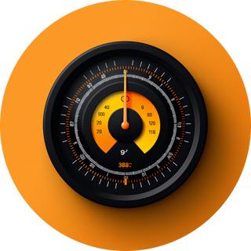

# ioBroker.energy-tracker

Adapter for sending meter readings to the Energy Tracker platform.  
It periodically transfers values from configured ioBroker states using the public REST API.

## Requirements

1. **Register an account:**  
   👉 [Create your account](https://www.energy-tracker.best-ios-apps.de/en-US/register)

2. **Create a personal access token** (login required)  
   👉 [Generate token](https://www.energy-tracker.best-ios-apps.de/de/login?next=%2Faccount%2Faccess-token)

3. **Get your device IDs from the API docs** (login required)  
   👉 [API documentation](https://www.energy-tracker.best-ios-apps.de/de/login?next=%2Faccount%2Frest-api)

## Configuration

The following fields must be configured in the adapter:

- **Personal Access Token**
- **Device list** with:
    - `deviceId` (Energy Tracker device ID)
    - `sourceState` (ioBroker state that provides the reading)
    - Enable rounding of values

**Additionally, you must create a schedule in ioBroker to trigger the adapter at regular intervals.**  
Without a schedule, the adapter will not fetch or transmit any data automatically.

## Security

- The access token is stored encrypted.
- Data is only **sent** – no readings are retrieved.

## Changelog

### 0.2.8

- Improved API reliability, added request timeout, and addressed review feedback.

### 0.2.7

- Updated ESLint to v9, fixed repository URL in package.json, and improved test coverage.

### 0.2.6

- Added README note: schedule required in ioBroker.

### 0.2.5

- Updated dependencies for testing and added Node.js v24 to adapter tests.

### 0.2.4

- Removed old news entries (fix W132 warning)

### 0.2.3

- Reduced build size

### 0.2.2

- Improved support for integration testing

### 0.2.1

- Added default schedule configuration for scheduled adapter mode

### 0.2.0

- Changed adapter type to 'schedule' to reflect intended usage. Fixed repository metadata and added missing GitHub test workflows.

### 0.1.3

- Fixed repository metadata and performed required minor adjustments

### 0.1.2

- Fixed repository metadata and performed required minor adjustments

### 0.1.1

- Fixed repository metadata

### 0.1.0

- Initial version with full Admin UI configuration
- Supports multiple devices and configurable intervals

## License

MIT – see [LICENSE](LICENSE).

Copyright (c) 2017-2025 Bluefox <dogafox@gmail.com>
Copyright (c) 2015-2025 energy-tracker support@best-ios-apps.de
