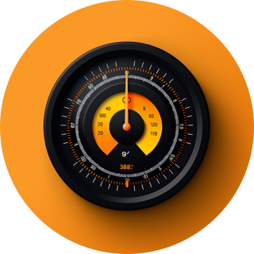

# ioBroker.energy-tracker

Adapter for sending meter readings to the Energy Tracker platform.  
It periodically transfers values from configured ioBroker states using the public REST API.

## Requirements

Requires Node.js 22 or newer, ioBroker js-controller 6.0.11 or newer and ioBroker Admin 7.6.20 or newer.

1. **Register an account:**  
   👉 [Create your account](https://www.energy-tracker.best-ios-apps.de/en-US/register)

2. **Create a personal access token** (login required)  
   👉 [Generate token](https://www.energy-tracker.best-ios-apps.de/de/login?next=%2Faccount%2Faccess-token)

3. **Get your device IDs from the API docs** (login required)  
   👉 [API documentation](https://www.energy-tracker.best-ios-apps.de/de/login?next=%2Faccount%2Frest-api)

## Configuration

The following fields must be configured in the adapter:

- **Personal Access Token** with permission to create meter readings
- **Device list** with:
    - `deviceId` (Energy Tracker device ID)
    - `sourceState` (ioBroker state that provides the reading)
    - Enable server-side rounding of values
- **Retries after timeout:** 0 (disabled), 1 or 2, with a configurable delay of 1–60 seconds. Requests still time out after 10 seconds. A conflict after a timeout requires checking the reading in Energy Tracker.

Source states may contain numbers or plain decimal strings. Use decimal strings when exact decimal precision is required.
Values are truncated to the API limit of six decimal places before sending; `allowRounding` controls server-side rounding to the meter's precision.

**Additionally, you must create a schedule in ioBroker to trigger the adapter at regular intervals.**  
Without a schedule, the adapter will not fetch or transmit any data automatically.

## Security

- The access token is stored encrypted.
- Data is only **sent** – no readings are retrieved.

## Changelog

### 1.0.0

**Before upgrading:** Node.js 22 or newer, ioBroker js-controller 6.0.11 or newer and ioBroker Admin 7.6.20 or newer are required.

- Send readings through the Energy Tracker SDK and API v3.
- Truncate readings to six decimal places before sending.
- Fix connection status for failed or incomplete batches.
- Add optional timeout retries with a fixed reading timestamp.
- Require Node.js 22 or newer and test on Node.js 22, 24 and 26.
- Update dependencies, release tools and adapter metadata.
- Publish releases through npm trusted publishing.

### 0.3.1

- Cleaned up dev dependencies and updated the admin adapter to version 7.6.17.

### 0.3.0

- Updated all adapter dependencies to current stable versions.
- Updated the API endpoint for submitting meter readings to the new v2 API.
- General maintenance and compatibility improvements.

### 0.2.8

- Improved API reliability, added request timeout, and addressed review feedback.

### 0.2.7

- Updated ESLint to v9, fixed repository URL in package.json, and improved test coverage.

## License

MIT – see [LICENSE](https://github.com/energy-tracker/ioBroker.energy-tracker/blob/main/LICENSE).

Copyright (c) 2017-2026 Bluefox <dogafox@gmail.com>  
Copyright (c) 2015-2026 energy-tracker support@energy-tracker.app