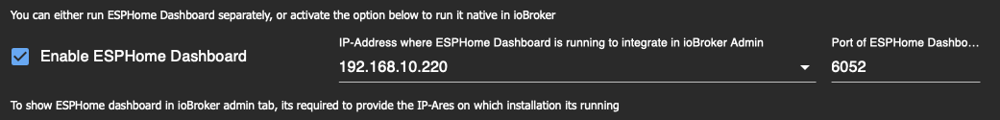
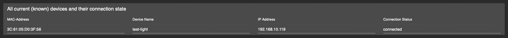

# ioBroker.esphome

[](https://www.npmjs.com/package/iobroker.esphome)
[](https://www.npmjs.com/package/iobroker.esphome)


[](https://david-dm.org/DrozmotiX/iobroker.esphome)
[](https://weblate.iobroker.net/engage/adapters/?utm_source=widget)
[](https://snyk.io/test/github/DrozmotiX/ioBroker.esphome)

[](https://nodei.co/npm/iobroker.esphome/)

**Tests:** 

**This adapter uses Sentry libraries to automatically report exceptions and code errors to the developers.** For more details and for information how to disable the error reporting see [Sentry-Plugin Documentation](https://github.com/ioBroker/plugin-sentry#plugin-sentry)! Sentry reporting is used starting with js-controller 3.0.

## ESPHome adapter for ioBroker

Control your ESP8266/ESP32 with simple yet powerful configuration files created and managed by ESPHome.
Native integration of ESPHome managed device (Including Dashboard) by its native API and ensures all data is synchronized (live-event handling, no data polling ! :)


This adapter uses the [esphome-native-api](https://github.com/Nafaya/esphome-native-api#readme) with all credits to @Nafaya to interact with [ESPHome API](https://esphome.io/components/api.html?highlight=api)!


<!--
## [Documentation](https://DrozmotiX.github.io/languages/en/Adapter/ESPHome/)

All our adapter documentation can be found at [The DrozmotiX Docu Page](https://DrozmotiX.github.io/languages/en/Adapter/ESPHome/) 
-->

## Prerequisites

    * NodeJS >= 18.x
    * API is activated in YAML
    * For admin tabs (optional)
        * ESPHome Dashboard IP is provided in instance settings

## Using the built-in ESPHome Dashboard
You can either use an external installation of ESPHome (like docker) or activate the ESPHome Dashboard process included in this adapter.  
In any case, it is possible to integrate the dashboard into ioBroker Admin interface, for this purpose you must specify the ip where the Dashboard is running



> [!IMPORTANT]
> is currently not possible to show the ESPHome DashBoard integrated in ioBroker when https is enabled, see [#159](https://github.com/DrozmotiX/ioBroker.esphome/issues/159)

## How to use this adapter

### Activate API in YAML
> [!IMPORTANT]
> ioBroker ESPHome allows to integrate Devices by Encryption Key (recommended) or API-Password (legacy), 
> you must specify your authentication settings accordingly, 
> see [ESPHome Documentation](https://esphome.io/components/api.html?highlight=api)
> Please only configure Encryption Key (preferable) or API-Password (legacy)

#### Example Encryption Key configuration entry
```
api:
  encryption:
    key: "DyDfEgDzmA9GlK6ZuLkj3qgFcjXiZUzUf4chnIcjQto="
```

#### Example API configuration entry
```
api:
  password: 'MyPassword'
```

### Add / Modify / Remove ESPHome devices to ioBroker
> [!IMPORTANT]
> This adapter integrates communication with ESPHome capable devices and 
> (if activated) an integrated version of ESPHome Dashboard.
> You must configure and upload your ESP configuration by yourself, 
> either by using the integrated Dashboard or an external alternative 
> (like Docker) before they can be integrated to ioBroker

The device Tab will show all current known devices; you can either wait for Devices to be autodetect
(currently disabled, see #175) or add them manually by providing their IP-Address and credentials


> [!NOTE]
> Buttons to add/modify/remove devices and load device table are only available if adapter is running!
> You must refresh the device table manually by pressing "Refresh device Overview", all devices and their connection state will be shown

Please enter IP-Address (if a device is already known, you can select it from the dropdown) and choose the proper actions:
- ADD / Modify Devices
  - Will send IP address and credentials to the backend and try to establish a connection
  - When an encryption Key is provided, API-Password is ignored, please ensure proper YAML configuration!

- Delete Device
  - Will send a message to the backend to remove this device

> [!WARNING]
> This action will remove a selected device and all its related states from ioBroker!

> [!NOTE]
> After a device has been added, a message will be indicated if successfully or error, 
> you can refresh the table to show current devices and their connection status




If connection was successfully, the Device will be initiated and all related states created to control their attributes.  
When making any changes to your YAML configuration, reboot of the ESP will disconnect and initiate a new connection.  
During this process, states not part anymore of YAML configuration will be automatically removed.


### Example config
Example config, for more examples see [The DrozmotiX Docu Page](https://DrozmotiX.github.io) or [ESPHome Documentation](https://esphome.io/index.html)

<details><summary>Show example config
</summary>

    esphome:
      name: sensor_badkamer
      platform: ESP32
      board: esp-wrover-kit
    
    wifi:
      use_address: 192.168.10.122
      ssid: "xxxxx"
      password: "xxxxxx"
              
    # Enable ESPHome API
    api:
        password: 'MyPassword'
    # Activate i2c bus  
    i2c:
      sda: 21
      scl: 22
      scan: True
      id: bus_a
      
    # Example configuration for bh1750
    sensor:
      - platform: bh1750
        name: "Hal_Illuminance"
        address: 0x23
        measurement_time: 69
        update_interval: 10s
        
    # Example configuration for an GPIO output    
    output:
      - platform: gpio
        pin: 12
        inverted: true
        id: gpio_12
        
    # Example configuration linking a switch to the previous defined output
    switch:
      - platform: output
        name: "Generic Output"
        output: 'gpio_12'
</details>

## Tasmota / ESPEasy migration

Migrating from previous Sonoff Tasmota or ESPEasy setups is very easy. You just need to have ESPHome create a binary for you and then upload that in the web interface.  
See for more details on our [Docu Page](https://DrozmotiX.github.io/languages/en/Adapter/ESPHome/06.migration.html)

**_NOTE:_** Generated yaml files are stored at ```/opt/iobroker/iobroker-data/iobroker.esphome.>instance</>device<.yaml


## Support me
If you like my work, please consider a personal donation  
(this is a personal Donate link for DutchmanNL, no relation to the ioBroker Project !)  
[](http://paypal.me/DutchmanNL)

## Changelog

<!--
    Placeholder for the next version (at the beginning of the line):
    ### __WORK IN PROGRESS__
    * (DutchmanNL) 
-->
### __WORK IN PROGRESS__
* (ticaki) Optimize admin configuration interface
* (DutchmanNL) Optimize backend handling of device discovery
* (DutchmanNL) Capability to select ESPHome Dashboard version added, resolves #118

### 0.5.0-beta.8 (2023-11-24)
* (DutchmanNL) Capability to automatically detect new devices added
* (DutchmanNL) Ensures a compatible pillow version is used (10.0.1)
* (SimonFischer04) Add pillow python package by default, resolves #188

### 0.5.0-beta.4 (2023-11-15)
* (DutchmanNL) Refactor memory caching of device data, resolves #189

### 0.5.0-beta.1 (2023-11-12)
* (DutchmanNL) Only show error messages once for unreachable devices

### 0.5.0-beta.0 (2023-11-12) - Rebuild Admin Interface & Connection handler
* (DutchmanNL) Admin interface redesigned to JSON-Config relates #171
* (DutchmanNL) Backend massages implemented to Add/Modify/Delete devices
* (DutchmanNL) Device connection handling and visibility of devices improved
* (DutchmanNL) Auto device discovery temporary disabled due to external bug, relates #175
* (DutchmanNL) Possibility added to exclude IP-Addresses from device discovery, relates #175
* (DutchmanNL) Allow Selection to listen on specific interface or all for device discovery resolves #67
* (DutchmanNL) State implemented to show current connection status (unreachable/disconnected/connected) to improve management of devices
* (DutchmanNL) Several bugfixes, resolves #181 resolves #

### 0.4.1 (2023-11-05)
* (DutchmanNL) Bugfix: Password / connection issues in previous beta resolves #179
* (DutchmanNL) Bugfix: Allow individual API password or encryption keys for devices, resolves #174
* (DutchmanNL) Support ESPHome device Encryption Key (you should migrate from API password to Encryption Key ! resolves #152)

## License
MIT License

Copyright (c) 2023 DutchmanNL <rdrozda86@gmail.com>

Permission is hereby granted, free of charge, to any person obtaining a copy
of this software and associated documentation files (the "Software"), to deal
in the Software without restriction, including without limitation the rights
to use, copy, modify, merge, publish, distribute, sublicense, and/or sell
copies of the Software, and to permit persons to whom the Software is
furnished to do so, subject to the following conditions:

The above copyright notice and this permission notice shall be included in all
copies or substantial portions of the Software.

THE SOFTWARE IS PROVIDED "AS IS", WITHOUT WARRANTY OF ANY KIND, EXPRESS OR
IMPLIED, INCLUDING BUT NOT LIMITED TO THE WARRANTIES OF MERCHANTABILITY,
FITNESS FOR A PARTICULAR PURPOSE AND NONINFRINGEMENT. IN NO EVENT SHALL THE
AUTHORS OR COPYRIGHT HOLDERS BE LIABLE FOR ANY CLAIM, DAMAGES OR OTHER
LIABILITY, WHETHER IN AN ACTION OF CONTRACT, TORT OR OTHERWISE, ARISING FROM,
OUT OF OR IN CONNECTION WITH THE SOFTWARE OR THE USE OR OTHER DEALINGS IN THE
SOFTWARE.