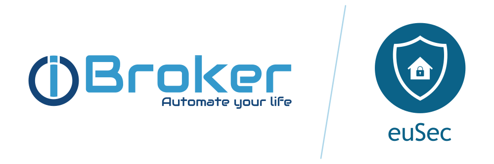

# ioBroker.euSec

**Tests:** 

This is an [ioBroker](https://www.iobroker.net) adapter that uses the [eufy-security-client](https://github.com/bropat/eufy-security-client) library to communicate with Eufy devices.

**This project is not affiliated with Anker and Eufy (Eufy Security). It is a personal project that is maintained in spare time.**

## Description

This adapter allows you to control [Eufy security devices](https://us.eufylife.com/collections/security) by connecting to the Eufy cloud servers and local/remote stations.

You need to provide your Cloud login credentials. The adapter connects to your cloud account and polls for all device data via HTTPS. Now a local or remote P2P connection to the Eufy stations/devices is also supported. However, a connection to the Eufy Cloud is always a prerequisite.

One Adapter instance will show all devices from one Eufy Cloud account and allows you to control them.

## Documentation

Check out the documentation [here](https://iobroker-community-adapters.github.io/ioBroker.eusec/).

## Known working devices

Information about supported devices can be found [here](https://github.com/bropat/eufy-security-client#known-working-devices).

## Credits

This adapter would not have been possible without the great work of Patrick Broetto (brobat) <https://github.com/bropat>, who created previous releases of this adapter.

## IMPORTANT information when upgrading to node.js 22

Adapter 2.0.3 and newer support node.js 22. Prior node.js versions require a special setup which became invalid with node.js 22. So when upgrading node.js from any version lower than 22.x.x to node.js 22, please follow these steps:

- If you have node.js < 22 and adapter < 2.0.0 installed, please update node.js first and install adapter 2.0.3 afterwards.
- If you have adapter >= 2.0.0 installed with any node release prior to 22, you MUST reinstall the adapter. A detailed description (in German) is available at our forum (https://forum.iobroker.net/topic/82651/test-adapter-eusec-v2-0-x)
  
## Changelog

<!--
	Placeholder for the next version (at the beginning of the line):
	### **WORK IN PROGRESS**
-->
### 3.0.3 (2026-09-02)
- (typhosj) Removed the "HTTPS streaming url" setting. The adapter never configures TLS for go2rtc and go2rtc ignores `api.tls_listen` without a certificate, so the option only ever produced a livestream URL that could not be opened. The URL is built with `http` now
- (typhosj) The livestream page (`http://<host>:1984/stream.html?src=<serial>`) is now served by the adapter, with the defaults that make a stream unstable on weak clients such as a Fire tablet replaced: MSE instead of WebRTC (go2rtc cannot request a keyframe for a pushed stream, so WebRTC starts in the middle of a GOP and shows green artifacts - `?mode=webrtc,mse,hls,mjpeg` restores the old order), the picture is pulled back to the live edge instead of falling further behind with every stall, and a reconnect starts after a second instead of 15. The URL, the parameters `src`, `mode`, `background` and `width`, several streams side by side and the status overlay all stay as they were; new are `?audio=false` (play video only), `?controls=false` (hide the native controls, so a tap cannot pause the stream) and `?drift=<seconds>`
- (typhosj) The `livestream` state now carries `&background=false`, so the player disconnects while its page is not visible. Without it the browser keeps decoding behind a switched off display and leaves a consumer attached that never recovers once the producer is gone
- (typhosj) go2rtc serves its web pages from the adapter directory now (`api.static_dir`). That replaces the files embedded in go2rtc, so the stream list, the log page, the link list and the WebRTC viewer are shipped along and keep answering. Three pages were left out: `editor.html` and `add.html`, because the adapter passes the go2rtc configuration as JSON on the command line (`/api/config` answers `410 Gone`, and a stream added by hand is gone with the next restart), and `network.html`, because it loads a library from `unpkg.com` and stays blank on a host without internet access. The pages taken from go2rtc keep their MIT license, see `www/LICENSE.go2rtc` and `www/VENDOR.md`

### 3.0.2 (2026-09-02)
- (copilot) Adapter requires node.js >= 22 now
- (copilot) Adapter requires admin >= 7.7.22 now
- (@GermanBluefox) Refactoring
- (@GermanBluefox) Fixed login failing with `Get passport profile - Response code not ok` since the eufy cloud started answering successful requests with code 200 instead of 0 (see [bropat/eufy-security-client#975](https://github.com/bropat/eufy-security-client/pull/975))
- (typhosj) Fixed livestreaming being broken when go2rtc is configured to use an API port other than 1984, and the eufy livestream is now stopped when streaming into go2rtc fails ([#151](https://github.com/iobroker-community-adapters/ioBroker.eusec/pull/151), [#160](https://github.com/iobroker-community-adapters/ioBroker.eusec/issues/160))
- (typhosj) go2rtc is now supervised and restarted if it terminates unexpectedly, the livestream states are cleared when a station disconnects, and a warning is logged when a camera streams at "Auto" quality ([#152](https://github.com/iobroker-community-adapters/ioBroker.eusec/pull/152))
- (@GermanBluefox) The warning about the "Auto" streaming quality now also covers devices where "Auto" is not value 0 (eufyCam 3, Professional models and battery doorbells)
- (@GermanBluefox) Removed the obsolete CVE-2023-46809 workaround for node.js 20 from the adapter startup
- (@GermanBluefox) Pinned eufy-security-client to 4.1.1-1 and removed the unused packages mime and @types/ffmpeg-static

### 2.0.3 (2025-10-26)
- (mcm1957) Remove fix for CVE-2023-46809 for node.js 22 and newer

### 2.0.0 (2025-10-26)

- (mcm1957) Adapter has been migrated to iobroker-community-adapters organisation
- (mcm1957) Adapter requires node.js >= 20, js-controller >= 6.0.11 and admin >= 7.6.17 now
- (mcm1957) Dependencies have been updated

### 1.3.3 (2024-09-28)

* (bropat) Updated version of the package eufy-security-client (3.1.1)
* (bropat) Further details can be found in the changelog of eufy-security-client (3.1.1)

[Older changelogs can be found there](CHANGELOG_OLD.md)

## License

MIT License

Copyright (c) 2025-2026 iobroker-community-adapters <iobroker-community-adapters@gmx.de>  
Copyright (c) 2020-2024 bropat <patrick.broetto@gmail.com>

The web pages in `www/` that go2rtc serves are taken from [go2rtc](https://github.com/AlexxIT/go2rtc),
MIT licensed, Copyright (c) 2022 Alexey Khit. Their license text is in `www/LICENSE.go2rtc`, the list
of files and what was changed is in `www/VENDOR.md`.

Permission is hereby granted, free of charge, to any person obtaining a copy
of this software and associated documentation files (the "Software"), to deal
in the Software without restriction, including without limitation the rights
to use, copy, modify, merge, publish, distribute, sublicense, and/or sell
copies of the Software, and to permit persons to whom the Software is
furnished to do so, subject to the following conditions:

The above copyright notice and this permission notice shall be included in all
copies or substantial portions of the Software.

THE SOFTWARE IS PROVIDED "AS IS", WITHOUT WARRANTY OF ANY KIND, EXPRESS OR
IMPLIED, INCLUDING BUT NOT LIMITED TO THE WARRANTIES OF MERCHANTABILITY,
FITNESS FOR A PARTICULAR PURPOSE AND NONINFRINGEMENT. IN NO EVENT SHALL THE
AUTHORS OR COPYRIGHT HOLDERS BE LIABLE FOR ANY CLAIM, DAMAGES OR OTHER
LIABILITY, WHETHER IN AN ACTION OF CONTRACT, TORT OR OTHERWISE, ARISING FROM,
OUT OF OR IN CONNECTION WITH THE SOFTWARE OR THE USE OR OTHER DEALINGS IN THE
SOFTWARE.
