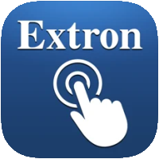

# ioBroker.extron

## extron adapter for ioBroker

Extron SIS adapter

Control devices from Extron. 
This Adapter is designed to control some of the Extron Audio Video Products via the 
**S**imple **I**nstruction **S**et Protocol.
The functional scope of the devices is tremendous. Not all of the features makes sense
to be supported with the adapter and the interaction with iobroker.

**Be aware:** When the device type is chosen in the adapter configuration it cannot be changed in the future !

There can be more instances of different or same types from this adapter in a iobroker installation. For future releases you have to add a valid license to the adapter configuration for each instance.
If you are a non commercial organisation or use it for private use you can get a licence for free. Please contact the author. 

### Supported devices
- 8x2 Presentation Matrix Switcher (DTP2 CrossPoint 82)
- H.264 Streaming Media Player and Decoder (SMD 202)
- Streaming Media Encoder (SME 211)
- 12x8 ProDSP Processor w/Dante (DMP 128 Plus AT)
- 12x8 ProDSP Processor w/AEC, VoIP, and Dante (DMP 128 Plus C V AT)

## ToDo
- The device type is checked on beginn of the conversation. This fails sometimes. Must be changed to a more reliable mechanism. 
- Make a more granular selection of used in- and outputs to reduce database size at DSP devices
- add more commands and their implementation on the database side
- add a media playing support to the SMD 202 

## Changelog

### 0.0.1
* (Bannsaenger) initial release

### 0.0.2
* (Bannsaenger) prepared for checkin to iobroker.latest

### 0.0.3
* (Bannsaenger) fix dependencies for integration test

### 0.1.0
* (mschlgl) extend device/database structure to cover all controllable elements

## License
Attribution-NonCommercial 4.0 International (CC BY-NC 4.0)

Copyright (c) 2021 Bannsaenger, https://github.com/bannsaenger <bannsaenger@gmx.de>

This work is licensed under a Creative Commons Attribution-NonCommercial 4.0 International License
http://creativecommons.org/licenses/by-nc/4.0/

Short content:
This is a human-readable summary of (and not a substitute for) the license. Disclaimer.
You are free to:

Share — copy and redistribute the material in any medium or format
Adapt — remix, transform, and build upon the material

The licensor cannot revoke these freedoms as long as you follow the license terms.

Under the following terms:

Attribution — You must give appropriate credit, provide a link to the license, and indicate if changes were made. You may do so in any reasonable manner, but not in any way that suggests the licensor endorses you or your use.

NonCommercial — You may not use the material for commercial purposes.

No additional restrictions — You may not apply legal terms or technological measures that legally restrict others from doing anything the license permits.
