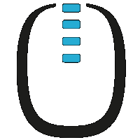
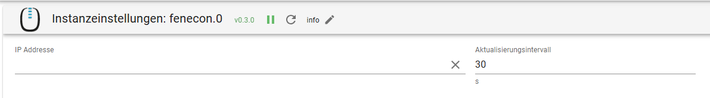

# ioBroker.fenecon

**Tests:** 

## Fenecon

[Fenecon](https://fenecon.de) is a German manufacturer of PV inverters and Energy storage systems. The energy management system (FEMS) usesd is based on the [openEMS](https://github.com/OpenEMS/openems) software.
Fenecon is a contributor of openEMS.

## Adapter

This adapter connects to the FEMS system and retrieves all availalbe data via the REST/JSON interface.
In addition, useful calculations are carried out.

## Configuration

In order to establish a connection, the IP address of the FEMS central unit is required. the update interval can also be adjusted.

You can use the custom endpoints so that not all data is retrieved. To do so, activate the checkbox.
The endpoints are configured in the table.

## States

States are generated automatically whenn the adapter starts. If a status or channel is accidentally deleted, warnings appear in the log file. Restart the adapter and the states will be generated.

## Changelog

<!--
	Placeholder for the next version (at the beginning of the line):
	### **WORK IN PROGRESS**
-->
### 0.6.2 (2025-02-11)

- (SG-App) fix loading single channel

### 0.6.1 (2025-02-10)

- (SG-App) fix missing size attributes

### 0.6.0 (2025-02-07)

- (SG-App) dependency updates
- (SG-App) added component and channel selection
- (SG-App) fix warning after FEMS update and create states

### 0.5.0 (2024-08-02)

- (SG-App) set correct role states

### 0.4.2 (2024-08-02)

- (SG-App) fix channel creation only one time on init

### 0.4.1 (2024-08-02)

- (SG-App) refactor for latest repo
- (SG-App) remove getObject calls on init
- (SG-App) filter object ids if needed
- (SG-App) check allowed length of address for channel and id creation

### 0.4.0 (2024-07-15)

- (SG-App) refactor for latest repo

### 0.3.2 (2024-07-14)

- (SG-App) calculate self consuming
- (SG-App) dependency updates

### 0.3.1 (2024-07-11)

- (SG-App) fix adapter checker warning

### 0.3.0 (2024-06-11)

- (SG-App) set correct read write state
- (SG-App) calculate autarchy
- (SG-App) dependency updates

### 0.2.0 (2024-04-20)

- (SG-App) collect all possible data from rest interface

### 0.1.0 (2024-04-17)

- (SG-App) minor fix

### 0.0.2-alpha.0 (2024-04-16)

- (SG-App) initial release

## License

MIT License

Copyright (c) 2025 Georg Schreiner <info@sg-app.de>

Permission is hereby granted, free of charge, to any person obtaining a copy
of this software and associated documentation files (the "Software"), to deal
in the Software without restriction, including without limitation the rights
to use, copy, modify, merge, publish, distribute, sublicense, and/or sell
copies of the Software, and to permit persons to whom the Software is
furnished to do so, subject to the following conditions:

The above copyright notice and this permission notice shall be included in all
copies or substantial portions of the Software.

THE SOFTWARE IS PROVIDED "AS IS", WITHOUT WARRANTY OF ANY KIND, EXPRESS OR
IMPLIED, INCLUDING BUT NOT LIMITED TO THE WARRANTIES OF MERCHANTABILITY,
FITNESS FOR A PARTICULAR PURPOSE AND NONINFRINGEMENT. IN NO EVENT SHALL THE
AUTHORS OR COPYRIGHT HOLDERS BE LIABLE FOR ANY CLAIM, DAMAGES OR OTHER
LIABILITY, WHETHER IN AN ACTION OF CONTRACT, TORT OR OTHERWISE, ARISING FROM,
OUT OF OR IN CONNECTION WITH THE SOFTWARE OR THE USE OR OTHER DEALINGS IN THE
SOFTWARE.
