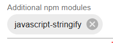

# ioBroker.flexcharts

[](https://www.npmjs.com/package/iobroker.flexcharts)
[](https://www.npmjs.com/package/iobroker.flexcharts)


[](https://nodei.co/npm/iobroker.flexcharts/)

**Tests:** 

## flexcharts adapter for ioBroker

# Breaking news
**Apache ECharts released v6.0.0 with 12 major updates.** See https://echarts.apache.org/handbook/en/basics/release-note/v6-feature for details.

Flexcharts v0.6.0 is based on this new release and offers new features:
* brand new default theme
* possibility to pass over an unlimited number of own themes
* dynamic theme switching, a typical scenario is listening to the system's dark mode and dynamically adjusting the chart's theme (add http parameter `&darkmode=auto` to activate)
* new chart types
* possibility to pass over an unlimited number of event driven functions

**Remark:** You may keep to **ECharts v5 themes** (default and dark) by simply adding the http parameter `&themev5`, e.g. `http://localhost:8082/flexcharts/echarts.html?source=state&id=flexcharts.0.info.chart1&themev5`. Apache offers a v5 light theme, but no v5 dark theme - I've already reported an issue. For now, I've created a v5 dark theme myself based on Apache's dark theme for v5.6.0. If you notice a difference between the v5 themes, please report an issue for flexcharts.

# Basic concept
There are several adapters available to view charts within ioBroker. As far as I know, all of them are using a UI to configure content and options of the charts. Typically not all features of the used graphical sub system could be used in this way. E.g. it's not possible to view fully featured stacked charts with eChart-Adapter.

This adapter uses a different approach. It brings almost the complete feature set of [Apache ECharts](https://echarts.apache.org/en/index.html) to ioBroker. Take a look to the [demo charts](https://echarts.apache.org/examples/en/index.html).

Remark: Adapter was not tested on MacOS, yet.

**There is no UI to configure any chart.** You have to define the chart yourself, the adapter takes care about visualization. You have to provide definition and content of the chart by providing the content as a json-object - in eCharts examples it corresponds to the content of variable `option`. Here's an example to make it clear. To create a stacked chart you store it's definition in an ioBroker state (json format):

```
{ "tooltip": {"trigger": "axis","axisPointer": {"type": "shadow"}},
  "legend": {},
  "xAxis": [{"type": "category","data": ["Mon","Tue","Wed","Thu","Fri","Sat","Sun"]}],
  "yAxis": [{"type": "value"}],
  "dataZoom": [{"show": true,"start": 0, "end": 100}],
  "series": [
    { "name": "Grid", "type": "bar", "color": "#a30000", "stack": "Supply",
      "data": [8,19,21,50,26,0,36]},
    { "name": "PV", "type": "bar", "color": "#00a300", "stack": "Supply",
      "data": [30,32,20,8,33,21,36]},
    { "name": "Household", "type": "bar", "color": "#0000a3", "stack": "Consumption",
      "data": [16,12,11,13,14,9,12]},
    { "name": "Heat pump", "type": "bar", "color": "#0000ff", "stack": "Consumption",
      "data": [22,24,30,20,22,12,25]},
    { "name": "Wallbox", "type": "bar", "color": "#00a3a3", "stack": "Consumption",
      "data": [0,15,0,25,23,0,35]}
  ]
}
```

flexchart adapter will then show this chart:


Typically you will use Blockly or javascript to create and update content of this state.

There is another possibility to directly hand over eCharts-data via callback function within javascript. For details see below.

To be clear: This approach is not intended to be used to quickly create a simple chart.
But if you have a specific idea in mind for a more complex chart, flexcharts offers the possibility to implement it.

# Getting started

### Using the adapter

This adapter brings it's functionality as a web extension. Therefore it is mandatory to have installed and running the [web adapter](https://www.iobroker.net/#en/adapters/adapterref/iobroker.ws/README.md) (`web.0`). In this readme it's assumed you're using the standard port 8082 for web adapter.

When flexcharts adapter is active you can access it via http://localhost:8082/flexcharts/echarts.html (replace `localhost` by address of your ioBroker server).

You may use this address in iFrame widgets of vis or jarvis or other visualizations. Of course you can also use it directly in a browser tab.

To make it work, you have to provide additional parameters to tell the adapter about the source of data. Two options are availabe:
* `source=state` => You provide chart data in an ioBroker state (json)
* `source=script` => You provide chart data via a script (javascript or blockly)

There are additional options available, pls. refer to [reference section](#reference)

To check for correct installation of adapter use built-in demo chart: http://localhost:8082/flexcharts/echarts.html?source=state&id=flexcharts.0.info.chart1

### Use ioBroker state as source for an eChart

Example: `http://localhost:8082/flexcharts/echarts.html?source=state&id=0_userdata.0.echarts.chart1`

<!--
Would this be better to read:
Example: http://localhost:8082/flexcharts/echarts.html?<mark style="background-color: #ffff00">source=state</mark>&<mark style="background-color: #00c000">&id=0_userdata.0.echarts.chart1</mark>
-->

Flexcharts will evaluate state `0_userdata.0.echarts.chart1` as data for eChart. Try it: Create such a state and copy json data of example shown above (`{ "tooltip": { ...`) as state content, then access given address with a browser.

It's not allowed to use following characters in the state id: `: / ? # [ ] @ ! $ & ' ( ) * + , ; = %` 

### Use javascript as source for an eChart

This is a bit more complicated but much more efficient and flexible. You provide the charts data directly by your JS script which is dynamically called by flexcharts adapter. You can pass additional parameters to your script by adding parameters to the http-address, e.g. `&chart=chart1`. All http-parameters are availabe within script in the object `httpParams` (see example below).

Again it's best to explain using an example. Create a script with this content (only first JS instance (**javascript.0**) is supported, name of script doesn't matter):
```
onMessage('flexcharts', (httpParams, callback) => {
    const myJsonParams  = (httpParams.myjsonparams ? JSON.parse(httpParams.myjsonparams) : {} );
    console.log(`httpParams = ${JSON.stringify(httpParams)}`);
    console.log(`myJsonParams = ${JSON.stringify(myJsonParams)}`);
    chart1(result => callback(result));
});

function chart1(callback) {
    const option = {
        tooltip: {trigger: "axis", axisPointer: {type: "shadow"}},
        legend: {},
        xAxis: [{type: "category", data: ["Mon","Tue","Wed","Thu","Fri","Sat","Sun"]}],
        yAxis: [{type: "value"}],
        dataZoom: [{show: true, start: 0, end: 100}],
        series: [
            { name: "Grid", type: "bar", color: "#a30000", stack: "Supply",
              data: [8,19,21,50,26,0,36]},
            { name: "PV", type: "bar", color: "#00a300", stack: "Supply",
            data: [30,32,20,8,33,21,36]},
            { name: "Household", type: "bar", color: "#0000a3", stack: "Consumption",
            data: [16,12,11,13,14,9,12]},
            { name: "Heat pump", type: "bar", color: "#0000ff", stack: "Consumption",
            data: [22,24,30,20,22,12,25]},
            { name: "Wallbox", type: "bar", color: "#00a3a3", stack: "Consumption",
            data: [0,15,0,25,23,0,35]}
        ]
    };
    callback(option);
}
```

Start the script and access this address in a browser: `http://localhost:8082/flexcharts/echarts.html?source=script`

<!--
Would this be better to read:
Start the script and access this in a browser: http://localhost:8082/flexcharts/echarts.html?<mark style="background-color: #ffff00">source=script</mark>
-->

Same chart should show up as in previous example.

You should get two log entries of the example script:
```
httpParams = {"message":"mylinechart","source":"script"}
myJsonParams = {}
```

Additional paramters can be forwarded to the script and will be available within the script in variable `httpParams`. Try following command: `http://localhost:8082/flexcharts/echarts.html?source=script&chart=chart1&myjsonparams={"period":"daily"}`

Log entries now should look like this:
```
httpParams = {"source":"script","chart":"chart1","myjsonparams":"{\"period\":\"daily\"}"}`
myJsonParams = {"period":"daily"}
```

Pls. note, **you have to use the `onMessage()` functionality to receive the trigger from the adapter**. Default vaule for the message is `flexcharts` as shown in example above. You may use different messages by providing an additional parameter, e.g. to use message `mycharts` add `&message=mycharts` to http address: `http://localhost:8082/flexcharts/echarts.html?source=script&message=mycharts`

### Using functions within definition of chart
Unfortunately function definitions within chart definition will typically not work because it's filtered when using `JSON.stringify(option)` or `callback(option)`.

However, since V0.3.0 of flexcharts it's possible to bring it to work. A bit more effort is needed:
* Add npm module `javascript-stringify` to instance 0 of javascript adapter. To do so, add `javascript-stringify` to "Additional npm modules" in configuration of adapter:

* In your script add `var strify = require('javascript-stringify');` at the beginning
* When using script as data source: Within your `onMessage()` functionality replace `callback(option);` by `callback(strify.stringify(option));` (assuming `option` contains your chart definition).
* Then using a state as data source: When creating the state replace `setState('my_chart_id', JSON.stringify(option), true);` by `setState('my_chart_id', strify.stringify(option), true);`
* That's it. Now functions within chart definitions will be correctly forwarded to flexcharts.

Just try it using [template3](templates/flexchartsTemplate3.js). A function is used to show data of tooltip with 2 decimals: `tooltip: {trigger: "axis", valueFormatter: (value) => '$' + value.toFixed(2)}`.

An example using chart definition via state is given in `flexcharts.0.info.chart2`. This will show same chart as template3.

Remark: When npm module `javascript-stringify` is installed, it's functionality could also be used by malicious code (Cross-Site-Scripting). Therefore, ioBroker should not be accessible from the Internet when using this module.

### Using event driven functions to create dynamically changing charts
Apache ECharts supports dynamically changing charts. Take a look at this [example](https://echarts.apache.org/examples/en/editor.html?c=dataset-link). When the mouse is moved to a data point of the line chart, the pie chart gets updated accordingly.
Here's a screen recording of this chart operated by flexcharts:
[dynamically changing chart](dynamic_charts_with_flexcharts.mkv)

**Important remark** for updating to version **0.5.0** of flexcharts: If you're using this feature and you wanted to dynamically change options of chart within your event driven function you had to address the option via the variable named `jsopts`. With version 0.5.0 and later this has changed to `option`. Pls. adapt the naming within you function accordingly, i.e. replace `jsopts` by `option`.

To use event driven functions for your own charts I recommend to use a **script as source**. [Template 4](templates/flexchartsTemplate4.js) demonstrates the implementation. Please take care about following:
* To make the chart dynamic you need to define functionality to handle events within the chart. This is done via definition of functions like `myChart.on("event",function(e){ ... });`
* It's mandatory to name each of those functions with `myChart.on()`
* For passing over the functions definition to flexcharts it has to be converted to a **Javascript String**. This could be done by consequently using quotation marks (`"`) inside the function and then enclosing it in apostrophes (`'`) - or the other way round. You may use a compactor, e.g. [this one](https://www.toptal.com/developers/javascript-minifier), to reduce the needed space.
* Finally, you have to provide all parts, definition of chart and definition of event function(s), as an **array of Javascript Strings** via the callback. In template 4 it's done as `callback([strify.stringify(option), onEvent]);` where `option` contains the chart definition and `onEvent` contains the definition of event function as a Javascript String. If you define more than one function you can include it to the String `onEvent` or you can add it as an additional array element, such as `callback([strify.stringify(option), onEvent1, onEvent2, onEvent3]);`. Number of function definitions is not limited.
* To stringify the definition of the chart (`option`) you have to use `javascript-stringify` as described in previous chapter.

Remark: When npm module `javascript-stringify` is installed, it's functionality could also be used by malicious code (Cross-Site-Scripting). Therefore, ioBroker should not be accessible from the Internet when using this module.

It's also possible to use this feature with a **state as source** of data. However, it's even more tricky:
* The state has to be made up as an **array of JSON Strings**. The two elements of the array consists of the definition of chart and the definition of event function(s).
* But now, both Strings has to be valid **JSON Strings**. This is different from Javascript Strings and brings additional restrictions:
   * To enclose a String quotation marks have to be used. Therefore within the String only apostrophes or escaped quotation marks (`\"`) are allowed.
   * Within a String no new line is allowed.
* It's a good idea to make sure about validity of the array by using a JSON validator, e.g. [this one](https://jsonformatter.curiousconcept.com/#).
* Of course you want to manipulate the data of the chart. But the data is part of the definition of the chart. So you have to read and write the array of JSON Strings using Javascript. Therefore I recommend to use a script as source of data as described above.
* However, an example is available within info part of flexcharts: `flexcharts.0.info.chart3`. To view in a browser use `http://localhost:8082/flexcharts/echarts.html?source=state&id=flexcharts.0.info.chart3`

### Working with Apache EChart themes (v6 feature)
ECharts offers several options to customize charts. A powerful method is to use themes. By default, theme 'default' is used on mormal mode and theme 'dark' in dark mode. Those themes are predefined, but can be modified.
Flexcharts version 0.6.0 and later supports definition of themes. Furthermore, in combination with definition of event driven functions - see previous chapter - it's possible to dynamically switch between themes.
Best way to create or modify themes is to use Apache ECharts [Theme Builder](https://echarts.apache.org/en/theme-builder.html).

To pass a theme to flexcharts using a **script as source** follow these steps:
* on site "Theme Builder" select or modify a theme, then press "Download"-button
* select tab "JSON version" and copy the content to clipboard by pressing "Copy"-button
* add something like `const myThemeDefault = ` to your script and paste the clipboard behind
* pass the theme to flexcharts using a array as shown for event driven functions: `callback([JSON.stringify(option), ['default', JSON.stringify(myThemeDefault)]]);`
* pls. note: you have to pass the theme as an array of strings `[<name of theme>, <stringified definition of theme>]`

[Template 5](templates/flexchartsTemplate5.js) demonstrates the implementation of passing new themes for standard (theme 'default') and dark mode (theme 'dark'). Dynamic switching between both themes based on system setting is activated.

To use a **state as source** for passing themes:
* create the state with format 'array'
* add the charts definition as 1st element of the array
* prepare the theme(s) as a stringified JSON object. You use a JSON formatter, e.g. https://jsonformatter.curiousconcept.com/ with template 'compact', to compact the JSON object to a string.
* add the theme as 2nd element to the state as an array (see above): `[<name of theme>, <definition of theme>]`
* Finally the state should look like `[<stringified definition of chart>,['default', <stringified definition of default theme>]]`.
* an example is available at `flexcharts.0.info.chart4` (only on newly installed instance).

Number of theme definitions is not limited. However, to activate themes named other than 'default' or 'dark', you have to define own functionality containing the expression `myChart.setTheme(<name of theme>);` and code to call it on certain condition.

**Give it a try:**
* Create a simple chart based on [this example](https://echarts.apache.org/examples/en/editor.html?c=area-stack)
* to pass data to Flexcharts use `callback(JSON.stringify(option));`
* Now add some changes to default theme. Replace the callback by this version:
`callback([JSON.stringify(option), ['default', '{"title":{"left":"left"},"color":["#ff715e","#ffaf51","#ffee51","#8c6ac4","#715c87"],"backgroundColor":"rgba(64,64,64,0.5)"}']]);`
* You should see a left-aligned title and changed colors for the data and background.

## Templates
Javascript templates are available for some uses cases:
* chart using data from history adapter: [template1](templates/flexchartsTemplate1.js)
* simple chart for a heat curve: [template2](templates/flexchartsTemplate2.js)
* simple stacked bar chart using function within chart definition: [template3](templates/flexchartsTemplate3.js)
* chart for data of **tibberLink adapter**: see discussions [here](https://github.com/MyHomeMyData/ioBroker.flexcharts/discussions/67) and [here](https://github.com/MyHomeMyData/ioBroker.flexcharts/discussions/66)
* a very specific use case is available for Viessmann devices of E3 series, e.g. heat pump Vitocal 250. Refer to https://github.com/MyHomeMyData/ioBroker.e3oncan/discussions/35
* implementing dynamically changing charts: [template4](templates/flexchartsTemplate4.js)
* implementing own themes for standard and dark mode and using dynamic switching based on system setting: [template5](templates/flexchartsTemplate5.js)
* adapter [tibberLink](https://github.com/hombach/ioBroker.tibberlink) uses flexcharts as an option for graphical processing of the data. Presently available in Beta Repo of ioBroker. Take a look to the [documentation](https://github.com/hombach/ioBroker.tibberlink?tab=readme-ov-file#2-using-the-flexcharts-or-fully-featured-echarts-adapter-with-json).

## Reference

Use **ioBroker state** as data source: `http://localhost:8082/flexcharts/echarts.html?source=state&id=my_state_id`

Use **javascript** as data source: `http://localhost:8082/flexcharts/echarts.html?source=script`

### Optional arguments
* `&message=my_message` - sends "my_message" to javascript. Use `onMessage('my_message', (httpParams, callback) => { callback(mychart); })` to provide chart data. Defaults to `flexcharts`.
* `&darkmode[=on|off|auto]` - specifies dark mode visualization of ECharts: 'off' => dark mode permanently off; 'on' or no value => dark mode permanently on; 'auto' => listening to the system's dark mode setting.
* `&refresh=number` - do a refresh of chart ervery "number" seconds. Defaults to 60 seconds. Minimum allowed value is 5 seconds.
* `&themev5` - set default theme of chart to Apache ECharts theme 'v5' - refer to https://echarts.apache.org/handbook/en/basics/release-note/v6-upgrade-guide/ chapter "Default Theme"
* `&user_defined_arguments` - Add more parameters as per your need. All arguments are available within function `onMessage()` in object `httpParams`. See examples above and templates for more details.

### Using functions within definition of charts
Available with version 0.3.0 or newer. Pls. refer previous [chapter](#using-functions-within-definition-of-chart)

### Built-in demo chart
There is a built-in demo chart available: http://localhost:8082/flexcharts/echarts.html?source=state&id=flexcharts.0.info.chart1

This should bring up a demo chart, when flexcharts- and web-adapter are running.

**Note:** Replace `localhost` by address of your ioBroker server. Replace `8082` by port number used by your Web-Adapter.

## Donate

<a href="https://www.paypal.com/donate/?hosted_button_id=WKY6JPYJNCCCQ"></a>  
If you enjoyed this project — or just feeling generous, consider buying me a beer. Cheers! :beers:

## Changelog
<!--
	Placeholder for the next version (at the beginning of the line):
	### **WORK IN PROGRESS**
-->
### 0.6.1 (2025-11-01)
* (MyHomeMyData) Added support for dark mode theme of ECharts version 5.6.0 (when using paramter themev5). Based on Apache ECharts 6.

### 0.6.0 (2025-10-19)
* (MyHomeMyData) Updated Apache ECharts to version 6.0.0 using brand new default theme - please take a look to Readme! Ref. issue #125
* (MyHomeMyData) Added option to dynamically switch dark mode by listening to the system's setting. Based on Apache ECharts 6.
* (MyHomeMyData) Added possibility to add self defined themes. Based on Apache ECharts 6.
* (MyHomeMyData) Extended support for definition of onEvent functions. Now an unlimited number of functions can be defined instead of just one.
* (MyHomeMyData) Fixes for issue #132 (repository checker)

### 0.5.0 (2025-09-17)
* (MyHomeMyData) Changed internal naming of chart's options from 'jsopts' to 'option'. If you're using event driven functions within your charts, you may need to adapt the naming accordingly. Pls. refer to Readme.
* (MyHomeMyData) Migration to ESLint 9. Fixes issues #107 (Migration to ESLint 9) and #114 (findings of repository checker)

### 0.4.1 (2025-05-22)
* (MyHomeMyData) Fix for issue #96 (findings of repository checker)

### 0.4.0 (2025-03-24)
* (MyHomeMyData) Added functionality to support event driven functions within charts, ref. issue #85
* (MyHomeMyData) Added timeout for script as source
* (MyHomeMyData) Added test cases for integration testing

### 0.3.2 (2025-02-09)
* (MyHomeMyData) Added hint for use of flexcharts by adapter tibberLink

### 0.3.1 (2025-02-02)
* (MyHomeMyData) Updated Apache ECharts to version 5.6.0
* (MyHomeMyData) Added support for 3D charts using extension echarts-gl, see issue #68
* (MyHomeMyData) Added templates for tibberLink Adapter

### 0.3.0 (2025-01-08)
* (MyHomeMyData) Enhancement for usage of functions within echart definitions.
* (MyHomeMyData) Fix for issue #56 (findings of repository checker)

### 0.2.0 (2024-11-06)
* (MyHomeMyData) Updated readme. Added sections Templates and Reference.
* (MyHomeMyData) Fix for issue #41 (findings of repository checker)
* (MyHomeMyData) Updated ECharts to version 5.5.1, see issue #40
* (MyHomeMyData) Fix for issue #39 (html warnings)
* (MyHomeMyData) Added option 'refresh' to enable auto update of chart

### 0.1.6 (2024-10-19)
* (MyHomeMyData) Fix for issue #37

### 0.1.5 (2024-10-11)
* (MyHomeMyData) Fixes for issue #36

### 0.1.4 (2024-10-06)
* (MyHomeMyData) Fixes for issue #34
* (MyHomeMyData) Fixes for issue #33

### 0.1.3 (2024-10-05)
* (MyHomeMyData) Fixed issue on windows systems (handling of file path)

### 0.1.2 (2024-10-01)
* (MyHomeMyData) Adapted adapter configurations

### 0.1.1 (2024-10-01)
* (MyHomeMyData) Removed main.js from package.json since it's obsolete

### 0.1.0 (2024-10-01)
* (MyHomeMyData) Use web extension instead of creating own web server. Use http://localhost:8082/flexcharts/echarts.html instead of http://localhost:3100/echarts.html

### 0.0.4 (2024-09-13)
* (MyHomeMyData) Changed default port to 3100 to avoid conflict with camera adapter
* (MyHomeMyData) Check for conflicting port usage during start of instance
* (MyHomeMyData) Added option to select dark mode
* (MyHomeMyData) Fixed missing 404-page

### 0.0.3 (2024-08-25)
* (MyHomeMyData) Disabled sinon should interface
* (MyHomeMyData) Update of npm dependencies

### 0.0.2 (2024-08-05)
* (MyHomeMyData) initial release

## License
MIT License

Copyright (c) 2025 MyHomeMyData <juergen.bonfert@gmail.com>

Permission is hereby granted, free of charge, to any person obtaining a copy
of this software and associated documentation files (the "Software"), to deal
in the Software without restriction, including without limitation the rights
to use, copy, modify, merge, publish, distribute, sublicense, and/or sell
copies of the Software, and to permit persons to whom the Software is
furnished to do so, subject to the following conditions:

The above copyright notice and this permission notice shall be included in all
copies or substantial portions of the Software.

THE SOFTWARE IS PROVIDED "AS IS", WITHOUT WARRANTY OF ANY KIND, EXPRESS OR
IMPLIED, INCLUDING BUT NOT LIMITED TO THE WARRANTIES OF MERCHANTABILITY,
FITNESS FOR A PARTICULAR PURPOSE AND NONINFRINGEMENT. IN NO EVENT SHALL THE
AUTHORS OR COPYRIGHT HOLDERS BE LIABLE FOR ANY CLAIM, DAMAGES OR OTHER
LIABILITY, WHETHER IN AN ACTION OF CONTRACT, TORT OR OTHERWISE, ARISING FROM,
OUT OF OR IN CONNECTION WITH THE SOFTWARE OR THE USE OR OTHER DEALINGS IN THE
SOFTWARE.

Additional remark:
Source code of [Apache ECharts](https://echarts.apache.org/en/index.html) is used according to [Apache License, Version 2.0](https://www.apache.org/licenses/LICENSE-2.0)
