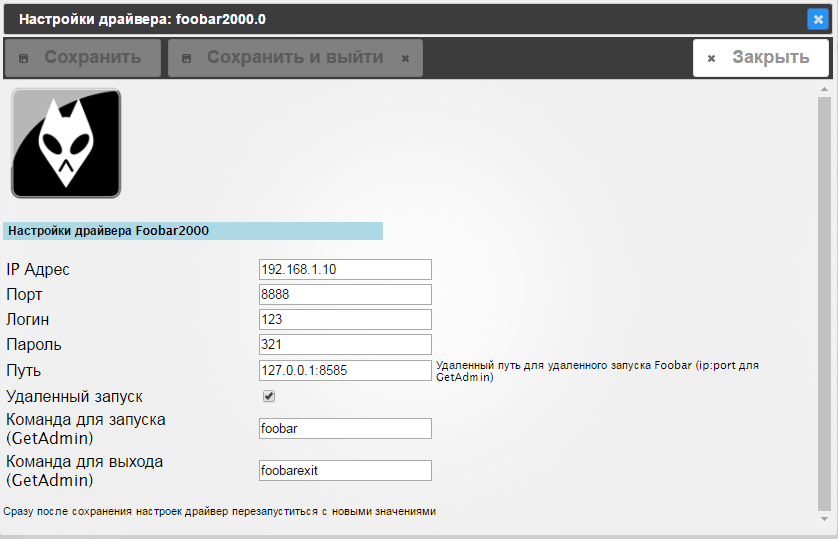

# iobroker.foobar2000

[](https://github.com/iobroker-community-adapters/ioBroker.foobar2000/blob/master/LICENSE)
[](https://www.npmjs.com/package/iobroker.foobar2000)

[](https://weblate.iobroker.net/engage/adapters/?utm_source=widget)</br>


</br>
**Version:** </br>
[](https://www.npmjs.com/package/iobroker.foobar2000)


</br>
**Tests:** </br>
[](https://github.com/iobroker-community-adapters/ioBroker.foobar2000/actions/workflows/test-and-release.yml)
[](https://github.com/iobroker-community-adapters/ioBroker.foobar2000/actions/workflows/codeql.yml)

<!--
## Sentry
**This adapter uses Sentry libraries to automatically report exceptions and code errors to the developers.**
For more details and for information how to disable the error reporting see [Sentry-Plugin Documentation](https://github.com/ioBroker/plugin-sentry#plugin-sentry)! Sentry reporting is used starting with js-controller 3.0.
-->

## Foobar2000 adapter for iobroker



## Using

To control the player, you must install the plugin [foo_httpcontrol](https://bitbucket.org/oblikoamorale/foo_httpcontrol/downloads/).
To display the cover as a link to a file, in the file ```c:\Users\{USER}\AppData\Roaming\foobar2000\foo_httpcontrol_data\foobar2000controller\config``` change the parameter ```albumart_prefer_embedded = 0```

## Changelog

<!--
    Placeholder for the next version (at the beginning of the line):
    ### **WORK IN PROGRESS**
-->

### **WORK IN PROGRESS**
- (copilot) Adapter requires js-controller >= 6.0.11 now
- (copilot) Adapter requires admin >= 7.6.17 now

### 2.2.0 (2024-04-17)
* (mcm1957) Adapter requires node.js 18 and js-controller >= 5 now
* (mcm1957) Dependencies have been updated

### 2.1.0 (2023-11-07)
* (mcm1957) Adapter requires nodejs16 or newer now.
* (mcm1957) Adapter has been moved to iobroker-community-adapters organization.
* (mcm1957) Dependencies have been updated.

### 2.0.4
* (instalator) fixed error

### 2.0.3
* (instalator) fixed admin error

### 2.0.2
* (instalator) fixed error

### 2.0.0
* (instalator) Completely rewritten

### 1.0.0
* (instalator) Up to stable

### 0.2.0
* (instalator) Change for widgets vis-players

### 0.1.2
* (instalator) del widgets folders
* (instalator) change log level
* (instalator) add news object

### 0.1.1
* (instalator) fix start, exit for local

### 0.1.0
* (instalator) beta (20.10.2016)

### 0.0.1
* (instalator) initial (12.10.2016)

## License
The MIT License (MIT)

Copyright (c) 2023-2024 iobroker-community-adapters <iobroker-community-adapters@gmx.de>
Copyright (c) 2021 instalator <vvvalt@mail.ru>

Permission is hereby granted, free of charge, to any person obtaining a copy
of this software and associated documentation files (the "Software"), to deal
in the Software without restriction, including without limitation the rights
to use, copy, modify, merge, publish, distribute, sublicense, and/or sell
copies of the Software, and to permit persons to whom the Software is
furnished to do so, subject to the following conditions:

The above copyright notice and this permission notice shall be included in all
copies or substantial portions of the Software.

THE SOFTWARE IS PROVIDED "AS IS", WITHOUT WARRANTY OF ANY KIND, EXPRESS OR
IMPLIED, INCLUDING BUT NOT LIMITED TO THE WARRANTIES OF MERCHANTABILITY,
FITNESS FOR A PARTICULAR PURPOSE AND NONINFRINGEMENT. IN NO EVENT SHALL THE
AUTHORS OR COPYRIGHT HOLDERS BE LIABLE FOR ANY CLAIM, DAMAGES OR OTHER
LIABILITY, WHETHER IN AN ACTION OF CONTRACT, TORT OR OTHERWISE, ARISING FROM,
OUT OF OR IN CONNECTION WITH THE SOFTWARE OR THE USE OR OTHER DEALINGS IN THE
SOFTWARE.
