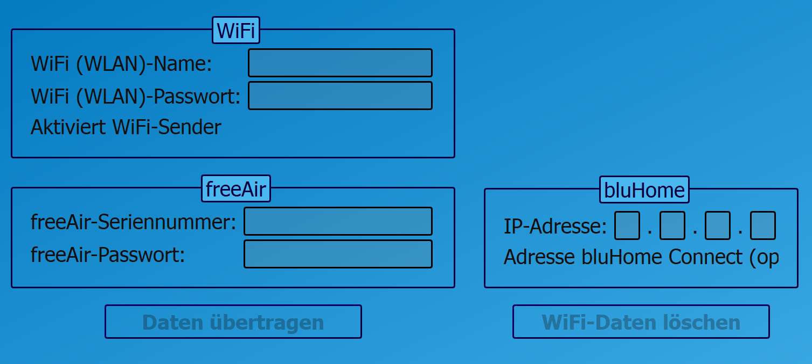
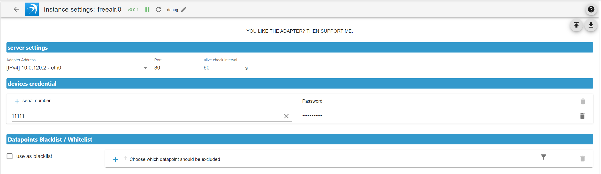

# ioBroker.freeair

**Tests:** 

## freeair adapter for ioBroker

locale connection to your [BluMartin FreeAir 100](https://blumartin.de/wohnraumlueftung-freeair-dezentral-mit-waermerueckgewinnung/) ventilation system

## Settings

### FreeAir 100

- under `bluHome` add the ip adresse of your ioBroker

### Adapter

#### Server Settings

- Adapter Adress: the ip adress of your ioBroker
- Port: default port is 80, because the FreeAir 100 devices send it's data to port 80 **_NOTE:_** you can change the port e.g. config a DNAT rule in your gateway
- alive check interval: if in this interval no data received, devices will be shown as offline

#### devices credential

- add the serial number of your FreeAir 100 devices
- add the password, that you have set in your FreeAir 100 device

#### Datapoints Blacklist / Whitelist

- blacklist or whitelist datapoints.

## Changelog

<!--
	Placeholder for the next version (at the beginning of the line):
	### **WORK IN PROGRESS**
-->
### 1.0.6 (2025-10-19)

- (Scrounger) auto translation bug fix
- (Scrounger) bug fixes

### 1.0.5 (2025-09-30)

- (Scrounger) dependencies updated
- (Scrounger) bug fixes

### 1.0.4 (2025-09-27)

- (Scrounger) bug fixes

### 1.0.3 (2025-09-21)

- (Scrounger) if only one devices is configured, show device online status as adapter status
- (Scrounger) dependencies updated
- (Scrounger) bug fixes

### 1.0.2 (2025-09-11)

- (Scrounger) automatic role assignment implemented
- (Scrounger) code optimizations
- (Scrounger) bug fixes

### 1.0.1 (2025-09-06)

- (Scrounger) bug fixes

### 1.0.0 (2025-09-03)

- (Scrounger) latest fun

### 1.0.0-beta.1 (2025-08-31)

- (Scrounger) i18n translation
- (Scrounger) dependencies updated

### 1.0.0-beta.0 (2025-08-31)

- (Scrounger) initial release

## License

MIT License

Copyright (c) 2025 Scrounger <scrounger@gmx.net>

Permission is hereby granted, free of charge, to any person obtaining a copy
of this software and associated documentation files (the "Software"), to deal
in the Software without restriction, including without limitation the rights
to use, copy, modify, merge, publish, distribute, sublicense, and/or sell
copies of the Software, and to permit persons to whom the Software is
furnished to do so, subject to the following conditions:

The above copyright notice and this permission notice shall be included in all
copies or substantial portions of the Software.

THE SOFTWARE IS PROVIDED "AS IS", WITHOUT WARRANTY OF ANY KIND, EXPRESS OR
IMPLIED, INCLUDING BUT NOT LIMITED TO THE WARRANTIES OF MERCHANTABILITY,
FITNESS FOR A PARTICULAR PURPOSE AND NONINFRINGEMENT. IN NO EVENT SHALL THE
AUTHORS OR COPYRIGHT HOLDERS BE LIABLE FOR ANY CLAIM, DAMAGES OR OTHER
LIABILITY, WHETHER IN AN ACTION OF CONTRACT, TORT OR OTHERWISE, ARISING FROM,
OUT OF OR IN CONNECTION WITH THE SOFTWARE OR THE USE OR OTHER DEALINGS IN THE
SOFTWARE.
