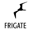

# ioBroker.frigate — Documentation

Adapter for [Frigate NVR](https://frigate.video/) — an open-source, self-hosted video surveillance system with AI-powered object detection.

## Table of Contents

- [Setup](#setup)
  - [Built-in MQTT Broker](#built-in-mqtt-broker-default)
  - [External MQTT Broker](#external-mqtt-broker)
  - [Frigate API Authentication](#frigate-api-authentication)
- [States Reference](#states-reference)
  - [Stats](#stats)
  - [Events](#events)
  - [Camera States](#camera-states)
  - [Camera Remote Controls](#camera-remote-controls)
  - [Zones](#zones)
  - [Frigate Notification Control](#frigate-notification-control)
  - [Automatically Available States](#automatically-available-states)
- [Notifications](#notifications)
  - [Supported Services](#supported-services)
  - [Configuration](#notification-configuration)
  - [Notification Text Template](#notification-text-template)
- [Integration](#integration)
  - [Live view via the web adapter](#live-view-via-the-web-adapter)
  - [Device manager widgets](#device-manager-widgets)
  - [vis Integration](#vis-integration)
  - [Scripts & Automation](#scripts--automation)
- [Requirements](#requirements)
- [FAQ](#faq)

---

## Setup

The adapter supports two MQTT modes for communicating with Frigate.

### Built-in MQTT Broker (default)

The adapter runs its own MQTT broker. Frigate connects directly to it.

1. Enter the Frigate URL in the adapter settings (e.g. `192.168.178.2:5000`)
2. Set the MQTT port (default: `1883`)
3. Configure Frigate's `config.yml` to connect to ioBroker:

```yaml
mqtt:
  host: <ioBroker IP address>
  port: 1883
```

4. Start both Frigate and the adapter. You should see "New client" in the adapter log.

### External MQTT Broker

If you already run an MQTT broker (e.g. Mosquitto), configure the adapter to connect as a client.

1. Set **MQTT Mode** to `External MQTT Broker`
2. Enter the broker host (e.g. `192.168.1.100` or `mqtt://192.168.1.100:1883`)
3. Optionally enter username and password
4. Set the **MQTT Topic Prefix** if Frigate uses a custom one (default: `frigate`)
5. Enter the Frigate URL as usual

### Frigate API Authentication

If your Frigate instance has authentication enabled (typically on port 8971 with HTTPS), you can configure the adapter to log in automatically.

1. Enter the Frigate URL with `https://` prefix (e.g. `https://192.168.178.26:8971`)
2. Enter your **Frigate Username** and **Frigate Password**
3. The adapter will log in via `POST /api/login` and use the JWT token for all API calls

If the fields are left empty, no login is performed and the adapter works as before (unauthenticated access on port 5000).

The adapter automatically refreshes the token if it expires (401 response triggers re-login and request retry).

**Note:** Self-signed certificates are accepted. If you don't use HTTPS, leave the URL without prefix (e.g. `192.168.178.26:5000`) — the adapter defaults to HTTP.

---

## States Reference

### Stats

`frigate.0.stats.*` — General system information updated every few seconds.

| State                                    | Description                          | Unit  |
|------------------------------------------|--------------------------------------|-------|
| `stats.cameras.<name>.camera_fps`        | Frames per second from camera feed   | fps   |
| `stats.cameras.<name>.process_fps`       | Frames per second being processed    | fps   |
| `stats.cameras.<name>.skipped_fps`       | Frames skipped (processing overload) | fps   |
| `stats.cameras.<name>.detection_fps`     | Object detection runs per second     | fps   |
| `stats.cameras.<name>.detection_enabled` | Object detection active              | —     |
| `stats.cameras.<name>.audio_dBFS`        | Audio level                          | dBFS  |
| `stats.cameras.<name>.audio_rms`         | Audio RMS amplitude                  | —     |
| `stats.detectors.<name>.inference_speed` | Time per inference                   | ms    |
| `stats.service.uptime`                   | Service uptime                       | s     |
| `stats.service.version`                  | Frigate version                      | —     |
| `stats.service.storage.<mount>.total`    | Total storage                        | MB    |
| `stats.service.storage.<mount>.used`     | Used storage                         | MB    |
| `stats.service.storage.<mount>.free`     | Free storage                         | MB    |

### Events

`frigate.0.events.*` — Last event with before/after information.

| State                       | Description                     |
|-----------------------------|---------------------------------|
| `events.after.camera`       | Camera that detected the event  |
| `events.after.label`        | Object type (person, car, etc.) |
| `events.after.top_score`    | Highest confidence score        |
| `events.after.has_snapshot` | Snapshot available              |
| `events.after.has_clip`     | Clip available                  |
| `events.history.json`       | JSON array of the last X events |

Each event in the history includes URLs for snapshots and clips:
- `websnap` — Snapshot URL
- `webclip` — Clip URL (MP4)
- `webm3u8` — HLS stream URL
- `thumbnail` — Base64-encoded thumbnail

### Camera States

`frigate.0.<camera_name>.*` — Status and detection states per camera.

| State                       | Type    | Writable  | Description                               |
|-----------------------------|---------|-----------|-------------------------------------------|
| `<cam>.motion`              | boolean | no        | Motion currently detected                 |
| `<cam>.person`              | number  | no        | Number of persons detected                |
| `<cam>.car`                 | number  | no        | Number of cars detected                   |
| `<cam>.person_snapshot`     | string  | no        | Base64 JPEG of last detected person       |
| `<cam>.detect_state`        | boolean | yes       | Enable/disable object detection           |
| `<cam>.recordings_state`    | boolean | yes       | Enable/disable recordings                 |
| `<cam>.snapshots_state`     | boolean | yes       | Enable/disable snapshots                  |
| `<cam>.audio_state`         | boolean | yes       | Enable/disable audio detection            |
| `<cam>.birdseye_state`      | boolean | yes       | Enable/disable birdseye view              |
| `<cam>.birdseye_mode_state` | string  | yes       | Birdseye mode (objects/continuous/motion) |
| `<cam>.review_status`       | string  | no        | Activity level (NONE/DETECTION/ALERT)     |

### Camera Remote Controls

`frigate.0.<camera_name>.remote.*` — Writable states to control cameras.

| State                              | Type    | Description                                                          |
|------------------------------------|---------|----------------------------------------------------------------------|
| `remote.ptz`                       | string  | PTZ commands (e.g. `preset_preset1`, `MOVE_LEFT`, `ZOOM_IN`, `STOP`) |
| `remote.createEvent`               | string  | Create manual event with label                                       |
| `remote.createEventBody`           | string  | JSON body for manual event creation                                  |
| `remote.motionThreshold`           | number  | Motion detection threshold (1-255)                                   |
| `remote.motionContourArea`         | number  | Motion contour area minimum size                                     |
| `remote.birdseyeMode`              | string  | Birdseye mode (objects, continuous, motion)                          |
| `remote.improveContrast`           | boolean | Toggle contrast improvement for detection                            |
| `remote.pauseNotifications`        | boolean | Pause notifications for this camera                                  |
| `remote.pauseNotificationsForTime` | number  | Pause notifications for X minutes                                    |
| `remote.notificationText`          | string  | Custom notification text for this camera                             |
| `remote.notificationMinScore`      | number  | Custom min score for notifications                                   |

### Zones

Zone devices are automatically created from the Frigate configuration.

The plain object count (e.g. `<zone>.person`, `<zone>.car`) comes directly from Frigate's MQTT occupancy topics (`frigate/<zone>/<object>` and `frigate/<zone>/all`), so it always matches what Frigate reports. The adapter additionally provides an active/stationary breakdown and a summary, derived from the event stream.

| State                      | Type    | Description                                         | Source           |
|----------------------------|---------|-----------------------------------------------------|------------------|
| `<zone>.person`            | number  | Persons currently in zone                           | Frigate MQTT     |
| `<zone>.all`               | number  | All objects currently in zone                       | Frigate MQTT     |
| `<zone>.person_active`     | number  | Actively moving persons                             | event aggregator |
| `<zone>.person_stationary` | number  | Stationary persons                                  | event aggregator |
| `<zone>.total_objects`     | number  | Total objects of all types (active + stationary)    | event aggregator |
| `<zone>.active`            | boolean | Any object detected in zone                         | event aggregator |

The active/stationary states use the object's `current_zones` and are reset to 0 once the object leaves the zone or the event ends.

### Frigate Notification Control

`frigate.0.notifications.*` — Control Frigate's built-in notification system.

| State                     | Type    | Writable  | Description                          |
|---------------------------|---------|-----------|--------------------------------------|
| `notifications.enabled`   | boolean | yes       | Enable/disable Frigate notifications |
| `notifications.suspend`   | number  | yes       | Suspend for X minutes                |
| `notifications.suspended` | number  | no        | UNIX timestamp when suspension ends  |

### Automatically Available States

These states are automatically created when Frigate publishes the corresponding MQTT topics:

| State                          | Description                                     |
|--------------------------------|-------------------------------------------------|
| `<cam>.audio_dBFS`             | Audio level in dBFS                             |
| `<cam>.audio_rms`              | Audio RMS level                                 |
| `<cam>.audio_transcription`    | Transcribed audio text                          |
| `<cam>.audio_<type>`           | Audio type detection (speech, bark, etc.)       |
| `<cam>.status_detect`          | Health of detect role (online/offline/disabled) |
| `<cam>.status_audio`           | Health of audio role                            |
| `<cam>.status_record`          | Health of record role                           |
| `<cam>.classification_<model>` | Classification results                          |
| `<cam>.ptz_autotracker_active` | PTZ autotracker active                          |

---

## Notifications

The adapter can send snapshots and clips from events to messaging services.

### Supported Services

- Telegram
- Pushover (snapshots only, no video)
- Signal (signal-cmb)
- Email (mail)
- Any other ioBroker messaging adapter

### Notification Configuration

1. Enable notifications in the adapter settings
2. Enter one or more notification instances (e.g. `telegram.0`)
3. Optionally enter user names/IDs for targeted delivery
4. Set minimum score threshold (0 = disabled)

Clips are sent after the configured wait time (default: 5 seconds) after the event ends.

**Important:** The notification instance and the Frigate adapter must run on the same host, as files are passed via the local filesystem.

### Notification Text Template

Use placeholders in your notification text:

| Placeholder  | Description                            |
|--------------|----------------------------------------|
| `{{source}}` | Camera name                            |
| `{{type}}`   | Object type (person, car, etc.)        |
| `{{state}}`  | Event state (Event Before/Event After) |
| `{{status}}` | Event status (new/update/end)          |
| `{{score}}`  | Confidence score                       |
| `{{zones}}`  | Entered zones (comma-separated)        |

Example: `{{source}}: {{type}} detected ({{score}}) in {{zones}}`

---

## Integration

### Live view via the web adapter

The adapter registers a web extension in `ioBroker.web`, so every camera is available under the web
server without exposing Frigate itself:

| URL | Content |
| --- | --- |
| `http(s)://iobroker-IP:8082/frigate.0/<camera>/snapshot.jpg` | the current frame as JPEG |
| `http(s)://iobroker-IP:8082/frigate.0/<camera>/stream.mjpeg` | continuous MJPEG, usable in a plain `` |

Both accept the query parameters of the corresponding Frigate endpoint, e.g. `?height=480` for a
smaller picture, `?fps=5` to limit the frame rate of the stream, or `?bbox=1&timestamp=1` to let
Frigate draw the bounding boxes and the timestamp into the image.

Why go through the web adapter instead of using the Frigate URL directly:

- Frigate is usually bound to `127.0.0.1`, so its URL does not work from any other machine
- port 8971 requires a login — the adapter holds the token, the browser does not
- an http Frigate inside an https ioBroker.web is blocked by the browser as mixed content
- these routes are covered by the ioBroker.web authentication, Frigate's own port is not

Note that Frigate encodes the MJPEG stream separately for every viewer. For a permanent dashboard
prefer a snapshot that is reloaded every few seconds and keep MJPEG for the moments when somebody is
really watching.

### Device manager widgets

The adapter ships two widgets for **ioBroker.devices**. Both let you pick a camera as a plain object
below the `frigate` namespace (e.g. `frigate.0.driveway`) and can have Frigate draw the detection
boxes and the timestamp into the picture.

- **Frigate Snapshot** — reloads a still picture in a configurable interval. It asks the adapter over
  the ioBroker socket, so it works wherever the Devices UI runs, including inside admin, and it
  reuses the Frigate login of the adapter.
- **Frigate Live** — shows the MJPEG stream, which the browser decodes natively. It loads the stream
  from the **web** adapter, which the Devices UI can only reach when it runs inside a web instance.
  When it runs in admin — the usual case — enter the web instance in the widget settings, e.g.
  `http://192.168.1.5:8082`.

If in doubt use the snapshot widget, it has no such restriction.

### vis Integration

**Snapshot:**
```
String img src → Object ID: frigate.0.camera_name.person_snapshot
String img src → Object ID: frigate.0.events.history.01.thumbnail
```

**Clip:**
```html
<video width="100%" height="auto" src="{frigate.0.events.history.01.webclip}" autoplay muted></video>
```

**Person count:**
```
Value → Object ID: frigate.0.camera_name.person
```

**Zone activity:**
```
Indicator → Object ID: frigate.0.Vorgarten.active
Value → Object ID: frigate.0.Vorgarten.person
```

### Scripts & Automation

Example: Turn on light when person is detected in zone:

```javascript
on({ id: 'frigate.0.Vorgarten.active', val: true }, () => {
    setState('hm-rpc.0.ABC1234567.1.STATE', true);
    log('Person detected in Vorgarten');
});
```

Example: Send notification when person count in zone exceeds threshold:

```javascript
on({ id: 'frigate.0.Vorgarten.person', change: 'ne' }, (obj) => {
    if (obj.state.val >= 3) {
        sendTo('telegram.0', { text: `Warning: ${obj.state.val} persons in Vorgarten!` });
    }
});
```

---

## Requirements

| Component     | Minimum Version |
|---------------|-----------------|
| Node.js       | >= 20           |
| js-controller | >= 6.0.5        |
| Admin         | >= 7.7.29       |
| Frigate       | >= 0.14         |

---

## FAQ

**Q: The adapter shows "cannot find start file" when installed from GitHub.**
A: This version includes the build directory. If you still get this error, run `npm run build` in the adapter directory.

**Q: Zone devices are empty.**
A: Zone states are only created when Frigate detects objects in those zones. Wait for an event to occur in the zone.

**Q: I get ENOENT errors for snapshots/clips.**
A: This was fixed in v2.3.0. Update to the latest version.

**Q: How do I change the motion detection threshold?**
A: Set `frigate.0.<camera>.remote.motionThreshold` to a value between 1-255.

**Q: Notifications are not sent.**
A: Ensure the notification instance (e.g. telegram.0) runs on the same host as the Frigate adapter. Check that notifications are enabled in the adapter settings.