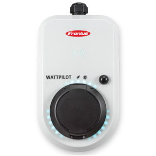

# ioBroker.fronius-wattpilot

**Tests:** 

Barebones implementation of the unofficial Fronius Watt pilot (https://www.fronius.com/de-ch/switzerland/solarenergie/installateure-partner/technische-daten/alle-produkte/l%C3%B6sungen/fronius-wattpilot) API. Based on https://github.com/joscha82/wattpilot.

## How to install:
**I don't take the responsibility for your device. With this API you can access the device directly, be careful.** 
### **Requirements**
- Finish your normal installation of the Fronius Watt pilot app. Remember the Password! 
- Go to the Internet tab and connect your Pilot to your Wi-Fi. 
- Find out the IP-Adress of your WattPilot. 
  - Option 1: Via your Router's Web-GUI. 
  - Option 2: Via Wattpilot App: After the connection established click on the Wi-Fi name.     
  You will see a page with more information about your Wi-Fi connection. Note the IP address down.
  
### **iobroker.fronuis-wattpilot Adapter**
- Now you can regularly install an instance of iobroker.fronius-wattpilot via the "Adapters"-page.
- After you created the instance, you will be prompted to insert IP-Address and password of your WattPilot. Fill in the values you noticed before and save the config. If you have done everything correctly the adapter will turn green after a while and you can see the incoming data in the objects tab.

**It is highly recommended to assign a static-IP to your WattPilot.**
## How can I use the adapter...
You can use the datapoints of this adapter like every other datapoint in your broker.

To get some ideas see "examples".

There is a [Blockly-example](https://github.com/tim2zg/ioBroker.fronius-wattpilot/blob/main/examples/example-Blockly.xml) how you can measure your Solar Grid output and automatically adjusts the Pilot to the right current value (Amp) to improve your internal energy consumption.    
You can simply import it by copying the content of the example and insert it via the "Import blocks"-icon in the upper right corner of your Blockly-script.

## What does the adapter?
The adapter connects to the WattPilots WebSocket and separates incoming data into ioBroker-datapoints you can use quite comfortable. 

## Get states
By default, the adapter only writes the key points of the Wattpilot. If you want all the possible values the API can deliver, uncheck the checkbox in the instance-settings.    
A documentation of the Datapoints is available here: https://github.com/joscha82/wattpilot/blob/main/API.md (Thanks to joscha82)

## Set states?
The most important states you can set directly, these are AccessState, amp, cableLock, cae and mode. 

**AccessState**: "Open" or "Wait"

**amp**: 6-16

**cableLock**: "Normal" or "AutoUnlock" or "AlwaysLock"

**cae**: "true" or "false" (watch out this disables the cloud functionality of your WattPilot may need to restart)

Yes, just write the state name followed by a semicolon and then the value in the set_state state.     
For example:

    amp;6
  
**You can control the "amp" and the "lmo" state directly via the set_power and the set_mode states.**

## What does this mess mean?
Thanks to joscha82 we know: https://github.com/joscha82/wattpilot/blob/main/API.md

## Developers
- [SebastianHanz](https://github.com/SebastianHanz)
- [tim2zg](https://github.com/tim2zg)
- [derHaubi](https://github.com/derHaubi)

### Changelog
<!--
    Placeholder for the next version (at the beginning of the line):
    ### **WORK IN PROGRESS**
-->
### 4.6.3 (2023-12-24)
- Fixed a bug where the adapter would use a undefined variable
- Fixed bug #44
- Fixed bug #43

### 4.6.2 (2023-08-15)
- Thanks to Norb1204 for fixing a few bugs that I missed. More in Issue #40

### 4.6.1 (2023-08-15)
- Fixed Issue #39 (set_state not working)

### 4.6.0 (2023-07-15)
- Fixed timeout issue in normal parser mode (#36), still exist in dynamic parser mode --> use no timeout (0)
- Fixed a number of issues concerning the static parser mode
- Quality of life improvements --> you can now set the common states directly! (set_power, set_mode) are still available for compatibility reasons and for the dynamic parser mode

### 4.5.1 (2023-03-02)
- Fixed issue #29 (custom states not working)

### 4.5.0 (2023-02-19)
- Fixed random log messages
- Fixed a type conflict at the set_state state
- Commits from now on should be signed

### 4.4.0 (2023-02-16)
- known states will now be updated even if the dynamic parser is enabled

### 4.3.0 (2023-01-14)
- dependency updates
- state updates

### 4.2.1 (2023-01-05)
- Fixed bug in the all values mode / parser

### 4.2.0 (2023-01-01)
- Some QoL improvements

### 4.1.0 (2022-12-30)
- Added the possibility to add states manually via the instance-settings
- Fixed the bug where the adapter didn't set the correct value types
- Added some quality of life improvements

### 4.0.0 (2022-11-30)
- Fixed timing issue 
- Added set_power and set_mode states

### 3.3.1 (2022-11-17)
- Fixed a bug where set_state was not writable

### 3.3.0 (2022-11-17)
- Fixed a bug where the adapter would not set the correct labels for the states
- Performance improvements
- Fixed dependencies

### 3.2.5 (2022-10-14)
- Small changes to the package.json and io-package.json

### 3.2.4 (2022-10-11) 
- Fiexed cool down timer for normal values

### 3.2.3 (2022-10-08)
- Bug fixed where the adapter would not respect the timout timer and would try to constantly reconnect to the WattPilot
- Bug fixed where the adapter would send a wrong disconnect message to the WattPilot

### 3.2.2 (2022-10-06)
- Fixed reconnecting frequency
- Fixed multiple Websocket connections
- Added frequency handler

### 3.2.1 (2022-10-02)
- Fixed reconnecting to the WebSocket
- Restructured the code

### 3.2.0 (2022-09-29)
- Implemented reconnecting
- Shrank code down

### 3.1.0 (2022-09-07)
- Added the option to use the cloud as a datasource
- Updated GitHub workflows

### 3.0.0 (2022-09-04)
- Updated README.md
- Created "examples"-directory for sample applications
- Added some translations
- Renamed checkbox "Parser" to something more intuitive
- Fixxed #4: Datapoint "map" now gets created correctly
- Fixxed #5: Password-characters are no longer visible
- Fixxed type conflict of cableType

### 2.2.4 (2022-09-01)
- SebastianHanz fixed infinite RAM-usage
- added some description

### 2.2.3 (2022-08-30)
- SebastianHanz fixed type-conflicts. Thank you!

### 2.2.2 (2022-08-25)
- Bug fixes

### 2.2.1 (2022-08-22)
- Bug fixes

### 2.2.0 (2022-08-21)
- Fixed Bugs

### 2.1.0 (2022-08-19)
- Min Node Version 16

### 2.0.3 (2022-07-20)
- Updated Readme

### 2.0.2 (2022-07-12)
-   Bug fixed

### 2.0.1 (2022-07-10)
-   Added a how to install. Not to detail because currently not in stable repo.

### 2.0.0 (2022-07-10)
-   Fixed NPM Versions hopefully

### 1.1.0 (2022-07-10)
-   Added UselessPV and TimeStamp Parser, did some testing.

### 1.0.1 (2022-06-02)
- Tests

### 1.0.0 (2022-06-02)

- Did some changes
- Did some more changes

### 0.0.5 (2020-01-01)
- Better Code

### 0.0.4 (2020-01-01)
- Parser option added

### 0.0.3 (2020-01-01)
- Parser added

### 0.0.2 (2020-01-01)
- Bug fixed

### 0.0.1 (2020-01-01)
- Initial release

## License
MIT License

Copyright (c) 2024 tim2zg <tim2zg@protonmail.com>

Permission is hereby granted, free of charge, to any person obtaining a copy
of this software and associated documentation files (the "Software"), to deal
in the Software without restriction, including without limitation the rights
to use, copy, modify, merge, publish, distribute, sublicense, and/or sell
copies of the Software, and to permit persons to whom the Software is
furnished to do so, subject to the following conditions:

The above copyright notice and this permission notice shall be included in all
copies or substantial portions of the Software.

THE SOFTWARE IS PROVIDED "AS IS", WITHOUT WARRANTY OF ANY KIND, EXPRESS OR
IMPLIED, INCLUDING BUT NOT LIMITED TO THE WARRANTIES OF MERCHANTABILITY,
FITNESS FOR A PARTICULAR PURPOSE AND NONINFRINGEMENT. IN NO EVENT SHALL THE
AUTHORS OR COPYRIGHT HOLDERS BE LIABLE FOR ANY CLAIM, DAMAGES OR OTHER
LIABILITY, WHETHER IN AN ACTION OF CONTRACT, TORT OR OTHERWISE, ARISING FROM,
OUT OF OR IN CONNECTION WITH THE SOFTWARE OR THE USE OR OTHER DEALINGS IN THE
SOFTWARE.
