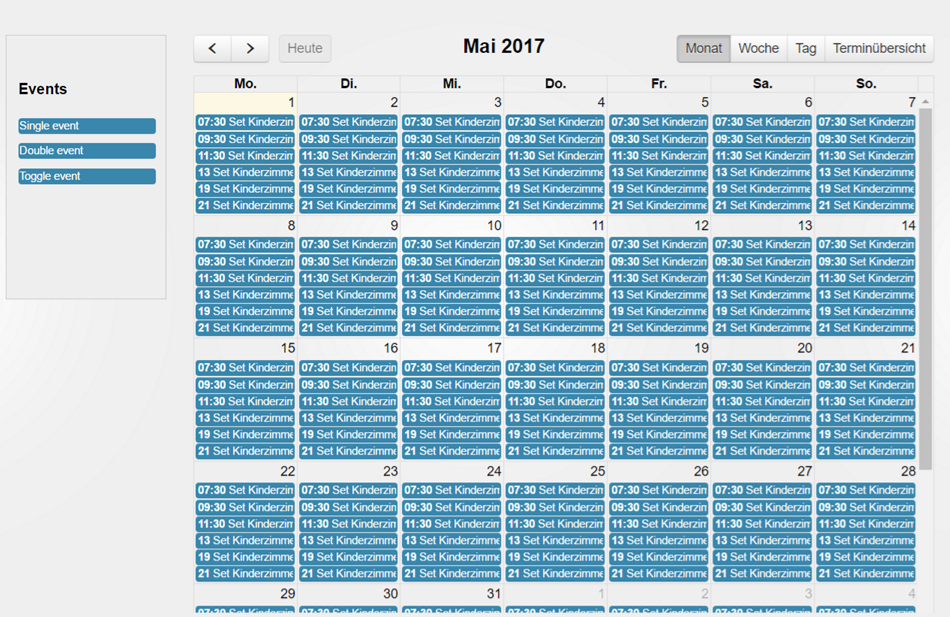

# ioBroker.fullcalendar

  

Schedules with [fullcalendar](https://fullcalendar.io).

You must not use any external resources, the scheduling is processed only in ioBroker and will be not combined with any external services like "google calendar" or "iTunes".

You can control your events with calendar and can plan to control them periodically.

## Todo
- Week and day must scroll to the current time
- Astro events

<!--
	Placeholder for the next version (at the beginning of the line):
	### **WORK IN PROGRESS**
-->
## Changelog
### 2.0.5 (2023-03-07)
* (bluefox) New material design
* (bluefox) License changed to MIT
* (bluefox) Allowed deletion of events

### 1.2.0 (2021-12-14)
* (bluefox) Updated to use with js-controller 3.3 and admin 5

### 1.1.0 (2020-01-12)
* (foxriver76) Updated to use with js-controller 2.x

### 1.0.0 (2019-11-17)
* (bluefox) Support of compact mode added

### 0.2.4 (2017-11-23)
* Translations

### 0.2.3 (2017-11-22)
* (bluefox) Fix interval settings
* (bluefox) Update fullcalendar library

### 0.2.1 (2017-09-25)
* (bluefox) Fixed error

### 0.2.0 (2017-08-06)
* (bluefox) Support of new admin

### 0.1.1 (2017-07-13)
* (bluefox) fix double event by creation

### 0.1.0 (2017-03-20)
* (bluefox) initial commit

## License
The MIT License (MIT)

Copyright (c) 2017-2023 Bluefox <dogafox@gmail.com>

Permission is hereby granted, free of charge, to any person obtaining a copy
of this software and associated documentation files (the "Software"), to deal
in the Software without restriction, including without limitation the rights
to use, copy, modify, merge, publish, distribute, sublicense, and/or sell
copies of the Software, and to permit persons to whom the Software is
furnished to do so, subject to the following conditions:

The above copyright notice and this permission notice shall be included in
all copies or substantial portions of the Software.

THE SOFTWARE IS PROVIDED "AS IS", WITHOUT WARRANTY OF ANY KIND, EXPRESS OR
IMPLIED, INCLUDING BUT NOT LIMITED TO THE WARRANTIES OF MERCHANTABILITY,
FITNESS FOR A PARTICULAR PURPOSE AND NONINFRINGEMENT. IN NO EVENT SHALL THE
AUTHORS OR COPYRIGHT HOLDERS BE LIABLE FOR ANY CLAIM, DAMAGES OR OTHER
LIABILITY, WHETHER IN AN ACTION OF CONTRACT, TORT OR OTHERWISE, ARISING FROM,
OUT OF OR IN CONNECTION WITH THE SOFTWARE OR THE USE OR OTHER DEALINGS IN
THE SOFTWARE.
