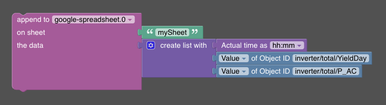

# Append

➡️ See the [sendTo API documentation](/#/docs/adapterref/iobroker.google-spreadsheet/docs/sendTo-API.md) for general usage and all available commands.
The append feature allows you to append data to a Google spreadsheet.

Used API endpoint: https://developers.google.com/sheets/api/reference/rest/v4/spreadsheets.values/append

The feature accepts the following parameters:
- `sheetName`: The name of the sheet to append to.
- `data`: The data to append (single value or one-dimensional array).
- `alias` (optional): The spreadsheet alias if you have multiple spreadsheets configured.

**Callback result:** `{ success: true }` on success, or `{ error: string }` on failure.

## Blockly



In Blockly, the parameter sheetname is always passed as the range-parameter to the Google API. However, the range-parameter can accept not only a sheet name but also a cell in A1 notation. If you need to append data to a specific cell, you can specify the cell using the range-parameter. For instance, you can use 'Sheet1!A1:A1' to target a specific cell.

## Javascript

The given code snippet adds a new row to the spreadsheet. Each of the three array values will create a distinct cell in the spreadsheet.

```javascript

sendTo(
  "google-spreadsheet", 
  "append", {  
    "sheetName": "nameOfTab", 
    "data":[
      formatDate(new Date(), 'hh:mm'), 
      getState('mqtt.0.inverter.total.YieldDay').val, 
      getState('mqtt.0.inverter.total.P_AC').val
    ]
  }
);
```