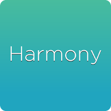
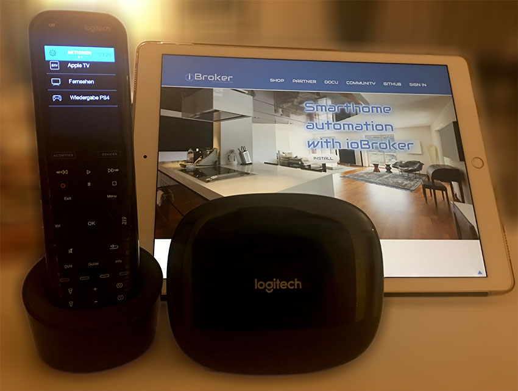
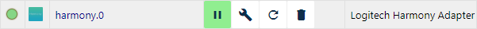
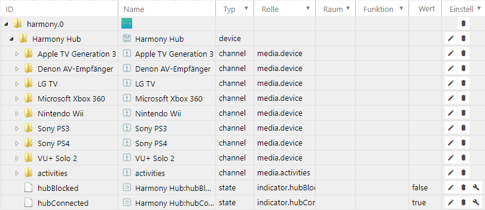
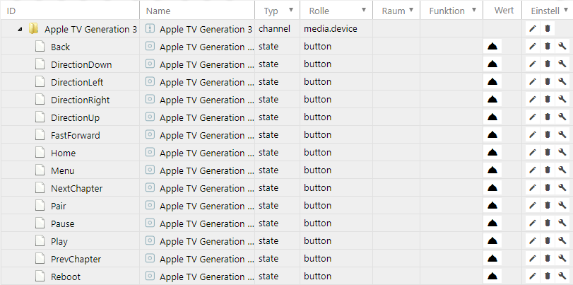
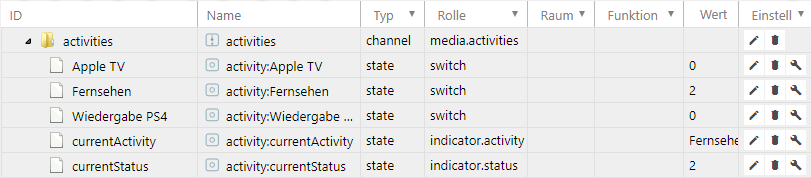
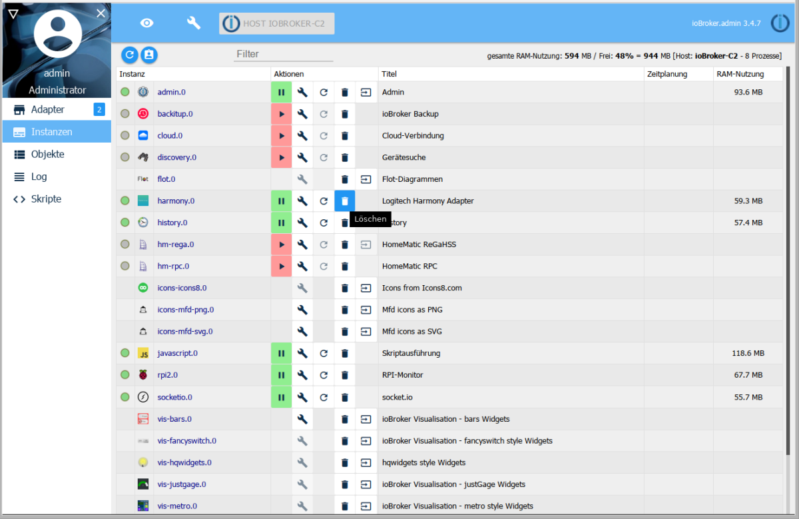
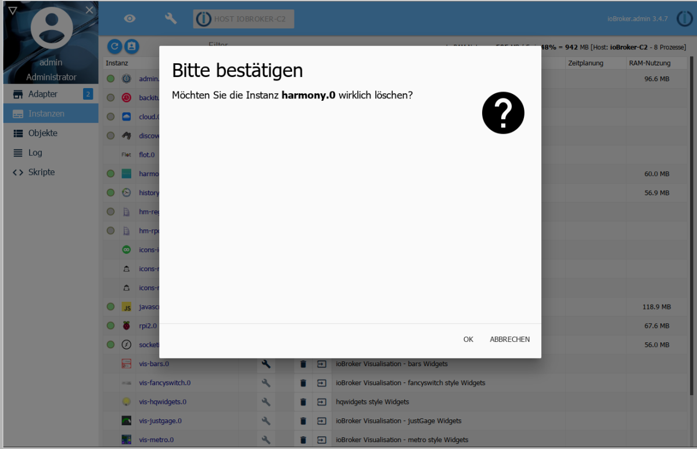
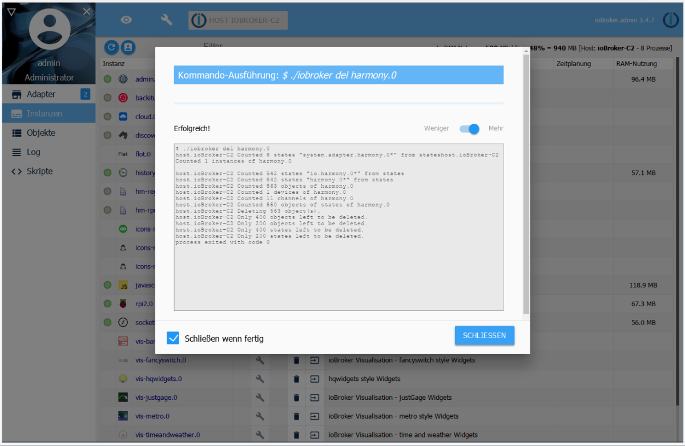
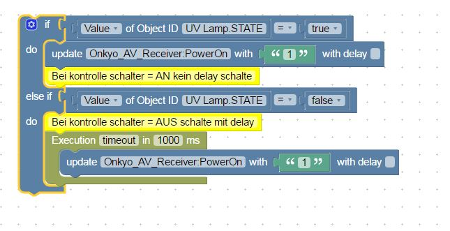

# ioBroker.harmony

[](https://github.com/iobroker-community-adapters/ioBroker.harmony/blob/master/LICENSE)
[](https://www.npmjs.com/package/iobroker.harmony)

[](https://weblate.iobroker.net/engage/adapters/?utm_source=widget)


**Version:**

[](https://www.npmjs.com/package/iobroker.harmony)


**Tests:**

[](https://github.com/iobroker-community-adapters/ioBroker.harmony/actions/workflows/test-and-release.yml)
[](https://github.com/iobroker-community-adapters/ioBroker.harmony/actions/workflows/codeql.yml)

<!--
## Sentry
**This adapter uses Sentry libraries to automatically report exceptions and code errors to the developers.**
For more details and for information how to disable the error reporting see [Sentry-Plugin Documentation](https://github.com/ioBroker/plugin-sentry#plugin-sentry)! Sentry reporting is used starting with js-controller 3.0.
-->

## ioBroker Logitech Harmony adapter

The Logitech Harmony adapter integrates one or several Logitech Harmony hubs into an ioBroker system.

A Logitech Harmony hub can control a wide range of entertainment and smart home devices. Through the hub, ioBroker can start and stop activities, read the status of an activity, and remote-control devices by sending virtual key presses.



## Overview

### Logitech Harmony
Logitech Harmony is compatible with more than 270000 entertainment and smart home devices. These range from televisions and cable boxes, disc players and game consoles to AV receivers and streaming media players, as well as smart lighting, locks, thermostats and much more.

With Logitech Harmony you can switch programs, adjust the volume, define favourites and control lighting and other smart devices. The highlight of the system is the ability to create actions that control several devices with a single key press.

1. The Logitech Harmony hub connects to the home network over Wi-Fi.
2. Harmony hubs have no Ethernet port.
3. The hub supports the 2.4 GHz Wi-Fi band only. The 5 GHz band is not supported.
4. An 802.11 g/n router should be used. 802.11 a/b is not supported.
5. As Wi-Fi encryption, the hub supports WEP 64/128, WPA Personal and WPA2-AES.
6. UPnP does not have to be enabled for the Harmony app to find the hub and communicate with it. It does have to be enabled, however, so that the hub itself can find other devices in the network and work together with them — this concerns devices such as Philips Hue, Sonos, Nest, Roku or smart TVs.
7. The maximum number of devices per hub is 8. Up to 15 devices are possible if at least one Harmony Touch or Ultimate One is registered at the hub as a remote control.
8. The maximum number of favourite channels is 50 per mobile device.

### The Logitech Harmony adapter
The Logitech Harmony adapter automatically finds every Logitech Harmony hub that shares the network subnet with the ioBroker server over a Wi-Fi connection.

The objects for triggering device functions and activities (= command macros) are created in ioBroker by the adapter automatically. The current status of the hub is available as well. By writing to or reading the created objects, their status can be changed, and actions can therefore be triggered or queried.

## Prerequisites before the installation
Devices and activities can neither be created nor changed through the ioBroker adapter for the Logitech Harmony system. Before the adapter is used, the remote control system therefore has to be set up as described in the Logitech manual, and it has to work together with the controlled devices.

## Installation
An instance of the adapter is installed through the ioBroker admin interface. The detailed description of the necessary installation steps can be found **[here](https://www.iobroker.net/#en/documentation/admin/adapter.md)**.

After the installation of an adapter instance has finished, a configuration window opens automatically.

## Configuration
The adapter finds every Harmony hub in the subnet of the ioBroker server on its own. In most installations nothing has to be configured at all.

### The "Logitech Harmony adapter settings" window

| Field                  | Description                                                                                                                                                                                                                                                                                                                                                                                               |
|------------------------|-----------------------------------------------------------------------------------------------------------------------------------------------------------------------------------------------------------------------------------------------------------------------------------------------------------------------------------------------------------------------------------------------------------|
| **Network Interface**  | The interface the adapter searches on. On hosts with several networks (multiple NICs, Docker, VPN) pick the right one, so that both the broadcast and the answer of the hub use it. The broadcast address is derived from that interface, so subnet masks other than /24 work as well (#331). Leave the field empty to search on all interfaces — this is the recommended setting for most installations. |
| **Discovery Interval** | How often a discovery broadcast is sent. The default is 2000 ms, the smallest accepted value is 500 ms.                                                                                                                                                                                                                                                                                                   |
| **Manual Hub IPs**     | An optional list of hub addresses. As soon as it contains at least one entry, the adapter contacts exactly those addresses and skips the broadcast entirely. Use it when a hub sits in a different subnet than ioBroker, or when broadcast traffic is blocked in your network (#147).                                                                                                                     |

After the configuration has been finished, the configuration dialog is left with `SAVE AND CLOSE`. The adapter is restarted afterwards.

Instances updated from version 2.1.0 or older migrate the removed *Discovery-Subnets* setting automatically on the first start: an address that is the broadcast address of one of your interfaces selects that interface, any other address becomes a manual hub IP. The adapter writes to the log what it has converted.

## Instances
The installation of the adapter has created an active instance of the Logitech Harmony hub adapter in the `Instances` section.



Only one instance of the Logitech Harmony adapter can be installed on an ioBroker server.

Whether the adapter is enabled and connected to the Logitech Harmony hub is shown by the colour of the status field of the instance. If the mouse pointer is placed on the symbol, further details are displayed.

## Objects of the adapter
In the `Objects` section, all devices and activities that the adapter has found in the hub are listed as a tree. In addition, the objects tell whether the communication with the hub runs smoothly.



Every state is listed together with its data type and its permissions. Permissions can be reading (R) as well as writing (W). Every state can at least be read (R), while others can be written as well. To find a certain state, the search with the key combination "CTRL + F" is recommended.

| Object                                | Access  | Description                                                                                             |
|---------------------------------------|---------|---------------------------------------------------------------------------------------------------------|
| **harmony.0**                         | R       | Name of the first *instance* of the Logitech Harmony adapter                                            |
| &emsp;**Harmony Hub**                 | R       | Name of the *hub*                                                                                       |
| &emsp;&emsp;**Apple TV Generation 3** | R       | Name of a *device*, contains the device functions                                                       |
| &emsp;&emsp;**Denon AV-Empfänger**    | R       | Name of a *device*, contains the device functions                                                       |
| &emsp;&emsp;**:**                     | R       | Further *devices*                                                                                       |
| &emsp;&emsp;**activities**            | R       | List of all *activities* programmed in the Harmony hub                                                  |
| &emsp;&emsp;***hubBlocked***          | R       | Shows whether the hub is busy at the moment, i.e. starting or stopping an activity or sending a command |
| &emsp;&emsp;***hubConnected***        | R       | Status of the connection between the adapter and the hub                                                |

`hubBlocked` and `hubConnected` are read-only, writing to them has no effect.

### Device functions
If a device is opened, a list with all functions belonging to that device is shown. These device functions are device-specific and therefore differ between devices of different types.



#### Triggering a device function
Every device function `{instance}.{hub name}.{device}.{device function}` triggers the corresponding reaction of the addressed device. The values of device functions can be read and written. The triggering can be tested by clicking the bell to the right of the function with the mouse pointer. Alternatively a value can be entered there with the pencil symbol.

Values have the unit `milliseconds`. If a value between 1 and 250 ms is entered, the Harmony hub usually sends a single key press of the given length. Values greater than 250 ms can lead to the device function being triggered several times.

After the device function has been triggered, the value changes back to 0.

### Activities
All activities programmed at the Harmony hub are listed below `activities`.



#### Starting an activity
An activity is started by entering a number greater than 0 at the activity `{instance}.{hub name}.activities.{activity}`. While the activity is being executed, this value first changes to 1 (= starting) and then to 2 (= active).

#### Stopping an activity
Running activities are stopped by setting their value to 0. Alternatively, any number can be entered in the object `{instance}.{hub name}.activities.currentStatus` to stop the running activity. While the activity is being stopped, `{instance}.{hub name}.activities.currentStatus` changes from 3 (= stopping) to 0 (= inactive).

#### Further status values
`{instance}.{hub name}.activities.currentActivity` returns the currently running activity as a string.

`{instance}.{hub name}.activities.currentStatus` shows the status of the Harmony hub. The values mean:

- 0 = inactive
- 1 = starting
- 2 = active
- 3 = stopping

`{instance}.{hub name}.activities.{activity}` shows the status of a single activity. The meaning of the values is the same as for `{instance}.{hub name}.activities.currentStatus`.

## Uninstallation
If the instance is to be removed again, it is removed with the trash can icon assigned to it in the `Instances` section.



A confirmation prompt appears, which has to be confirmed with ***OK***.



Afterward a window appears again that shows how the uninstallation commands are processed.



This uninstallation removes all objects belonging to the instance completely.

If the installation files are to be deleted from the host completely, this has to be done with the trash can icon in the tile of the Harmony adapter in the `Adapters` section.

## FAQ
1. **The connection to the hub is interrupted again and again.**

   The Harmony hub needs an excellent radio connection to communicate with the adapter. The use of a Wi-Fi access point in the immediate vicinity of the hub is recommended.

2. **What is the easiest way to implement an "all off" button via ioBroker?**

   Set `{instance}.{hub name}.activities.currentStatus` to 0.

3. **On Windows the message `ERR! code ENOGIT` appears during the installation of the adapter and the adapter does not work.**

   Download and install GIT from the website https://git-scm.com/download/win before installing the Harmony adapter.

4. **On Linux the message `ERR! code ENOGIT` appears during the installation of the adapter and the adapter does not work.**

   Install GIT on the command line with `sudo apt install git` before installing the Harmony adapter.

5. **Scripts no longer work with newer versions of the adapter.**

   Starting with version 0.9.1 of the adapter, objects are named differently. The old `harmony.0.Harmony_Hub` became `harmony.0.Harmony Hub`, for example. Please check the objects and adapt the components that build on them, such as scripts.

   Starting with version 3.0.0, every dot in hub, activity, device and command names is replaced by `_`, not only the first one. States whose name contained a dot are recreated under the new ID, so scripts, VIS views and aliases that referenced such states have to be adapted as well.

6. **The Wi-Fi is switched off automatically at night. After the Wi-Fi has been switched on again, the adapter does not reconnect to the hub automatically.**

   Add an automatic restart of the harmony instance (expert mode) about 5-10 minutes after the start of the Wi-Fi router.

7. **The hub is not found.**

   Check whether the hub really is in the same network subnet and VLAN as the ioBroker server. Are multicasts allowed or are they filtered by the router? Is the status LED on the hub lit green? Can the hub be reached with the Logitech app? Follow the instructions of Logitech to solve connectivity problems.

   If the hub is in a different subnet, or if broadcast traffic is blocked in your network, enter its address under **Manual Hub IPs** in the instance settings.

8. **Only one instance of the adapter can be installed.**

   Only one instance of the Logitech Harmony adapter can be installed on an ioBroker server.

## Examples

### JavaScript
Triggering device functions. Here the Denon AV receiver is switched on or off when the value of another state changes.

```javascript
if (getState("hm-rpc.0.MEQ01234567.2.STATE").val == true) {
  setState("harmony.0.Harmony Hub.Denon AV-Empfänger.PowerOn"/*Denon AV-Empfänger:PowerOn*/, '1', true);
  // control switch == ON: switch without delay
} else if (getState("hm-rpc.0.MEQ01234567.2.STATE").val == false) {
  // control switch == OFF: switch with a delay
  var timeout = setTimeout(function () {
    setState("harmony.0.Harmony Hub.Denon AV-Empfänger.PowerOn"/*Denon AV-Empfänger:PowerOn*/, '1', true);
  }, 1000);
}
```

### Blockly
Triggering device functions. Here the Denon AV receiver is switched on or off when the value of another state changes.



[Source code](https://github.com/iobroker-community-adapters/ioBroker.harmony/blob/master/media/a_harmony_blockly.xml)

## Links
* Manufacturer page [https://www.logitech.com/de-de/product/harmony-hub](https://www.logitech.com/de-de/product/harmony-hub)

## Changelog
<!--
    Placeholder for the next version (at the beginning of the line):
    ### **WORK IN PROGRESS**
-->
### 3.0.0 (2026-08-06)
- (copilot) Adapter requires node.js >= 22 now
- (krobipd) State ID sanitisation hardened — tab/newline and other whitespace in hub-supplied device names no longer crash subscribe (#98). Dots are also collapsed so labels cannot split the ID path. Empty results fall back to `unnamed`.
- (krobipd) Async event handlers (`stateChange`, hub discovery, client online/offline/state) now have proper error handling — a single failing await no longer terminates the adapter with an unhandled promise rejection.
- (krobipd) Existing activities are now correctly recognised on every restart — the inverted `if` in `initHub` left the bookkeeping empty and made every activity log as `Added new activity` after each adapter start. As a side effect, activities deleted on the hub are now also pruned from the state tree, and the per-activity `-control` state is no longer falsely flagged as stale during the cleanup pass.
- (GermanBluefox) **Breaking:** the `Discovery-Subnets` setting was replaced by a network interface selector plus a manual hub list. Existing instances are migrated automatically on first start — a directed broadcast address selects the matching interface, any other address is carried over as a manual hub IP. The conversion is written to the log and runs exactly once.
- (GermanBluefox) **Breaking:** dots in hub, activity, device and command names are now replaced by `_` throughout, not just the first one. States whose name contained a dot are recreated under the new ID and the outdated objects are removed on the next hub sync. Adapt scripts, VIS views and aliases that referenced such states.
- (GermanBluefox) Discovery now restarts by itself after a socket error, with a delay growing from 30 s to at most 5 min, instead of staying silently dead until the adapter is restarted.
- (GermanBluefox) A single unreachable address no longer stops discovery for every other hub — send failures are logged per address.
- (GermanBluefox) A broadcast address entered in the manual hub list works again instead of failing with `EACCES` on every ping.
- (GermanBluefox) Dependencies updated: TypeScript 6, `@tsconfig/node22`, `@iobroker/adapter-core` 3.4.3, `@iobroker/testing` 5.3.0. The unused `sinon-chai` and `chai-as-promised` test helpers are gone.
- (GermanBluefox) `npm run build` and `npm run check` compile without errors again. The sources carried 26 strict-mode violations — unguarded `null` accesses on hub clients and discovery sockets, `Array.pop()` results used as strings, and `delete` on properties typed as required — none of which were caught because the scripts had been failing for a while.
- (GermanBluefox) `npm run lint` works again. It reported nothing but parse errors on every file (`project` and `projectService` were both enabled), and `allowDefaultProject` sat outside `projectService`, so no rule ever ran. An unused `tsconfig.json` left over from the vendored discovery library was shadowing the real one for everything under `src/discover/` and hid the Node.js types from the linter.

### 2.1.0 (2026-04-15)
- (copilot) Adapter requires admin >= 7.7.22 now

### 2.0.5 (2026-02-06)
* (@GermanBluefox) Corrected the type of value

### 2.0.4 (2026-01-29)
* (@brkai) Trying to fix the activities

### 2.0.3 (2025-11-04)
* (@GermanBluefox) Corrected the table in the configuration

## License
The MIT License (MIT)

Copyright (c) 2023-2026 iobroker-community-adapters <iobroker-community-adapters@gmx.de>  
Copyright (c) 2015-2019 Pmant <patrickmo@gmx.de>

Permission is hereby granted, free of charge, to any person obtaining a copy
of this software and associated documentation files (the "Software"), to deal
in the Software without restriction, including without limitation the rights
to use, copy, modify, merge, publish, distribute, sublicense, and/or sell
copies of the Software, and to permit persons to whom the Software is
furnished to do so, subject to the following conditions:

The above copyright notice and this permission notice shall be included in
all copies or substantial portions of the Software.

THE SOFTWARE IS PROVIDED "AS IS", WITHOUT WARRANTY OF ANY KIND, EXPRESS OR
IMPLIED, INCLUDING BUT NOT LIMITED TO THE WARRANTIES OF MERCHANTABILITY,
FITNESS FOR A PARTICULAR PURPOSE AND NONINFRINGEMENT. IN NO EVENT SHALL THE
AUTHORS OR COPYRIGHT HOLDERS BE LIABLE FOR ANY CLAIM, DAMAGES OR OTHER
LIABILITY, WHETHER IN AN ACTION OF CONTRACT, TORT OR OTHERWISE, ARISING FROM,
OUT OF OR IN CONNECTION WITH THE SOFTWARE OR THE USE OR OTHER DEALINGS IN
THE SOFTWARE.

[Older changelogs can be found there](https://github.com/iobroker-community-adapters/ioBroker.harmony/blob/master/CHANGELOG_OLD.md)
