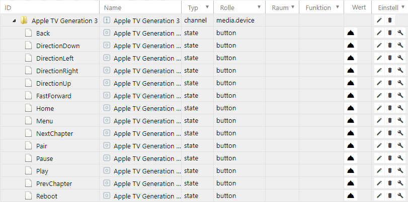

# Logitech Harmony
The Logitech Harmony Adapter allows you to easily integrate one or more Logitech Harmony Hubs into an ioBroker system.

The Logitech Harmony Hub can control a variety of entertainment and smart home devices. With the ioBroker, activities can be started and stopped via the hub, the status of activities can be queried, and devices can be remotely controlled by virtual keystrokes.


## Overview
### Logitech Harmony
Logitech Harmony is compatible with more than 270,000 entertainment and smart home devices. These include TVs and cable boxes, disc players and game consoles, AV receivers and streaming media players, as well as smart lighting, locks, thermostats and more.

With Logitech Harmony you can switch programs, adjust the volume, set favorites, and control lighting and other smart devices. The highlight of the system is the creation of actions to control multiple devices with the push of a button.

1. The Logitech Harmony Hub connects to the home network via Wi-Fi.
2. Harmony hubs do not have an Ethernet port.
3. The hub supports only the WLAN 2.4 GHz frequency band. The 5 GHz frequency band will be

   unsupported.

4. An 802.11 g / n router should be used. 802.11 a / b is not supported.
5. WEP 64/128, WPA Personal and WEP are used as encryption for the WLAN

   WPA2-AES supported.

6. UPnP does not need to be enabled for Harmony for the Harmony app to do

Recognize Hub and communicate with him. On the other hand, it must be enabled for the hub to discover and work with other devices on the network.
This applies, for example, to devices such as Philips hue, Sonos, Nest, Roku or Smart TVs.

7. The maximum number of devices per stroke is 8 devices. 15 devices are possible if as

   Remote at least one Harmony Touch or Ultimate one is registered at the hub.

8. The maximum number of preferred channels is 50 per mobile device.

### Logitech Harmony adapter
The Logitech Harmony adapter automatically finds all Logitech Harmony hubs that are on the same network subnet over a Wi-Fi connection to the ioBroker server.

Objects for triggering functions and activities (= command macros) are automatically created by the adapter in the ioBroker. The current status of the hub is also available. By specifying or reading the objects created, their status can be changed and thus actions can be triggered or queried.

## Prerequisites before installation
The ioBroker adapter for the Logitech Harmony system does not allow you to create or modify devices or activities. Therefore, before using the adapter, it is necessary to set up the remote control system as described in the Logitech manual and to work with the controlled devices.

## Installation
An instance of the adapter is installed via the ioBroker Admin interface. The detailed instructions for the necessary installation steps can be found **here**

After completing the installation of an adapter instance, a configuration window opens automatically.

## Configuration
The adapter automatically finds all Harmony hubs that are in the subnet of the ioBroker server.

### "Logitech Harmony adapter settings" window


| Field | Description |
|:-------------|:-------------|
| **Hub User** | In case the access to the Harmony Hub configuration is provided with a user and a password, the user name must be entered here. It is case-sensitive. |
| **Hub Password** | In case the access to the Harmony Hub configuration is provided with a user and password, the password must be entered here. It is case-sensitive. |

The two fields need only be completed if the hub is secured with a username and password.

After completing the configuration, the configuration dialog is quit with `SPEICHERN UND SCHLIEßEN`. This will result in a subsequent restart of the adapter.

## Instances
The installation of the adapter has created an active instance of the Logitech Harmony Hub Adapter in the section `Objekte`.


On an ioBroker server, only one instance of the Logitech Harmony adapter can be installed.

Whether the adapter is enabled or connected to the Logitech Harmony Hub is indicated by the color of the instance's Status field. If the mouse pointer points to the symbol, further detailed information is displayed.

## Objects of the adapter
In the section `Objekte`, all devices and activities recognized by the adapter in the hub are listed in a tree structure. In addition, information is also provided as to whether the communication with the hub takes place smoothly.


Each data point is associated with its associated data type and permissions.
Permissions can be read (R) as well as write (W). Each data point can at least be read (R) while others can also be described. To find a specific data point, the search is recommended using the key combination "CTRL + F".

| Object | Access | Bescheibung |
|------|-------|-----------|
| **harmony.0** | R | Name of the first *instance* of the Logitech Harmony adapter |
| & #; **Harmony Hub** | R | Name of *Hub* |
| & mp; **Apple TV Generation 3** | R | Name of *device* contains device functions |
| &emsp; **** Denon AV Receiver** | R | Name of *device* contains device functions |
| &emsp; &emsp; **** | R | Other *devices* |
| &emsp; &emsp; **activities** | R | List of all *activities* | programmed in the Harmony Hub
| &emsp; &emsp; ***hubBlocked*** | R | Indicates if the hub is busy |
| &emsp; &emsp; ***hubConnected*** | R | Status of the connection between adapter and hub |

### Device functions
If you open a device, you will get a list with all the functions belonging to the device. These device functions are device-specific and therefore differ in devices of different types.



#### Triggering a device function
Each device function `{Instanz}.{Hub Name}.{Gerät}.{Gerätefunktion}` triggers a corresponding reaction of the addressed device. The values of device functions can be read and written. The triggering can be tested by using the mouse pointer to activate the bell on the right of the function. Alternatively, you can also enter a value there with the pencil symbol.
Values have the unit `Millisekunden`. If you enter a value between 1 and 250ms, the Harmony Hub usually outputs a single key press of the specified length. Values greater than 250ms may cause the device to operate multiple times.
After triggering the device function, the value changes back to 0.

### Activities
Below `activities` all activities programmed on the Harmony Hub are listed.


#### Starting an activity
Activities are started if you enter a number greater than 0 for an activity `{Instanz}.{Hub Name}.activities.{Aktivität}`.
During the execution of the activity, this value first changes to 1 (= starting) and then to 2 (= active).

#### Ending an activity
Running activities can be stopped by setting their value to 0.
Alternatively, you can enter any number to terminate an activity in the object `{Instanz}.{Hub Name}.activities.currentStatus`.
During the termination of the activity `{Instanz}.{Hub Name}.activities.currentStatus` changes from 3 (= terminating) to 0 (= inactive).

#### Other status values
`{Instanz}.{Hub Name}.activities.currentActivity` returns the currently running activity as a string.

`{Instanz}.{Hub Name}.activities.currentStatus` indicates the status of the Harmony Hub. The values mean

- 0 = inactive
- 1 = starting
- 2 = active
- 3 = finishing

`{Instanz}.{Hub Name}.activities.{Aktivität}` indicates the status of an activity.
The meaning of the values is analogous to `{Instanz}.{Hub Name}.activities.currentStatus`.

## Deinstallation
> T: I think a standard installation of an adapter in a central article is documented in detail. The adapter will (always) refer to this central article. Only deviations from the standard procedure are documented here.

If the instance is to be removed again, it will be removed via the assigned trashcan icon in the Instances column


A confirmation prompt appears, which must be confirmed with ***OK***


Then, a window will appear again showing the processing of the uninstall commands


This uninstall removes all objects belonging to the instance completely.

If the installation files are completely deleted from the host, this must be done via the trash can icon in the tile of the Harmony adapter in the section Adapters.

## Particularities
backup

multihost

History

performance

## FAQ
!> Search the forum for frequently asked questions and give a reference answer here

1. **The connection to the hub is interrupted again and again.**

The Harmony Hub requires excellent wireless communication to communicate with the adapter. Using a wireless LAN access point in close proximity to the hub is recommended.

2. **How to implement the button "alles aus" via ioBroker?**

   Set `{Instanz}.{Hub Name}.activities.currentStatus` to 0.

3. ** Under Windows, the message appears when installing the adapter

   `ERR! code ENOGIT` and the adapter does not work. **

Before installing the Harmony adapter, download and install GIT from the website https://git-scm.com/download/win.

4. ** Under Linux, the message appears when installing the adapter

   `ERR! code ENOGIT` and the adapter does not work. **

Install GIT using the command line and `sudo apt install git` before installing the Harmony adapter.

6. **Scripts no longer work with newer versions of the adapter.**

Starting with version 0.9.1 of the adapter, objects are named differently. From old `harmony.0.Harmony_Hub` was e.g. new `harmony.0.Harmony Hub`. Please check the objects and add components to them, e.g. Customize scripts.

7. ** Wi-Fi is automatically disabled at night. The adapter adjusts to the

   Restarting the WLAN does not automatically connect to the HUB. **

Insert an automatic restart of the harmony instance (expert mode) about 5-10 minutes after the WiFi router startup.

8. **The HUB is not found.**

Check if the hub is really the same network subnet and VLAN as the ioBroker server. Are multicasts allowed or are they filtered by the router? Is the status LED on the hub lit green? Is the hub accessible via the Logitech app? Follow Logitech's instructions to resolve connectivity issues.

9. **Only one instance of the adapter can be installed.**

On an ioBroker server, only one instance of the Logitech Harmony adapter can be installed.

## Examples
### JavaScript
Trigger device functions. Here, the Denon AV receiver is turned on or off when the value of another data point changes.

```
if (getState("hm-rpc.0.MEQ01234567.2.STATE").val == true) {
  setState("harmony.0.Harmony Hub.Denon AV-Empfänger.PowerOn"/*Denon AV-Empfänger:PowerOn*/, '1', true);
  // Bei Kontrolle Schalter == AN keine Verzögerung Schalter
} else if (getState("hm-rpc.0.MEQ01234567.2.STATE").val == false) {
  // Bei Kontrolle Schalter == AUS schalte mit Verzögerung
  var timeout = setTimeout(function () {
    setState("harmony.0.Harmony Hub.Denon AV-Empfänger.PowerOn"/*Denon AV-Empfängerr:PowerOn*/, '1', true);
  }, 1000);
}
```

### Blockly
Trigger device functions. Here, the Denon AV receiver is turned on or off when the value of another data point changes.


[source](media/a_harmony_blockly.xml)

### Node-Red
> associated node-red elements

> Examples

> Exports for reuse

### Vis
> associated vis elements

> Examples

> Exports for reuse

> Code Fragments

## Left
> References to other documents in the ioBroker portal

> Web links, e.g. to the manufacturer

> GitHub links

* Manufacturer side [https://www.logitech.com/de-de/product/harmony-hub](https://www.logitech.com/de-de/product/harmony-hub)

## Changelog
<!--
    Placeholder for the next version (at the beginning of the line):
    ### **WORK IN PROGRESS**
-->
### 2.0.3 (2025-11-04)
* (@GermanBluefox) Corrected the table in the configuration

### 2.0.2 (2025-11-03)
* (mcm1957) Adapter requires node.js >= 20, js-controller >= 6.0.11 and admin >= 7.6.17 now.
* (@GermanBluefox) Added state "switch" to switch activities on/off with Alexa
* (@GermanBluefox) Adapter has been rewritten with TypeScript
* (mcm1957) Dependencies have been updated.

### 1.5.0 (2024-06-02)
* (WolfspiritM) Multiple subnets can be entered as comma separated list now. (#147)
* (mcm1957) Testing for node.js 22 has been added.
* (mcm1957) Dependencies have been updated.

### 1.4.0 (2024-04-11)
* (mcm1957) Adapter requires node.js 18 and js-controller >= 5 now
* (mcm1957) Translations have been updated
* (mcm1957) Dependencies have been updated

### 1.3.0 (2023-11-08)
* (mcm1957) Adapter requires nodejs 16 now.
* (mcm1957) Adapter has been moved to iobroker-community-adapters organisation.
* (mcm1957) Dependencies have been updated.

## License
The MIT License (MIT)

Copyright (c) 2023-2025 iobroker-community-adapters <iobroker-community-adapters@gmx.de>  
Copyright (c) 2015-2019 Pmant <patrickmo@gmx.de>

Permission is hereby granted, free of charge, to any person obtaining a copy
of this software and associated documentation files (the "Software"), to deal
in the Software without restriction, including without limitation the rights
to use, copy, modify, merge, publish, distribute, sublicense, and/or sell
copies of the Software, and to permit persons to whom the Software is
furnished to do so, subject to the following conditions:

The above copyright notice and this permission notice shall be included in
all copies or substantial portions of the Software.

THE SOFTWARE IS PROVIDED "AS IS", WITHOUT WARRANTY OF ANY KIND, EXPRESS OR
IMPLIED, INCLUDING BUT NOT LIMITED TO THE WARRANTIES OF MERCHANTABILITY,
FITNESS FOR A PARTICULAR PURPOSE AND NONINFRINGEMENT. IN NO EVENT SHALL THE
AUTHORS OR COPYRIGHT HOLDERS BE LIABLE FOR ANY CLAIM, DAMAGES OR OTHER
LIABILITY, WHETHER IN AN ACTION OF CONTRACT, TORT OR OTHERWISE, ARISING FROM,
OUT OF OR IN CONNECTION WITH THE SOFTWARE OR THE USE OR OTHER DEALINGS IN
THE SOFTWARE.