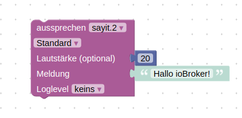
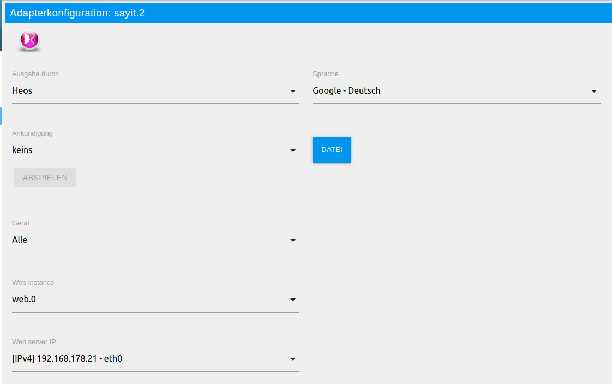
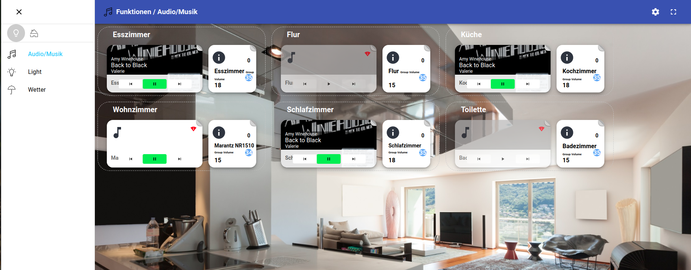
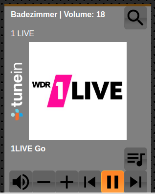
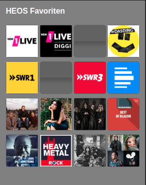
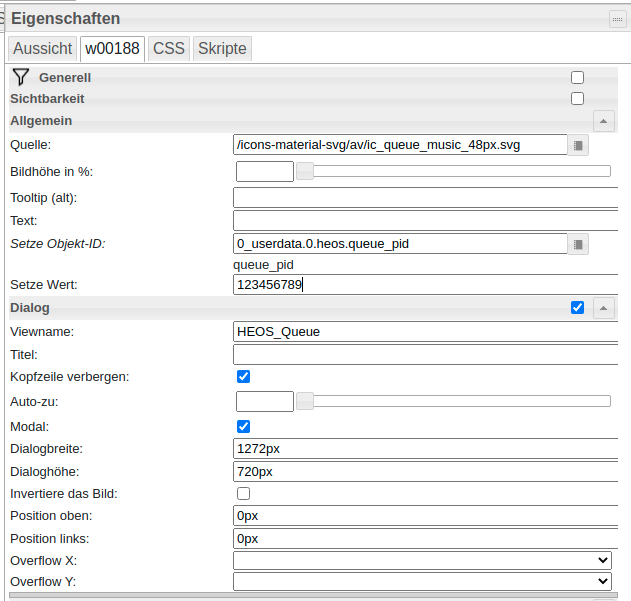
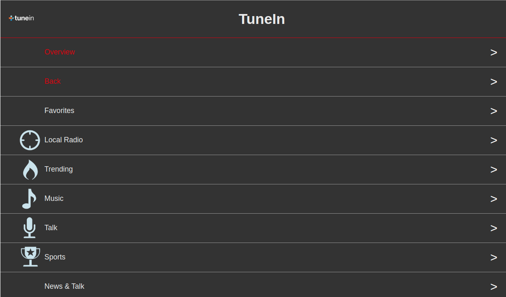

# ioBroker.heos

[](https://www.npmjs.com/package/iobroker.heos)
[](https://www.npmjs.com/package/iobroker.heos)


[](https://david-dm.org/withstu/iobroker.heos)
[](https://snyk.io/test/github/withstu/ioBroker.heos)

[](https://nodei.co/npm/iobroker.heos/)

The adapter lets control HEOS from ioBroker.

## Disclaimer
HEOS, DENON and Marantz are trademarks of D&M Holdings Inc.
The developers of this module are in no way endorsed by or affiliated with D&M Holdings Inc.,
or any associated subsidiaries, logos or trademarks.

## Reference
The used HEOS API is documented here: https://rn.dmglobal.com/euheos/HEOS_CLI_ProtocolSpecification_2021.pdf

## Network Requirements
The protocol SSDP is used for finding the players. UPnP requires multicast access to the 239.255.255.250:1900 along with the appropriate IGMP messages. The source port for receiving SSDP Messages can be configured in the adapter settings (Default setting is ```0``` means the port is automatically choosen). Further Details: https://support.denon.com/app/answers/detail/a_id/4717/~/network-requirements-for-heos
For the API access to the HEOS Players the adapter uses the port ```1255```.

## Configuration

* **AutoPlay**: Automatically plays music after the player is connected or on unmute. Can be configured globally in configuration. If it is enabled globally you can disable it for one specific player with the state ```auto_play```.
* **Command scope**: Defines to which players the command ```scope/[cmd]``` of the command state is send to. It can be send to all players, all leading players or to all PIDs in the comma separated state: ```heos.0.command_scope_pid```
* **Mute Regex**:
In the configuration you can activate a function to mute the player based on a regex match on the song information. That can be used to mute ads automatically. For example for Spotify you can use the following regex: ```spotify:ad:|Advertisement```.
* **ignore_broadcast_cmd**: This player state configures, if the player should ignore commands to all players e.g. player/set_mute&state=on or pressing the play button for presets/playlists

## States and their meanings

### Command State

The HEOS player can be controlled by the different player states. To control the players in a more advanced way you can use the command state. On the one hand there is one global command state (heos.0.command) to control the whole adapter or multiple players with one command. On the other hand there is a command state per player.

#### HEOS Command State (heos.0.command)

* ```system/connect```: Try to Connect to HEOS
* ```system/disconnect```: Disconnect from HEOS
* ```system/reconnect```: Disconnect and Connect
* ```system/load_sources```: Reload sources
* ```system/reboot```: Reboot connected player
* ```system/reboot_all```: Reboot all players
* ```group/set_group?pid=<pid1>,<pid2>,...```: Set group with the list of player ids e.g. ```group/set_group?pid=12345678,12345679```.
* ```group/set_group?pid=<pid1>```: Delete existing group e.g. "group/set_group?pid=12345678"
* ```group/ungroup_all```: Delete all groups
* ```group/group_all```: Group all player in one group
* ```player/[cmd]```: Send the command to all players. e.g. player/set_mute&state=on 
* ```leader/[cmd]```: Send the command to all leading players. e.g. leader/set_mute&state=on
* ```scope/[cmd]```: Send the command to the configured scope all players, leading players or comma separated player pids in scope_pids
* ```...```: All other commands are tried to send to HEOS (Look in the HEOS API PDF for details)

#### Player Command State (heos.0.players.123456789.command)

Note: Multiple commands are possible, if they are separated with the pipe e.g. set_volume&level=20|play_preset&preset=1

* ```set_volume?level=0|1|..|100```: Set the player volume 
* ```set_play_state?state=play|pause|stop```: Set the player state
* ```set_play_mode?repeat=on_all|on_one|off&shuffle=on|off```: Set Repeat and Shuffle mode
* ```set_mute?state=on|off```: Mute player
* ```volume_down?step=1..10```: Lower volume
* ```volume_up?step=1..10```: Raise volume
* ```play_next```: Play next
* ```play_previous```: Play previous
* ```play_preset?preset=1|2|..|n```: Play preset n
* ```play_stream?url=url_path```: Play URL-Stream
* ```add_to_queue?sid=1025&aid=4&cid=[CID]```: Play playlist with [CID] on player (aid: 1 – play now; 2 – play next; 3 – add to end; 4 – replace and play)

### Presets & Playlists
Each source e.g. preset/favorite or playlists are located in the sources state folder (```heos.0.sources```). You can find your presets/favorites in the subfolder with the ID 1028 and the playlists in the subfolder with the ID 1025. Initially the adapter don't create your individual presets and playlists, because you have to trigger an update by setting the following states to true:
- Presets/Favorites: ```heos.0.sources.1028.browse```
- Playlists: ```heos.0.sources.1025.browse```
After that the adapter creates the states for the presets or playlists so that you easily can play the preset on all players.

### Image color extraction
With version 1.7.6 the prominent colors of the song cover are extracted and saved to three new player states:
* **current_image_color_palette**: Prominent colors selected by node-vibrant.
* **current_image_color_background**: Color with the biggest population in the image. Can be used as background color for player controls in VIS.
* **current_image_color_foreground**: Color with the second biggest population in the image and a good read contrast to the background color. Can be used as text color for player controls in VIS.

## Seek
The seek functionality is not working on all sources. Spotify and Amazon Music are supporting seeking.

## SayIt
[SayIt Adapter](https://github.com/ioBroker/ioBroker.sayit) is supported.




## Material UI
[Material UI Adapter](https://github.com/ioBroker/ioBroker.material) is supported.



## VIS

### Installation
* Create following string states:
    * 0_userdata.0.heos.queue_pid
    * 0_userdata.0.heos.queue_html
    * 0_userdata.0.heos.browse_result_html

### Player View
* Open the file: [player_view.json](docs/vis/views/player_view.json)
* Replace 123456789 with the player pid
* Import view into VIS



### Presets
* Click button ```heos.0.sources.1028.browse``` to load presets
* Open the file: [presets_view.json](docs/vis/views/presets_view.json)
* Import view into VIS




### Queue
* Queue Widget: [queue_player_widget.json](docs/vis/views/queue_player_widget.json)
* Queue View: [queue_view.json](docs/vis/views/queue_view.json)
* Queue HTML Generation Script: [queue.js](docs/vis/scripts/queue.js)



### Browse Sources
* Browse Widget: [browse_player_widget.json](docs/vis/views/browse_player_widget.json)
* Browse View: [browse_view.json](docs/vis/views/browse_view.json)
* Browse HTML Generation Script: [browse.js](docs/vis/scripts/browse.js)




Alternative you can use the script from Uhula: https://forum.iobroker.net/post/498779


## Changelog
<!--
	Placeholder for the next version (at the beginning of the line):
	### **WORK IN PROGRESS**
-->
### 3.2.2 (2026-08-19)
* (withstu) Fix repository checker findings

### 3.2.1 (2026-08-19)
* (withstu) Package update
* (withstu) Improve number casting

### 3.2.0 (2026-08-12)
* (withstu) add flag to disable SSDP discovery
* (withstu) fixing iobroker checks

### 3.1.0 (2026-07-28)
* (withstu) improve error handling for sign in if webservice unreachable

### 3.0.5 (2026-07-28)
* (copilot) Adapter requires node.js >= 22 now
* (withstu) improve error handling for sign in if webservice unreachable

[Older changelogs can be found there](CHANGELOG_OLD.md)

## License
MIT License

Copyright (c) 2025-2026 withstu <withstu@gmx.de>

derived from https://forum.iobroker.net/topic/10420/vorlage-denon-heos-script by Uwe Uhula
TTS derived from https://github.com/ioBroker/ioBroker.sonos

Permission is hereby granted, free of charge, to any person obtaining a copy
of this software and associated documentation files (the "Software"), to deal
in the Software without restriction, including without limitation the rights
to use, copy, modify, merge, publish, distribute, sublicense, and/or sell
copies of the Software, and to permit persons to whom the Software is
furnished to do so, subject to the following conditions:

The above copyright notice and this permission notice shall be included in all
copies or substantial portions of the Software.

THE SOFTWARE IS PROVIDED "AS IS", WITHOUT WARRANTY OF ANY KIND, EXPRESS OR
IMPLIED, INCLUDING BUT NOT LIMITED TO THE WARRANTIES OF MERCHANTABILITY,
FITNESS FOR A PARTICULAR PURPOSE AND NONINFRINGEMENT. IN NO EVENT SHALL THE
AUTHORS OR COPYRIGHT HOLDERS BE LIABLE FOR ANY CLAIM, DAMAGES OR OTHER
LIABILITY, WHETHER IN AN ACTION OF CONTRACT, TORT OR OTHERWISE, ARISING FROM,
OUT OF OR IN CONNECTION WITH THE SOFTWARE OR THE USE OR OTHER DEALINGS IN THE
SOFTWARE.
