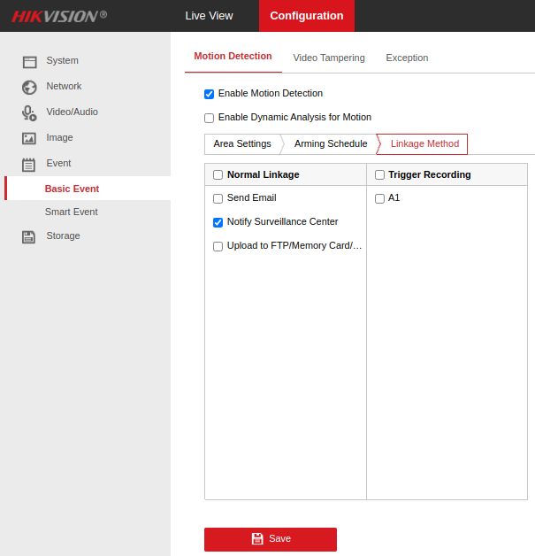

# ioBroker.hikvision-alarmserver

[](https://www.npmjs.com/package/iobroker.hikvision-alarmserver)
[](https://www.npmjs.com/package/iobroker.hikvision-alarmserver)


[](https://nodei.co/npm/iobroker.hikvision-alarmserver/)

**Tests:** 

## Hikvision Alarm Server adapter for ioBroker

An adapter to receive alarms/events sent from Hikvision cameras.

Tested with Hikvision models:

- DS-2CD2043G2-I
- DS-2CD2143G2-I
- DS-2DE2A404IW-DE3
- DS-2DE3A404IW-DE/W

Success/failure/bug reports welcomed if you have a model not in this list.

## Usage

The adapter instance creates a boolean state for each combination of camera/event type reported. Cameras are identified by MAC address (limited by information given by camera).

It appears that cameras repeatedly issue events every second when those events are still valid but no message is sent to clear them. For this reason the adapter automatically clears events that have not been re-reported for more than 5 seconds.

## Configuration

### ioBroker

#### Network

In the adapter configuration, select a free port for the adapter to listen on (8089 by default).

#### Alarm timeout

Most devices signal an alarm is *active* by constantly sending alert messages. These devices never send an *inactive* message. Therefore the adapter assumes an alarm is cleared when no message is received after a given period of time. Specify that period here (default 5000ms).

#### Channel tree

Some cameras (eg. with multiple sensors) report on multiple channels (not to be confused with ioBroker channels). In order to differentiate events between each of the camera's channels check the appropriate option.

For specific event types (eg. field detection, line crossing, etc), some cameras are able to identify motion detection targets (eg. human, vehicle, etc). To create a state for each of these targets under each applicable event type, check the appropriate option.

#### sendTo

Some event types received have a simple boolean on/off (duration, VMD, etc). For these simple events, setting the appropriate state in ioBroker's object tree is sufficient.

However, some events received include binary data such as images which would be impractical to constantly store in the ioBroker object tree. A more graceful mechanism to handle such events it to use ioBroker's inbuilt messaging system which allows message objects to be communicated between adapters.

While this function is designed mainly for images, sending triggered by simple XML parts is also supported.

The exact message sent is configurable in the `Send to message...` fields. These fields are evaluated with the JavaScript `Function` object and have two variables available: `ctx` (the event context object - see below) and in the case of image parts the raw buffer is available in `imageBuffer`.

##### Example 1: Send textual alert on every event received via Telegram

If the Telegram adapter has been implemented, one could set the following parameters in the `XML event parts` section:

* Send to instance for XML: `telegram.0`
* Send to command for XML: Leave blank
* Send to message for XML: Note backticks are part of configured value - `` `Received ${ctx.eventType} from ${ctx.deviceName}` ``

##### Example 2: Send images via Telegram

If the Telegram adapter has been implemented, one could set the following parameters in the `Image event parts` section:

* Send to instance for images: `telegram.0`
* Send to command for images: Leave blank
* Send to message for images: `{ text: imageBuffer, type: 'photo' }`

##### Example 3: Send images to custom Javascript

A more complex example is to send each image buffer received to a custom script running inside a Javascript adapter:

* Send to instance name: `javascript.0`
* Send to command: `toScript` (this is not an example - the literal string is required).
* Send to message: `{ script: 'script.js.myImageHandler', message: 'myImageReceiver', data: { device: ctx.device, image: imageBuffer } }`

Inside the Javascript adapter (instance zero) create a script named `myImageHandler` and add this code:

```javascript
onMessage('myImageReceiver', (data, cb) => {
  // data.device holds mac address of device (colons stripped).
  // data.image holds raw image buffer.
  ...
  cb();
});
```

##### Event context object

The `ctx` event context has the following properties:

- `macAddress`
- `eventType`
- `detectionTarget`
- `channelName`
- `device` - MAC address with quotes stripped (for consistency with net-tools).
- `deviceName` - Hostname derived from net-tools or copy of `device` if not found.
- `stateId` - State ID this event triggers.
- `eventLogged` - Boolean indicating a state was properly triggered. Should always be true.
- `xml` - Parsed XML data.
- `ts` - JavaScript `Date` object created from `dateTime` in event message (or time event was receive if not available).
- `periodPath` - Filesystem folder where event parts are currently being saved (changes each day).
- `fileBase` - Prefix for all saved parts from the current message.
- `files` - Array holding filenames (including full path) of all files dumped as part of processing of the current message.


#### Saving event data

If checked event XML and/or image data is store on the local filesystem under `iobroker-data/hikvision-alarmserver.<instance>`.

*Warning!* these files are not currently purged or archived so use with caution or implement an external strategy for this.


### On Camera

Visit the configuration page of your camera(s) and define ioBroker IP/host and port settings:


Make sure to linkage in the events you would like to report to ioBroker includes 'Notify Surveillance Center'. Eg:



## Changelog

<!--
  Placeholder for the next version (at the beginning of the line):
  ### **WORK IN PROGRESS**
-->
### **WORK IN PROGRESS**
- (copilot) Adapter requires js-controller >= 6.0.11 now
- (copilot) Adapter requires admin >= 7.6.17 now
* (mcm1957) Adapter requires node.js >= 18 and js-controller >= 5 now
* (mcm1957) Dependencies have been updated

### 0.1.0 (2023-01-24)
-   (Robin Rainton) Added configuration for alarm timeout ([#16](https://github.com/iobroker-community-adapters/ioBroker.hikvision-alarmserver/issues/16)).
-   (Robin Rainton) Fixed multipart message handling for line crossing/field detection, etc ([#18](https://github.com/iobroker-community-adapters/ioBroker.hikvision-alarmserver/issues/18)).
-   (Robin Rainton) Optionally save XML/images & send events using `sendTo` to other adapters ([#20](https://github.com/iobroker-community-adapters/ioBroker.hikvision-alarmserver/issues/20) & [#26](https://github.com/iobroker-community-adapters/ioBroker.hikvision-alarmserver/issues/26)).
-   (Robin Rainton) Added info.connection state ([#22](https://github.com/iobroker-community-adapters/ioBroker.hikvision-alarmserver/issues/22)).
-   (Robin Rainton) Handle cases where `TargetRect` is specified in decimals between zero & one ([#24](https://github.com/iobroker-community-adapters/ioBroker.hikvision-alarmserver/issues/24)).

### 0.0.7 (2022-12-29)
-   (Robin Rainton) Add bind address option ([#9](https://github.com/iobroker-community-adapters/ioBroker.hikvision-alarmserver/issues/9)).
-   (Robin Rainton) Try to derive device names from net-tools. Optionally use channelName from devices ([#10](https://github.com/iobroker-community-adapters/ioBroker.hikvision-alarmserver/issues/10)).

### 0.0.6 (2022-12-13)
-   (Robin Rainton) Handle multipart message payload ([#5](https://github.com/iobroker-community-adapters/ioBroker.hikvision-alarmserver/issues/5)).
-   (Robin Rainton) Handle payloads without XML declaration ([#7](https://github.com/iobroker-community-adapters/ioBroker.hikvision-alarmserver/issues/7).)

### 0.0.5 (2022-12-10)
-   (Robin Rainton) Drop colons from device IDs.

### 0.0.2
-   (Robin Rainton) initial release.

## License
MIT License


Copyright (c) 2026 iobroker-community-adapters <iobroker-community-adapters@gmx.de>  
Copyright (c) 2022-2024 Robin Rainton <robin@rainton.com>

Permission is hereby granted, free of charge, to any person obtaining a copy
of this software and associated documentation files (the "Software"), to deal
in the Software without restriction, including without limitation the rights
to use, copy, modify, merge, publish, distribute, sublicense, and/or sell
copies of the Software, and to permit persons to whom the Software is
furnished to do so, subject to the following conditions:

The above copyright notice and this permission notice shall be included in all
copies or substantial portions of the Software.

THE SOFTWARE IS PROVIDED "AS IS", WITHOUT WARRANTY OF ANY KIND, EXPRESS OR
IMPLIED, INCLUDING BUT NOT LIMITED TO THE WARRANTIES OF MERCHANTABILITY,
FITNESS FOR A PARTICULAR PURPOSE AND NONINFRINGEMENT. IN NO EVENT SHALL THE
AUTHORS OR COPYRIGHT HOLDERS BE LIABLE FOR ANY CLAIM, DAMAGES OR OTHER
LIABILITY, WHETHER IN AN ACTION OF CONTRACT, TORT OR OTHERWISE, ARISING FROM,
OUT OF OR IN CONNECTION WITH THE SOFTWARE OR THE USE OR OTHER DEALINGS IN THE
SOFTWARE.