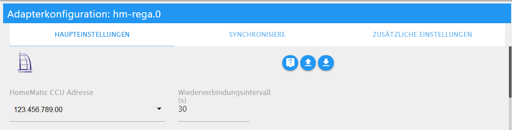
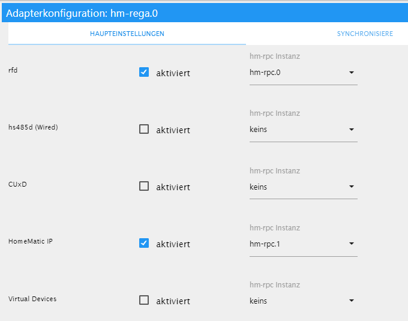
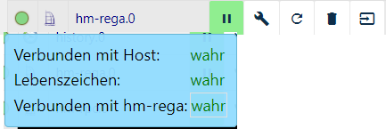
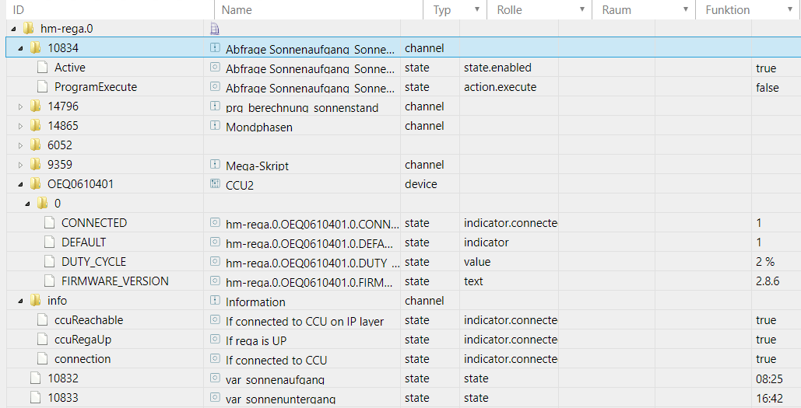

# HomeMatic ReGaHSS
## Homematic
> Homematic is the smart home system from eQ-3, which enables the comprehensive control of a wide variety of functions using scenarios (from simple to complex) in the house or apartment.

> The devices include products for controlling lights, roller shutters and heating, hazard detectors, security sensors and products for measuring weather data. The wireless communication simplifies retrofitting. Wire bus components can be used in new buildings.

[source](https://www.eq-3.de/produkte/homematic.html)

## Adapter Homematic ReGaHss
This adapter establishes a connection to the Homematic logic layer "ReGaHSS" (**Re**sidential **Ga**teway).
It synchronizes real names, system variables, rooms, trades and programs between Homematic and ioBroker.

If several centers are to be integrated into ioBroker, a separate instance must be installed and configured for each center.

With the installation of ReGaHSS, an instance of the "hm-rpc" adapter is also installed, which should be configured and activated beforehand.

One instance of this adapter can manage up to 5 different instances of the Homematic RPC Adapter that provide different services (each service needs its own RPC instance):

- rfd (CCU radio service for standard components)
- hs485d (wired) (for wired bus components)
- CuxD (additional software to provide a universal interface)
- Homematic IP (IP-supported components)
- Virtual devices

### Pre-installation requirements
- Homematic Gateway (CCU/CCU2/CCU3 …) *or*
- Radio module with suitable software (piVCCU(*x)*, RaspberryMatic or similar)

## Installation
An instance of the adapter is installed from the ioBroker admin interface.

After the installation is complete, the configuration window opens automatically.

Before the actual configuration, the instance of the HM-RPC adapter (created together with this adapter) or, if required, further HM-RPC instances should be created and configured.

## Configuration
 **Selection menu above**

Three different areas can be selected in the upper selection menu:

### Main settings area
 **Main Settings**

The basic settings are made in this area.

The IP address of the CCU can be selected in the pull-down menu; the reconnection interval (standard 30 sec) can also be adjusted by the user.

 **Assignment of the RPC instances**

The required services are then activated and linked to the appropriate HM-RPC instance.

polling

If activated, the CCU will query the RegaHSS data regularly, based on the seconds set in the Intervals field. The interval should not be set too low, since polling too frequently can cause the CCU to crash.

triggers

In order to minimize the active queries from ioBroker to the RegaHSS, a trigger can also push the data on the CCU within a program when there is a change.
A virtual button on the CCU can be used for this, which is triggered in a CCU program. By default, this is the BidCosRF.50.PRESS_SHORT button (see sample program).

### Sync area
Here the user can specify which information is transferred from the CCU to ioBroker. The corresponding objects and data points are then created in ioBroker.

- DutyCycle: Activates the indication of the duty cycle (in %)
- Variables: Activates the adoption of system variables from the CCU
- Programs: Activates the adoption of the program designations from the CCU
- Names: Activates the transfer of the plain text names of the data points from the CCU
- Favorites: Activates the acquisition and listing of favorites
- Rooms: Activates the acquisition of rooms and a listing of them
- Trades: Activates the transfer of the trades and a list of them

### Additional settings area
Here the user can decide whether https (encrypted and tap-proof connection) should be used. If activated, the user name and the corresponding password must be entered

Once all the settings have been made, the configuration page is closed with the "save and close" command (button below the settings area). The adapter is closed and the instance is started with the new values.

### Instance
 **Instance and signal**

The created instance(s) can now be found in the *Instances* area of the ioBroker. The traffic light system on the left shows whether the adapter is activated or connected to the CCU.

If you place the mouse pointer on a symbol, you get detailed information.

### Objects of the adapter
All the values and information transmitted by the adapter from the CCU are displayed in a tree structure in the Objects area.

Since the objects are user-specific, only the general objects that are the same for all users are shown here.

 **Folder Structure**

The first folders (usually digit ID) are the programs contained in the CCU.

CCU and info folders contain the basic information of the gateway incl.
percentage of the duty cycle (if activated).

Finally, the variables created in the CCU are listed

###FAQ

## Changelog
<!--
	Placeholder for the next version (at the beginning of the line):
	### **WORK IN PROGRESS**
-->
### 5.1.0 (2024-08-29)
* (@foxriver76) added notification if devices are low on battery

### 5.0.0 (2024-07-18)
* (bluefox) required node 18
* (bluefox) updated dependencies

### 4.0.0 (2023-09-04)
* (mcm1957) required node 16 due to adapter-core 3.x.x
* (bluefox) removed deprecated package - `request`

### 3.0.47 (2023-08-08)
* (bluefox) Updated packages

### 3.0.46 (2023-03-30)
* (foxriver76) fixed for controller v5 (closes #368)

### 3.0.44 (2023-02-20)
* (foxriver76) compatibility of RSSI_DEVICE and RSSI_PEER for CCU updated (closes #352)
* (foxriver76) also sync enums for a maintenance channel of rfd devices (closes #320)

### 3.0.43 (2022-07-28)
* (foxriver76) if LGW is not reachable we now set duty cycle to `null` instead of `-1` in all cases (closes #298)

### 3.0.40 (2022-04-03)
* (foxriver76) if LGW is not reachable we now set duty cycle to `null` instead of `-1`

### 3.0.39 (2022-03-26)
* (foxriver76) fixed another `ValueList` bug

### 3.0.38 (2022-03-26)
* (foxriver76) fixed bug with `ValueList` (closes #268)

### 3.0.37 (2022-02-22)
* (foxriver76) only delete hm-rpc objects of configured instances from enums (fixes #253)

### 3.0.35 (2022-01-28)
* (foxriver76) do not log warning if we cannot synchronize favorites of empty string user (fixes #227)

### 3.0.34 (2022-01-24)
* (martin-herzog/foxriver76) fixed unneeded call which lead to warnings in rega log

### 3.0.33 (2021-11-18)
* (foxriver76) if function or room names on CCU include dots, we replace them (fixes Sentry IOBROKER-HM-REGA-3H)

### 3.0.32 (2021-10-14)
* (foxriver76) Duty Cycle of LAN gateways can be -1 if they are disconnected (fixes #196)
* (foxriver76) we now only scale on UNIT "100%" as hm-rpc does (fixes #207)

### 3.0.31 (2021-08-12)
* (foxriver76) we fixed some sentry issues (closes #182, closes #183)

### 3.0.30 (2021-07-18)
* (foxriver76) improved the detection of ALARM occurrences for virtual devices

### 3.0.29 (2021-07-01)
* (foxriver76) fixed bug on ALARM datapoint creation

### 3.0.28 (2021-06-30)
* (foxriver76) improve creation of ALARM dps even if no states provided by `getDatapoints` (fixes #168)

### 3.0.27 (2021-06-28)
* (foxriver76) fixed a bug that already deleted programs were only partially deleted in ioBroker
__Please note: This will only work for deleted programs up from now. You have to clean up orphan programs manually__

### 3.0.26 (2021-06-14)
* (bluefox) Use name from device if channel has a default name

### 3.0.25 (2021-05-14)
* (foxriver76) remove old code, which also scaled unit: % values and not only unit: 100 %

### 3.0.24 (2021-04-30)
* (foxriver76) we fixed more occurrences of incorrect types (fixes #146)

### 3.0.23 (2021-04-30)
* (foxriver76) we now correctly convert the rssi values, workaround for https://github.com/jens-maus/RaspberryMatic/issues/897
* (foxriver76) we made counter states of type "number", was incorrectly "string" (closes #145)

### 3.0.22 (2021-04-30)
* (foxriver76) parse the dutyCycle state to int (fixes #144)
* (foxriver76) updated dependencies
* (foxriver76) removed unneeded dependency

### 3.0.21 (2021-04-24)
* (foxriver76) bring back io-package json readme attribute, admin does not fall back to docs as expected (fixes #135)

### 3.0.20 (2021-04-20)
* (foxriver76) admin/controller has a bug still requiring `common.title` (fixes #133)

### 3.0.19 (2021-04-16)
* (foxriver76) fixed for custom webinterface port (addresses #117)

### 3.0.18 (2021-04-05)
* (foxriver76) local link now respects port and protocol

### 3.0.17 (2021-04-04)
* (foxriver76) correctly identify incomplete requests

### 3.0.16 (2021-01-31)
* (foxriver76) fixed issue with non-existing objects when using LAN-Gateways

### 3.0.15 (2021-01-31)
* (foxriver76) Ensures that objects are created if something (devices, variables, programs) created during runtime (fixes #124)

### 3.0.14 (2021-01-30)
* (foxriver76) fixed pot. crash after reconnecting because of existingStates array

### 3.0.13 (2021-01-30)
* (foxriver76) ensure to not set states of non-existing RPC objects due to differences in the APIs (fixes #123)

### 3.0.12 (2021-01-29)
* (foxriver76) we now handle some more edge case errors

### 3.0.10 (2021-01-27)
* (foxriver76) no build needed

### 3.0.9 (2021-01-27)
* (foxriver76) fixed gh actions

### 3.0.8 (2021-01-27)
* (foxriver76) we now wait until objects are created before setting states (fixes #122)
* (foxriver76) added release script

### 3.0.7 (2021-01-17)
* (foxriver76) we notify the user about aborted connection by CCU during request

### 3.0.6 (2020-12-25)
* (Hirsch-DE) don't write data points if timestamp is 0"

### 3.0.5 (2020-12-24)
* (foxriver76) provide possibility to use custom webinterface port, please see FAQ

### 3.0.4 (2020-12-21)
* (foxriver76) fixed enum translations (changed in API)
* (foxriver76) fixed handling of "favorites" enum
* __this can be breaking for some users, please check your enums__

### 2.6.25 (2020-12-16)
* (foxriver76) fixed aliases being removed from enums if they contain `hm-rpc.`

### 2.6.24 (2020-11-03)
* (foxriver76) now states will be accordingly marked to indicate that rega is down when receiving invalid responses

### 2.6.23 (2020-10-15)
* (foxriver76) fixes for edge case crashes

### 2.6.22 (2020-09-29)
* (foxriver76) fixed error where alarm states of hm-rpc instances with instance number >= 10 are created for the wrong instance (issue #111)

### 2.6.20 (2020-09-15)
* (foxriver76) set an explicit object type on extending object (issue #109)

### 2.6.19 (2020-08-23)
* (foxriver76) fixed issue on syncing service message counter when invisible variables are synchronized
* (foxriver76) fixed issue where value list variables are a string instead of an integer

### 2.6.17 (2020-08-17)
* (foxriver76) fixed for % scaling of float numbers

### 2.6.15 (2020-08-08)
* (foxriver76) fixed potential issues with scaling of % values as in https://github.com/ioBroker/ioBroker.hm-rpc/issues/263

### 2.6.14 (2020-06-11)
* (foxriver76) fixed a potential problem on enum sync, where to many channels could be deleted

### 2.6.11 (2020-06-11)
* (foxriver76) timeout of requests increased to 90 seconds (its only important to have a timeout to prevent infinite stucking)

### 2.6.10 (2020-06-10)
* (foxriver76) fixed crash when a user on CCU is an empty string on synchronizing favorites

### 2.6.9 (2020-05-29)
* (foxriver76) fixed crash when we cannot determine CCU version

### 2.6.8 (2020-05-26)
* (foxriver76) Script post requests will time out after 15 seconds to prevent stucking in queue if no answer from ccu received

### 2.6.7 (2020-05-11)
* (foxriver76) fixed some edge cases, reported by Sentry

### 2.6.6 (2020-05-06)
* (foxriver76) use current time as timestamp if non-existent on initial variables poll

### 2.6.5 (2020-04-22)
* (foxriver76) improved error handling, no longer use legacy log file

### 2.6.4 (2020-04-13)
* (foxriver76) now storing scripts in iob file storage

### 2.6.2 (2020-04-11)
* (foxriver76) minor fixed on a ccu object

### 2.6.1 (2020-04-04)
* (foxriver76) fixed synchronization

### 2.6.0 (2020-04-02)
* (foxriver76) sentry plugin support added

### 2.5.5 (2020-02-17)
* (foxriver76) we are logging the script name in still pending warning from now on

### 2.5.4 (2020-02-05)
* (foxriver76) made port fully configurable, also with https enabled

### 2.5.3 (2020-01-15)
* (foxriver76) improved error handling in edge cases and more verbose logging on errors

### 2.5.2 (2019-12-29)
* (foxriver76) fixed issue which originated by undefined tclsh alias on CCU for `dutycycle.fn` script

### 2.5.1 (2019-12-14)
* (foxriver76) no longer use `adapter.objects`
* (foxriver76) js-controller v > 2 required

### 2.4.12 (2019-09-26)
* (foxriver76) fixed bug which leads to alarm counter showing the number of service messages

### 2.4.10 (2019-09-17)
* (foxriver76) we set enum name as a translation object again

### 2.4.9 (2019-09-04)
* (foxriver76) fixed minor bug which prevented correct room sync
* (foxriver76) in 2.4.6 we implemented the mechanism for hm-rega and rpc, in fact we should only delete hm-rpc devices, 
because rega will be added on ioB side (can't be done in CCU)

### 2.4.7 (2019-08-28)
* (foxriver76) fixed another legacy bug, which prevented some enums from getting the correct name

### 2.4.6 (2019-08-11)
* (foxriver76) only deleting hm adapter objects from enums

### 2.4.4 (2019-08-02)
* (foxriver76) fixed enum sync and improved logging

### 2.4.2 (2019-07-23)
* (foxriver76) lc and ts for alarm states are now valid formatted for js-controller

### 2.4.1 (2019-07-13)
* (foxriver76) also poll invisible vars if configured

### 2.4.0 (2019-07-03)
* (foxriver76) added possibility to synchronize hidden variables

### 2.3.3 (2019-04-05)
* (foxriver76) added more system info states when syncing duty cycle
* (foxriver76) when setting ts, do it in ms

### 2.3.2 (2019-03-10)
* (foxriver76) when ccu sysvar is nan, replace it by null

### 2.3.1 (2019-03-07)
* (foxriver76) also unescape %0A (\n)
* (foxriver76) remove line break in a firmware version

### 2.3.0 (2019-02-07)
* (foxriver76) implemented messagebox

### 2.2.2 (2019-02-04)
* (foxriver76) show the correct number of service messages even if automatic checking is enabled

### 2.2.1 (2019-01-29)
* (foxriver76) create alarm states with the correct name instead of renaming on restart
* (foxriver76) fixed to enabled acknowledging servicemessages for all instance types

### 2.2.0 (2019-01-26)
* (foxriver76) reworked alarm states, see FAQ
* (foxriver76) fixed where virtual devices were not named

### 2.1.8 (2019-01-24)
* (foxriver76) from now on we are displaying the firmware version instead of coprocessor fw version
* (foxriver76) we are making sure to prevent a CCU3 being exposed as a CCU2
* (foxriver76) fixed renaming of alarms on start

### 2.1.7 (2019-01-21)
* (foxriver76) fixed the bug that all alarms of devices are in hm-rpc rfd instance 
or non existent if no rpc instance existed
* (foxriver76) fixed bug where datapoints were not named

### 2.1.6 (2019-01-20)
* (foxriver76) updated state when the same value is set with another timestamp
* (foxriver76) reverted the duty cycle script
* (foxriver76) fixed for parse errors on -inf values

### 2.1.3 (2019-01-14)
* (foxriver76) also decode string values when setting foreign states
* (foxriver76) added more translations

### 2.1.2 (2019-01-10)
* (foxriver76) fixed duty cycle script
* (foxriver76) fixed bug where state units were ignored for all except rfd

### 2.1.0 (2019-01-07)
* (foxriver76) usage of adapter-core
* (bluefox) compact mode compatibility

### 2.0.1 (2019-01-01)
* (foxriver76) fixed error that prevented setting umlauts to system variables in ioBroker
* (foxriver76) usage and application of eslint

### 2.0.0 (2018-11-28)
* (foxriver76) Https checkbox added
* (foxriver76) Https can be used instead of http
* (foxriver76) Added possibility to authenticate on API
* (foxriver76) de- and encryption added

### 1.7.2 (2018-07-29)
* (bluefox) Configuration dialog was corrected

### 1.7.1 (2018-06-25)
* (bluefox) Forbidden characters were replaced

### 1.7.0 (2018-01-26)
* (bluefox) Ready for Admin3

### 1.6.6 (2017-09-23)
* (AlGu1) Fixed error if Lan Interfaces exits

### 1.6.5 (2017-09-10)
* (AlGu1) Change adapter logging of new values to debug

### 1.6.4 (2017-09-10)
* (AlGu1) Config Settings changed to set defaults after updated adapter

### 1.6.3 (2017-09-06)
* (AlGu1) Read values from CCU in raw format and create JSON string and object in adapter

### 1.6.2 (2017-09-05)
* (AlGu1) dutycycle.fn script changed for better compatibility without ReGaHss Beta version

### 1.6.1 (2017-09-05)
* (AlGu1) Error in script file fixed

### 1.6.0 (2017-09-05)
* (AlGu1) Read DutyCycle and other params from `listBidcosInterfaces`

### 1.5.0 (2017-06-29)
* (Apollon77) Also updated names of states when syncing with CCU

### 1.4.8 (2017-05-24)
* (bluefox) Fixed values conversion for CUxD

### 1.4.4 (2017-02-28)
* (Apollon77) small fixed (issue #23)

### 1.4.3 (2017-02-01)
* (Apollon77) respect settings and only sync variables and programs if selected in settings (issue #22)

### 1.4.2 (2017-01-30)
* (bluefox) remove error log in CCU by start

### 1.4.1 (2017-01-16)
* (bluefox) merge rooms, functions and favorites with existing one

### 1.4.0 (2017-01-15)
* (jens-maus) Add HMIP support

### 1.3.0 (2016-08-23)
* (bluefox) updated states only if changed

### 1.2.1 (2016-07-15)
* (nobody) fixed initial read of states

### 1.2.0 (2016-05-27)
* (bluefox) read variables anew if connection of rfd detected
* (bluefox) read alarms
* (bluefox) support for acknowledgment of alarms

### 1.1.1 (2016-05-27)
* (bluefox) fixed min/max for variables

### 1.1.0 (2016-04-19)
* (bluefox) change timestamp and last change of states

### 1.0.0 (2016-04-19)
* (bluefox) detect disconnection and handle it

### 0.3.7 (2016-04-18)
* (bluefox) fixed error with polling trigger

### 0.3.6 (2016-03-12)
* (bluefox) fixed read data points

### 0.3.5 (2016-03-12)
* (bluefox) remove deprecated unescape

### 0.3.4 (2016-03-09)
* (bluefox) remove deprecated unescape

### 0.3.3 (2016-03-01)
* (bluefox) remove deprecated unescape
* (bluefox) added connection state

### 0.3.2 (2016-03-01)
* (bluefox) remove deprecated unescape

### 0.3.1 (2016-02-29)
* (bluefox) fixed dimmer and blinds values at start

### 0.3.0 (2016-02-28)
* (bluefox) remove deprecated unescape

### 0.2.1 (2015-03-25)
* (bluefox) fixed "\n" in values

### 0.2.0 (2015-03-24)
* (bluefox) implement check init function

### 0.1.16 (2015-01-04)
* (bluefox) catch errors if states deleted

### 0.1.15 (2015-01-03)
* (bluefox) added hm-rpc as dependency

### 0.1.14 (2015-01-03)
* (bluefox) enabled npm install

### 0.1.13 (2014-12-11)
* (bluefox) processed errors

### 0.1.12 (2014-12-10)
* (bluefox) updated devices if hm-rpc updates the device list

### 0.1.11 (2014-12-06)
* (bluefox) updated devices if hm-rpc updates the device list

### 0.1.10 (2014-11-21)
* (bluefox) support of new naming concept with no parents and children

### 0.1.9 (2014-11-11)
* (bluefox) fixed error with stopping adapter

### 0.1.8 (2014-10-22)
* (bluefox) fixed error with scripts
* (bluefox) added gruntfile.js and removed jscs warnings

### 0.1.7
* (Bluefox, Hobbyquaker) fixed bug if no programs or variables exist

### 0.1.6
* (hobbyquaker) added common.role for variables
* (hobbyquaker) get state values
* (hobbyquaker) queue device/channel renaming

### 0.1.5
* (hobbyquaker) enum fixes

### 0.1.4
* (hobbyquaker) fixes
* (hobbyquaker) added settings ui

### 0.1.3
* (hobbyquaker) common.children vs children

### 0.1.2
* (hobbyquaker) Fixed common.children in getPrograms

### 0.1.1
* (hobbyquaker) Fixed common.name attribute

## License
The MIT License (MIT)

Copyright (c) 2014-2024 bluefox <dogafox@gmail.com>

Copyright (c) 2014 hobbyquaker

Permission is hereby granted, free of charge, to any person obtaining a copy
of this software and associated documentation files (the "Software"), to deal
in the Software without restriction, including without limitation the rights
to use, copy, modify, merge, publish, distribute, sublicense, and/or sell
copies of the Software, and to permit persons to whom the Software is
furnished to do so, subject to the following conditions:

The above copyright notice and this permission notice shall be included in
all copies or substantial portions of the Software.

THE SOFTWARE IS PROVIDED "AS IS", WITHOUT WARRANTY OF ANY KIND, EXPRESS OR
IMPLIED, INCLUDING BUT NOT LIMITED TO THE WARRANTIES OF MERCHANTABILITY,
FITNESS FOR A PARTICULAR PURPOSE AND NONINFRINGEMENT. IN NO EVENT SHALL THE
AUTHORS OR COPYRIGHT HOLDERS BE LIABLE FOR ANY CLAIM, DAMAGES OR OTHER
LIABILITY, WHETHER IN AN ACTION OF CONTRACT, TORT OR OTHERWISE, ARISING FROM,
OUT OF OR IN CONNECTION WITH THE SOFTWARE OR THE USE OR OTHER DEALINGS IN
THE SOFTWARE.