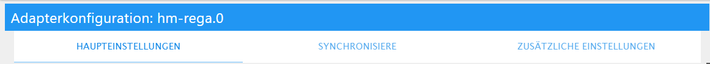
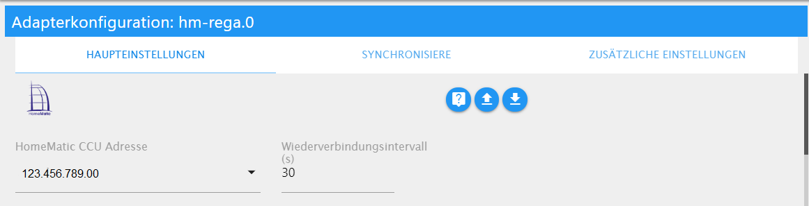
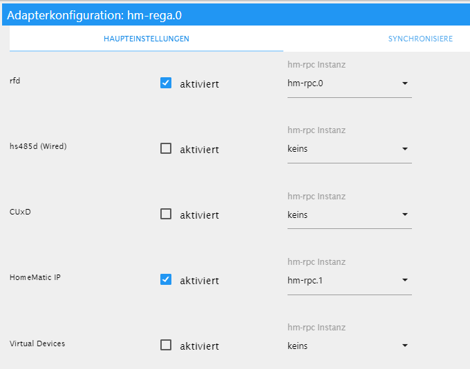
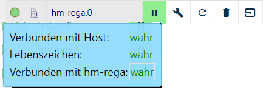
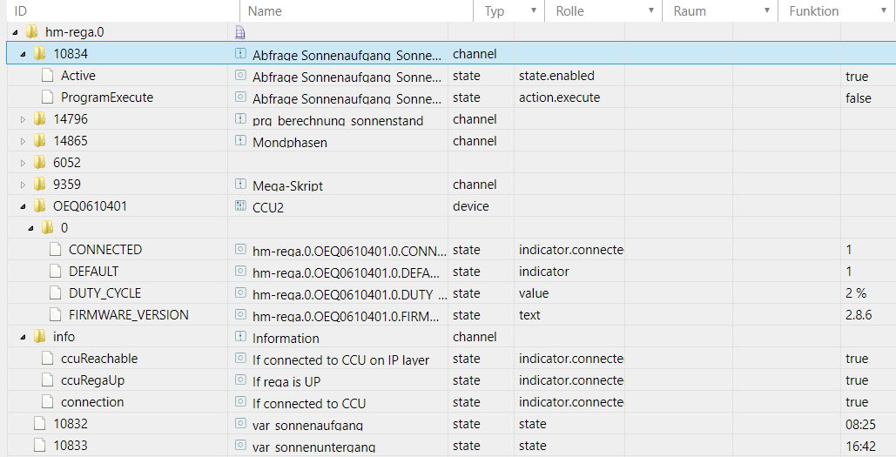

# ioBroker HomeMatic ReGaHSS Adapter


[](https://www.npmjs.com/package/iobroker.hm-rega)


[](https://weblate.iobroker.net/engage/adapters/?utm_source=widget)
[](https://www.npmjs.com/package/iobroker.hm-rega)

Connects HomeMatic CCU "Logic Layer" ("ReGaHSS") to ioBroker.

**This adapter uses Sentry libraries to automatically report exceptions and code errors to the developers.** For more details and for information on how to disable the error reporting, see [Sentry-Plugin Documentation](https://github.com/ioBroker/plugin-sentry#plugin-sentry)! Sentry reporting is used starting with js-controller 3.0.

## Homematic

> Homematic is the smart home system of eQ-3. It controls many different functions in a house or in a flat with simple or complex scenarios.

> The devices include products for the control of light, roller shutters and heating, hazard detectors, security sensors and products for the measurement of weather data. The radio communication makes the retrofitting easier. In new buildings, wired bus components can be used.

[Source](https://www.eq-3.de/produkte/homematic.html)

## Adapter Homematic ReGaHSS

This adapter connects to the Homematic logic layer "ReGaHSS" (**Re**sidential **Ga**teway).
It synchronizes plain text names, system variables, rooms, functions and programs between Homematic and ioBroker.

If you want to connect more than one CCU to ioBroker, install and configure one instance of this adapter for every CCU.

Together with this adapter, an instance of the adapter "hm-rpc" is installed too. Configure and activate this instance first.

One instance of this adapter can manage up to five different instances of the Homematic RPC adapter. Every service needs its own RPC instance:

- rfd (radio service of the CCU for the standard components)
- hs485d (Wired) (for the wired bus components)
- CUxD (additional software that provides a universal interface)
- Homematic IP (components with IP support)
- Virtual Devices

## Purpose

This adapter keeps the HomeMatic CCU variables in sync with ioBroker and makes it possible to start HomeMatic CCU programs from ioBroker.

The adapter can also be used as a "migration helper": you can copy device and channel names, rooms, functions and favorites from the CCU to ioBroker. This works only in one direction. Changes in ioBroker are overwritten with the next synchronization, so switch these options off after the first synchronization.

## Requirements

- Homematic gateway (CCU/CCU2/CCU3 …) **or** a radio module with suitable software (piVCCU, RaspberryMatic or similar)
- At least one instance of the adapter hm-rpc, which is already installed and configured

## Installation

Install one instance of the adapter in the ioBroker admin interface. When the installation is finished, the configuration window opens automatically.

Create and configure the instance of the hm-rpc adapter, which was installed together with this adapter, before you configure this adapter. If you need more services, create the additional hm-rpc instances too.

## Configuration



*Selection menu at the top*

The selection menu at the top has three areas:

### Area "Main settings"



*Main settings*

The basic settings are made in this area.

You can select the IP address of the CCU in the drop-down menu. You can also change the reconnection interval (default: 30 seconds).



*Assignment of the RPC instances*

After that, activate the required services and connect every service with the matching hm-rpc instance.

**Polling**

If polling is activated, the adapter reads the ReGaHSS data from the CCU at regular intervals. The interval is set in seconds in the field "interval (s)". Do not set a too small interval, because too many requests can crash the CCU.

**Trigger**

To reduce the number of requests from ioBroker to the ReGaHSS, the CCU can also send the data on change. For this, use a virtual button of the CCU, which is switched in a CCU program. By default, this is the button `BidCosRF.50.PRESS_SHORT` (see the example program).

### Area "Synchronize"

Here you define which information is copied from the CCU to ioBroker. The adapter creates the according objects and states in ioBroker.

- **DutyCycle**: shows the duty cycle (in %)
- **variables**: copies the system variables from the CCU
- **programs**: copies the program names from the CCU
- **names**: copies the plain text names of the data points from the CCU
- **favorites**: copies the favorites and lists them
- **rooms**: copies the rooms and lists them
- **functions**: copies the functions and lists them

### Area "Additional settings"

Here you decide if https (an encrypted connection) must be used. If https is activated, you must enter the user name and the according password.

When all settings are done, close the configuration page with the button "save and close" below the settings. The adapter stops, and the instance starts again with the new values.

### Instance



*Instance and signal*

You find the created instances in the area *Instances* of ioBroker. On the left side, the traffic light shows if the adapter is activated and if it is connected with the CCU.

If you move the mouse pointer over an icon, you get detailed information.

### Objects of the adapter

The area *Objects* shows all values and information, which the adapter reads from the CCU, in a tree structure.

The objects depend on your own installation. That is why only the general objects, which are the same for all users, are described here.



*Folder structure*

The first folders (normally a numeric ID) are the programs of the CCU.

The folders CCU and info contain the basic information of the gateway, including the duty cycle in percent (if it is activated).

At the end, the variables, which are created in the CCU, are listed.

## FAQ

### What are the ALARM states created in the device object?

States which end on `_ALARM` are created by the ReGa adapter to represent service messages. The alarm has three different states.

`_NO ALARM_` means that there is no service message for this state. When a service message appears, the state changes to `_ALARM_`. The time of the alarm on the CCU is stored in the "last changed" timestamp of the state (`state.lc`).

If you change the state in ioBroker, the alarm is acknowledged on the CCU and the service message disappears. The alarm state in ioBroker changes to `_ACKNOWLEDGED_`. It still contains the time of the alarm in the "last changed" timestamp, and the time of the acknowledgement in the timestamp of the state (`state.ts`).

### I have a HomeMatic CCU2/CCU3. How can I add it to the adapter settings?

Enter the IP address of your CCU in the adapter settings and then

* activate "rfd" for the normal HomeMatic devices,
* activate "HomeMatic IP" if you use HomeMatic IP devices,
* activate "Virtual Devices" if you use groups in HomeMatic (for example, if you combine several thermostats into one group).

### I changed rooms or other settings in HomeMatic, but the changes are not visible in ioBroker.

Restart the hm-rega instance, for example, with the restart button of hm-rega.x in the column "actions" on the tab "Instances".

Wait about 10 to 20 seconds and then check the tab "Enums" and the objects (`enum.xxx` – the expert mode must be switched on). If the changes are still not there, restart ioBroker. After that, the changes are available in ioBroker.

### How can I synchronize the hidden (invisible) variables, for example, of the HMIP-PSM?

Since version 2.4.0 it is possible to synchronize hidden variables. Open the settings of hm-rega. On the tab "Synchronize" you find the option `Invisible variables` if the option `variables` is activated.

### I want to execute my own scripts on the CCU from ioBroker. Is this possible?

Since version 2.3.0 you can execute your own scripts on the CCU with the command `sendTo`.

For example, you can read the uptime of your CCU with this script:

```javascript
const upTimeScript = `
    string stderr;
    string stdout;
    system.Exec("cat /proc/uptime | awk '// { printf $1/3600 }'", &stdout, &stderr);
    WriteLine(stdout);`;

sendTo('hm-rega.0', upTimeScript, res => {
    log(JSON.stringify(res), 'info');
});
```

### The web interface of my CCU uses another port than the standard http/https ports, and no connection is established. How can I configure another port?

This is a rare case, so the setting is only shown in the *expert mode*. Switch on the expert mode in the admin, and you find the option `Web interface port` on the tab "Additional settings". You can also change the port in the command line:

```bash
iob set hm-rega.0 --webinterfacePort 8765
```

To use the default ports again, enter `443` or `80` according to your protocol, or enter `0` for the automatic selection.

### My ReGa API does not use port 8181 (HTTPS: 48181). Can I use the adapter anyway?

Yes. Switch on the *expert mode* in the admin, and you can set the option `Rega port` on the tab "Additional settings".

You can also change the port in the command line: `iob set hm-rega.<instance> --homematicPort <port>`

## Changelog
<!--
	Placeholder for the next version (at the beginning of the line):
	### **WORK IN PROGRESS**
-->
### **WORK IN PROGRESS**
* (bluefox) Removed prepare script
* (bluefox) Merged the English documentation into README.md and removed the docs folder

### 6.0.0 (2026-08-15)
* (bluefox) migrated the adapter to TypeScript
* (bluefox) migrated the configuration dialog to JSON config (requires admin 6.17.14 or newer)
* (bluefox) the ports of the ReGaHSS API and of the web interface can now be configured in the expert mode
* (bluefox) required js-controller 5.0.19

### 5.1.0 (2024-08-29)
* (@foxriver76) added notification if devices are low on battery

### 5.0.0 (2024-07-18)
* (bluefox) required node 18
* (bluefox) updated dependencies

### 4.0.0 (2023-09-04)
* (mcm1957) required node 16 due to adapter-core 3.x.x
* (bluefox) removed deprecated package - `request`

### 3.0.47 (2023-08-08)
* (bluefox) Updated packages

### 3.0.46 (2023-03-30)
* (foxriver76) fixed for controller v5 (closes #368)

### 3.0.44 (2023-02-20)
* (foxriver76) compatibility of RSSI_DEVICE and RSSI_PEER for CCU updated (closes #352)
* (foxriver76) also sync enums for a maintenance channel of rfd devices (closes #320)

### 3.0.43 (2022-07-28)
* (foxriver76) if LGW is not reachable we now set duty cycle to `null` instead of `-1` in all cases (closes #298)

### 3.0.40 (2022-04-03)
* (foxriver76) if LGW is not reachable we now set duty cycle to `null` instead of `-1`

### 3.0.39 (2022-03-26)
* (foxriver76) fixed another `ValueList` bug

### 3.0.38 (2022-03-26)
* (foxriver76) fixed bug with `ValueList` (closes #268)

### 3.0.37 (2022-02-22)
* (foxriver76) only delete hm-rpc objects of configured instances from enums (fixes #253)

### 3.0.35 (2022-01-28)
* (foxriver76) do not log warning if we cannot synchronize favorites of empty string user (fixes #227)

### 3.0.34 (2022-01-24)
* (martin-herzog/foxriver76) fixed unneeded call which lead to warnings in rega log

### 3.0.33 (2021-11-18)
* (foxriver76) if function or room names on CCU include dots, we replace them (fixes Sentry IOBROKER-HM-REGA-3H)

### 3.0.32 (2021-10-14)
* (foxriver76) Duty Cycle of LAN gateways can be -1 if they are disconnected (fixes #196)
* (foxriver76) we now only scale on UNIT "100%" as hm-rpc does (fixes #207)

### 3.0.31 (2021-08-12)
* (foxriver76) we fixed some sentry issues (closes #182, closes #183)

### 3.0.30 (2021-07-18)
* (foxriver76) improved the detection of ALARM occurrences for virtual devices

### 3.0.29 (2021-07-01)
* (foxriver76) fixed bug on ALARM datapoint creation

### 3.0.28 (2021-06-30)
* (foxriver76) improve creation of ALARM dps even if no states provided by `getDatapoints` (fixes #168)

### 3.0.27 (2021-06-28)
* (foxriver76) fixed a bug that already deleted programs were only partially deleted in ioBroker
__Please note: This will only work for deleted programs up to now. You have to clean up orphan programs manually__

### 3.0.26 (2021-06-14)
* (bluefox) Use name from a device if the channel has a default name

### 3.0.25 (2021-05-14)
* (foxriver76) remove old code, which also scaled unit: % values and not only unit: 100 %

### 3.0.24 (2021-04-30)
* (foxriver76) we fixed more occurrences of incorrect types (fixes #146)

### 3.0.23 (2021-04-30)
* (foxriver76) we now correctly convert the rssi values, workaround for https://github.com/jens-maus/RaspberryMatic/issues/897
* (foxriver76) we made counter-states of type "number", was incorrectly "string" (closes #145)

### 3.0.22 (2021-04-30)
* (foxriver76) parse the dutyCycle state to int (fixes #144)
* (foxriver76) updated dependencies
* (foxriver76) removed unneeded dependency

### 3.0.21 (2021-04-24)
* (foxriver76) bring back io-package.json readme attribute, admin does not fall back to docs as expected (fixes #135)

### 3.0.20 (2021-04-20)
* (foxriver76) admin/controller has a bug still requiring `common.title` (fixes #133)

### 3.0.19 (2021-04-16)
* (foxriver76) fixed for custom webinterface port (addresses #117)

### 3.0.18 (2021-04-05)
* (foxriver76) a local link now respects port and protocol

### 3.0.17 (2021-04-04)
* (foxriver76) correctly identify incomplete requests

### 3.0.16 (2021-01-31)
* (foxriver76) fixed issue with non-existing objects when using LAN-Gateways

### 3.0.15 (2021-01-31)
* (foxriver76) Ensures that objects are created if something (devices, variables, programs) created during runtime (fixes #124)

### 3.0.14 (2021-01-30)
* (foxriver76) fixed pot. crash after reconnecting because of existingStates array

### 3.0.13 (2021-01-30)
* (foxriver76) ensure to not set states of non-existing RPC objects due to differences in the APIs (fixes #123)

### 3.0.12 (2021-01-29)
* (foxriver76) we now handle some more edge case errors

### 3.0.10 (2021-01-27)
* (foxriver76) no build needed

### 3.0.9 (2021-01-27)
* (foxriver76) fixed gh actions

### 3.0.8 (2021-01-27)
* (foxriver76) we now wait until objects are created before setting states (fixes #122)
* (foxriver76) added release script

### 3.0.7 (2021-01-17)
* (foxriver76) we notify the user about aborted connection by CCU during request

### 3.0.6 (2020-12-25)
* (Hirsch-DE) don't write data points if timestamp is 0"

### 3.0.5 (2020-12-24)
* (foxriver76) provide possibility to use custom webinterface port, please see FAQ

### 3.0.4 (2020-12-21)
* (foxriver76) fixed enum translations (changed in API)
* (foxriver76) fixed handling of "favorites" enum
* __this can be breaking for some users, please check your enums__

### 2.6.25 (2020-12-16)
* (foxriver76) fixed aliases being removed from enums if they contain `hm-rpc.`

### 2.6.24 (2020-11-03)
* (foxriver76) now states will be accordingly marked to indicate that rega is down when receiving invalid responses

### 2.6.23 (2020-10-15)
* (foxriver76) fixes for edge case crashes

### 2.6.22 (2020-09-29)
* (foxriver76) fixed error where alarm states of hm-rpc instances with instance number >= 10 are created for the wrong instance (issue #111)

### 2.6.20 (2020-09-15)
* (foxriver76) set an explicit object type on extending object (issue #109)

### 2.6.19 (2020-08-23)
* (foxriver76) fixed issue on syncing service message counter when invisible variables are synchronized
* (foxriver76) fixed issue where value list variables are a string instead of an integer

### 2.6.17 (2020-08-17)
* (foxriver76) fixed for % scaling of float numbers

### 2.6.15 (2020-08-08)
* (foxriver76) fixed potential issues with scaling of % values as in https://github.com/ioBroker/ioBroker.hm-rpc/issues/263

### 2.6.14 (2020-06-11)
* (foxriver76) fixed a potential problem on enum sync, where to many channels could be deleted

### 2.6.11 (2020-06-11)
* (foxriver76) timeout of requests increased to 90 seconds (its only important to have a timeout to prevent infinite stucking)

### 2.6.10 (2020-06-10)
* (foxriver76) fixed crash when a user on CCU is an empty string on synchronizing favorites

### 2.6.9 (2020-05-29)
* (foxriver76) fixed crash when we cannot determine CCU version

### 2.6.8 (2020-05-26)
* (foxriver76) Script post requests will time out after 15 seconds to prevent stucking in queue if no answer from ccu received

### 2.6.7 (2020-05-11)
* (foxriver76) fixed some edge cases, reported by Sentry

### 2.6.6 (2020-05-06)
* (foxriver76) use current time as timestamp if non-existent on initial variables poll

### 2.6.5 (2020-04-22)
* (foxriver76) improved error handling, no longer use legacy log file

### 2.6.4 (2020-04-13)
* (foxriver76) now storing scripts in iob file storage

### 2.6.2 (2020-04-11)
* (foxriver76) minor fixed on a ccu object

### 2.6.1 (2020-04-04)
* (foxriver76) fixed synchronization

### 2.6.0 (2020-04-02)
* (foxriver76) sentry plugin support added

### 2.5.5 (2020-02-17)
* (foxriver76) we are logging the script name in still pending warning from now on

### 2.5.4 (2020-02-05)
* (foxriver76) made port fully configurable, also with https enabled

### 2.5.3 (2020-01-15)
* (foxriver76) improved error handling in edge cases and more verbose logging on errors

### 2.5.2 (2019-12-29)
* (foxriver76) fixed issue which originated by undefined tclsh alias on CCU for `dutycycle.fn` script

### 2.5.1 (2019-12-14)
* (foxriver76) no longer use `adapter.objects`
* (foxriver76) js-controller v > 2 required

### 2.4.12 (2019-09-26)
* (foxriver76) fixed bug which leads to alarm counter showing the number of service messages

### 2.4.10 (2019-09-17)
* (foxriver76) we set enum name as a translation object again

### 2.4.9 (2019-09-04)
* (foxriver76) fixed minor bug which prevented correct room sync
* (foxriver76) in 2.4.6 we implemented the mechanism for hm-rega and rpc, in fact we should only delete hm-rpc devices, 
because rega will be added on ioB side (can't be done in CCU)

### 2.4.7 (2019-08-28)
* (foxriver76) fixed another legacy bug, which prevented some enums from getting the correct name

### 2.4.6 (2019-08-11)
* (foxriver76) only deleting hm adapter objects from enums

### 2.4.4 (2019-08-02)
* (foxriver76) fixed enum sync and improved logging

### 2.4.2 (2019-07-23)
* (foxriver76) lc and ts for alarm states are now valid formatted for js-controller

### 2.4.1 (2019-07-13)
* (foxriver76) also poll invisible vars if configured

### 2.4.0 (2019-07-03)
* (foxriver76) added possibility to synchronize hidden variables

### 2.3.3 (2019-04-05)
* (foxriver76) added more system info states when syncing duty cycle
* (foxriver76) when setting ts, do it in ms

### 2.3.2 (2019-03-10)
* (foxriver76) when ccu sysvar is nan, replace it by null

### 2.3.1 (2019-03-07)
* (foxriver76) also unescape %0A (\n)
* (foxriver76) remove line break in a firmware version

### 2.3.0 (2019-02-07)
* (foxriver76) implemented messagebox

### 2.2.2 (2019-02-04)
* (foxriver76) show the correct number of service messages even if automatic checking is enabled

### 2.2.1 (2019-01-29)
* (foxriver76) create alarm states with the correct name instead of renaming on restart
* (foxriver76) fixed to enabled acknowledging servicemessages for all instance types

### 2.2.0 (2019-01-26)
* (foxriver76) reworked alarm states, see FAQ
* (foxriver76) fixed where virtual devices were not named

### 2.1.8 (2019-01-24)
* (foxriver76) from now on we are displaying the firmware version instead of coprocessor fw version
* (foxriver76) we are making sure to prevent a CCU3 being exposed as a CCU2
* (foxriver76) fixed renaming of alarms on start

### 2.1.7 (2019-01-21)
* (foxriver76) fixed the bug that all alarms of devices are in hm-rpc rfd instance 
or non existent if no rpc instance existed
* (foxriver76) fixed bug where datapoints were not named

### 2.1.6 (2019-01-20)
* (foxriver76) updated state when the same value is set with another timestamp
* (foxriver76) reverted the duty cycle script
* (foxriver76) fixed for parse errors on -inf values

### 2.1.3 (2019-01-14)
* (foxriver76) also decode string values when setting foreign states
* (foxriver76) added more translations

### 2.1.2 (2019-01-10)
* (foxriver76) fixed duty cycle script
* (foxriver76) fixed bug where state units were ignored for all except rfd

### 2.1.0 (2019-01-07)
* (foxriver76) usage of adapter-core
* (bluefox) compact mode compatibility

### 2.0.1 (2019-01-01)
* (foxriver76) fixed error that prevented setting umlauts to system variables in ioBroker
* (foxriver76) usage and application of eslint

### 2.0.0 (2018-11-28)
* (foxriver76) Https checkbox added
* (foxriver76) Https can be used instead of http
* (foxriver76) Added possibility to authenticate on API
* (foxriver76) de- and encryption added

### 1.7.2 (2018-07-29)
* (bluefox) Configuration dialog was corrected

### 1.7.1 (2018-06-25)
* (bluefox) Forbidden characters were replaced

### 1.7.0 (2018-01-26)
* (bluefox) Ready for Admin3

### 1.6.6 (2017-09-23)
* (AlGu1) Fixed error if Lan Interfaces exits

### 1.6.5 (2017-09-10)
* (AlGu1) Change adapter logging of new values to debug

### 1.6.4 (2017-09-10)
* (AlGu1) Config Settings changed to set defaults after updated adapter

### 1.6.3 (2017-09-06)
* (AlGu1) Read values from CCU in raw format and create JSON string and object in adapter

### 1.6.2 (2017-09-05)
* (AlGu1) dutycycle.fn script changed for better compatibility without ReGaHss Beta version

### 1.6.1 (2017-09-05)
* (AlGu1) Error in script file fixed

### 1.6.0 (2017-09-05)
* (AlGu1) Read DutyCycle and other params from `listBidcosInterfaces`

### 1.5.0 (2017-06-29)
* (Apollon77) Also updated names of states when syncing with CCU

### 1.4.8 (2017-05-24)
* (bluefox) Fixed values conversion for CUxD

### 1.4.4 (2017-02-28)
* (Apollon77) small fixed (issue #23)

### 1.4.3 (2017-02-01)
* (Apollon77) respect settings and only sync variables and programs if selected in settings (issue #22)

### 1.4.2 (2017-01-30)
* (bluefox) remove error log in CCU by start

### 1.4.1 (2017-01-16)
* (bluefox) merge rooms, functions and favorites with existing one

### 1.4.0 (2017-01-15)
* (jens-maus) Add HMIP support

### 1.3.0 (2016-08-23)
* (bluefox) updated states only if changed

### 1.2.1 (2016-07-15)
* (nobody) fixed initial read of states

### 1.2.0 (2016-05-27)
* (bluefox) read variables anew if connection of rfd detected
* (bluefox) read alarms
* (bluefox) support for acknowledgment of alarms

### 1.1.1 (2016-05-27)
* (bluefox) fixed min/max for variables

### 1.1.0 (2016-04-19)
* (bluefox) change timestamp and last change of states

### 1.0.0 (2016-04-19)
* (bluefox) detect disconnection and handle it

### 0.3.7 (2016-04-18)
* (bluefox) fixed error with polling trigger

### 0.3.6 (2016-03-12)
* (bluefox) fixed read data points

### 0.3.5 (2016-03-12)
* (bluefox) remove deprecated unescape

### 0.3.4 (2016-03-09)
* (bluefox) remove deprecated unescape

### 0.3.3 (2016-03-01)
* (bluefox) remove deprecated unescape
* (bluefox) added connection state

### 0.3.2 (2016-03-01)
* (bluefox) remove deprecated unescape

### 0.3.1 (2016-02-29)
* (bluefox) fixed dimmer and blinds values at start

### 0.3.0 (2016-02-28)
* (bluefox) remove deprecated unescape

### 0.2.1 (2015-03-25)
* (bluefox) fixed "\n" in values

### 0.2.0 (2015-03-24)
* (bluefox) implement check init function

### 0.1.16 (2015-01-04)
* (bluefox) catch errors if states deleted

### 0.1.15 (2015-01-03)
* (bluefox) added hm-rpc as dependency

### 0.1.14 (2015-01-03)
* (bluefox) enabled npm install

### 0.1.13 (2014-12-11)
* (bluefox) processed errors

### 0.1.12 (2014-12-10)
* (bluefox) updated devices if hm-rpc updates the device list

### 0.1.11 (2014-12-06)
* (bluefox) updated devices if hm-rpc updates the device list

### 0.1.10 (2014-11-21)
* (bluefox) support of new naming concept with no parents and children

### 0.1.9 (2014-11-11)
* (bluefox) fixed error with stopping adapter

### 0.1.8 (2014-10-22)
* (bluefox) fixed error with scripts
* (bluefox) added gruntfile.js and removed jscs warnings

### 0.1.7
* (Bluefox, Hobbyquaker) fixed bug if no programs or variables exist

### 0.1.6
* (hobbyquaker) added common.role for variables
* (hobbyquaker) get state values
* (hobbyquaker) queue device/channel renaming

### 0.1.5
* (hobbyquaker) enum fixes

### 0.1.4
* (hobbyquaker) fixes
* (hobbyquaker) added settings ui

### 0.1.3
* (hobbyquaker) common.children vs children

### 0.1.2
* (hobbyquaker) Fixed `common.children` in getPrograms

### 0.1.1
* (hobbyquaker) Fixed common.name attribute

[Older changelogs can be found there](CHANGELOG_OLD.md)

## License
The MIT License (MIT)

Copyright (c) 2014-2026 bluefox <dogafox@gmail.com>

Copyright (c) 2014 hobbyquaker

Permission is hereby granted, free of charge, to any person obtaining a copy
of this software and associated documentation files (the "Software"), to deal
in the Software without restriction, including without limitation the rights
to use, copy, modify, merge, publish, distribute, sublicense, and/or sell
copies of the Software, and to permit persons to whom the Software is
furnished to do so, subject to the following conditions:

The above copyright notice and this permission notice shall be included in
all copies or substantial portions of the Software.

THE SOFTWARE IS PROVIDED "AS IS", WITHOUT WARRANTY OF ANY KIND, EXPRESS OR
IMPLIED, INCLUDING BUT NOT LIMITED TO THE WARRANTIES OF MERCHANTABILITY,
FITNESS FOR A PARTICULAR PURPOSE AND NONINFRINGEMENT. IN NO EVENT SHALL THE
AUTHORS OR COPYRIGHT HOLDERS BE LIABLE FOR ANY CLAIM, DAMAGES OR OTHER
LIABILITY, WHETHER IN AN ACTION OF CONTRACT, TORT OR OTHERWISE, ARISING FROM,
OUT OF OR IN CONNECTION WITH THE SOFTWARE OR THE USE OR OTHER DEALINGS IN
THE SOFTWARE.