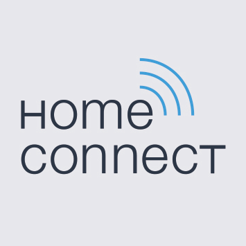
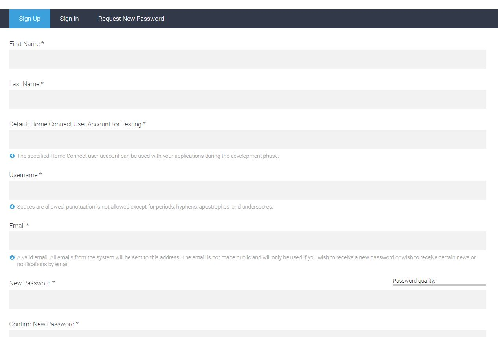
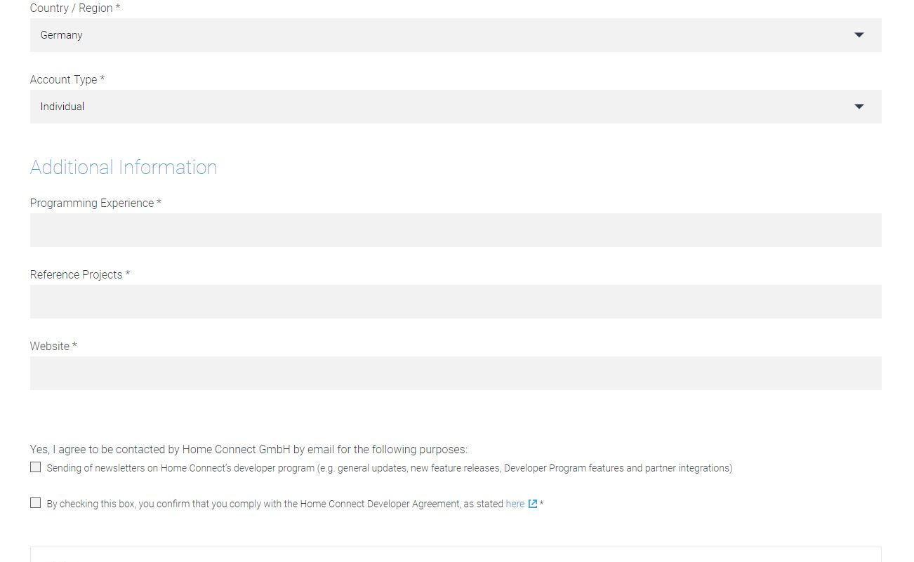
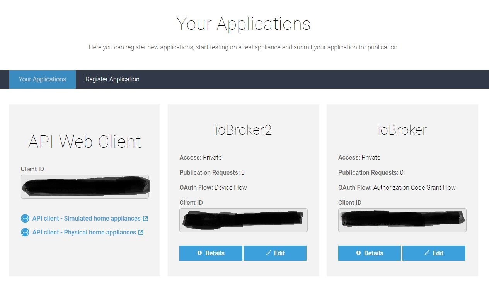
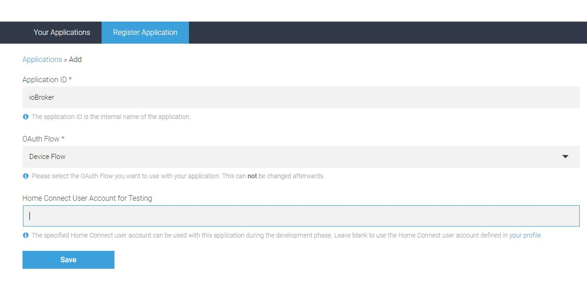

# ioBroker.homeconnect

## Voraussetzungen vor der Installation

Es muß mindestens Node.js Version 8 installiert sein!!

Für den Adapter wird eine ClientID benötigt. Nutze die Einstellungen um jeden Schritt der Registrierung zu erreichen.

## Requirements before installation

At least Node.js version 8 must be installed!

A ClientID is required for the adapter. Use the settings for each step to register.

<https://developer.home-connect.com>

Bei **Default Home Connect User Account for Testing** die E-Mail-Adresse angeben, mit der die Home-Connect-App
registriert wurde, diese wird später auch beim Authorization-Prozess benötigt.

For **Default Home Connect User Account for Testing**, specify the e-mail address with which the Home Connect app is to be sent.
was registered, this is also required later in the authorization process.

Bei **Account Type** Individual auswählen. Die restlichen Daten sofern vorhanden ergänzen (keine Ahnung, ob das geprüft wird).

For **Account Type** select Individual. Add the remaining data if available (no idea if this will be checked).

Dann auf **Applications** und anschließend auf **Register Application** gehen.

Then go to **Applications** and then to **Register Application**.

Bei **Application ID** einen Namen für die Application eintragen, z.B. ioBroker. Bei **OAuth Flow** Device Flow selektieren.
**Home Connect User Account for Testing** kann leer bleiben. Bei **Success Redirect** eine URI eintragen, z.B. https://example.com.
Dann Speichern und dann hat man die benötigte ClientID.

For **Application ID** enter a name for the application, e.g. ioBroker. With **OAuth Flow** Device Flow select.
**Home Connect User Account for Testing** can remain empty. For **Success Redirect** enter a URI, e.g. https://example.com.
Then save and you have the required ClientID.

## Konfiguration

In der Adapter-Config muss der Homeconnect App Benutzername und Passwort und die erstellte ClientID eingetragen werden.

## Benutzung

Mit den states in commands kannst du das Programm stoppen, pausieren oder fortführen.

Mit den states in settings kannst du das Gerät ein oder ausschalten.

Ändern des States programs.active.BSH_Common_Root_ActiveProgram führt zum starten eines Programms
Update iQ300: Es muss das gewüschnte Programm eingetragen werden. Wenn man programs.selected.BSH_Common_Root_SelectedProgram ausliest und einträgt, hat der User die Möglichkeit am Gerät des gewünschte Programm auszuwählen, welches dann per ioBroker gestartet wird.

Ändern des States programs.selected.BSH_Common_Root_SelectedProgram führt zum auswählen des Programms oder Optionen

Wenn man checken möchte, ob ein Programm fertig ist muss

status.BSH_Common_Status_OperationState

auf den kompletten Status Name übrprüft werden:

BSH.Common.EnumType.OperationState.Finished

Weitere Zustände sind noch:

"BSH.Common.EnumType.OperationState.Inactive": "Inactive",
"BSH.Common.EnumType.OperationState.Ready": "Ready",
"BSH.Common.EnumType.OperationState.Run": "Run",
"BSH.Common.EnumType.OperationState.ActionRequired": "ActionRequired",
"BSH.Common.EnumType.OperationState.Finished": "Finished"

Oder ob ein Gerät geöffnet ist

"BSH.Common.EnumType.DoorState.Open": "Open",
"BSH.Common.EnumType.DoorState.Closed": "Closed"

## Usage

With the states in commands you can stop, pause and resume a program.
With the states in settings you can turn off or turn on the device
Change the value of programs.active.BSH_Common_Root_ActiveProgram leads to starting a program
Update iQ300: You need to set the program name in this variable. If programs.selected.BSH_Common_Root_SelectedProgram is copied, the machine user can predefine the wanted program at the machine and it will be started via ioBroker
Change the value of programs.selected.BSH_Common_Root_SelectedProgram leads to selecting a program or options

## Changelog

<!--
    Placeholder for the next version (at the beginning of the line):
    ### **WORK IN PROGRESS**
-->
### 1.2.2 (2023-12-02)

- bump version

### 1.2.1 (2023-12-02)

- bump version

### 1.2.0 (2023-12-02)

- fix login flow
- (mcm1957) changed: Testing has been changed to support node 16, 18 and 20
- (mcm1957) changed: Dependencies have been updated
- (ta2k) restart adapter instead of relogin

### 1.1.1

- Fix auto login for SingleKey User

### 1.1.0

- Add auto login for SingleKey User

### 1.0.3

- Add manually login for SingleKey User

### 1.0.2

- Adapter complete rewriten. Includes a lot of Bugfixes

### 0.0.36

- fix for js.controller 3.3. Please delete the device in Objects manually

### 0.0.32 (29.12.2020)

- (Morluktom) bugfix for devices that are completely switched off (e.g. washing machine, dryer)

### 0.0.31

- (ta2k) fix pause start command

### 0.0.30 (10.05.2020)

- (ta2k) fix js controller 3 issues

### 0.0.27 (13.11.2019)

- (ta2k) improve option selecting

### 0.0.26 (04.11.2019)

- (ta2k) fix boolean settings

### 0.0.25 (08.09.2019)

- (ta2k) fix compact mode
- (ta2k) reduce query per minute to prevent too much request error

### 0.0.24 (08.09.2019)

- (ta2k) improve error messaging

### 0.0.22 (08.09.2019)

- (ta2k) improve error messaging

### 0.0.22 (26.07.2019)

- (ta2k) bugfixing

### 0.0.21 (12.07.2019)

- (ta2k) bugfixing

### 0.0.19 (30.06.2019)

- (ta2k) improve displaying long states, options and events

### 0.0.18 (26.06.2019)

- (ta2k) add error handling for stoping

### 0.0.17 (26.06.2019)

- (ta2k) make commands writeable

### 0.0.16 (26.06.2019)

- (ta2k) cleanup states after update

### 0.0.15 (24.06.2019)

- (ta2k) reconnect after token refresh

### 0.0.14 (18.06.2019)

- (ta2k) check for keep alive events

### 0.0.13 (18.06.2019)

- (ta2k) close event stream before reconnect

### 0.0.12 (18.06.2019)

- (ta2k) fix events lost after 12hr

### 0.0.11 (09.06.2019)

- (ta2k) fix set values and refresh available options after program select

### 0.0.10 (04.06.2019)

- (ta2k) add settings and commands, add options to available and fix bugs

### 0.0.9 (29.05.2019)

- (ta2k) clean up code and receive event notifications

### 0.0.8 (10.04.2019)

- (dna909) increase refreshTokenInterval

### 0.0.7 (03.04.2019)

- (TA2k) Improve refreshToken and add Register process in instance option

### 0.0.6 (09.01.2019)

- (dna909) Oven: add Option.FastPreHeat, Logging, query stream.type DISCONNECTED
- (tFaster) code format and cleanups,fixed devices data structure,renamed deviceArray to devices,
  added startInRelative for Oven

### 0.0.5 (28.11.2018)

- (dna909) add eventstream handling

### 0.0.4 (23.11.2018)

- (dna909) add event-listener

### 0.0.3 (14.11.2018)

- (dna909) query States and available programs

### 0.0.2 (08.11.2018)

- (dna909) OAuth2 Deviceflow-Authorization, enumerate connected appliances

### 0.0.1 (09.10.2018)

- (dna909) initial release

## License

The MIT License (MIT)

Copyright (c) 2023 dna909 <dna909@googlemail.com>, TA2k

Permission is hereby granted, free of charge, to any person obtaining a copy
of this software and associated documentation files (the "Software"), to deal
in the Software without restriction, including without limitation the rights
to use, copy, modify, merge, publish, distribute, sublicense, and/or sell
copies of the Software, and to permit persons to whom the Software is
furnished to do so, subject to the following conditions:

The above copyright notice and this permission notice shall be included in
all copies or substantial portions of the Software.

THE SOFTWARE IS PROVIDED "AS IS", WITHOUT WARRANTY OF ANY KIND, EXPRESS OR
IMPLIED, INCLUDING BUT NOT LIMITED TO THE WARRANTIES OF MERCHANTABILITY,
FITNESS FOR A PARTICULAR PURPOSE AND NONINFRINGEMENT. IN NO EVENT SHALL THE
AUTHORS OR COPYRIGHT HOLDERS BE LIABLE FOR ANY CLAIM, DAMAGES OR OTHER
LIABILITY, WHETHER IN AN ACTION OF CONTRACT, TORT OR OTHERWISE, ARISING FROM,
OUT OF OR IN CONNECTION WITH THE SOFTWARE OR THE USE OR OTHER DEALINGS IN
THE SOFTWARE.
