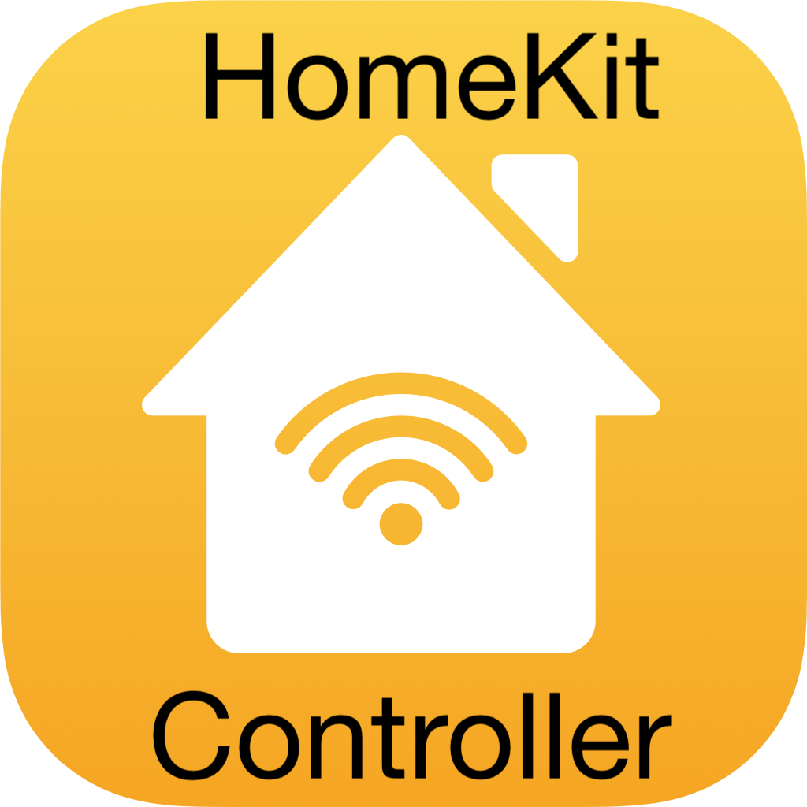

# ioBroker.homekit-controller

**This adapter uses Sentry libraries to automatically report exceptions and code errors to the developers.** For more details and for information how to disable the error reporting see [Sentry-Plugin Documentation](https://github.com/ioBroker/plugin-sentry#plugin-sentry)! Sentry reporting is used starting with js-controller 3.0.

## homekit-controller adapter for ioBroker

This adapter allows you to pair and directly control devices with the "works with HomeKit" Logo that cna be used with Apple Home. The adapter supports IP/WLAN devices and also BLE (Bluetooth LE) devices. The adapter works completely local in your network.

### The adapter is not ...
... offering ioBroker devices or states to be controlled by an Apple Home app/system. If you want this direction please use the [yahka](https://github.com/jensweigele/ioBroker.yahka) adapter.

... supporting Thread based devices. The Homekit Thread specifications are not yet publicly available.

### How to use the adapter

The adapter listens for available devices in your network.

There are three "types" of detected devices:
* **Unpaired devices** are devices that are discovered and available to pair. Some basic states are generated for these devices in ioBroker which contains some informational and administrative states. By providing the PIN you can pair these devices to this adapter instance (see "pairing" section below)
* **Paired with this instance** devices can be fully controlled, will update state values in "real time" using subscriptions (IP devices only) and data polling interval. The device can also be "unpaired" from this instance (see section below).
* **Paired with someone else** devices are devices that are discovered but already paired with some other controller. These are logged in debug mode but no states are created for them. If you want to use them with ioBroker you first need to unpair them from their current controller (sometimes only possible with a hard reset or such - refer to manual) and after this they should be shown as "unpaired device".

After pairing the supported states are read out from the device and objects and states are created. All known datapoints defined in the HomeKit standard should be named in a human-readable way. If you see UUIDs as names then the device manufacturer added self-defined data. If it is known what they provide this could be added to the adapter (e.g. as the ones added for Elgato devices) to show up as named in next version.

The datapoints are created with proper states and, if available, also correct roles. Else generic roles are used.

### Identify information
Devices that are not paired with any controller have an admin.identify state that can be triggered with "true". In this case the relevant device should identify itself (e.g. a lamp should blink or such, so that it can be identified). This function is only available as long as the device is not paired with an controller.

#### Pairing information
To pair the device with this adapter instance you need to provide the pin which is shown on the device, or a lable or such. The PIN is 8 numbers beside a QR-Code. The numbers need to be entered in the format 123-45-678 (also when the dashes are not printed on the label or shown on screen!)

Right now the PIN needs to be entered into the admin.pairWithPin state - an Admin UI will follow soon.

After pairing the device to this instance it is NOT possible to also add the device to Apple Home app or such in parallel.

There might be cases that are still problematic for pairing because I was only able to test with a very few devices, so please report issues, and I will support with instructions to get the needed debugging data.

#### Unpairing information
To unpair just trigger the "admin.unpair" state with "true" and the unpair process will be executed - an Admin UI will follow soon.

#### Special notes for use of IP devices
IP devices are discovered using UDP packages, so your host need to be in the same network as the devices. There is currently no real way around it because the MDNS record used contains important information for the pairing process.
Especially when using Docker you need to find ways (host mode, macvlan, ...) to see the UDP packages.

The main challenge for WLAN based IP devices without controls or a screen is to get them into your WLAN network. Most likely there is a manufacturer specific Mobile app to add the devices initially to your network. If this initial process also pairs the device with Apple Home you might need to unpair it afterwards (e.g. https://www.macrumors.com/how-to/delete-homekit-device/). After this it should be in your WLAN and available to pair with this adapter.

Once an IP device is paired and the IP stays the same the adapter directly connects to the device on start. SO best pin the IP in your router. If the IP has changed then the connection should be established on next discovery and the IP should be updated.

#### Special notes for use of BLE devices
By default, BLE is disabled in the adapter settings. After enabling the devices that are reachable can be discovered.

Because of the limitations of Bluetooth devices no "real-time updates" of state changes are available. The devices will report "important state changes" (e.g. the "On" state changes) by special packages that will trigger an immediate data refresh. Additionally, data are refreshed in the defined data polling intervals. Do not set them too short!

After a restart of the adapter bluetooth devices can not be connected directly - the system needs to receive at least one discovery package from the device to get the needed connection details. This mean BLE devices might be available a bit delayed.

### Resources and Links
* Resource that tries to decode Elgato special states: https://gist.github.com/simont77/3f4d4330fa55b83f8ca96388d9004e7d
* 

### TODO
* check how the adapter works with buttons (they do not have a state, and I do not own such a device. need support for this)
* look into supporting video devices
* look into support devices that offer images
* check all cases where polling updates might overlap - feedback needed if there are problems

## Changelog
### 0.3.3 (2021-10-26)
* (bluefox) Fix the Discovery checkboxes

### 0.3.1 (2021-10-25)
* (Apollon77) Fix datatype of lastDiscovered state

### 0.3.0 (2021-10-24)
* (Apollon77) BREAKING CHANGE: All channel names will be changed and a number gets added at the end of the name. Please manually delete the ones without such a number

### 0.2.0 (2021-10-23)
* (bluefox) Add Admin UI
* (Apollon77) Store pairing data additionally in an instance directory and retry them on start if objects where deleted or such
* (Apollon77) Add info.lastDiscovered state with a timestamp to allow manual cleanup of devices that are paired somewhere else then with the adapter instance (because such objects would currently not be deleted)
* (Apollon77) Add missing device and channel objects
* (Apollon77) Always convert bool-type to boolean because it might be numbers coming from the devices
* (Apollon77) sort devices for Admin UI to have those with available actions on top
* (Apollon77) Enhance error messages
* (Apollon77) Adjust some roles

### 0.1.0 (2021-10-19)
* (Apollon77) Optimizations and added some Elgato states
* (Apollon77) Initial GitHub release

### 0.0.x
* (Apollon77) Initial commit and Alpha GitHub testing

## License
MIT License

Copyright (c) 2021 Ingo Fischer <github@fischer-ka.de>

Permission is hereby granted, free of charge, to any person obtaining a copy
of this software and associated documentation files (the "Software"), to deal
in the Software without restriction, including without limitation the rights
to use, copy, modify, merge, publish, distribute, sublicense, and/or sell
copies of the Software, and to permit persons to whom the Software is
furnished to do so, subject to the following conditions:

The above copyright notice and this permission notice shall be included in all
copies or substantial portions of the Software.

THE SOFTWARE IS PROVIDED "AS IS", WITHOUT WARRANTY OF ANY KIND, EXPRESS OR
IMPLIED, INCLUDING BUT NOT LIMITED TO THE WARRANTIES OF MERCHANTABILITY,
FITNESS FOR A PARTICULAR PURPOSE AND NONINFRINGEMENT. IN NO EVENT SHALL THE
AUTHORS OR COPYRIGHT HOLDERS BE LIABLE FOR ANY CLAIM, DAMAGES OR OTHER
LIABILITY, WHETHER IN AN ACTION OF CONTRACT, TORT OR OTHERWISE, ARISING FROM,
OUT OF OR IN CONNECTION WITH THE SOFTWARE OR THE USE OR OTHER DEALINGS IN THE
SOFTWARE.
