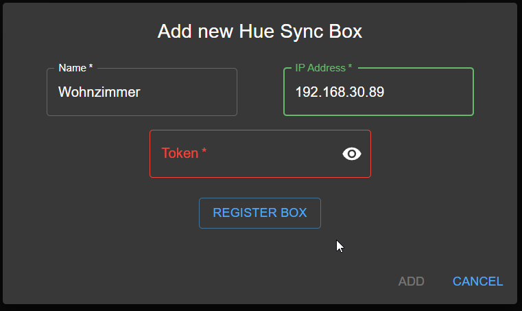
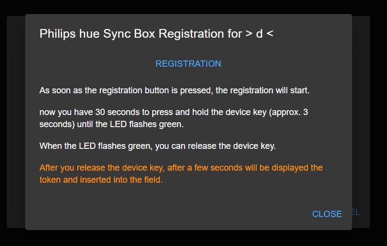
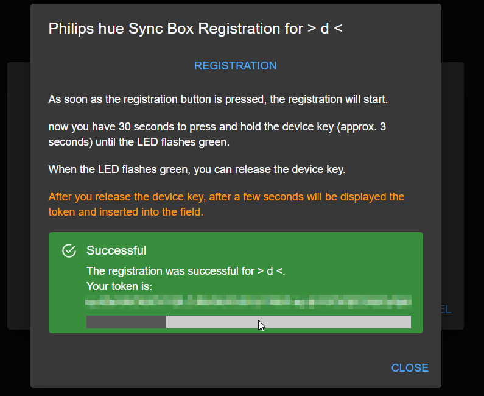
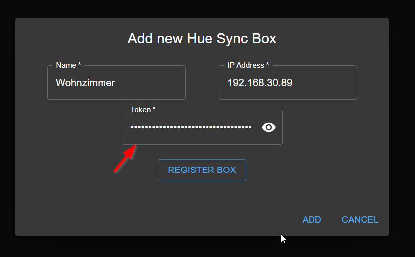
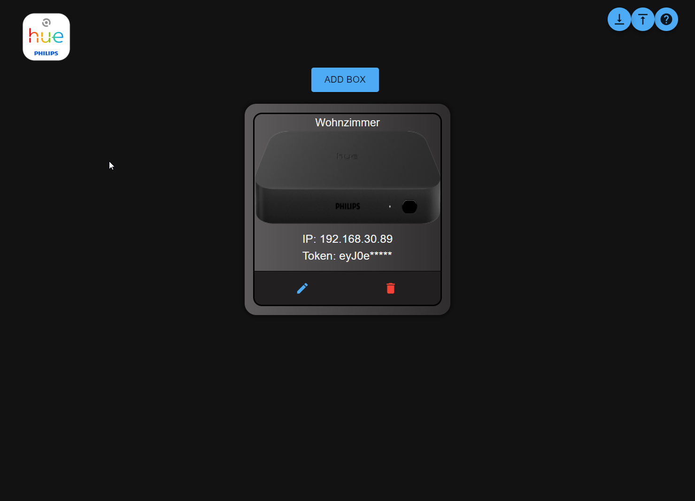
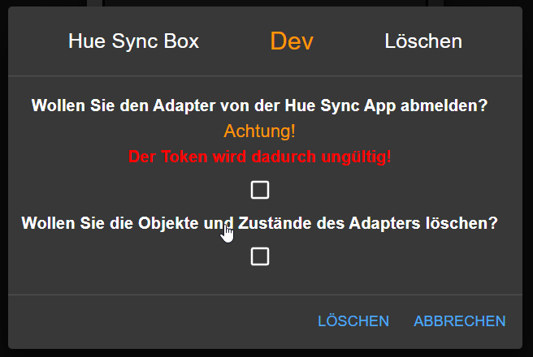

# ioBroker.hue-sync-box

## hue-sync-box adapter for ioBroker

**This adapter uses Sentry libraries to automatically report exceptions and code errors to the developers.** For more details and for information 
how to disable the error reporting see [Sentry-Plugin Documentation](https://github.com/ioBroker/plugin-sentry#plugin-sentry)! Sentry reporting is used starting with js-controller 3.0. 

## The adapter requires a Node.js version >= 16.x

### What is the Philips Hue Sync Box?

The Philips Hue Sync Box is a device that allows you to synchronize the colors and lighting effects of your Philips Hue lights with the screen of your
computer screen. This is possible by the Sync Box detecting the colors and light effects of your screen and transmitting them to your Philips
Hue luminaires.

### What can the adapter do?

The adapter polls the Philips Hue Sync Box API every 15 seconds and updates the data points accordingly.
There are some data points that can change the settings of the Sync Box (e.g. the sync on/off switch, switch the HDMI inputs, etc.).
Any change to the data points is immediately sent to the Philips Hue Sync Box and triggers an update of the data points.
Multiple Philips Hue Sync boxes can be created at the same time.

## What is required to use the adapter?

- Philips Hue Sync Box IP address (IPv4 only)
- Hue Sync Box token (see below)

## How do I add the Philips Hue Sync Box to the adapter?

1. Open the adapter configuration and click on the button "Add box".
2. enter a name for the box, the name must be only 1x because it will be used as ID.
3. Enter the IP address of the box. (IPv4 only) (small hint: when entering the IP address, a dot will be inserted automatically at every 3rd number)

   
4. Click on the button `register box` a new window will open, where you can register the box (see below)
   
5. As soon as the button `registration` is pressed, the process starts, then you have 30 seconds to press the button on the box and hold it for 
   about 3 seconds until the LED flashes green. (see below)
   
6. After you release the device key, after a few seconds will be displayed the token and inserted into the field. (see below)
   
   
7. Now you can click on the button `add` and the box will be added, then you just have to click on the button `save` to save the config.
   

## Delete the hue sync box from the adapter
### Attention! For the deletion with the options to work, the token must have been created via the registration function of the adapter.

1. Open the adapter configuration and click on the button "Delete" Trash can icon.
2. a new window opens with 2 options select the option you want to use. If none of the options is selected, the box will only be deleted from 
   config. (see below) 
   - `deregister from the box` - the box will be deleted from the adapter and the token will be deleted from the box
   - `delete object` - the box will be deleted from the adapter and the objects will be deleted from the ioBroker
     
   
you can also select both options at the same time then the box is deleted from the adapter and the objects are deleted from the ioBroker and 
the token is deleted from the box.

## Changelog
<!--
	Placeholder for the next version (at the beginning of the line):
	### **WORK IN PROGRESS**
-->
### 0.3.5 (2023-02-06)
* (xXBJXx) Dependency update

### 0.3.4 (2023-01-15)
* (xXBJXx) fixed Sentry error reporting

### 0.3.3 (2023-01-14)
* (xXBJXx) fixed a bug

### 0.3.2 (2023-01-13)
* (xXBJXx) update dependencies
* (xXBJXx) Log output extended and improved
* (xXBJXx) Added data point for the response JSON
* (xXBJXx) Added data point "Reachable" to check if the box is reachable

### 0.3.1 (2022-12-20)
* (xXBJXx) Fixed error message that occurs after a successful registration.

### 0.3.0 (2022-12-20)
* (xXBJXx) added delete function for objects and Token
* (xXBJXx) added funktion for sync the `execution.intensity` state

### 0.2.1 (2022-12-17)
* (xXBJXx) typo corrected in README
* (xXBJXx) Fixed a bug when sending commands to the box

### 0.2.0 (2022-12-17)
* (xXBJXx) Optimization and improvement of the registration process

### 0.1.0 (2022-12-16)
* (Issi) First release

## License
MIT License

Copyright (c) 2022-2023 Issi <issi.dev.iobroker@gmail.com>

Permission is hereby granted, free of charge, to any person obtaining a copy
of this software and associated documentation files (the "Software"), to deal
in the Software without restriction, including without limitation the rights
to use, copy, modify, merge, publish, distribute, sublicense, and/or sell
copies of the Software, and to permit persons to whom the Software is
furnished to do so, subject to the following conditions:

The above copyright notice and this permission notice shall be included in all
copies or substantial portions of the Software.

THE SOFTWARE IS PROVIDED "AS IS", WITHOUT WARRANTY OF ANY KIND, EXPRESS OR
IMPLIED, INCLUDING BUT NOT LIMITED TO THE WARRANTIES OF MERCHANTABILITY,
FITNESS FOR A PARTICULAR PURPOSE AND NONINFRINGEMENT. IN NO EVENT SHALL THE
AUTHORS OR COPYRIGHT HOLDERS BE LIABLE FOR ANY CLAIM, DAMAGES OR OTHER
LIABILITY, WHETHER IN AN ACTION OF CONTRACT, TORT OR OTHERWISE, ARISING FROM,
OUT OF OR IN CONNECTION WITH THE SOFTWARE OR THE USE OR OTHER DEALINGS IN THE
SOFTWARE.