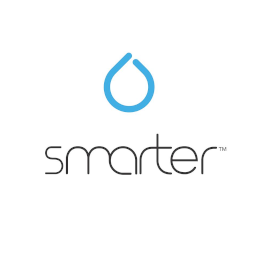

# ioBroker.ikettle2

**Tests:** 

## ikettle2 adapter for ioBroker

Control your Smarter iKettle 2.0 with ioBroker.

## Join the Discord server to discuss everything about ioBroker!

## [Sponsors](./SPONSORS.md)
If you like my work, please feel free to provide a personal donation  
(this is an personal Donate link for Jey Cee, no relation to the ioBroker Project !)  

---
## Manual
### Object description
**on** - Turns the kettle on. set_temperature has to be set before.

**on_formula** - Turns the kettle on, heating up and holds the formula_temperature for the warming_time.
formula_temperature and warming_time has to be set before.

**calibrate** - Start base calibration.

**on_plate** - Indicates if the kettle is on the base plate.

**set_temperature** - The target temperature for heating up water.

**formula_temperature** - The target temperature after heating up the water to set_temperature.

**water_temperature** - The actual temperature of the water.

**water_level** - Actual water amount in kettle. Note: The accuracy isn't that good and could be completely
false, so check that there is water in the kettle with your eyes.

**warming_time** - The time the kettle will hold the water at the formula temperature before turning off. 
Note: 0 = Not used, the minimum time is 5 minutes and the maximum is 30 minutes.

**get_preset** - Read the preset values for manual control (without APP) from the kettle.

**set_preset** - Set the preset values on the kettle for manual control (without APP). 
formula_temperature, temperature and warming_time in preset folder has to be set before. 

---
### Calibrate
Take the kettle from the base, then set the object calibrate to true. 
After the beep from base you can turn the kettle back on base and use it.

---
## Changelog

* (Jey Cee) fixes for Beta release

### 1.0.0
* (Jey Cee) initial release

## License
MIT License

Copyright (c) 2021-2022 Jey Cee <jey-cee@live.com>

Permission is hereby granted, free of charge, to any person obtaining a copy
of this software and associated documentation files (the "Software"), to deal
in the Software without restriction, including without limitation the rights
to use, copy, modify, merge, publish, distribute, sublicense, and/or sell
copies of the Software, and to permit persons to whom the Software is
furnished to do so, subject to the following conditions:

The above copyright notice and this permission notice shall be included in all
copies or substantial portions of the Software.

THE SOFTWARE IS PROVIDED "AS IS", WITHOUT WARRANTY OF ANY KIND, EXPRESS OR
IMPLIED, INCLUDING BUT NOT LIMITED TO THE WARRANTIES OF MERCHANTABILITY,
FITNESS FOR A PARTICULAR PURPOSE AND NONINFRINGEMENT. IN NO EVENT SHALL THE
AUTHORS OR COPYRIGHT HOLDERS BE LIABLE FOR ANY CLAIM, DAMAGES OR OTHER
LIABILITY, WHETHER IN AN ACTION OF CONTRACT, TORT OR OTHERWISE, ARISING FROM,
OUT OF OR IN CONNECTION WITH THE SOFTWARE OR THE USE OR OTHER DEALINGS IN THE
SOFTWARE.
