# ioBroker.imap

```:warning:
 ⚠ This adapter can crash the system very quickly with the Blockly (own query).
 ⚠ So please read this description carefully.
```

[Back to the README](/README.md)

# Summary

-   [Instance Settings](#instance-settings)
    -   [Settings TAB IMAP](#instance-settings-tab---create-imaps)
    -   [Settings TAB Icons](#instance-settings-tab---create-icons)
    -   [Settings TAB Mailparser](#instance-settings-tab---mailparser-options)
-   [Datenpunkte](#datenpunkte)
    -   [Data points imap.0](#data-point-imap0)
    -   [Data points imap.0.username](#data-point-imap0username)
    -   [Data points imap.0.username.email.emails_xx](#data-point-imap0usernameemailemail_xx)
    -   [Data points imap.0.username.infos](#data-point-imap0usernameinfos)
    -   [Data points imap.0.username.remote](#data-point-imap0usernameremote)
    -   [Data points imap.0.username.remote.copy](#data-point-imap0usernameremotecopy)
    -   [Data points imap.0.username.remote.flag](#data-point-imap0usernameremoteflag)
    -   [Data points imap.0.username.remote.html](#data-point-imap0usernameremotehtml)
    -   [Data points imap.0.username.remote.move](#data-point-imap0usernameremotemove)
-   [Blocklys](#blocklys)
    -   [Blockly - Change Instance settings](#blockly---change-imap-query)
    -   [Blockly - Own query](#blockly---imap-own-query)
    -   [Blockly - Query with instance settings](#blockly---imap-query-with-instance-settings)
    -   [Blockly - Set flags](#blockly---set-imap-flags)
-   [Array JSON](#array-json)
    -   [imap.0.xxx.email.email_xx.attach_json](#array-json-imap0xxxemailemail_xxattach_json)
    -   [imap.0.xxx.json](#array-json-imap0xxxjson)
    -   [imap.0.xxx.last_activity_json](#json-imap0xxxlast_activity_json)
    -   [imap.0.xxx.quality](#json-imap0xxxquality)
    -   [imap.0.xxx.status](#json-imap0xxxstatus)
    -   [imap.0.online_history](#array-json-imap0online_history)
-   [Example Javascripts and Blocklys](/docs/en/EXAMPLE.md)

# Instance Settings

### Instance settings TAB - Create IMAP`s

[Summary](#summary)

```:warning:
 ⚠ The instance must be activated!!!!
```

-   `Activ`: Enable IMAP connection
-   `Host`: Host - e.g. imap.gmail.com
-   `Inbox`: Default INBOX - Box to be monitored - Possible selection see imap.0.xxx.remote.change_folder
-   `Port`: Port - Default 993
-   `Username`: Username - Instance must be activated!!!
-   `Password`: Password - Instance must be activated!!!
    -   [gmail login](https://support.google.com/mail/answer/185833?hl=de)
    -   [outlook 2Factor authentication](https://mcuiobroker.gitbook.io/jarvis-infos/tipps/allgemein/microsoft-windows/2-fach-authentifizierung)

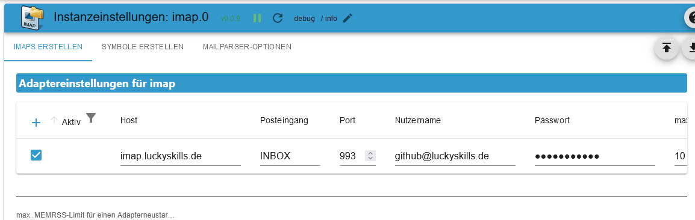

-   `max.`: Create maximum as data points - email_01...email_02... (1-99)
-   `max. HTML`: Maximum number of emails as HTML. Should be greater than max data points (1-99)
-   `TLS`: Use TLS-Connection - Default true
-   `Flags`: Flags for the query - Possible flags:

```
ALL - All messages.
ANSWERED - Messages with the Answered flag set.
DELETED - Messages with the Deleted flag set.
DRAFT - Messages with the Draft flag set.
FLAGGED - Messages with the Flagged flag set.
NEW - Messages that have the Recent flag set but not the Seen flag.
SEEN - Messages that have the Seen flag set.
RECENT - Messages that have the Recent flag set.
OLD - Messages that do not have the Recent flag set. This is functionally equivalent to "!RECENT" (as opposed to "!NEW").
UNANSWERED - Messages that do not have the Answered flag set.
UNDELETED - Messages that do not have the Deleted flag set.
UNDRAFT - Messages that do not have the Draft flag set.
UNFLAGGED - Messages that do not have the Flagged flag set.
UNSEEN - Messages that do not have the Seen flag set.
```

-   `Choose icon`: Folder icon (upload under TAB `CREATE ICON`)


-   `tls Option`: Default {"rejectUnauthorized": false}
-   `auto tls`: Set to `always` to always attempt connection upgrades via STARTTLS, `required` only if upgrading is required, or `never` to never attempt upgrading. Default: `never`
    **[For more information](https://www.npmjs.com/package/node-imap)**

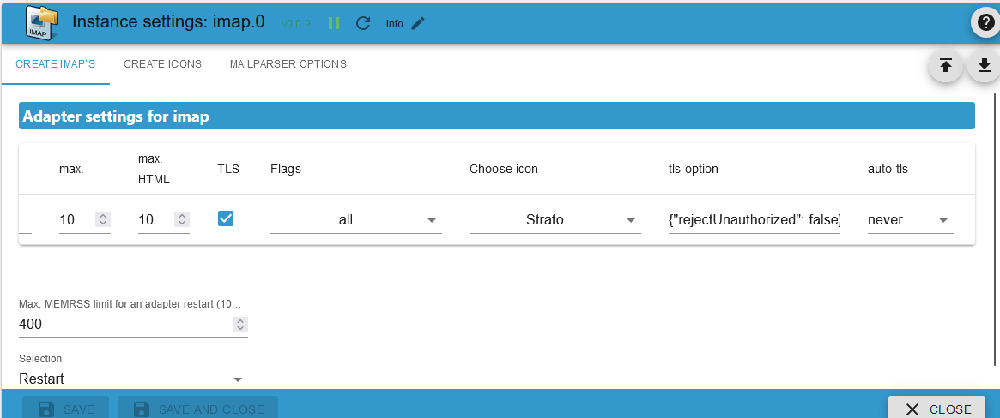

-   `Att.`: In order to fill the HTML field, attachments must also be loaded. Very high RAM consumption!!! Default `false`
-   `Mail option`: Mailparser-Option (Create under TAB `MAILPARSER OPTIONEN`)

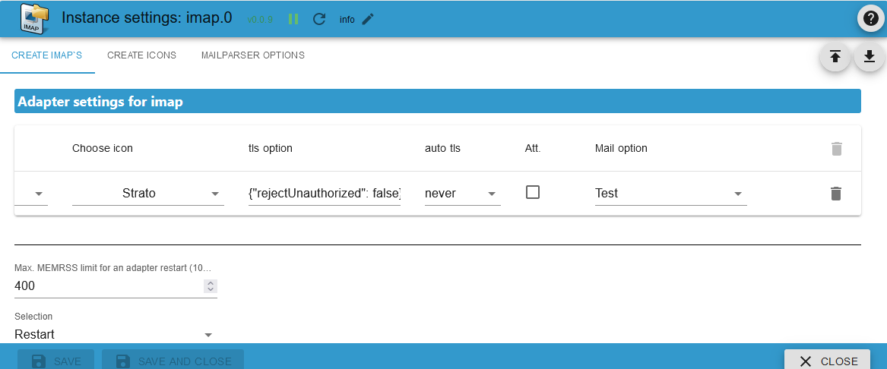

-   `max. MEMRSS-Limit:` From when the actions listed below should be triggered. Default 400 MB
-   `Restart:` When the MEMRSS limit is reached, the adapter restarts. It is checked every 24 hours.

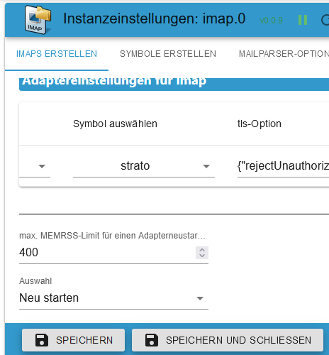

-   `Datapoint:` When the MEMRSS limit is reached, the selected data point is set to `true`. This must be reset manually. It is checked every 24 hours.

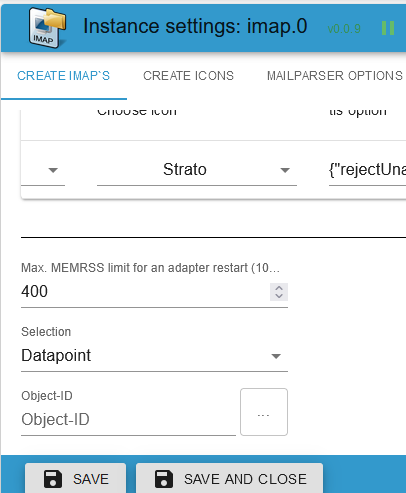

-   `Send:` A message is sent when the MEMRSS limit is reached. A message will then be sent whenever `MEMRSS` is updated.
    -   `Instance:` e. g. telegram.0,telegram.1,pushover.0
    -   `Instance User:` e. g. Peter,Olaf,Thomas

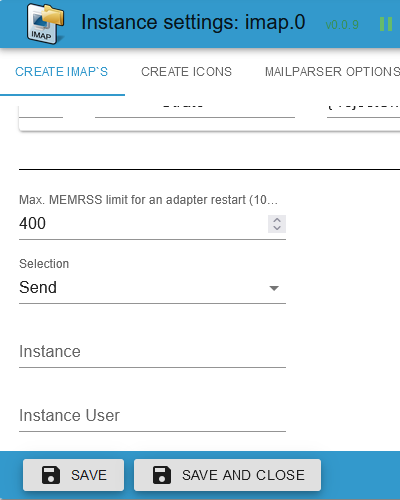

### Instance settings TAB - Create ICONS

[Summary](#summary)

-   `Icon Name:` Name for the icon. Please do not use duplicate names. An error message is output when the adapter starts.
-   `Upload:` Upload icon.

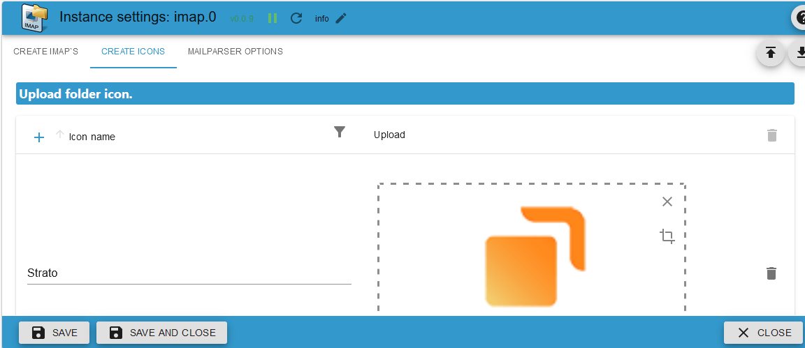

### Instance settings TAB - MAILPARSER OPTIONS

[Summary](#summary)

-   `Name:` Name for the Mailparser. Please do not use duplicate names. An error message is output when the adapter starts. [There is a detailed description here](https://nodemailer.com/extras/mailparser/).
-   `skip Html To Text:` Don’t generate plaintext from HTML.
-   `max Html Length To Parse:` The maximum amount of HTML to parse in bytes. If this is exceeded, only header data is generated.
-   `skip Image Links:` Skip converting CID attachments to data URL images. Images are not converted as base64 which saves `huge RAM usage`.
-   `skip Text To Html:` Don’t generate HTML from plaintext message.
-   `skip Text Links:` Do not linkify links in plaintext content.

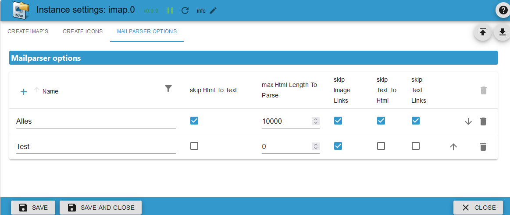

# Data points

### Data point `imap.0`

[Summary](#summary)

| Object                | Description                                                                               |
| --------------------- | ----------------------------------------------------------------------------------------- |
| imap.0.json_imap      | Name of the IMAP connection of the last activity. Trigger for incoming emails or updates. |
| imap.0.json_table     | Last update of an IMAP connection as a JSON table for VIS.                                |
| imap.0.online_counter | Number of active IMAP connections.                                                        |
| imap.0.online_history | Connection activity history as JSON - [Example](#array-json-imap0online_history).         |

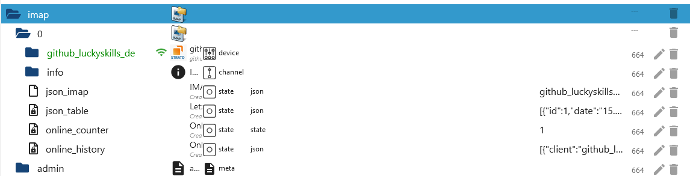

### Data point `imap.0.username`

[Summary](#summary)

| Object                             | Description                                                                                      |
| ---------------------------------- | ------------------------------------------------------------------------------------------------ |
| imap.0.xxx.active_inbox            | Active Inbox                                                                                     |
| imap.0.xxx.host                    | Hostname                                                                                         |
| imap.0.xxx.html                    | HTML Code for VIS                                                                                |
| imap.0.xxx.json                    | JSON Table for VIS - [Example](#array-json)                                                      |
| imap.0.xxx.last_activity           | Last activity                                                                                    |
| imap.0.xxx.last_activity_json      | Activity as array JSON - [Example](#json-imap0xxxlast_activity_json)                             |
| imap.0.xxx.last_activity_timestamp | Last activity timestamp                                                                          |
| imap.0.xxx.online                  | IMAP status Verbindung                                                                           |
| imap.0.xxx.quality                 | Quality of all data points as JSON. Is updated every 24 hours - [Example](#json-imap0xxxquality) |
| imap.0.xxx.status                  | Information about the IMAP connection as JSON - [Example](#json-imap0xxxstatus)                  |
| imap.0.xxx.total                   | Total eMails                                                                                     |
| imap.0.xxx.total_unread            | Total unread eMails                                                                              |

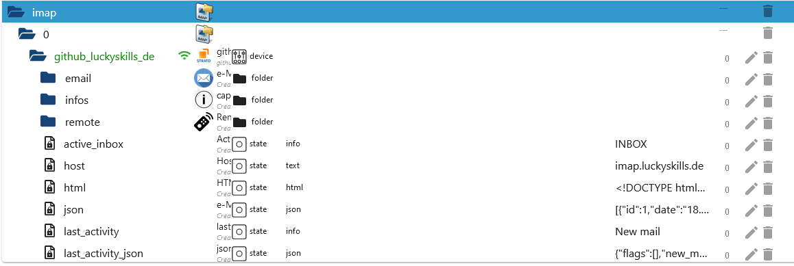

### Data point `imap.0.username.email.email_xx`

[Summary](#summary)

| Object                                | Description                                                                           |
| ------------------------------------- | ------------------------------------------------------------------------------------- |
| imap.0.xxx.email.email_01.attach      | Number of attachments and images in the body                                          |
| imap.0.xxx.email.email_01.attach_json | Infos der Anhänge als JSON - [Beispiel](#array-json-imap0xxxemailemail_xxattach_json) |
| imap.0.xxx.email_01.content           | Content of the email                                                                  |
| imap.0.xxx.email.email_01.flag        | Email flags                                                                           |
| imap.0.xxx.email.email_01.from        | All sender as Array                                                                   |
| imap.0.xxx.email.email_01.receive     | Received date                                                                         |
| imap.0.xxx.email.email_01.seq         | Sequence number                                                                       |
| imap.0.xxx.email.email_01.size        | Size of the email in bytes                                                            |
| imap.0.xxx.email.email_01.subject     | Subject                                                                               |
| imap.0.xxx.email.email_01.texthtml    | Content as HTML                                                                       |
| imap.0.xxx.email.email_01.to          | Recipient as Array                                                                    |
| imap.0.xxx.email.email_01.uid         | Unique UID                                                                            |

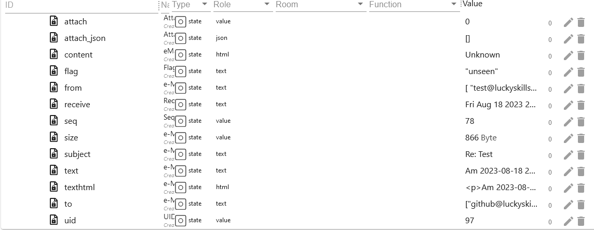
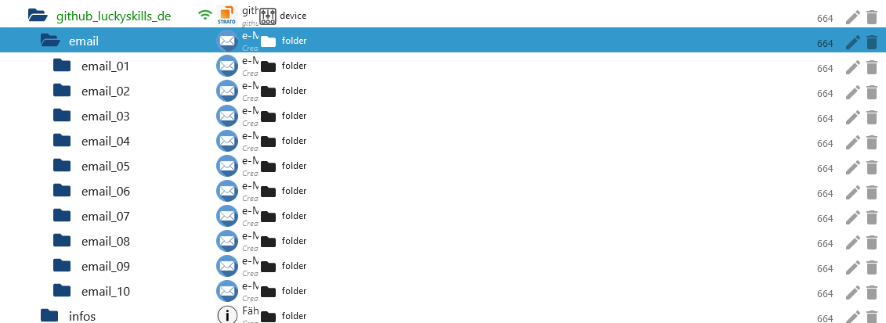

### Data point `imap.0.username.infos`

[Summary](#summary)

| Object                                 | Description                                                                                                                                           |
| -------------------------------------- | ----------------------------------------------------------------------------------------------------------------------------------------------------- |
| imap.0.xxx.infos.all_capability        | All capability from IMAP connection                                                                                                                   |
| imap.0.xxx.infos.auth_cram-md5         | Authentication method auth_cram-md5                                                                                                                   |
| imap.0.xxx.infos.auth_xoauth           | Authentication method xoauth                                                                                                                          |
| imap.0.xxx.infos.auth_xoauth2          | Authentication method xoauth2                                                                                                                         |
| imap.0.xxx.infos.condstore             | MODSEQ request possible [lookup](https://datatracker.ietf.org/doc/html/rfc4551#page-18)                                                               |
| imap.0.xxx.infos.esearch               | Search multiple mailboxes with one command                                                                                                            |
| imap.0.xxx.infos.id                    | [lookup](https://www.iana.org/assignments/imap-capabilities/imap-capabilities.xhtml)                                                                  |
| imap.0.xxx.infos.idle                  | [lookup](https://www.iana.org/assignments/imap-capabilities/imap-capabilities.xhtml)                                                                  |
| imap.0.xxx.infos.literal\*             | [lookup](https://www.iana.org/assignments/imap-capabilities/imap-capabilities.xhtml)                                                                  |
| imap.0.xxx.infos.logindisabled         | [lookup](https://www.iana.org/assignments/imap-capabilities/imap-capabilities.xhtml)                                                                  |
| imap.0.xxx.infos.move                  | Emails can be moved. [lookup](https://www.iana.org/assignments/imap-capabilities/imap-capabilities.xhtml)                                             |
| imap.0.xxx.infos.namespace             | [lookup](https://www.iana.org/assignments/imap-capabilities/imap-capabilities.xhtml)                                                                  |
| imap.0.xxx.infos.quota                 | [lookup](https://www.iana.org/assignments/imap-capabilities/imap-capabilities.xhtml)                                                                  |
| imap.0.xxx.infos.sasl-ir               | [lookup](https://www.iana.org/assignments/imap-capabilities/imap-capabilities.xhtml)                                                                  |
| imap.0.xxx.infos.sort                  | e-mails are retrieved sorted [lookup](https://www.iana.org/assignments/imap-capabilities/imap-capabilities.xhtml)                                     |
| imap.0.xxx.infos.sort_display          | Header info is sorted. [lookup](https://www.iana.org/assignments/imap-capabilities/imap-capabilities.xhtml)                                           |
| imap.0.xxx.infos.starttls              | Starttls is supported. Can then be set in the instance settings. [lookup](https://www.iana.org/assignments/imap-capabilities/imap-capabilities.xhtml) |
| imap.0.xxx.infos.thread_orderedsubject | [lookup](https://www.iana.org/assignments/imap-capabilities/imap-capabilities.xhtml)                                                                  |
| imap.0.xxx.infos.thread_references     | [lookup](https://www.iana.org/assignments/imap-capabilities/imap-capabilities.xhtml)                                                                  |
| imap.0.xxx.infos.unselect              | [lookup](https://www.iana.org/assignments/imap-capabilities/imap-capabilities.xhtml)                                                                  |
| imap.0.xxx.infos.x-gm-ext-1            | [lookup](https://www.iana.org/assignments/imap-capabilities/imap-capabilities.xhtml)                                                                  |

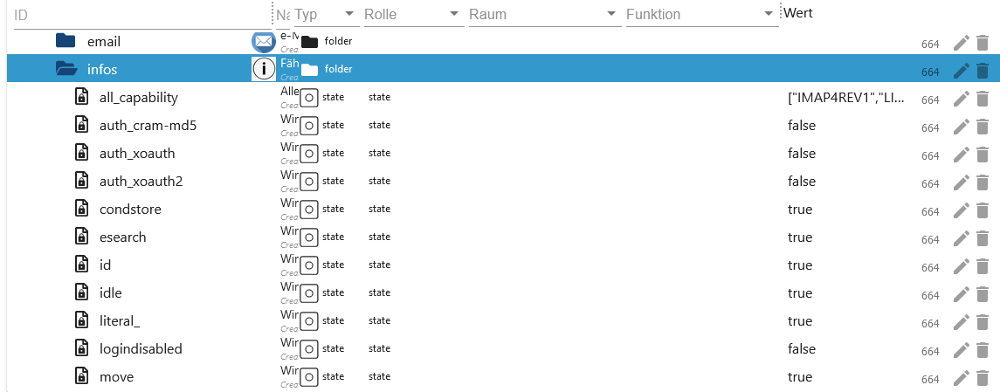
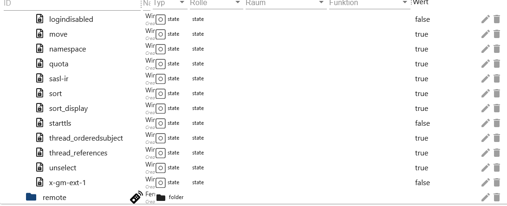

### Data point `imap.0.username.remote`

[Summary](#summary)

| Object                          | Description                                                                                                                                      |
| ------------------------------- | ------------------------------------------------------------------------------------------------------------------------------------------------ |
| imap.0.xxx.remote.apply_html    | Apply change in imap.0.xxx.remote.html.                                                                                                          |
| imap.0.xxx.remote.change_folder | Instance settings: Change post folder to be monitored and displayed. Will only be reset after a reboot.                                          |
| imap.0.xxx.remote.criteria      | Instance settings: Change search. Will only be reset after a reboot.                                                                             |
| imap.0.xxx.remote.reload_emails | Reload emails.                                                                                                                                   |
| imap.0.xxx.remote.search_start  | Apply changes from change_folder, criteria and show_mails                                                                                        |
| imap.0.xxx.remote.show_mails    | Instance settings: Number of emails (max. HTML) to be loaded. Will only be reset after a reboot. Should of course be greater than the value max. |
| imap.0.xxx.remote.vis_command   | Command from the VIS to move mails from the selection boxes. Only used by VIS.                                                                   |

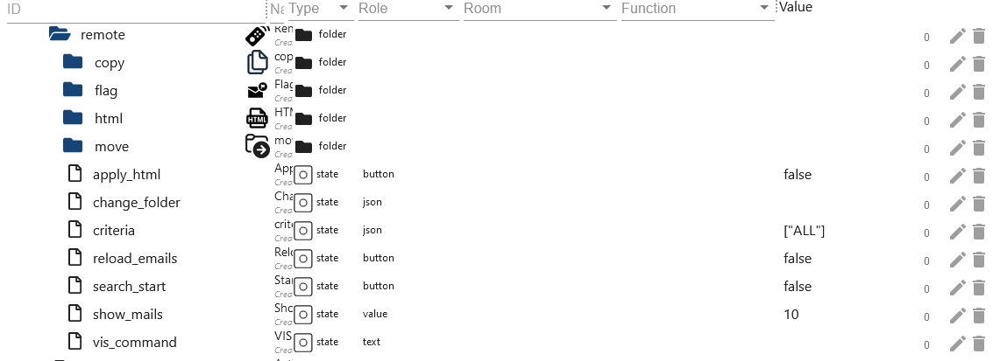

### Data point `imap.0.username.remote.copy`

[Summary](#summary)

| Object                            | Description                                                                                                   |
| --------------------------------- | ------------------------------------------------------------------------------------------------------------- |
| imap.0.xxx.remote.copy.apply_copy | Apply change of copy.folder and copy.uid.                                                                     |
| imap.0.xxx.remote.copy.folder     | Select folder in which the selected mail should be copied.                                                    |
| imap.0.xxx.remote.copy.uid        | Enter the UID of the email to be copied here. You can find the UID in imap.0.xxx.json or in the email folders |

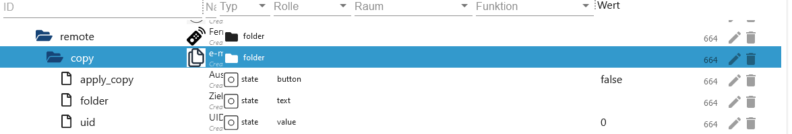

### Data point `imap.0.username.remote.flag`

[Summary](#summary)

| Object                            | Description                                                                                                       |
| --------------------------------- | ----------------------------------------------------------------------------------------------------------------- |
| imap.0.xxx.remote.flag.apply_flag | Apply change of set, type and uid.                                                                                |
| imap.0.xxx.remote.flag.set        | Select setFlag, addFlag and delFlag.                                                                              |
| imap.0.xxx.remote.flag.type       | Select flag to add, set or delete.                                                                                |
| imap.0.xxx.remote.flag.uid        | The UID to which the flag change should be made. You can find the UID in imap.0.xxx.json or in the email folders. |

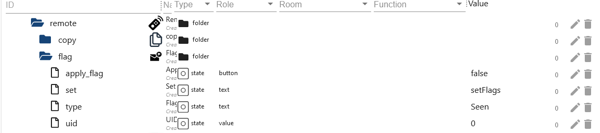

### Data point `imap.0.username.remote.html`

[Summary](#summary)

| Object                                         | Description                                                                                     |
| ---------------------------------------------- | ----------------------------------------------------------------------------------------------- |
| imap.0.xxx.remote.html.body_background         | Background Body - Default #000000                                                               |
| imap.0.xxx.remote.html.choose_content          | Display attribute from email. </br>Possible fields are html, text, textAsHtml and html convert. |
| imap.0.xxx.remote.html.header_border           | Header border - Default 2 px                                                                    |
| imap.0.xxx.remote.html.header_font             | Header font - Default Helvetica                                                                 |
| imap.0.xxx.remote.html.header_font_size        | Header font size - Default 15 px                                                                |
| imap.0.xxx.remote.html.header_linear_color_1   | Gradient background header value 1 - Default #424242                                            |
| imap.0.xxx.remote.html.header_linear_color_2   | Gradient background header value 2 - Default #424242                                            |
| imap.0.xxx.remote.html.header_tag_border_color | Header border color - Default #424242 - Everything possible                                     |
| imap.0.xxx.remote.html.header_text_color       | Header text color - Default #BDBDBD                                                             |
| imap.0.xxx.remote.html.header_width            | Header width - Default auto - Possible px or %                                                  |
| imap.0.xxx.remote.html.headline_align_column_1 | Header align column 1 - Default center </br> Possible center, left, right and auto              |

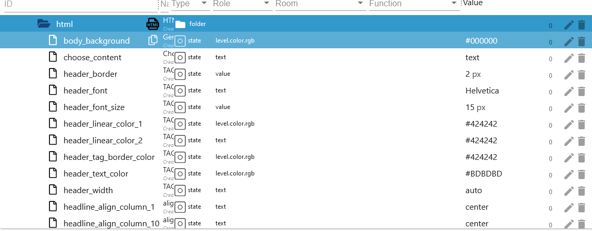

| Object                                          | Description                                                                                  |
| ----------------------------------------------- | -------------------------------------------------------------------------------------------- |
| imap.0.xxx.remote.html.headline_align_column_2  | Text alignment header column 2 - Default center </br> Possible center, left, right and auto  |
| imap.0.xxx.remote.html.headline_align_column_3  | Text alignment header column 3 - Default center </br> Possible center, left, right and auto  |
| imap.0.xxx.remote.html.headline_align_column_4  | Text alignment header column 4 - Default center </br> Possible center, left, right and auto  |
| imap.0.xxx.remote.html.headline_align_column_5  | Text alignment header column 5 - Default center </br> Possible center, left, right and auto  |
| imap.0.xxx.remote.html.headline_align_column_6  | Text alignment header column 6 - Default center </br> Possible center, left, right and auto  |
| imap.0.xxx.remote.html.headline_align_column_7  | Text alignment header column 7 - Default center </br> Possible center, left, right and auto  |
| imap.0.xxx.remote.html.headline_align_column_8  | Text alignment header column 8 - Default center </br> Possible center, left, right and auto  |
| imap.0.xxx.remote.html.headline_align_column_9  | Text alignment header column 9 - Default center </br> Possible center, left, right and auto  |
| imap.0.xxx.remote.html.headline_align_column_10 | Text alignment header column 10 - Default center </br> Possible center, left, right and auto |
| imap.0.xxx.remote.html.headline_color           | Border color Body - Default #BD5A3C                                                          |
| imap.0.xxx.remote.html.headline_column_width_1  | column width column 1 - Default auto - Possible px or %                                      |
| imap.0.xxx.remote.html.headline_column_width_10 | column width column 10 - Default auto - Possible px or %                                     |

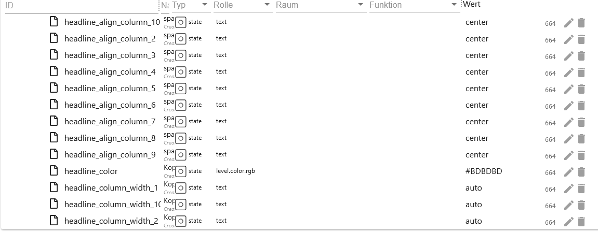

| Objekt                                         | Description                                             |
| ---------------------------------------------- | ------------------------------------------------------- |
| imap.0.xxx.remote.html.headline_column_width_2 | column width column 2 - Default auto - Possible px or % |
| imap.0.xxx.remote.html.headline_column_width_3 | column width column 3 - Default auto - Possible px or % |
| imap.0.xxx.remote.html.headline_column_width_4 | column width column 4 - Default auto - Possible px or % |
| imap.0.xxx.remote.html.headline_column_width_5 | column width column 5 - Default auto - Possible px or % |
| imap.0.xxx.remote.html.headline_column_width_6 | column width column 6 - Default auto - Possible px or % |
| imap.0.xxx.remote.html.headline_column_width_7 | column width column 7 - Default auto - Possible px or % |
| imap.0.xxx.remote.html.headline_column_width_8 | column width column 8 - Default auto - Possible px or % |
| imap.0.xxx.remote.html.headline_column_width_9 | column width column 9 - Default auto - Possible px or % |
| imap.0.xxx.remote.html.headline_font_size      | Font size in the cell - Default 16 px                   |
| imap.0.xxx.remote.html.headline_height         | Cell height - Default 35 px                             |
| imap.0.xxx.remote.html.headline_style          | Style Cell - Default normal - Possible normal or bold   |

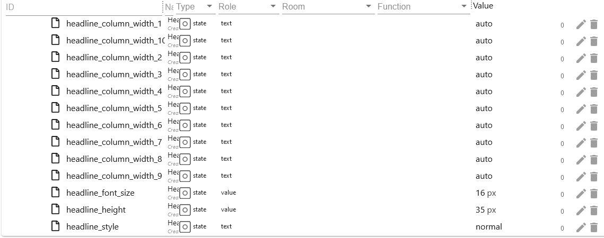

| Objekt                                           | Description                                                                               |
| ------------------------------------------------ | ----------------------------------------------------------------------------------------- |
| imap.0.xxx.remote.html.headline_underlined       | Cell border - Default 3 px                                                                |
| imap.0.xxx.remote.html.headline_underlined_color | Cell border color - Default #ffffff                                                       |
| imap.0.xxx.remote.html.jarvis                    | Code customization for View in Jarvis                                                     |
| imap.0.xxx.remote.html.mails_even_color          | Line background color for even IDs - Default #333333                                      |
| imap.0.xxx.remote.html.mails_nextday_color_even  | Line background color for even IDs yesterday - Default #F7FFE0                            |
| imap.0.xxx.remote.html.mails_nextday_color_odd   | Line background color for odd IDs yesterday - Default #F7FFE0                             |
| imap.0.xxx.remote.html.mails_odd_color           | Line background color for odd IDs - Default #FFE32E                                       |
| imap.0.xxx.remote.html.mails_today_color         | Line background color for even IDs today - Default #ffffff                                |
| imap.0.xxx.remote.html.mails_today_color_odd     | Line background color for odd IDs today - Default #ffffff                                 |
| imap.0.xxx.remote.html.p_tag_text_align          | Text align Header and Footer - Default center </br> Possible center, left, right and auto |
| imap.0.xxx.remote.html.short_content             | Character limitation in the `Content` - Default 35                                        |
| imap.0.xxx.remote.html.short_subject             | Character limitation in the `Subject` - Default 35                                        |
| imap.0.xxx.remote.html.table_tag_border_color    | Table border color - Default #424242                                                      |

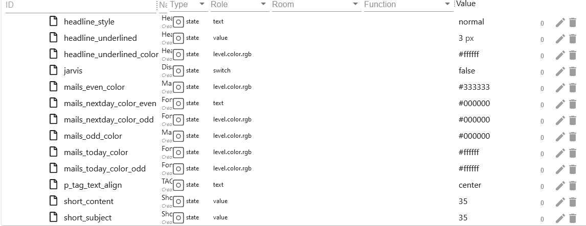

| Objekt                                      | Description                                                   |
| ------------------------------------------- | ------------------------------------------------------------- |
| imap.0.xxx.remote.html.table_tag_cell       | Table border spacing - Default 6 px                           |
| imap.0.xxx.remote.html.table_tag_text_align | Table margin - Default auto - Possible px or %                |
| imap.0.xxx.remote.html.table_tag_width      | Table width - Default auto - Possible px or %                 |
| imap.0.xxx.remote.html.td_tag_2_colums      | Line border of line 1 and 2 - Default auto - Possible px or % |
| imap.0.xxx.remote.html.td_tag_border_bottom | Line under border - Default 1 px                              |
| imap.0.xxx.remote.html.td_tag_border_color  | Line under border color - Default #424242                     |
| imap.0.xxx.remote.html.td_tag_border_right  | Cell border right - Default 1 px                              |
| imap.0.xxx.remote.html.td_tag_cell          | Cell spacing in the rows - Default 6 px                       |
| imap.0.xxx.remote.html.text_content         | Header text column 5 - Default Content                        |
| imap.0.xxx.remote.html.text_date            | Header text column 4 - Default Date                           |
| imap.0.xxx.remote.html.text_flag            | Header text column 7 - Default Flags                          |
| imap.0.xxx.remote.html.text_from            | Header text column 2 - Default From                           |

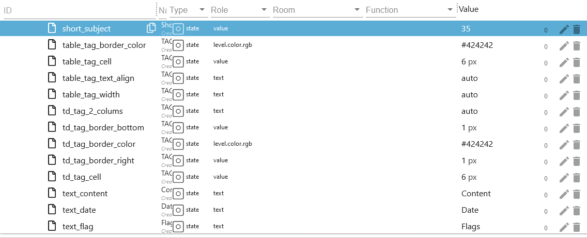

| Objekt                                     | Description                                     |
| ------------------------------------------ | ----------------------------------------------- |
| imap.0.xxx.remote.html.text_id             | Header text column 1 - Default ID               |
| imap.0.xxx.remote.html.text_move_or_copy   | Header text column 9 - Default copy/paste       |
| imap.0.xxx.remote.html.text_select_addflag | Text in flag selection box - Default addFlags - |
| imap.0.xxx.remote.html.text_select_copy    | Text in Kopie selection box - Default copy      |
| imap.0.xxx.remote.html.text_select_delflag | Text in Flag selection box - Default delFlags - |
| imap.0.xxx.remote.html.text_select_move    | Text in Kopie selection box - Default move      |
| imap.0.xxx.remote.html.text_select_setflag | Text in Flag selection box - Default setFlags - |
| imap.0.xxx.remote.html.text_seq            | Header text column 6 - Default SEQ              |
| imap.0.xxx.remote.html.text_setflag        | Header text column 10 - Default Flag action     |
| imap.0.xxx.remote.html.text_subject        | Header text column 3 - Default Subject          |
| imap.0.xxx.remote.html.text_uid            | Header text column 8 - Default UID              |
| imap.0.xxx.remote.html.top_font            | Font Header und Footer - Default Helvetica      |

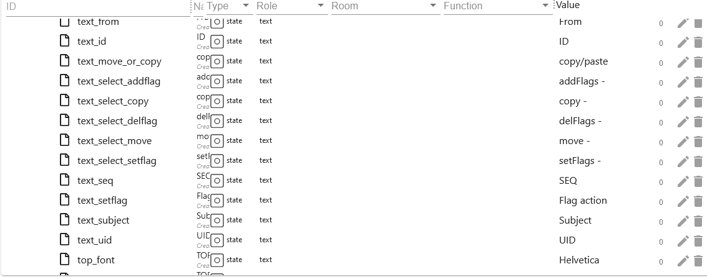

| Objekt                                 | Description                                                                |
| -------------------------------------- | -------------------------------------------------------------------------- |
| imap.0.xxx.remote.html.top_font_size   | Font size Header und Footer - Default 20 px                                |
| imap.0.xxx.remote.html.top_font_weight | Schriftstärke Header und Footer - Default normal - Possible normal or bold |
| imap.0.xxx.remote.html.top_text        | Header text Default the Username                                           |
| imap.0.xxx.remote.html.top_text_color  | Header text color - Default #ffffff                                        |

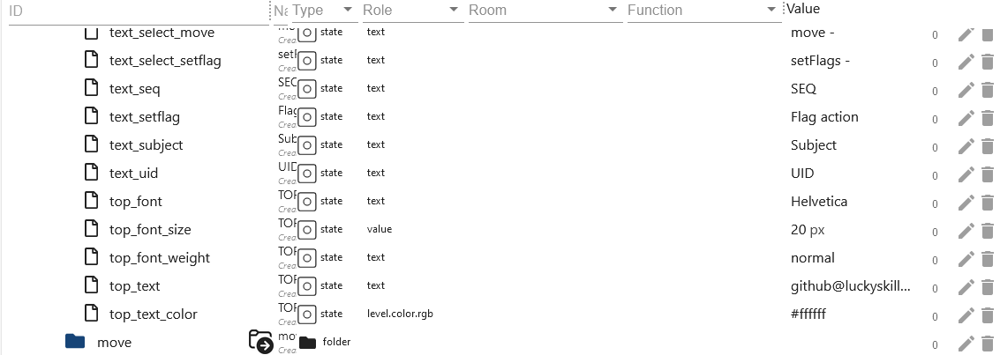

### Data point `imap.0.username.remote.move`

[Summary](#summary)

| Objekt                            | Description                                                                                                   |
| --------------------------------- | ------------------------------------------------------------------------------------------------------------- |
| imap.0.xxx.remote.move.apply_move | Apply change of folder and uid.                                                                               |
| imap.0.xxx.remote.move.folder     | Select folder in which the selected mail should be moved.                                                     |
| imap.0.xxx.remote.move.uid        | Enter the UID of the email to be moved here. You can find the UID in imap.0.xxx.json or in the email folders. |

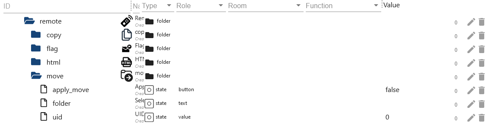

# Blocklys

### Blockly - Change IMAP query

[Summary](#summary)

-   With this you can set these [data points](#data-point-imap0usernameremote).
-   See the [instance setting](#instance-settings-tab---create-imaps) for possible flags.
-   Select IMAP connection or apply to all.
-   Max. 100 emails allowed.

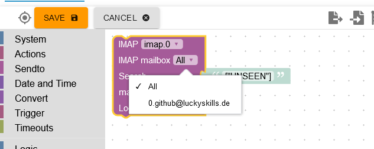
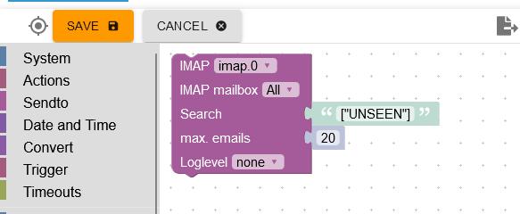

### Blockly - IMAP own query

[Summary](#summary)

-   DANGER! Here comes all the data such. E.g. attachments. This query can push the RAM or CPU to the limit. If an incorrect criterion is created, this can lead to an iobroker crash!!!
-   The data is then delivered as JSON.
-   With log outputs, the log file becomes very large. Therefore delete the log outputs again later.
-   A variable called `result` must be created.
-   Max. 100 emails allowed.
-   [Beispiele](/docs/en/EXAMPLE.md)

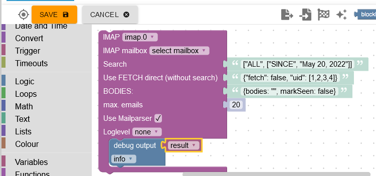

### Blockly - IMAP query with instance settings

[Summary](#summary)

-   Load all data from the IMAP connection and process it yourself. The instance setting is used as the search criterion.
-   DANGER! Higher RAM consumption
-   The data is then delivered as JSON.
-   With log outputs, the log file becomes very large. Therefore delete the log outputs again later.
-   A variable called `result` must be created.
-   [Example](/docs/en/EXAMPLE.md)


### Blockly - Set IMAP flags

[Summary](#summary)

-   Set a flag setFlag=set, addFlag=add or delFlag=delete for an email.
-   Select mailbox.
-   Select setFlag=set, addFlag=add or delFlag=delete.
-   select flag.
-   [Possible flags in imap.0.xxx.status](#json-imap0xxxstatus)

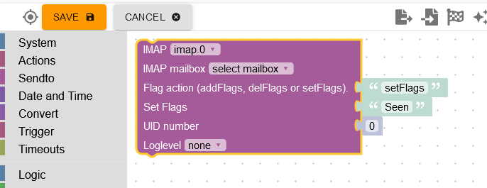

# Array JSON

### Array JSON imap.0.xxx.email.email_xx.attach_json

[Summary](#summary)

```json
[
    {
        "partID": "2",
        "id": "<image001.png@01D9C718.240FAD50>",
        "uid": 86,
        "size": "159762",
        "filename": "image001.png",
        "type": "inline",
        "encoding": "base64"
    },
    {
        "partID": "3",
        "id": "<image002.png@01D9C718.36F8AE30>",
        "uid": 86,
        "size": "1296247",
        "filename": "image002.png",
        "type": "inline",
        "encoding": "base64"
    }
]
```

### Array JSON imap.0.xxx.json

[Summary](#summary)

```json
[
    {
        "id": 1,
        "date": "15.08.2023 15:39:17",
        "from": ["test@luckyskills.de"],
        "from_name": ["Tester"],
        "attach": 0,
        "attach_info": [],
        "to": ["github@luckyskills.de"],
        "to_name": ["Lucky-ESA"],
        "subject": "Test",
        "text": "Am 2023-08-10 12:17, schrieb test@luckyskills.de:\n>>> TEST\n",
        "html": false,
        "textAsHtml": "Am 2023-08-10 12:17, schrieb <a href=\"mailto:test@luckyskills.de\">test@luckyskills.de</a>:<br/>&gt;&gt;&gt; TEST</p>",
        "seqno": 74,
        "uid": 93,
        "size": 1077,
        "flag": "unseen"
    }
]
```

### JSON imap.0.xxx.last_activity_json

[Summary](#summary)

```json
{
    "modseq": "196",
    "flags": ["\\Seen"]
}
```

### JSON imap.0.xxx.quality

[Summary](#summary)

```json
{
    "message": "No Message"
}
```

### Possibilities

```
0: "0x00 - good",
1: "0x01 - general problem",
2: "0x02 - no connection problem",
16: "0x10 - substitute value from controller",
17: "0x11 - general problem by instance",
18: "0x12 - instance not connected",
32: "0x20 - substitute initial value",
64: "0x40 - substitute value from device or instance",
65: "0x41 - general problem by device",
66: "0x42 - device not connected",
68: "0x44 - device reports error",
128: "0x80 - substitute value from sensor",
129: "0x81 - general problem by sensor",
130: "0x82 - sensor not connected",
132: "0x84 - sensor reports error",
```

### JSON imap.0.xxx.status

[Summary](#summary)

```json
{
    "name": "INBOX",
    "flags": ["\\Answered", "\\Flagged", "\\Deleted", "\\Seen", "\\Draft"],
    "readOnly": false,
    "uidvalidity": 1667682367,
    "uidnext": 94,
    "permFlags": ["\\Answered", "\\Flagged", "\\Deleted", "\\Seen", "\\Draft"],
    "keywords": [],
    "newKeywords": true,
    "persistentUIDs": true,
    "nomodseq": false,
    "seq": 0,
    "time": 0,
    "reason": "",
    "user": "github_luckyskills_de",
    "messages": {
        "total": 74,
        "new": 0
    },
    "highestmodseq": "200"
}
```

### Array JSON imap.0.online_history

[Summary](#summary)

```json
[
    {
        "client": "github_luckyskills_de",
        "time": 1692298599784,
        "status": "Online"
    },
    {
        "client": "github_luckyskills_de",
        "time": 1692298232899,
        "status": "Online"
    }
]
```

## Changelog

<!--
    Placeholder for the next version (at the beginning of the line):
    ### **WORK IN PROGRESS**
-->

### **WORK IN PROGRESS**

-   (Lucky-ESA) Fixed setFlag

### 0.1.2 (2024-01-24)

-   (Lucky-ESA) Added missing translate
-   (Lucky-ESA) Updated package
-   (Lucky-ESA) Bug fixes

### 0.1.1 (2023-09-11)

-   (Lucky-ESA) Delete wrong error parse message

### 0.1.0 (2023-09-06)

-   (Lucky-ESA) Added RAM consumption - Instance Settings
-   (Lucky-ESA) Added german documention
-   (Lucky-ESA) Added Mailparser options
-   (Lucky-ESA) Added counter history
-   (Lucky-ESA) Bug fixes

### 0.0.9 (2023-07-26)

-   (Lucky-ESA) Fixed RAM consumption of new emails
-   (Lucky-ESA) Added counter attachments in JSON

### 0.0.8 (2023-07-13)

-   (Lucky-ESA) Fix refresh crash
-   (Lucky-ESA) Added MB threshold

### 0.0.7 (2023-04-25)

-   (Lucky-ESA) Fix correct counter for seen and unseen
-   (Lucky-ESA) Added capabilities
-   (Lucky-ESA) Criteria change without restart
-   (Lucky-ESA) Added outlook.office365.com oauth2 login
-   (Lucky-ESA) Added Connection.js from Module to Adapter
-   (Lucky-ESA) Bug fixes

### 0.0.6 (2023-03-17)

-   (Lucky-ESA) Added trigger move or copy emails
-   (Lucky-ESA) Added JSON for multiple IMAP accounts
-   (Lucky-ESA) Bug fixes

### 0.0.5 (2023-03-15)

-   (Lucky-ESA) Added: Limited reconnected (5 max)
-   (Lucky-ESA) Added: into datapoints
-   (Lucky-ESA) Added: Password entry not possible without an active instance
-   (Lucky-ESA) Added: Added description to readme
-   (Lucky-ESA) Added: Added move or copy
-   (Lucky-ESA) Added: Set flag with datapoints
-   (Lucky-ESA) Fix: debug output without attachments
-   (Lucky-ESA) Fix: wrong json_table
-   (Lucky-ESA) Fix: value null
-   (Lucky-ESA) Change: Reconnected change info level to debug level
-   (Lucky-ESA) Change: correct dp roles
-   (Lucky-ESA) Change: delete attachments (too much RAM usage)

### 0.0.4 (2023-03-03)

-   (Lucky-ESA) Fix json_table

### 0.0.3 (2023-03-03)

-   (Lucky-ESA) Beta release

### 0.0.2 (2023-03-03)

-   (Lucky-ESA) initial release

## License

MIT License

Copyright (c) 2023-2024 Lucky-ESA <github@luckyskills.de>

Permission is hereby granted, free of charge, to any person obtaining a copy
of this software and associated documentation files (the "Software"), to deal
in the Software without restriction, including without limitation the rights
to use, copy, modify, merge, publish, distribute, sublicense, and/or sell
copies of the Software, and to permit persons to whom the Software is
furnished to do so, subject to the following conditions:

The above copyright notice and this permission notice shall be included in all
copies or substantial portions of the Software.

THE SOFTWARE IS PROVIDED "AS IS", WITHOUT WARRANTY OF ANY KIND, EXPRESS OR
IMPLIED, INCLUDING BUT NOT LIMITED TO THE WARRANTIES OF MERCHANTABILITY,
FITNESS FOR A PARTICULAR PURPOSE AND NONINFRINGEMENT. IN NO EVENT SHALL THE
AUTHORS OR COPYRIGHT HOLDERS BE LIABLE FOR ANY CLAIM, DAMAGES OR OTHER
LIABILITY, WHETHER IN AN ACTION OF CONTRACT, TORT OR OTHERWISE, ARISING FROM,
OUT OF OR IN CONNECTION WITH THE SOFTWARE OR THE USE OR OTHER DEALINGS IN THE
SOFTWARE.