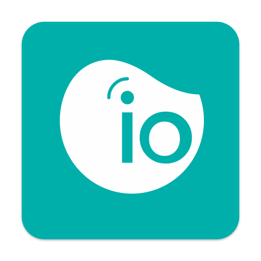

# ioBroker.iopooleco

**Tests:** 

## iopooleco adapter for ioBroker
Connect to your pool meter ECO from iopool (https://iopool.com) and receive ORP, PH and temperature via ioBroker every 15 minutes.

Just install this adapter and enter your API key from iopool App.
The API key can be generated in your iopool App under More/Settings/API Key. 

## Changelog
### 0.5.1 (2023-10-25)
improve scheduler calculation
<!--
	Placeholder for the next version (at the beginning of the line):
	### **WORK IN PROGRESS**
-->

### 0.5.0 (2023-10-25)
update readme & secure API key & change scheduler & bugfixes

### 0.4.1 (2023-10-19)
change repo URL to https

### 0.4.0 (2023-10-16)
some bugfixes & added offsets for temperature, ORP and pH if meter is inaccurate

### 0.3.0 (2023-10-13)
add error handling for invalid measurements

### 0.2.3 (2023-10-13)
minor changes to error handling

### 0.2.2 (2023-10-13)
minor changes to readme

### 0.2.1 (2023-10-13)
minor changes to readme

### 0.2.0 (2023-10-12)
* (Mule) initial release

### 0.0.1 (2023-10-12)
* (Mule) initial test release

## License
MIT License

Copyright (c) 2023 Mule

Permission is hereby granted, free of charge, to any person obtaining a copy
of this software and associated documentation files (the "Software"), to deal
in the Software without restriction, including without limitation the rights
to use, copy, modify, merge, publish, distribute, sublicense, and/or sell
copies of the Software, and to permit persons to whom the Software is
furnished to do so, subject to the following conditions:

The above copyright notice and this permission notice shall be included in all
copies or substantial portions of the Software.

THE SOFTWARE IS PROVIDED "AS IS", WITHOUT WARRANTY OF ANY KIND, EXPRESS OR
IMPLIED, INCLUDING BUT NOT LIMITED TO THE WARRANTIES OF MERCHANTABILITY,
FITNESS FOR A PARTICULAR PURPOSE AND NONINFRINGEMENT. IN NO EVENT SHALL THE
AUTHORS OR COPYRIGHT HOLDERS BE LIABLE FOR ANY CLAIM, DAMAGES OR OTHER
LIABILITY, WHETHER IN AN ACTION OF CONTRACT, TORT OR OTHERWISE, ARISING FROM,
OUT OF OR IN CONNECTION WITH THE SOFTWARE OR THE USE OR OTHER DEALINGS IN THE
SOFTWARE.