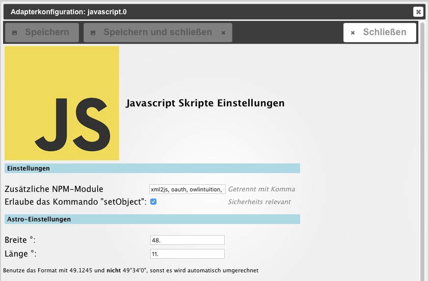
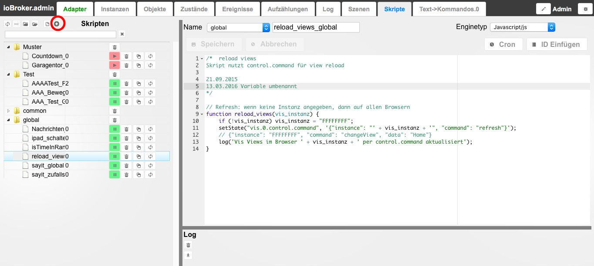
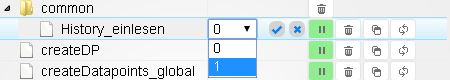

**Note: The English version currently contains much more information, and we recommend reading it.**

The JavaScript adapter allows you to conveniently create, edit, and manage scripts.

## configuration

[Here's more about it](https://github.com/ioBroker/ioBroker/wiki/ioBroker-Adapter-javascript#konfiguration)

 The actual configuration consists of entering the additional npm modules to be loaded (separated by commas), as well as the geo-coordinates to be used for various calculations. To obtain the coordinates, you can, for example, zoom in quite far on _Google Maps_ and click at the desired location. The coordinates will then be displayed. After saving, the adapter must be activated using the red play button.

---

## operation

During installation, an additional _"Scripts"_ tab appears in the _admin_ interface. A new folder is created here by clicking the (+) icon in the toolbar (red circle). A new script is created using the "blank sheet" icon to the left of it. A window will open asking for the name and location within the folder structure.

### Folder and file list

The folder structure can be configured as desired. The storage location has no effect on the script's functionality. In addition to the tree structure, there is a list view. A search field makes it easy to find scripts again. To run a script, it must be activated by clicking the red _Play_ button on the left side of the folder structure. To stop it, press the green _Pause_ button. A new object is created for each script. It bears the script name with the suffix "script".`_enabled` and is located in the folder`javascript.Instanz.ScriptEnabled` The object shows with (`true/false` The status indicates whether the script is running. This status can also be set to enable/disable the script. Scripts stored in the _global_ folder are global scripts. These are internally copied before every other script, meaning they are executed first. This allows global functions to be applied to multiple scripts. Variables in global scripts can be used in other scripts. However, be aware that each script has its own variable space. Therefore, variables in global scripts cannot be used to exchange values between scripts. For this, objects (states) must be used.

### editor

After creating the script, the _JavaScript_ editor will open on the right. Some example scripts can be found [here](http://www.iobroker.net/docu/?page_id=2786\&lang=de) .

#### name

If a name has been assigned previously, it will be displayed here and can be changed.

#### Storage location

This dropdown menu displays all created folders. Currently, they are sorted in chronological order of their creation.

#### Engine type

Here you can choose whether to work with the _javascript_ or the _coffeescript_ engine.

#### log

The log window, which displays all logs related to the selected script, is located in the lower right corner. The logs are displayed after saving and restarting the script.

---

## Tips

### Backup

To be able to restore scripts if necessary, backup via _copy & paste_ is recommended.

### Test instance

It has proven effective to create a separate JavaScript instance for testing new scripts and to run the script in that instance. The desired instance can be selected from a dropdown menu next to the script name. If a critical error occurs in the script, only this additional test instance will terminate, not the production instance.

