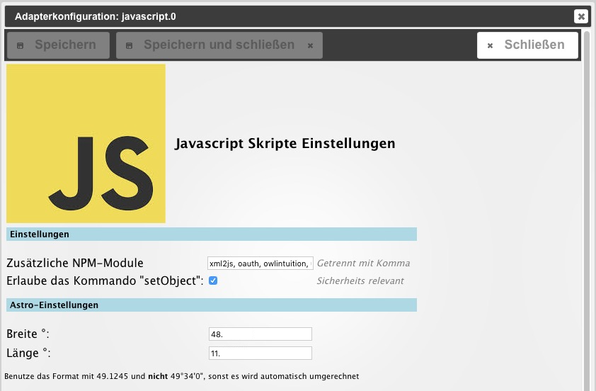

**Note: Currently the English version contains much more information and we recommend reading it**

The JavaScript adapter is used to conveniently create, edit and manage scripts.

## Configuration
[Here is more about it](https://github.com/ioBroker/ioBroker/wiki/ioBroker-Adapter-javascript#konfiguration)

 The actual configuration consists of entering additional npm modules to be loaded (separated by commas), as well as the geo-coordinates to be used for various calculations. To get the coordinates, you can, for example, zoom in on _google maps_ quite far and click on the desired location. The coordinates are then displayed. After saving, the adapter must be activated using the red play button.

* * *

## Service
During installation, another tab _Scripts_ is shown in the _Admin_ interface. A new folder is created here by clicking on the (+) in the toolbar (red circle). A new script is created using the "blank sheet" icon to the left of it. A window opens and asks for the name and storage location in the folder structure.

### Folder and file list
The folder structure can be created as desired. The storage location has no effect on the functionality of the script. In addition to the tree structure, there is a list view. A search field makes it easier to find scripts. For a script to run, it must be activated in the folder structure on the left by clicking on the red _Play_ button. To stop, press the green _Pause_ button. A new object is created for each script. It has the script name with the addition `_enabled` and is located in the folder `javascript.Instanz.ScriptEnabled`. The object shows with (`true/false`) whether the script is running. The state can also be set to switch the script on/off. Scripts saved in the _global_ folder are global scripts. These are copied internally before any other script, i.e. processed first. This means that global functions can be applied to multiple scripts. Variables in global scripts can be used in other scripts. But be careful: every script has its own variable space. You cannot use variables in global scripts to exchange values between scripts. Objects (states) must be used for this.

### Editor
After creation, the editor for _Javascript_ opens on the right. Some example scripts can be found [here](http://www.iobroker.net/docu/?page_id=2786&lang=de).

#### Surname
If you have previously given a name, it will be displayed here and can be changed.

#### Storage location
This dropdown displays all created folders. They are currently sorted in the chronological order in which they were created.

#### Engine type
Here you can select whether you want to work with the _javascript_ or the _coffeescript_ engine.

####Logs
At the bottom right is the log window for the output of all logs relating to the selected script. The logs are displayed after saving/restarting the script.

* * *

## Tips
### Backup
In order to be able to restore scripts in case of doubt, it is recommended to back them up using _copy & paste_.

### Test instance
It has proven useful to create another JavaScript instance and start the script in this instance when testing new scripts.
The desired instance can be set using the dropdown menu behind the script name.
If there is a serious error in the script, only this additional test instance will be terminated, not the production instance.

