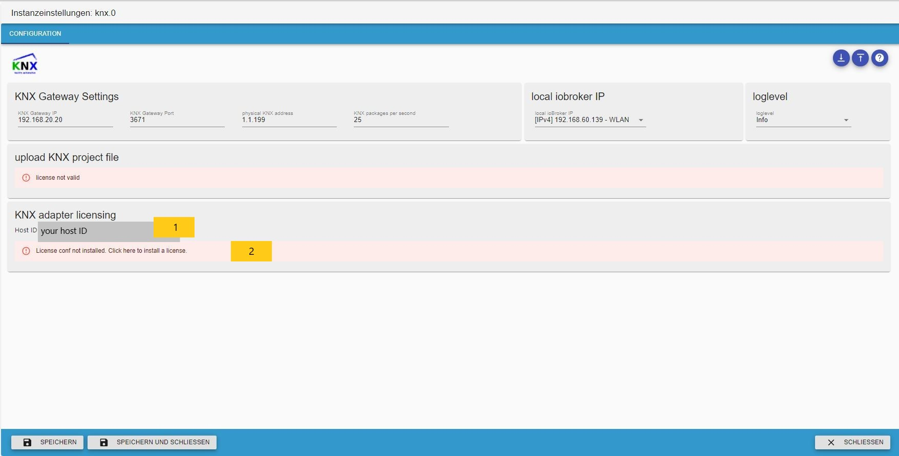

# ioBroker.knx

#### Table of content

* [Description](#description)
* [Requirements](#requirements)
* [Features](#features)
* [Installation](#installation)
* [Adapter configuration](#adapter-configuration)
    * [Install the License](#install-the-license)
    * [Configuration Interface](#configuration-interface)
    * [Objects](#objects)
    * [Usage](#usage)
    * [Data point Types (DPT)](#data-point-types-dpt)
    * [How the import works](#how-the-import-works)
    * [Avoidance of problems](#avoidance-of-problems)
* [GA-Tool](#ga-tool)
    * [Direct Link non-KNX state to KNX vice-verse](#direct-link-non-knx-state-to-knx-vice-verse)
* [Planned features](#planned-features)
* [Changelog](#changelog)

## Description

en: This adapter allows importing of knxproj Files from ETS. It generates the translation between KNX- group addresses and ioBroker and puts the devices into rooms (esp. for MobileUI).

ru: [Установка и базовая настройка адаптера](docs/ru/README.md)

It connects to standard KNX/LAN Gateways.

**Attention: with changing to KNX-Adapter Version 2.x the licensing has been changed. You can get a new license from [https://iobroker.net](https://iobroker.net/)**

**You also should update iobroker js-controller AND admin to the latest version.**

Before beginning: Every DPT of com.Objects should be set in your ETS project. Every device should be sorted into your facility structure.

## Requirements

* node Version >= 14.15.4
* admin Version >= 5.2.0
* js-controller Version >=3.3.20

Without this requirements, the adapter is not installable or will work not properly.

## License requirements

For <500 datapoints there is no need of registration or adding a license key. If you have more then 500 datapoints you need a license. You can choose  
between yearly and permanent licence.

To use this adapter in ioBroker you need to accept the source code license of the adapter. The source code of this adapter is available under the CC-NC-BY license.

Additionally you need a license to use the adapter. The license editions are available on [https://iobroker.net/www/pricing](https://iobroker.net/www/pricing)

## Features

* importing `knxproj` file
* generating ETS-like object structure
* finding and combining act-channel and state-channel (heuristic)
* updating all states on start
* no cloud or internet needed
* emitting a READ to the KNX-Bus, while writing on state-object
* edit and modify GA objects with GA-Tools
* edit and modify state-act relations with GA-Tools
* NEW: allow non-KNX State direct link (vice-verse)
* NEW: adapter responses to GroupValueRead to a directLink connected object
* NEW: import of passwort protected project files (thanks to aKzenT)

###Installation
This adapter is only installable with npm. Installation via github does **not** work.

##Adapter configuration
After installing this adapter, open the adapter configuration.

###Install the License
The first step is to apply the license. If you have not installed a license, then 500 Datapoints are applied.

* (1) shows your System ID, you need this to get a license
* (2) click here to apply your license

If you already have created a new license under [https://iobroker.net](https://iobroker.net/), then you can paste it in (2), OR you can
aquire it directly online by clicking on (1)

If you have clicked on (1) enter your iobroker.net account login.

If your data have been correct, you will see all your licenses you got. Choose the one you want to use.

If this was succesfull, save it.

Thats all. Click on the button to save on the bottom of this page.

### Configuration Interface

1. KNX-Gateway IP: IPv4 of KNX-LAN Gateway.
2. KNX-Gateway port: Default is Port 3671.
3. physical address: Physical address of iobroker knx instance **! important: this is not the phys. address of the LAN Gateway !** and May not end in 0
4. KNX packages per second: this limits the package rate. If KNX Lan Gateway reconnects to much or is temporarly not accessable, then reduce this rate.
5. local iobroker IP: select the IP / Interface on which the adapter will be bound
6. loglevel: normaly is level "Info", for debugging increase the level.
7. only import new Datapoints: this is enabled by default. In case of disabling new GA's will be generatet AND existing GA's will be recreated.
8. button upload file: drag'n drop is available here or on click the filechooser dialog. Here you can upload your ETS Export in `knxproj` format.
    After successful import a dialog shows the number of imported objects. Now press "save & close" and the adapter should start.
    While starting the adapter reads all group addresses with read-Flag and write-Flag. This might take a while and can produce a high load on your KNX-bus. But the values in your vis are updated after start.
    Uploading a password secured file is not yet available.
9. Host-ID: this is a special ID of iobroker host. This ID is neccessary for generating and validating the license
10. GA-Tools: toolbox for fast changing GA's

### Objects
Here is under knx.0 the group address tree like in your ETS project. For modifying the properties, use GA-Tool.

### Usage
If the adapter starts successfully, your data points will be available for everything you like to do.

### Data point Types (DPT)
All DPTs according to "System Specifications, Interworking, Datapointtypes" from KNX Association are available. That means there are 2 types of information you can get:
1) a Value or a String
2) comma-separated values or an array of values (for the moment I don't know what's the better way to handle)

For example a DPT5.001 is encoded as unsigned Integer with 8-Bit. This gives a single Value. The DPT3.007 (Control Dimming) is encoded as 1Bit(Boolean)+3Bit(unsigned Int).
This results e.g. in a value like "0,5", where "0" means "decrease" and "5" means number of intervals.

### How the import works

1. reading of all communicationobjectreferences (COR):
    combining of groupadressreference ID'd with DPT of corresponding COR (if exists).
2. generation of groupaddress structure(GAS):
    generating the GAS based on GAR IDs and setting DPT (if not done yet)
3. finding state an act addresses:
    in ets-exports are no informations about state and act addresses.The adapter parses all GA's of "status" or "state". If there are 2 GA's with a similarity more than 90%,
    then one address will be act and the other one the state. There is also a check if the DPT's are similar. Thats why its not easy to find a peer, if GA naming is
    not consistent.
4. Flag check in deviceconfiguration:
   the flags are handled as follows:

    | KNX   |  |  | iobroker |  |  |
    |-------|-----------|------------|----------|----------|-------------------------------------------------|
    | Read  |  Write    | Transmit  | Read    | Write   | Explanation                                       |
    |   -   |    -      |    -      |   -     |    -    | the value will be updated by GroupValueRead|
    |   x   |    -      |    -      |   x     |    x    | sending any value on this state trigger a GroupValueRead|
    |   -   |    x      |    -      |   -     |    x    | write the value to KNX with GroupValueWrite|
    |   -   |    -      |    x      |   x     |    -    | the state value will be updated by GroupValueResponse |
    |   x   |    -      |    x      |   x     |    x    | sending any value on this state trigger a GroupValueRead|

6. Creation of datapoint peers (DPP):
    A DPP will be created if GA, GAR and DPT are valid. This are the DPP the adapter is working with.
    If DPT is missing in a GA, because it couldn't be found, then the DPP will not be created. It can
    be done with GA-Tool.
7. at adapter start:
    all GA's marked with "Read" Flag are checked at start. This can affect a higher bus traffic. In the end
    are all states up to date.

###Avoidance of problems

* clean ETS programming and more important clean ETS programming and most important clean ETS programming
* Assign the DPTs!!
* uniform labeling of the GA names (e.B "EG Wohnen Decke Licht schalten" and "EG Wohnen Decke Licht schalten status" )
* Avoidance of special characters ",./;&%$§[]" (may cause problems with the generation of gas)
* Check if the KNX/LAN GW is reachable. If it is not, the adapter tries to connect continuously.
* Correctly select physical address ( important when using line couplers ). !!! ATTENTION: the physical address entered here is NOT the address of the LAN Gateway and must not end in 0 !!!
* The port of the LAN interface is usually 3671
* Due to the possibility of status query, one thing must be noted: It must be ensured that no more than 40 requests per second are generated by the ioBroker, because these can then be physically generated
  can no longer be passed on to the gateway by the adapter.

## GA-Tool
The GA-Tool makes it easy to change properties of GA's.

1. shows the GA tree and selected GA
2. in the property section the name of selected GA
3. set iobroker flags
4. set GA DPT
5. recognized act GA
6. recognized state GA

1. show the state-act relation
2. if relation exists then it can removed

If no relation exist, then can be created a new one by clicking (2) for selected GA (1).
In the dialog (3) can the peer selected

If there are more GA's to change properties, use multiselect. This feature works only for GA's with no relation.

1. selected GA's
2. properties to change
3. there is no change possible

### Direct Link non-KNX state to KNX vice-verse
Since Adapter Version 2.0.6 it is possible to link a non KNX ioBroker state directly to a GA. This
can be used to apply time, date, any states or infos to KNX. (a small hint: you can link any of your
IOT components directly to a GA in KNX (f.e. link a homematic button to a KNX GA or link a KNX buttonsensor to  
your sonosplayer)). The states can be read with a GroupValueRead and if the states changes it will be
automaticly updated on KNX. Also if you change on KNX it will update the linked non KNX iot device.

1. select the GA to connect to
2. show the selected GA
3. this GA must have **write** attribute
4. choose a valid datapointtype (if they don't match, it will not work)
5. it is not allowed to have a act-state relation
6. button to select a non KNX object to link with

1. select the non-KNX object you want to link
2. hit ok, if you're done

Now is KNX-GA **(1)** directly linked with non-KNX iobroker **(2)**. With **(3)** you can delete this
relation.

## Planned features

* esf-import
* GA-Mon bus monitoring tool

<!--
	Placeholder for the next version (at the beginning of the line):
	### __WORK IN PROGRESS__
-->

## Changelog
### 2.0.21 (17.06.2023)
* fixed license handling

### 2.0.20 (16.06.2023)
* fixed license handling with js-controller Version > 5

### 2.0.19 (29.05.2023)
* added ETS V6.1.0 import
* required node version >= 16.13.1

### 2.0.18 (08.04.2023)
* fixed send-delay
* small changes

### 2.0.17 (14.10.2022)
* added ETSv6.0.6 import
* major changes in Adapter Config UI
* fixed change of port settings for LAN-GW

### 2.0.16 (04.09.2022)
* added ETSv6.0.5 import

### 2.0.15 (02.06.2022)
* fixed import error with extrem large KNX catalogue files
* fixed unrecognized connection breaks

### 2.0.14 (08.04.2022)
* added ETSv6.0.4 (override 6.0.3)
* small bugfixes

### 2.0.13 (12.03.2022)
* added ETSv5.7.7 import
* fixed "unknown value" bug
* some other small fixes

### 2.0.12 (25.02.2022)
* fixed handling of undefined DP
* updated datapointtypes
* fix warning with incompatible DPT in future
* the biggest issue of all: I get shocked because of the war in Ukraine. My thoughts are with the people of Ukraine, I am infinitely sorry for what is happening to them and their country. It is an inhuman shame.
* can't fix it, but I appeal to everyone: Be neighbors and not enemies. Respect the other and do not fight yourselves.

### 2.0.11
* fixed password handling for projects from upgraded ETS

### 2.0.10
* import of ETS6.0.2 projects **ETS6.0.1 not possible**
* bugfixes

### 2.0.9
* import password protected project files
* bug fixes

### 2.0.8
* fixed bug with unackn write
* fixed bug in linkedState

### 2.0.7
* fixed bug with unable to write on KNX

### 2.0.6
* fixed problem on ETSv6 import
* many small bugfixes
* implemented GA-Tools directLink feature

### 2.0.5

* fixed problem on ETSv4 import
* corrected some messages
* corrected DPT14.x min and max range

### 2.0.4

* fixed DPT9.xxx calculation
* implemented date-and-time DPT19.00x
* fixed confusing "no license error"
* small bugfixes

### 2.0.3 (2021-12-04)

* fixed counting 1st Datapoint
* automaticly remove old V1 license", preventing confusion after upgrade from V1 to V2

### 2.0.1

* fixed problem with license acceptance

### 2.0.0 (2021-11-15) **Major release**

* Breaking change! => new license is neccessary V1 Licenses will not work => V1 business Licenses can changed to V2
* complete refactoring of knx-admin
* added Tool for handling GA in knx-admin
* fixed many bugs (in knx-stack, on importing ETS Projects, reconnect and timeouts)
* added new datapoint types
* added import till ETS V6
* changed license management

### 1.0.46 (2021-03-23)

* New admin GUI

### 1.0.45 (2021_03_22)

* import of ETS v5.7.5 projects

### 1.0.44 (2021_01_22)

* fixed act and state handling
* added some new datapoint types
* fix facility and room recognition and device allocation

### 1.0.42 (2020_09_03)

* Fixed problem with missing index_m.html

### 1.0.41

* fixed bug on GroupValue_Response event
* corrected connection to Gira GW

### 1.0.40

* fixed some import errors for ETS 5.7.x
* fixed bug on GroupValue_Response event

### 1.0.39

* fixed import error

### 1.0.38

* fixed some bugs on import
* show warning if import-file ist password protected

### 1.0.37 (2010-01-31)

* update for ETS 5.7.3 import

### 1.0.36 (2019-10-16)

* some bugs fixed

### 1.0.35 (2019-09-15)

* fixed permanent reconnects, if no traffic on knx-bus

### 1.0.34 (2019-09-15)

* changes on importer for detecting project-id

### 1.0.33 (2019-09-12)

* fixed bug while writing to bus
* added units to states
* fixed "read/write of undefined" error

### 1.0.32 (2019-09-03)

* updated importer for ETS V5.7.2, some changes in KNX-stack state-machine

### 1.0.31

* some fixes on ETS5.7.2 importer
* small changes in knx-stack statemachine
* added (again) phys address to admin config dialog
* fixed bug in deviceTree generation

### 1.0.30

* new Importer for ETS5.7.2 knxproj files
* extended accepted Data point types
* new adapter configuration menu
* implemented a switch for the user to decide to use "true" and "false" or "0" or "1" for binary values
* fixed bug in GroupValue_Read
* implemented a selector for local network interface for KNX to Gateway communication
* extended State Object for later features
* fixed some small other bugs

### 1.0.20

* fixed bug in handling KNX-data packages, which occurs periodical reconnects
* fixed bug in KNX-project file upload procedure

### 1.0.19

* reverted to true/false handling for DPT1.x

### 1.0.18

* fixed upload issue with ETS5.6.x project files
* switched values for "boolean" from 1 and 0 to true false 
* fixed recognition of role set for DPT1.x to switch
* fixed DPT16.xxx writing to KNX-Bus with values < 14Byte

### 1.0.17 (2018-08-16)

* Better state processing
* Add configurable package rate
* corrected Bug in "import only new objects"

### 1.0.15 (2018-07-18)

* change ChID on reconnect
* on Startup read wait for response of State channel or timeout

### 1.0.13 (2018-07-04)

* elimination of special signs while importing
* small bug-fixes

### 1.0.12 (2018-06-19)

* reduced and sorted log output
* small bug-fixes
* NEW Feature: request State/Val of stateObject from KNX-Bus

### 1.0.11 (2018-05-27)

* fixed DPT1 correcting value problem
* fixed reconnect problem
* other small optimizations and fixes

### 1.0.10 (2018-05-04)

* closing local port in case of undefined connection state
* added advanced debug-level via adapter-config
* many fixes

### 1.0.9 (2018-04-29)

* changed to state-wise processing
* fixed "disconnect-request"
* changed connection handling with knxd
* many small fixes

### 1.0.8 (2018-04-04)

* modified package queue
* fixed ACK if sending to KNX-Bus
* many small fixes

### 1.0.7 (2018-03-16)

* fixed Adapter-lock while uploading projects

### 1.0.6 (2018-03-11)

* fixed connection problem
* corrected package counter

### 1.0.5 (2018-03-01)

* fixed empty objects, related to DPT1 (error message \[object Object\] unknown Input value)
* fixed path variable
* fixed bug with GA's containing a "/" in the name (on proj-import)
* start implementing crosswise property update on corresponding DPT (on proj-import)

### 1.0.4 (2018-02-27)

* schema update for room enumeration coming up with ETS 5.6

### 1.0.2 (2018-02-27)

* kleine Fehler beseitigt

### 1.0.1 (2018-02-26)

* fixed certificate error

### 1.0.0 (2018-02-25)

* substitution of used KNX-stack with own from scratch build stack
* implemented full scale of DPT according to "System Specifications, Interworking, Datapointtypes" from KNX Association
* hardening connection handling for tunneling connections
* upgrade Adapter-configuration Interface to be ready with Admin3
* removed "Delay Slider" because of the new knx-stack
* many other small changes
* fixed post-comma values to scale-value of DPT
* implemented "add" mode for knxproject upload (existing Objects stay as they are, only new Objects where added)

### 0.8.6 (2017-06-17)

* some small bug-fixes
* insert slider to set a sendDelay for slow KNX/LAN Gateways to prevent connection loss

### 0.8.5 (2017-06-05)

* project loader rebuild, dpt13-fix

### 0.8.3 (2017-04-24)

* added act channel update of corresponding state
* fix bug in state-vis update
* optimized knxproj upload

### 0.8.2 (2017-02-26)

* implemented device-config parsing from knxproj
* better choice of state/val of DP objects

### 0.8.1 (2017-02-06)

* fixed DPT1 switch problem

### 0.8.0 (2017-02-xx) comming soon

### 0.7.3 (2016-12-22)

* (chefkoch009) more DPT's are supported
* faster Startup
* implemented generation of room list with device dependencies

### 0.7.2 (2016-11-20)

* (chefkoch009) added necessary dependencies

### 0.7.1 (2016-11-19)

* (chefkoch009) Support standard KNX/LAN Gateways.

### 0.7.0 (2016-10-13)

* (chefkoch009) Support of project export

### 0.6.0 (2016-07-20)

* (chefkoch009) redesign

### 0.5.0

*  (vegetto) include vis widget

#### 0.4.0

* (bluefox) fix errors with grunt

#### 0.2.0

* (bluefox) initial release

## Exceptions and errors

**This adapter uses Sentry libraries to automatically report exceptions and code errors to the developers.**  
For more details and for information how to disable the error reporting see [Sentry-Plugin Documentation](https://github.com/ioBroker/plugin-sentry#plugin-sentry)!  
Sentry reporting is used starting with js-controller 3.0.

The developer is not able to get any further special informations about the system/config/user/enviroment. In case no license is found the
adapter version and host id is also reported.

## Many thanks for support and help
* bluefox
* foxriver76

## License
The CC-NC-BY License (CC-NC-BY)

Copyright (c) 2016-2023 K.Ringmann <info@punktnetzwerk.net>

THE WORK IS PROVIDED UNDER THE TERMS OF THIS CREATIVE
COMMONS PUBLIC LICENSE ("CCPL" OR "LICENSE"). THE WORK IS PROTECTED BY
COPYRIGHT AND/OR OTHER APPLICABLE LAW. ANY USE OF THE WORK OTHER THAN AS
AUTHORIZED UNDER THIS LICENSE OR COPYRIGHT LAW IS PROHIBITED.

BY EXERCISING ANY RIGHTS TO THE WORK PROVIDED HERE, YOU ACCEPT AND AGREE
TO BE BOUND BY THE TERMS OF THIS LICENSE. TO THE EXTENT THIS LICENSE MAY
BE CONSIDERED TO BE A CONTRACT, THE LICENSOR GRANTS YOU THE RIGHTS
CONTAINED HERE IN CONSIDERATION OF YOUR ACCEPTANCE OF SUCH TERMS AND
CONDITIONS.

Read full license text in [LICENSE](LICENSE)
