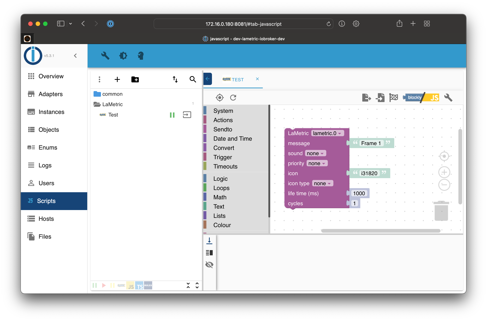

# ioBroker.lametric

## Blockly Examples

You can use a simple string as message, which will be shown as a single frame

To show multiple frames, you can also provide an array as message

If you want to use chart frames, you have to specify an array of numbers as a frame

