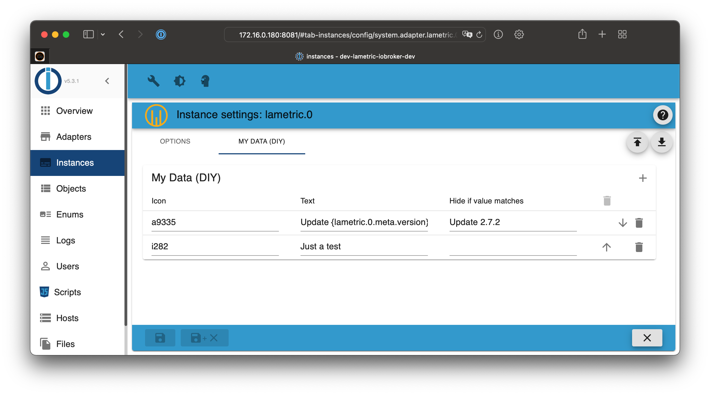

# ioBroker.lametric

*LaMetric* offers an app (on the integrated app market) to poll custom data. This app is called [My Data DIY](https://apps.lametric.com/apps/my_data__diy_/8942). This adapter creates a new state in the required format.

Since version 2.0.0 of this app, data can be transferred in different ways to the device.

- Push: the adapter sends the required information on its own to the device (when data has changed) - **default option**
- Poll: the information are requested by the *LaMetric Time* periodically (configurable)

Both methods are explained in this document.

## My Data (DIY) - Push *(Adapter version >= 3.0.0 required)* (recommended)

- Requires *My Data DIY* App >= 2.0.0
- Requires Firmware >=2.3.7 (>= 3.0.16)

## My Data (DIY) - Poll *(Adapter version >= 1.1.0 required)*

Different adapters can be used to transfer the data to the *LaMetric Time*:

- Web Adapter (recommended) *(Adapter version >= 2.1.0 required)*
- REST API Adapter
- Simple API Adapter

### Web Adapter (recommended)

```ioBroker LaMetric Adapter -> State with frame information <- ioBroker Web Adapter <- My Data DIY App <- LaMetric```

1. Install the [Web ioBroker Adapter](https://github.com/ioBroker/ioBroker.web)
2. Create a new instance of the web adapter (e.g. ``web.0``)
3. Configure a port for the new web instance (e.g. ``8082``)
4. Install the *My Data DIY* App on your *LaMetric Time* (use Market)
5. Open the *My Data (DIY)* app settings and configure the web url (see below)
6. Go to the adapter configuration and configure the frames with your custom information (see next chapter)
7. Don't forget to select the previously configured web instance!

HTTP Poll Config:

```
URL: http://172.16.0.219:8082/lametric.0/
```

### REST API Adapter

```ioBroker LaMetric Adapter -> State with frame information <- ioBroker REST API Adapter <- My Data DIY App <- LaMetric```

#### Configuration (with authentication)

1. Install the [REST API ioBroker Adapter](https://github.com/ioBroker/ioBroker.rest-api)
2. Create a new ioBroker user called ``lametric`` with a custom password (e.g. ``HhX7dZl3Fe``)
3. Add the ``lametric`` user to the default group ``users``
4. Install the *My Data DIY* App on your *LaMetric Time* (use Market)
5. Open the *My Data (DIY)* app settings and configure the rest api url (see below)
6. Go to the adapter configuration and configure the frames with your custom information (see next chapter)

HTTP Poll Config:

```
URL: http://172.16.0.219:8093/v1/state/lametric.0.mydatadiy.obj/plain?extraPlain=true
Username: lametric
Password: HhX7dZl3Fe
```

**Replace example IP, port, user and password!**

### Simple API Adapter

```ioBroker LaMetric Adapter -> State with frame information <- ioBroker Simple API Adapter <- My Data DIY App <- LaMetric```

#### Configuration (with authentication)

1. Install the [Simple API ioBroker Adapter](https://github.com/ioBroker/ioBroker.simple-api)
2. Create a new ioBroker user called ``lametric`` with a custom password (e.g. ``HhX7dZl3Fe``)
3. Add the ``lametric`` user to the default group ``users``
4. Install the *My Data DIY* App on your *LaMetric Time* (use Market)
5. Open the *My Data (DIY)* app settings and configure the simple api url (see below)
6. Go to the adapter configuration and configure the frames with your custom information (see next chapter)

HTTP Poll Config:

```
URL: http://172.16.0.219:8087/getPlainValue/lametric.0.mydatadiy.obj/?json&user=lametric&pass=HhX7dZl3Fe
```

**Important: use json flag of SimpleAPI Adapter (available since version 2.6.2)**

**Replace example IP, port, user and password in the URL!**

#### Configuration (without authentication)

1. Install the [Simple API ioBroker Adapter](https://github.com/ioBroker/ioBroker.simple-api)
2. Install the *My Data DIY* App on your LaMetric Time (use Market)
3. Open the *My Data (DIY)* app settings and configure the simple api url (see below)
4. Go to the adapter configuration and configure the frames with your custom information (see next chapter)

HTTP Poll Config:

```
URL: http://172.16.0.219:8087/getPlainValue/lametric.0.mydatadiy.obj/?json
```

**Important: use json flag of SimpleAPI Adapter (available since version 2.6.2)**

**Replace example IP (and port) in the URL!**

### Frame Configuration

- Use the plus icon to add as many frames as you want
- Icon: Choose an icon from the [official website](https://developer.lametric.com/icons) and put the ID in the configuration field. **Important: Add an i (for static icons) or an a (for animated icons) as a prefix for that ID. (Example: `i3389`)**
- Text: Just type the text information for the frame. You can use states in curly braces. These information will be replaced with the corresponding value of the state. (Example: `{youtube.0.channels.HausAutomatisierungCom.statistics.subscriberCount} Subscribers`)
- Duration: Specifies how long the frame should be displayed (default = 5 seconds)

Example configuration of some frames:



### My Data DIY app configuration

Since version 2.0.0 of the *My Data DIY* app a lot of options have been added to the configuration.

- Type: "HTTP Poll"
- HTTP Poll Config
    - URL: *see above (depends on method)*
    - Poll Interval: 15 Sek.
    - Username: *see above (depends on method)*
    - Passwort: *see above (depends on method)*
- Data Format: Predefined (LaMetric Format)

