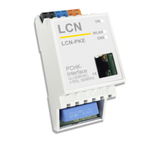
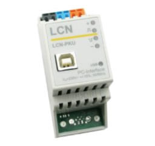
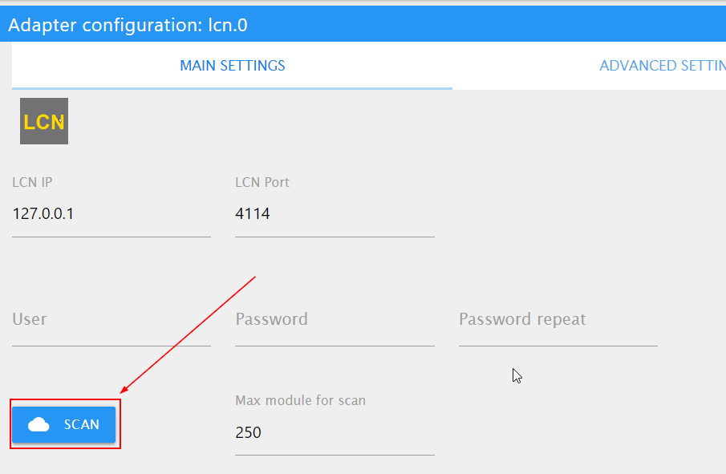

# ioBroker.lcn

[](https://www.npmjs.com/package/iobroker.lcn)
[](https://www.npmjs.com/package/iobroker.lcn)

[](https://nodei.co/npm/iobroker.lcn/)

This adapter allows to connect Local Control Network [LCN](https://www.lcn.eu/) to ioBroker.

## Supported Gateways
- LCN-PKE



- LCN-PKU with LCN-PCHK



**Don't forget that `ioBroker.lcn` will block one LCN Connection License.**

The configuration and modules will be automatically detected by scan, that must be triggered manually from the configuration dialog and can be repeated any time again.

## Types
The following read and write groups are supported:
- Analog values (output/input)
- Relays (output)
- Sensors (input)
- LEDs (output / input)
- Variables (input)

## Variables
To apply the valid convert functions to variables, the variables must have the valid roles. The following roles are supported:

- **value.temperature** - temperature in celsius
- **value.brightness** - Lux (I- input) in lux
- **value.speed.wind** - wind speed in m/s
- **value.voltage** - voltage in Volt
- **value.current** - current in Ampere
- **value.sun.azimuth** - sun azimuth
- **value.sun.elevation** - sun elevation

## Display
For every device you can activate if it has display or not.

## Regulator (Regler)
For every device you can activate if it has regulators or not.

## Settings
- Reconnect interval(sec) - how often the adapter tries to connect. Default every 30 seconds. 
- Connect timeout(ms) - how long adapter waits for connection response inclusive authentication. Default 6 seconds. 
- Scan response timeout(ms) - how long adapter waits for answers by scan of modules.
- Response timeout(ms) - timeout for control commands
- Ping Interval(sec) - how often adapter sends ping requests 
- Ping response timeout(ms) - timeout for ping requests
- IN/OUT Relays are the same - if the "out" and "in" relays are the same thing or if these relays are different ones. 
```
// =====================  Same relays =============================
//                                    +-------+
// ----------------- OUT -----------> |       |
//                                    | Relay |
// <----------------- IN ------------ |       |
//                                    +-------+
// 
// 
// ======================  Different relays =======================
//                                    +-------+
//                                    |       |
// ----------------- OUT -----------> | Relay |
//                                    |       |
//                                    +-------+
// 
//                                    +--------+
//                                    | Sensor |
// <----------------- IN ------------ |   or   |
//                                    | Relay  |
//                                    +--------+
```

## How to use
After the first start, the devices must be scanned. It can be done in the configuration dialog with scan button



## ToDO
- Configuration dialog to define type of variables.

<!--
	Placeholder for the next version (at the beginning of the line):
	### **WORK IN PROGRESS**
-->
## Changelog
### 3.0.1 (2025-03-24)
* (bluefox) License was changed to MIT. The adapter is now free of charge.

### 2.0.3 (2024-09-04)
* (bluefox) Added translations

### 2.0.2 (2024-09-03)
* (bluefox) Corrected checking of licenses with license manager

### 2.0.1 (2024-08-07)
* (bluefox) Disable possibility to install via git

### 2.0.0 (2024-08-06)
* (bluefox) Made adapter compatible with js-controller 6
* (bluefox) A minimum supported node.js version is 18

### 1.1.8 (2023-11-13)
* (bluefox) Added SUM inputs

### 1.1.7 (2023-11-06)
* (bluefox) Corrected setting of undefined values

### 1.1.1 (2022-10-19)
* (bluefox) Corrected license check

### 1.1.0 (2022-10-18)
* (bluefox) Corrected issue with password

### 1.0.4 (2021-05-21)
* (bluefox) Ack will be ignored for the display commands

### 1.0.3 (2021-05-21)
* (bluefox) Changed the calculation of the temperature variables

### 1.0.2 (2020-10-11)
* (bluefox) Implemented the regulators and the display support.

### 0.6.3 (2019-12-18)
* (bluefox) General relays mode implemented

### 0.6.2 (2019-12-07)
* (bluefox) Detected delayed responses
* (bluefox) Dynamical creation of states is implemented

### 0.5.5 (2019-12-05)
* (bluefox) Relay inputs were corrected

### 0.5.4 (2019-12-04)
* (bluefox) Connection indication was corrected

### 0.5.1 (2019-11-29)
* (bluefox) Finger scanner supported
* (bluefox) Added possibility to set the analog mode
* (bluefox) Relay outputs are supported now

### 0.4.4 (2019-11-26)
* (bluefox) Fixed error by parsing of acknowledgement

### 0.4.2 (2019-06-12)
* (bluefox) Support of old measure values was added

### 0.3.2 (2018-11-19)
* (bluefox) add variables support

### 0.2.1
* (bluefox) initial release

## License
The MIT License (MIT)

Copyright (c) 2018-2024 Denis Haev <dogafox@gmail.com> Private License
Copyright (c) 2025 Denis Haev <dogafox@gmail.com> MIT License

Permission is hereby granted, free of charge, to any person obtaining a copy
of this software and associated documentation files (the "Software"), to deal
in the Software without restriction, including without limitation the rights
to use, copy, modify, merge, publish, distribute, sublicense, and/or sell
copies of the Software, and to permit persons to whom the Software is
furnished to do so, subject to the following conditions:

The above copyright notice and this permission notice shall be included in all
copies or substantial portions of the Software.

THE SOFTWARE IS PROVIDED "AS IS", WITHOUT WARRANTY OF ANY KIND, EXPRESS OR
IMPLIED, INCLUDING BUT NOT LIMITED TO THE WARRANTIES OF MERCHANTABILITY,
FITNESS FOR A PARTICULAR PURPOSE AND NONINFRINGEMENT. IN NO EVENT SHALL THE
AUTHORS OR COPYRIGHT HOLDERS BE LIABLE FOR ANY CLAIM, DAMAGES OR OTHER
LIABILITY, WHETHER IN AN ACTION OF CONTRACT, TORT OR OTHERWISE, ARISING FROM,
OUT OF OR IN CONNECTION WITH THE SOFTWARE OR THE USE OR OTHER DEALINGS IN THE
SOFTWARE.
