# ioBroker.lg-thinq

[Back to README](/README.md)

# Introduction

The adapter creates all data points with the template from the data point `modelJsonUri` (deviation for devices) and uses the translation with the template from the data point `langPackModelUri` (deviation for devices). It is therefore possible that data points are created under REMOTE that have no function or are not available for the device.

# Summary

-   [Instance Settings](#instance-settings)
    -   [Setting LG-Thinq](#instance-setting-lg-thinq)
    -   [Thinq1 Interval](#interval-thinq1-lg-thinq)
-   [States](#states)
    -   [State Device 101 Refrigerator/Freezer](#device-101-refrigeratorfreezer-thinq1--thinq2)
        -   [Remote Statistic](#101-remote-statistic-thinq2)
        -   [Remote basic commands](#101-remote-control-thinq1--thinq2)
        -   [Snapshot](#101-snapshot-thinq1--thinq2)
    -   [State Device 201 Signature](#device-201-washer-signature-thinq2)
        -   [Remote basic commands](#201-remote-control-signature-thinq2)
    -   [State Device 201 Washer](#device-201-washer-thinq1--thinq2)
        -   [Remote Statistic](#201-remote-statistic-thinq2)
        -   [Remote basic commands](#201-remote-control-thinq1--thinq2)
        -   [Snapshot](#201-snapshot-thinq1--thinq2)
    -   [State Device 202 Dryer](#device-202-dryer-thinq1--thinq2)
        -   [Remote Statistic](#202-remote-statistic-thinq2)
        -   [Remote basic commands](#202-remote-control-thinq1--thinq2)
        -   [Snapshot](#202-snapshot-thinq1--thinq2)
    -   [State Device 401 air conditioner thinq2](#device-401-air-conditioner-thinq2)
        -   [Remote Statistic](#401-remote-statistic-thinq2)
        -   [Remote basic commands](#401-remote-control-thinq2)
        -   [Remote Holiday](#401-remote-holiday-thinq2)
        -   [Snapshot](#401-snapshot-thinq2)
    -   [State Device 401 air conditioner thinq1](#device-401-air-conditioner-thinq1)
        -   [Remote Statistic](#401-remote-statistic-thinq1)
        -   [Remote basic commands](#401-remote-control-thinq1)
        -   [Snapshot](#401-snapshot-thinq1)
    -   [State Device 406 Head pump](#device-406-heat-pump-thinq2)
        -   [Remote Statistic](#406-remote-statistic-thinq2)
        -   [Remote basic commands](#406-remote-basicctrl-thinq2)
        -   [Remote schedule settings](#406-remote-reservationctrl-thinq2)
        -   [Snapshot](#406-snapshot-thinq2)
    -   [Weather](#weather)

# Instance Settings

### Instance Setting LG-Thinq

[Summary](#summary)

-   `LG ThinQ Email`: Enter APP email
-   `LG ThinQ Password`: Enter APP password
-   `Update interval in minutes`: Recommended: At 60 minutes. If interval thinq1 is set to 0 then here is 0.5/1 minute
-   `Update interval in seconds for Thinq1 (per device 1 Second)`: Interval for thinq1 users
-   `Country`: Enter country - default DE
-   `Language`: Enter language - default de_DE
-   `Platform`: Enter platform - default LGThinQ
-   `Registration method select` Switch between old third-party or APP login (you receive an email)
-   `Delete session data`: If there are problems with the login, please delete the session data (lg-thinq.0.session wird geleert)

    
    

### Interval thinq1 LG-Thinq

[Summary](#summary)

-   `interval.active` How many devices are currently receiving updates
-   `interval.inactive` How many devices are currently not receiving updates
-   `interval.interval` Change interval from instance setting. After an adapter restart, the instance setting is applied.
-   `interval.last_update` Latest update
-   `interval.status_devices`
    -   `OK` Interval OK
    -   `Fail - 0100` Request fail - WorkID is recreated
    -   `Fail - 0106` Not conneted device - WorkID is recreated
    -   `Error` Error WorkID - WorkID is recreated
    -   `Error <code>` Unknown error - WorkID is recreated
    -   `Result Error` Receive error - WorkID is recreated
    -   `Parse error` Parse error - WorkID is recreated
    -   `Unknown` Unknown error - WorkID is recreated
    -   `Request` Receive is unknwon - WorkID is recreated
    -   `{}` Unknown - WorkID is recreated

    

# States

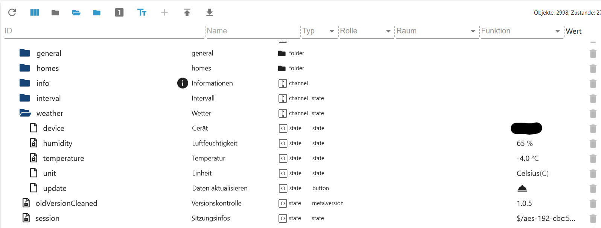

### Device 101 Refrigerator/Freezer thinq1 & thinq2

[Summary](#summary)

### 101 All Folders thinq1 & thinq2

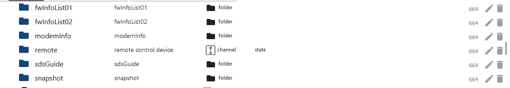

### 101 Remote Folder thinq1 & thinq2

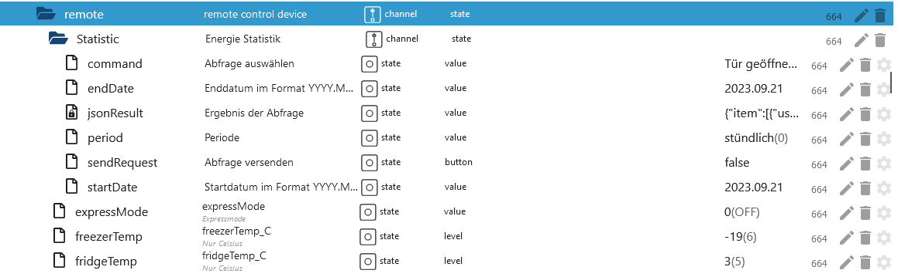

### 101 Remote Statistic thinq2

[Summary](#summary)

-   `remote.Statistic.command` Which history should be loaded
-   hourly
-   `remote.Statistic.endDate` Enter the date for hourly, end and start must be the same Format: 2023.12.01
-   `remote.Statistic.startDate` Enter the date for hourly, end and start must be the same Format: 2023.12.01
-   Or daily
-   `remote.Statistic.endDate` Enter date daily - Format: 2023.12.06
-   `remote.Statistic.startDate` Enter date daily - Format: 2023.12.01
-   Or monthly
-   `remote.Statistic.endDate` Enter date monthly - Format: 2023.12.01
-   `remote.Statistic.startDate` Enter date monthly - Format: 2023.10.01
-   `remote.Statistic.period` Select period
-   `remote.Statistic.sendRequest` Send selection
-   `remote.Statistic.jsonResult` Statistics as JSON. If the attributes are empty then your device does not support them or an incorrect date was specified.

    
    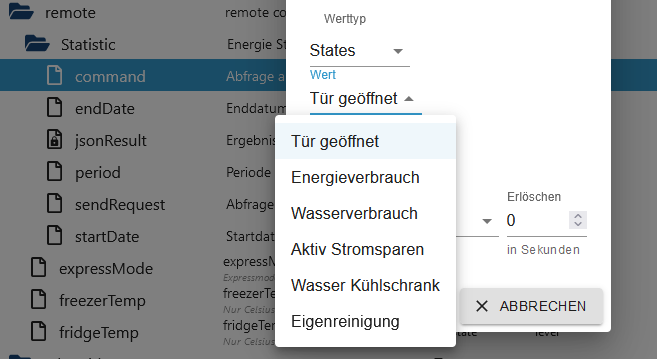
    

Example JSON Door open
```json
{
  "item": [
    {
      "usedDate": "2023-11",
      "doorType": "DID_DOOR",
      "openCount": "0",
      "openTime": "0"
    },
    {
      "usedDate": "2023-12",
      "doorType": "DID_DOOR",
      "openCount": "0",
      "openTime": "0"
    },
    {
      "usedDate": "2023-11",
      "doorType": "FREEZER_DOOR",
      "openCount": "62",
      "openTime": "713937"
    },
    {
      "usedDate": "2023-12",
      "doorType": "FREEZER_DOOR",
      "openCount": "0",
      "openTime": "0"
    },
    {
      "usedDate": "2023-11",
      "doorType": "FRIDGE_DOOR",
      "openCount": "1037",
      "openTime": "12421700"
    },
    {
      "usedDate": "2023-12",
      "doorType": "FRIDGE_DOOR",
      "openCount": "27",
      "openTime": "304857"
    },
    {
      "usedDate": "2023-11",
      "doorType": "CONVERTIBLE_DOOR",
      "openCount": "0",
      "openTime": "0"
    },
    {
      "usedDate": "2023-12",
      "doorType": "CONVERTIBLE_DOOR",
      "openCount": "0",
      "openTime": "0"
    },
    {
      "usedDate": "2023-11",
      "doorType": "ONE_DOOR",
      "openCount": "0",
      "openTime": "0"
    },
    {
      "usedDate": "2023-12",
      "doorType": "ONE_DOOR",
      "openCount": "0",
      "openTime": "0"
    }
  ]
}
```
### 101 Remote Control thinq1 & thinq2

[Summary](#summary)

-   `remote.expressMode` Express Mode on/off/rapid on -> thinq1 state snapshot.IcePlus
-   `remote.freezerTemp` Change the temperature of the freezer (Celsius only)
-   `remote.fridgeTemp` Change the temperature of the refrigerator (Celsius only)
    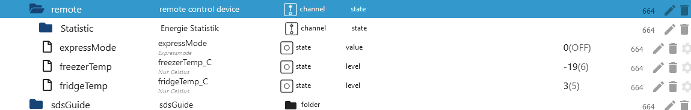

### 101 Snapshot thinq1 & thinq2

[Summary](#summary)


### Device 201 Washer Signature thinq2

[Summary](#summary)

### 201 Remote Control Signature thinq2

-   Can be controlled like the 201. However, the following values ​​must be set in the `Course` folder.
-   In the course folder: initialBit on INITIAL_BIT_ON
-   In the course folder: remoteStart on REMOTE_START_ON

### Device 201 Washer thinq1 & thinq2

[Summary](#summary)

### 201 All Folders thinq1 & thinq2


### 201 Remote Folder thinq1 & thinq2


### 201 Remote Statistic thinq2

[Summary](#summary)

-   hourly
-   `remote.Statistic.endDate` Enter the date for hourly, end and start must be the same Format: 2023.12.01
-   `remote.Statistic.startDate` Enter the date for hourly, end and start must be the same Format: 2023.12.01
-   Or daily
-   `remote.Statistic.endDate` Enter date daily - Format: 2023.12.06
-   `remote.Statistic.startDate` Enter date daily - Format: 2023.12.01
-   Or monthly
-   `remote.Statistic.endDate` Enter date monthly - Format: 2023.12.01
-   `remote.Statistic.startDate` Enter date monthly - Format: 2023.10.01
-   `remote.Statistic.period` Select period
-   `remote.Statistic.sendRequest` Send selection
-   `remote.Statistic.jsonResult` Statistics as JSON. If the attributes are empty then your device does not support them or an incorrect date was specified.

    

```json
{
  "count": 0,
  "power": 0,
  "energyWater": 0,
  "energyDetergent": 0,
  "energySoftener": 0,
  "powerWh": 0,
  "periodicEnergyData": 0,
  "item": [
    {
      "usedDate": "2023-12-04",
      "count": 0,
      "power": 0,
      "energyWater": 0,
      "energyDetergent": 0,
      "energySoftener": 0,
      "powerWh": 0,
      "periodicEnergyData": 0
    },
    {
      "usedDate": "2023-12-05",
      "count": 0,
      "power": 0,
      "energyWater": 0,
      "energyDetergent": 0,
      "energySoftener": 0,
      "powerWh": 0,
      "periodicEnergyData": 0
    },
    {
      "usedDate": "2023-12-06",
      "count": 2,
      "power": 2,
      "energyWater": 0,
      "energyDetergent": 0,
      "energySoftener": 0,
      "powerWh": 0,
      "periodicEnergyData": 2
    },
    {
      "usedDate": "2023-12-07",
      "count": 2,
      "power": 2,
      "energyWater": 0,
      "energyDetergent": 0,
      "energySoftener": 0,
      "powerWh": 0,
      "periodicEnergyData": 2
    },
    {
      "usedDate": "2023-12-08",
      "count": 5,
      "power": 5,
      "energyWater": 0,
      "energyDetergent": 0,
      "energySoftener": 0,
      "powerWh": 0,
      "periodicEnergyData": 5
    },
    {
      "usedDate": "2023-12-09",
      "count": 0,
      "power": 0,
      "energyWater": 0,
      "energyDetergent": 0,
      "energySoftener": 0,
      "powerWh": 0,
      "periodicEnergyData": 0
    },
    {
      "usedDate": "2023-12-10",
      "count": 0,
      "power": 0,
      "energyWater": 0,
      "energyDetergent": 0,
      "energySoftener": 0,
      "powerWh": 0,
      "periodicEnergyData": 0
    }
  ]
}
```

### 201 Remote Control thinq1 & thinq2

[Summary](#summary)

-   `remote.Favorite` Only works when a favorite has been selected in the APP and when the machine is turned on.
-   `remote.LastCourse` The last 10 programs can be selected.
-   `remote.WMDownload_Select` Selection of all available programs (STD=Standard/DL=Download programs)
When one of the 3 data points is filled, the selected program is written to the Course folder. You can then make adjustments here. However, not all data points in the `Course` folder can be changed. Please test for yourself which data the washing machine accepts.
-   `remote.WMDownload` By pressing, the program in the 'Course' folder is transferred to the washing machine and shown on the display (washing machine must be on).
-   `remote.WMStart` Start washer
-   `remote.WMStop` Stop washer
-   `remote.WMWakeup` Wake up washer

    
    

### 201 Snapshot thinq1 & thinq2

[Summary](#summary)


### Device 202 Dryer thinq1 & thinq2

[Summary](#summary)

### 202 All Folders thinq1 & thinq2

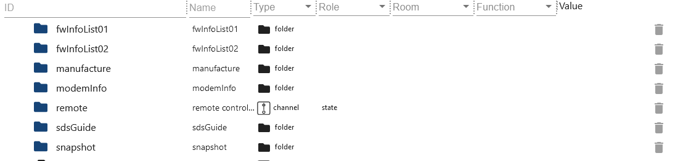

### 202 Remote Folder thinq1 & thinq2


### 202 Remote Statistic thinq2

[Summary](#summary)

-   hourly
-   `remote.Statistic.endDate` Enter the date for hourly, end and start must be the same Format: 2023.12.01
-   `remote.Statistic.startDate` Enter the date for hourly, end and start must be the same Format: 2023.12.01
-   Or daily
-   `remote.Statistic.endDate` Enter date daily - Format: 2023.12.06
-   `remote.Statistic.startDate` Enter date daily - Format: 2023.12.01
-   Or monthly
-   `remote.Statistic.endDate` Enter date monthly - Format: 2023.12.01
-   `remote.Statistic.startDate` Enter date monthly - Format: 2023.10.01
-   `remote.Statistic.period` Select period
-   `remote.Statistic.sendRequest` Send selection
-   `remote.Statistic.jsonResult` Statistics as JSON. If the attributes are empty then your device does not support them or an incorrect date was specified.

    

```json
{
  "count": 0,
  "power": 0,
  "energyWater": 0,
  "energyDetergent": 0,
  "energySoftener": 0,
  "powerWh": 0,
  "periodicEnergyData": 0,
  "item": [
    {
      "usedDate": "2023-12-08",
      "count": 5,
      "power": 2587, // 2587 / 1000 kwh
      "energyWater": 0,
      "energyDetergent": 0,
      "energySoftener": 0,
      "powerWh": 0,
      "periodicEnergyData": 2587
    }
  ]
}
```

### 202 Remote Control thinq1 & thinq2

[Summary](#summary)

-   `remote.Favorite` Only works when a favorite has been selected in the APP and when the machine is turned on.
-   `remote.LastCourse` The last 10 programs can be selected.
-   `remote.WMDownload_Select` Selection of all available programs (STD=Standard/DL=Download programs)
When one of the 3 data points is filled, the selected program is written to the Course folder. You can then make adjustments here. However, not all data points in the `Course` folder can be changed. Please test for yourself which data the dryer accepts.
-   `remote.WMDownload` No function
-   `remote.WMStart` By pressing, the program in the 'Course' folder is transferred to the dryer and shown on the display (dryer must be on).
-   `remote.WMStop` Stop Dryer
-   `remote.WMWakeup` Wake up Dryer

    
    

### 202 Snapshot thinq1 & thinq2

[Summary](#summary)


### Device 401 Air conditioner thinq2

[Summary](#summary)

### 401 All Folders thinq2


### 401 Remote Folder thinq2

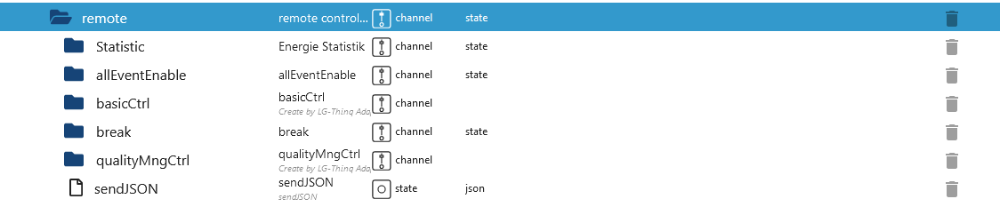

### 401 Remote Statistic thinq2

[Summary](#summary)

-   `remote.Statistic.command` Which history should be loaded
-   hourly
-   `remote.Statistic.endDate` Enter the date for hourly, end and start must be the same Format: 2023.12.01
-   `remote.Statistic.startDate` Enter the date for hourly, end and start must be the same Format: 2023.12.01
-   Or daily
-   `remote.Statistic.endDate` Enter date daily - Format: 2023.12.06
-   `remote.Statistic.startDate` Enter date daily - Format: 2023.12.01
-   Or monthly
-   `remote.Statistic.endDate` Enter date monthly - Format: 2023.12.01
-   `remote.Statistic.startDate` Enter date monthly - Format: 2023.10.01
-   `remote.Statistic.period` Select period
-   `remote.Statistic.sendRequest` Send selection
-   `remote.Statistic.jsonResult` Statistics as JSON. If the attributes are empty then your device does not support them or an incorrect date was specified.

    

```json
[
  {
    "usedDate": "2023-04",
    "energyData": "0",
    "operationTime": "0"
  },
  {
    "usedDate": "2023-05",
    "energyData": "0",
    "operationTime": "0"
  },
  {
    "usedDate": "2023-06",
    "energyData": "3800",
    "operationTime": "13873"
  }
]
```

### 401 Remote Control thinq2

[Summary](#summary)

-   `remote.basicCtrl.operation` 0 for off and 1 for on
-   `remote.basicCtrl.opMode` 0 for off and 4 for on
-   `remote.basicCtrl.hotWater` 0 for off and 1 for on
-   `remote.basicCtrl.hotWaterTarget` desired temperature
-   `remote.basicCtrl.powerHotWater` Boost 0 for off and 1 for on
-   `remote.basicCtrl.target` desired temperature

-   If the error message 400 appears in the log, then this data point is not compatible with the device.


### 401 Remote Holiday thinq2

[Summary](#summary)

-   `remote.break.holiday_silent_update` The current data must always be loaded from the cloud first.
-   `remote.break.holiday_silent_data` Current schedule from the cloud.
-   `remote.break.holiday_startdate` Enter the start date for vacation mode here. The date cannot be in the past (Format DD.MM.YY HH:MM)
-   `remote.break.holiday_enddate` Enter the end date for vacation mode here. The date cannot be in the past and must be greater than the start date (Format DD.MM.YY HH:MM)
-   `remote.break.holiday_heating` Heating on/off (as in the APP)
-   `remote.break.holiday_water` Hot water on/off (as in the APP)
-   `remote.break.holiday_onoff` Only the above mentioned Fill data points and then activate/deactivate vacation mode here
-   `remote.break.silent_mode_starttime` Enter the start time for the low-noise mode here. (Format HH:MM)
-   `remote.break.silent_mode_endtime` Enter the end time for quiet mode here. Of course it should be larger than the start date. (Format HH:MM)
-   `remote.break.silent_mode_onoff` Enable/disable quiet mode
-   `remote.break.holiday_sendJSON` Intended for experts only. The JSON has an array consisting of JSON Type 1, 2 and 3. 1 stands for the runtimes, 2 for vacation mode and type 3 for quiet mode. You could now add additional JSONs to Type 1 and thus generate more switching times.


### 401 Snapshot thinq2

[Summary](#summary)


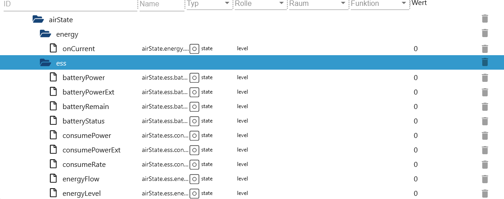


### Device 401 Air conditioner thinq1

[Summary](#summary)

### 401 Remote Statistic thinq1

[Summary](#summary)

-   hourly
-   `remote.Statistic.endDate` Enter the date for hourly, end and start must be the same Format: 2023.12.01
-   `remote.Statistic.startDate` Enter the date for hourly, end and start must be the same Format: 2023.12.01
-   Or daily
-   `remote.Statistic.endDate` Enter date daily - Format: 2023.12.06
-   `remote.Statistic.startDate` Enter date daily - Format: 2023.12.01
-   Or monthly
-   `remote.Statistic.endDate` Enter date monthly - Format: 2023.12.01
-   `remote.Statistic.startDate` Enter date monthly - Format: 2023.10.01
-   `remote.Statistic.period` Select period
-   `remote.Statistic.sendRequest` Send selection
-   `remote.Statistic.jsonResult` Statistics as JSON. If the attributes are empty then your device does not support them or an incorrect date was specified.
-   `remote.Statistic.ownrequest` Own query of data. Open the file from the `modelJsonUri` link and apply cmd, cmdOpt and value.
-   `remote.Statistic.ownresponse` Result of `remote.Statistic.ownrequest`

    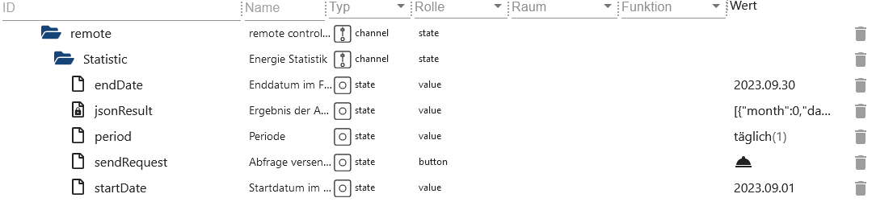

```json
[
  {
    "month": 0,
    "day": "03",
    "hour": 0,
    "min": "16",
    "kwh": 0.1
  },
  {
    "month": 0,
    "day": "04",
    "hour": 0,
    "min": "59",
    "kwh": 0.2
  },
  {
    "month": 0,
    "day": "06",
    "hour": 0,
    "min": "15",
    "kwh": 0.1
  },
  {
    "month": 0,
    "day": "07",
    "hour": 0,
    "min": "40",
    "kwh": 0.1
  },
  {
    "month": 0,
    "day": "09",
    "hour": 0,
    "min": "35",
    "kwh": 0.2
  },
  {
    "month": 0,
    "day": "10",
    "hour": 0,
    "min": "60",
    "kwh": 0.2
  },
  {
    "month": 0,
    "day": "11",
    "hour": 0,
    "min": "60",
    "kwh": 0.2
  },
  {
    "month": 0,
    "day": "12",
    "hour": 0,
    "min": "90",
    "kwh": 0.3
  }
]
```

# ownrequest JSON

```json
{
  "method": "POST", // POST or GET Axios Request
  "url": "rti/rtiControl", // URL
  "data": {
    "lgedmRoot": {
      "deviceId": null, // Adapter replaces null
      "workId": null, // Adapter replaces null
      "cmd": "Config", // Change possible
      "cmdOpt": "Get", // Change possible
      "value": "InOutInstantPower", // Change possible
      "isControlFree": "Y" // DO NOT change
    }
  }
}
```

### 401 Remote Control thinq1


[Summary](#summary)

Which data points belong to set... data points is stated in the name of the data point.
lg-thinq.0.xxx.remote.SetWDirLeftRight -> {"`WDirLeftRight`":"{{WDirLeftRight}}","`WDirUpDown`":"0"}

-   Turn on example:
-   `remote.settings.Operation` set to 1
-   `remote.SetOperation` then set this data point to true

-   Turn off example:
-   `remote.settings.Operation` set to 0
-   `remote.SetOperation` then set this data point to true

-   Example changing temperature:
-   `remote.settings.TempCfg` Enter temperature
-   `remote.SetTempCfg` then set this data point to true

-   Other example:
-   `remote.settings.WDirUpDown` set to 0
-   `remote.settings.WDirLeftRight` 0 or 1
-   `remote.SetWDirLeftRight` then set this data point to true

    

### 401 Snapshot thinq1

[Summary](#summary)


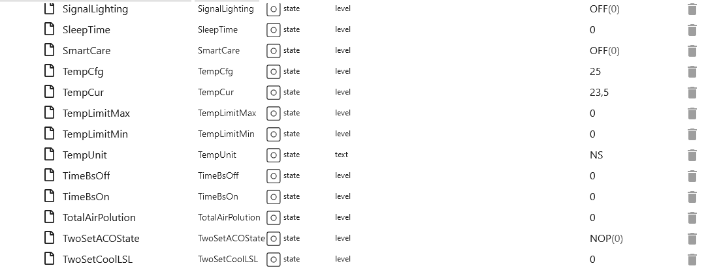


### Device 406 Heat pump thinq2

[Summary](#summary)

### 406 All Folders thinq2

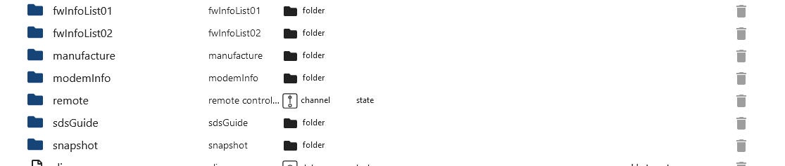

### 406 Remote Folder thinq2


### 406 Remote Statistic thinq2

[Summary](#summary)

-   `remote.Statistic.command` Which history should be loaded
-   hourly
-   `remote.Statistic.endDate` Enter the date for hourly, end and start must be the same Format: 2023.12.01
-   `remote.Statistic.startDate` Enter the date for hourly, end and start must be the same Format: 2023.12.01
-   Or daily
-   `remote.Statistic.endDate` Enter date daily - Format: 2023.12.06
-   `remote.Statistic.startDate` Enter date daily - Format: 2023.12.01
-   Or monthly
-   `remote.Statistic.endDate` Enter date monthly - Format: 2023.12.01
-   `remote.Statistic.startDate` Enter date monthly - Format: 2023.10.01
-   `remote.Statistic.period` Select period
-   `remote.Statistic.sendRequest` Send selection
-   `remote.Statistic.jsonResult` Statistics as JSON. If the attributes are empty then your device does not support them or an incorrect date was specified.

    

### 406 Remote basicCtrl thinq2

[Summary](#summary)

-   `remote.basicCtrl.hotWaterTarget` Setting the temperature
-   `remote.basicCtrl.opMode` Set mode

    

### 406 Remote reservationCtrl thinq2

[Summary](#summary)

-   `remote.reservationCtrl.add_new_schedule` Create a new schedule. 3 new data points will then be created that must be filled out. Then press `send_new_schedule` to save the new slot. If it is not sent, these new data points will be deleted after a restart.
-   `remote.reservationCtrl.del_new_schedule` Delete a slot again. Then press `send_new_schedule` again so that the data is saved.
-   `remote.reservationCtrl.send_new_schedule` Press to save changes.
-   `remote.reservationCtrl.01_end Enddatum` Example 22:30.
-   `remote.reservationCtrl.01_start Startdatum` Example 21:30.
-   `remote.reservationCtrl.01_state` Enable/Disable

    

### 406 Snapshot thinq2

[Summary](#summary)


### Weather

[Summary](#summary)

lg-thinq.0.xxx.area must be filled!

-   `weather.device` Choose area. If all devices have the same area, only one device is displayed.
-   `weather.humidity` Humidity
-   `weather.temperature` Temperature
-   `weather.unit` Select Celsius or Fahrenheit
-   `weather.update` Request an LG senden (device und unit müssen gefüllt sein!)

    

## Changelog
### 1.1.0 (2025-04-08)

- (Lucky-ESA) max target changed from 30 to 40 degrees
- (Lucky-ESA) Dependencies updated
- (Lucky-ESA) Admin 7.4.10 required

### 1.0.7 (2024-12-08)

- (Lucky-ESA) Fixed: Connection status does not turn green
- (Lucky-ESA) Changed: Checkbox to dropdown for login procedure

### 1.0.6 (2024-12-07)

- (Lucky-ESA) Save session data (prevents the login email)
- (Lucky-ESA) Fixed invalid jsonConfig
- (Lucky-ESA) Added choice between old and new login
- (Lucky-ESA) Bugfixe

### 1.0.5 (2024-12-02)

- (Lucky-ESA) Migration to ESLint9
- (Lucky-ESA) Bugfixe

### 1.0.4 (2024-12-01)

- (TA2k) Login fixed
- (Lucky-ESA) Added hotwater for device 406 & 401
- (Lucky-ESA) Dependencies updated

## License

MIT License

Copyright (c) 2021-2025 TA2k <tombox2020@gmail.com>

Permission is hereby granted, free of charge, to any person obtaining a copy
of this software and associated documentation files (the "Software"), to deal
in the Software without restriction, including without limitation the rights
to use, copy, modify, merge, publish, distribute, sublicense, and/or sell
copies of the Software, and to permit persons to whom the Software is
furnished to do so, subject to the following conditions:

The above copyright notice and this permission notice shall be included in all
copies or substantial portions of the Software.

THE SOFTWARE IS PROVIDED "AS IS", WITHOUT WARRANTY OF ANY KIND, EXPRESS OR
IMPLIED, INCLUDING BUT NOT LIMITED TO THE WARRANTIES OF MERCHANTABILITY,
FITNESS FOR A PARTICULAR PURPOSE AND NONINFRINGEMENT. IN NO EVENT SHALL THE
AUTHORS OR COPYRIGHT HOLDERS BE LIABLE FOR ANY CLAIM, DAMAGES OR OTHER
LIABILITY, WHETHER IN AN ACTION OF CONTRACT, TORT OR OTHERWISE, ARISING FROM,
OUT OF OR IN CONNECTION WITH THE SOFTWARE OR THE USE OR OTHER DEALINGS IN THE
SOFTWARE.