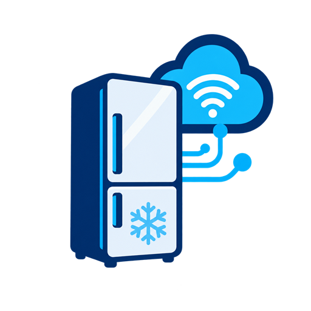

# ioBroker.liebherr

[](https://www.npmjs.com/package/iobroker.liebherr)
[](https://www.npmjs.com/package/iobroker.liebherr)


[](https://nodei.co/npm/iobroker.liebherr/)

**Tests:** 

## Liebherr adapter for ioBroker

This adapter connects ioBroker to the official cloud-based [Liebherr SmartDevice HomeAPI](https://developer.liebherr.com/apis/smartdevice-homeapi). It discovers compatible refrigerators, freezers, and other appliances associated with a HomeAPI API key and exposes the capabilities reported for each appliance.

Internet access and a HomeAPI API key are required. Only appliances returned by the SmartDevice HomeAPI can be used. The separate Liebherr SmartModule LocalAPI is not supported and is not interchangeable with the HomeAPI.

The HomeAPI is currently a beta service, so available capabilities and response fields may change.

Liebherr and SmartDevice are trademarks of Liebherr. This project is not affiliated with or endorsed by Liebherr.

## Requirements

- A compatible Liebherr appliance exposed through the SmartDevice HomeAPI
- A Liebherr SmartDevice HomeAPI API key
- Internet access from the ioBroker host
- Node.js 22 or newer
- ioBroker js-controller 7.0.4 or newer
- ioBroker Admin 7.6.20 or newer

## Installation

Install the adapter from the normal adapter list in ioBroker Admin. Create an adapter instance if ioBroker Admin does not create one automatically, enter the HomeAPI API key in the instance configuration, and save it.

Do not publish API keys in forum posts, GitHub issues, screenshots, or log excerpts.

## Current status

The adapter currently provides:

- Automatic discovery of all appliances associated with the configured API key
- Capability-based creation and polling of controls, with a default interval of 300 seconds
- Realtime control updates through one reconnecting SSE stream per discovered appliance
- Current, target, minimum, and maximum temperatures for every reported temperature zone
- Reported temperature units and temperature-step metadata
- Validated writes for target temperatures, NightMode, PartyMode, SuperCool, and SuperFrost when the corresponding capability is reported
- Safe handling of malformed, unknown, and future control types without crashing the adapter

`TemperatureControl` and `ToggleControl` are currently mapped. Operational toggle controls are grouped in the device's `controls` channel; any reported zone association is retained in the object's native metadata. Realtime control updates use the official per-device Server-Sent Events (SSE) endpoint, while periodic REST polling remains active as a safety resync and for device discovery.

## Getting a HomeAPI API key

The API key is generated in the official Liebherr SmartDevice app.

1. Open the SmartDevice app.
2. Open **Settings**.
3. Open **HomeAPI**.
4. Generate a new API key.
5. Copy and store the key securely.
6. Enter the key in the ioBroker.liebherr adapter configuration.

The API key is shown only once. Generating a new API key invalidates the previously generated key.

For more information, see the official [Liebherr SmartDevice HomeAPI documentation](https://developer.liebherr.com/apis/smartdevice-homeapi).

## Configuration

- **API key:** Your Liebherr SmartDevice HomeAPI API key. ioBroker stores it as an encrypted, protected native setting. The adapter never writes the key to its log.
- **Realtime updates:** Enables the HomeAPI SSE streams (enabled by default). Disable this to use polling only.
- **Polling interval:** Time between full REST discovery and control resyncs, in seconds. The default is 300 seconds; valid values range from 30 to 86400 seconds.

## Object structure

Devices and capabilities are created dynamically from the HomeAPI response. Device IDs are encoded into safe ioBroker object-ID segments.

```text
liebherr.0
|-- info.connection
`-- devices
    `-- <encoded device ID>
        |-- info
        |   |-- deviceId
        |   |-- nickname
        |   |-- deviceName
        |   |-- deviceType
        |   |-- imageUrl
        |   `-- available
        |-- controls
        |   `-- <toggle control>
        `-- zone_<zoneId>
            |-- zoneId
            |-- position
            |-- temperature
            |-- targetTemperature
            |-- minTemperature
            |-- maxTemperature
            |-- unit
            |-- setTemperatureStepsEnabled (if reported)
            `-- setTemperatureSteps (if reported)
```

For advanced users: HomeAPI values are published with `ack: true`. Writable states accept `ack: false` changes only when the appliance reports a supported writable capability. Values are validated before transmission and acknowledged only through a subsequent HomeAPI readback; failed requests are not falsely acknowledged.

## Limitations

- The adapter depends on internet access and the availability of Liebherr's cloud-based HomeAPI.
- Only appliances exposed through the SmartDevice HomeAPI are supported.
- The Liebherr SmartModule LocalAPI is not supported.
- The HomeAPI is currently beta and may change.
- Realtime updates require SSE to be enabled; periodic polling remains active for discovery and resynchronization.
- Reported controls without an implemented write schema remain read-only.

## Testing and feedback

This adapter is in an early public testing phase. When reporting a problem, please include:

- Adapter, Node.js, js-controller, and Admin versions
- The appliance model and device type
- The control names and zone IDs reported by the appliance
- Relevant debug log excerpts with API keys and other sensitive values removed

Please report reproducible problems in the [GitHub issue tracker](https://github.com/Gaspode69/ioBroker.liebherr/issues).

## Changelog
<!--
	Placeholder for the next version (at the beginning of the line):
	### **WORK IN PROGRESS**
-->
### 0.0.4 (2026-09-10)

* (Gaspode69) Updated the Node.js 22 TypeScript configuration dependency; TypeScript 7 remains deferred until the development toolchain supports its compiler API

### 0.0.3 (2026-08-19)

* (Gaspode69) Added realtime control updates via HomeAPI Server-Sent Events with reconnect handling and periodic REST resync
* (Gaspode69) Masked appliance serial numbers in adapter log messages

### 0.0.2 (2026-08-18)
* (Gaspode69) Prepared the first public testing release for the ioBroker latest repository
* (Gaspode69) Consolidated capability-based device discovery, polling, and validated control writes
* (Gaspode69) Updated Node.js requirements, project metadata, CI workflows, and repository compliance

### 0.0.2-alpha.1 (2026-08-18)
* (Gaspode69) Enabled automated npm publishing through GitHub trusted publishing

### 0.0.2-alpha.0 (2026-08-18)
* (Gaspode69) Added read-only SmartDevice HomeAPI device discovery and capability polling
* (Gaspode69) Added encrypted API-key and polling-interval configuration
* (Gaspode69) Added validated writes for target temperature, NightMode, PartyMode, SuperCool, and SuperFrost

## License
MIT License

Copyright (c) 2026 Gaspode69 <gaspode69@online.de>

**No support is provided via email.**

Permission is hereby granted, free of charge, to any person obtaining a copy
of this software and associated documentation files (the "Software"), to deal
in the Software without restriction, including without limitation the rights
to use, copy, modify, merge, publish, distribute, sublicense, and/or sell
copies of the Software, and to permit persons to whom the Software is
furnished to do so, subject to the following conditions:

The above copyright notice and this permission notice shall be included in all
copies or substantial portions of the Software.

THE SOFTWARE IS PROVIDED "AS IS", WITHOUT WARRANTY OF ANY KIND, EXPRESS OR
IMPLIED, INCLUDING BUT NOT LIMITED TO THE WARRANTIES OF MERCHANTABILITY,
FITNESS FOR A PARTICULAR PURPOSE AND NONINFRINGEMENT. IN NO EVENT SHALL THE
AUTHORS OR COPYRIGHT HOLDERS BE LIABLE FOR ANY CLAIM, DAMAGES OR OTHER
LIABILITY, WHETHER IN AN ACTION OF CONTRACT, TORT OR OTHERWISE, ARISING FROM,
OUT OF OR IN CONNECTION WITH THE SOFTWARE OR THE USE OR OTHER DEALINGS IN THE
SOFTWARE.