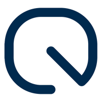

# ioBroker.loqed

**Tests:** 

## loqed adapter for ioBroker

Control LOQED smart locks

## Changelog
<!--
    Placeholder for the next version (at the beginning of the line):
    ### **WORK IN PROGRESS**
-->
### 0.3.1 (2023-08-17)
* (foxriver76) updated the library to fix unknown events (closes #7)

### 0.3.0 (2023-08-09)
* (foxriver76) added state for local key id (closes #6)

### 0.2.3 (2023-08-07)
* (foxriver76) updated the library to fix unknown events (closes #5)

### 0.2.2 (2023-07-30)
* (foxriver76) updated the library to fix unknown events

### 0.2.1 (2022-09-10)
* (foxriver76) ensure library is updated

### 0.2.0 (2022-09-09)
* (foxriver76) connection handling implemented
* (foxriver76) some bugs fixed
* (foxriver76) battery level updates implemented

### 0.1.2 (2022-09-09)
* (foxriver76) io-package optimizations

### 0.1.1 (2022-09-09)
* (foxriver76) initial release

## License
MIT License

Copyright (c) 2023 Moritz Heusinger <moritz.heusinger@gmail.com>

Permission is hereby granted, free of charge, to any person obtaining a copy
of this software and associated documentation files (the "Software"), to deal
in the Software without restriction, including without limitation the rights
to use, copy, modify, merge, publish, distribute, sublicense, and/or sell
copies of the Software, and to permit persons to whom the Software is
furnished to do so, subject to the following conditions:

The above copyright notice and this permission notice shall be included in all
copies or substantial portions of the Software.

THE SOFTWARE IS PROVIDED "AS IS", WITHOUT WARRANTY OF ANY KIND, EXPRESS OR
IMPLIED, INCLUDING BUT NOT LIMITED TO THE WARRANTIES OF MERCHANTABILITY,
FITNESS FOR A PARTICULAR PURPOSE AND NONINFRINGEMENT. IN NO EVENT SHALL THE
AUTHORS OR COPYRIGHT HOLDERS BE LIABLE FOR ANY CLAIM, DAMAGES OR OTHER
LIABILITY, WHETHER IN AN ACTION OF CONTRACT, TORT OR OTHERWISE, ARISING FROM,
OUT OF OR IN CONNECTION WITH THE SOFTWARE OR THE USE OR OTHER DEALINGS IN THE
SOFTWARE.
