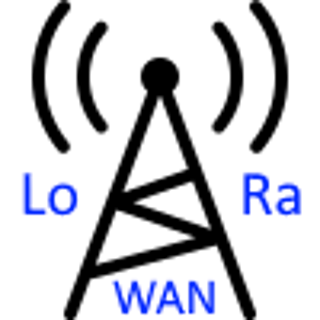

# ioBroker.lorawan

## lorawan adapter for ioBroker
The adapter communicates bidirectionally with LoraWan devices via LoRaWAN Network Server via MQTT protocol.
“The Thinks Network” and “Chirpstack” are supported now, more could follow later. 
Adapter was created in collaboration with Joerg Froehner LoraWan@hafenmeister.com

For Documentation use the doc folder.
For now there is documentation in English here: https://wiki.hafenmeister.de

## Changelog
<!--
	Placeholder for the next version (at the beginning of the line):
	### **WORK IN PROGRESS**
-->
### 1.5.5 (2024-11-23)
* (BenAhrdt) add CRC-8

### 1.5.4 (2024-11-15)
* (BenAhrdt) add roles and fix responsive issues

### 1.5.3 (2024-10-30)
* (BenAhrdt) add roles

### 1.5.2 (2024-10-28)
* (BenAhrdt) add new standard types / add new Roles / update core to 3.2.2

### 1.5.1 (2024-10-17)
* (BenAhrdt) remove some wrong loggings

### 1.5.0 (2024-10-17)
* (BenAhrdt) add some notifications for devices back online

### 1.4.2 (2024-09-27)
* (BenAhrdt) add informations about delete an custom entry in config

### 1.4.1 (2024-09-25)
* (BenAhrdt) remove timestamp from role date (ttn timestamp im µs)

### 1.4.0 (2024-08-30)
* (BenAhrdt) function to assign properties

### 1.3.1 (2024-07-30)
* (BenAhrdt) implements example image

### 1.3.0 (2024-07-29)
* (BenAhrdt) Add "Custom"-Configuration

### 1.2.3 (2024-06-26)
* (BenAhrdt) Bugfix offlinenotification (calculation of diffenerce)

### 1.2.2 (2024-06-25)
* (BenAhrdt) Bugfix inf generate Deviceinfo at startup for chirpstack

### 1.2.1 (2024-06-24)
* (BenAhrdt) improof building of offlinenotification >= 25 hours

### 1.2.0 (2024-05-28)
* (BenAhrdt) change deviceInformations (keep old values in structure)

### 1.1.1 (2024-05-15)
* (BenAhrdt) mqtt dependencies updated for better keepalive

### 1.1.0 (2024-05-12)
* (BenAhrdt) implement keepalive in config

### 1.0.9 (2024-05-11)
* (BenAhrdt) remove debug warn logging

### 1.0.8 (2024-05-11)
* (BenAhrdt) set keepalive value to 0 => deactivate automatic reconnection

### 1.0.7 (2024-05-10)
* (BenAhrdt) setObjectAsynch bug after offline solved

### 1.0.6 (2024-05-10)
* (BenAhrdt) icons changed
* (BenAhrdt) device offline notofication placed in messagehandler.js

### 1.0.5 (2024-05-10)
* (BenAhrdt) device offline location changed

### 1.0.4 (2024-05-10)
* (BenAhrdt) changed icon and offline time

### 1.0.3 (2024-05-10)
* (BenAhrdt) notifications for connection and disconnection LNS added
* (BenAhrdt) notifiction for device offline added

### 1.0.2 (2024-03-27)
* (BenAhrdt) change some comments and logging

### 1.0.1 (2024-03-25)
* (BenAhrdt) support 2's complement

### 1.0.0 (2024-03-21)
* (BenAhrdt) implement wifi icons

### 0.6.6 (2024-03-11)
* (BenAhrdt) update Vicki device-config

### 0.6.5 (2024-03-08)
* (BenAhrdt) setObject changed into setObjectAsync

### 0.6.4 (2024-03-07)
* (BenAhrdt) Change writing of deviceinformations at Ttn

### 0.6.3 (2024-03-05)
* (BenAhrdt) def of deviceinformations changed

### 0.6.2 (2024-03-05)
* (BenAhrdt) seperate dp for deviceinformations

### 0.6.1 (2024-03-02)
* (BenAhrdt) better concept to write values and change setObjectNotExists to extendObject

### 0.6.0 (2024-03-02)
* (BenAhrdt) change concept of assigning roles, values and writecommands

### 0.5.5 (2024-03-01)
* (BenAhrdt) first step of handling with date

### 0.5.4 (2024-03-01)
* (BenAhrdt) implement ther approvedFolder conzept for writecommands from message

### 0.5.3 (2024-02-29)
* (BenAhrdt) change folder for writetriggers

### 0.5.2 (2024-02-29)
* (BenAhrdt) make writetrigger more flexible

### 0.5.1 (2024-02-29)
* (BenAhrdt) detecting of triggerwords changed

### 0.5.0 (2024-02-28)
* (BenAhrdt) trigger for devicetype implemented

### 0.4.1 (2024-02-26)
* (BenAhrdt) implement new deviceprofiles

### 0.4.0 (2024-02-26)
* (BenAhrdt) searchallgorythm improoved, defaultvalues changed, remove query for "all"

### 0.3.10 (2024-02-25)
* (BenAhrdt) change logging again if a device joined the network

### 0.3.9 (2024-02-25)
* (BenAhrdt) change logging if a device joined the network

### 0.3.8 (2024-02-23)
* (BenAhrdt) write def into state in case of type changes

### 0.3.7 (2024-02-22)
* (BenAhrdt) improove forbidden chars and implements join raw

### 0.3.6 (2024-02-21)
* (BenAhrdt) set attributs if undefined

### 0.3.5 (2024-02-21)
* (BenAhrdt) set tier to 2 and improove standard devices

### 0.3.4 (2024-02-20)
* (BenAhrdt) put some debug and silly logging to code

### 0.3.3 (2024-02-19)
* (BenAhrdt) set infos into native

### 0.3.2 (2024-02-16)
* (BenAhrdt) wording recieved => received in messageing

### 0.3.1 (2024-02-15)
* (BenAhrdt) rebuild with better messageing

### 0.3.0 (2024-02-15)
* (BenAhrdt) define user friendly Blockly Blocks with result

### 0.2.1 (2024-02-13)
* (BenAhrdt) check types of messaging values and implements more blockly blocks

### 0.2.0 (2024-02-12)
* (BenAhrdt) more functionality in messageing

### 0.1.13 (2024-02-12)
* (BenAhrdt) building of directory changed and message implemented

### 0.1.12 (2024-02-09)
* (BenAhrdt) default value crc config bug fixed

### 0.1.11 (2024-02-09)
* (BenAhrdt) min / max values for downlink-configs (number)

### 0.1.10 (2024-02-08)
* (BenAhrdt) default of crc changed

### 0.1.9 (2024-02-07)
* (BenAhrdt) crc calculation improoved

### 0.1.8 (2024-02-07)
* (BenAhrdt) implement crc calculation

### 0.1.7 (2024-02-06)
* (BenAhrdt) change filter on statechange

### 0.1.6 (2024-02-05)
* (BenAhrdt) implments byte swap

### 0.1.5 (2024-02-02)
* (BenAhrdt) remove units and insert roles

### 0.1.4 (2024-02-01)
* (BenAhrdt) change input of length and validate hex inputs

### 0.1.3 (2024-02-01)
* (BenAhrdt) change internal Base devices

### 0.1.2 (2024-01-31)
* (BenAhrdt) concept of config changed

### 0.1.1 (2024-01-30)
* (BenAhrdt) reduceing calling changeInfo > create expersettings to send downlinks with uplink

### 0.1.0 (2024-01-26)
* (BenAhrdt) removing downlink/configuration path and first tests of send downlink with uplink

### 0.0.18 (2024-01-25)
* (BenAhrdt) remove wrong warn logging

### 0.0.17 (2024-01-25)
* (BenAhrdt) changed Handling of standard configurations

### 0.0.16 (2024-01-22)
* (BenAhrdt) romeve reacheble object directory / improoved object === NULL

### 0.0.15 (2024-01-21)
* (BenAhrdt) bugfix chirpstack directory at downlink queued

### 0.0.14 (2024-01-21)
* (BenAhrdt) bugfix chirpstack directory

### 0.0.13 (2024-01-21)
* (BenAhrdt) change device id selecting in chirpstack out of directory (for downlink queued)

### 0.0.12 (2024-01-21)
* (BenAhrdt) change flow of downlink

### 0.0.11 (2024-01-20)
* (BenAhrdt) toSend und lastSend added to folders

### 0.0.10 (2024-01-19)
* (BenAhrdt) changes in length calculation

### 0.0.9 (2024-01-19)
* (BenAhrdt) first version for beta

### 0.0.8 (2024-01-18)
* (BenAhrdt) first implementation of chirpstack

### 0.0.7 (2024-01-17)
* (BenAhrdt) hex to Upper case, more units for decoded payload values

### 0.0.6 (2024-01-16)
* (BenAhrdt) insert whole translation for config and move some functions

### 0.0.5 (2024-01-15)
* (BenAhrdt) delete not configed states at startup

### 0.0.4 (2024-01-15)
* (BenAhrdt) implements buttons and standard downlink control ind json (push / replace)

### 0.0.3 (2024-01-14)
* (BenAhrdt) first config for downlinks inputed

### 0.0.2 (2024-01-12)
* (BenAhrdt) initial release

## License
MIT License

Copyright (c) 2024 BenAhrdt <bsahrdt@gmail.com>
Copyright (c) 2024 Joerg Froehner <LoraWan@hafenmeister.com>

Permission is hereby granted, free of charge, to any person obtaining a copy
of this software and associated documentation files (the "Software"), to deal
in the Software without restriction, including without limitation the rights
to use, copy, modify, merge, publish, distribute, sublicense, and/or sell
copies of the Software, and to permit persons to whom the Software is
furnished to do so, subject to the following conditions:

The above copyright notice and this permission notice shall be included in all
copies or substantial portions of the Software.

THE SOFTWARE IS PROVIDED "AS IS", WITHOUT WARRANTY OF ANY KIND, EXPRESS OR
IMPLIED, INCLUDING BUT NOT LIMITED TO THE WARRANTIES OF MERCHANTABILITY,
FITNESS FOR A PARTICULAR PURPOSE AND NONINFRINGEMENT. IN NO EVENT SHALL THE
AUTHORS OR COPYRIGHT HOLDERS BE LIABLE FOR ANY CLAIM, DAMAGES OR OTHER
LIABILITY, WHETHER IN AN ACTION OF CONTRACT, TORT OR OTHERWISE, ARISING FROM,
OUT OF OR IN CONNECTION WITH THE SOFTWARE OR THE USE OR OTHER DEALINGS IN THE
SOFTWARE.

## DISCLAIMER
The rights of the trademarks and company names,
remain with their owners and have no relation to this adapter.
The fairuse policy must continue to be adhered to by the operator of the adapter.
If this repository is forked, it must be cited as the source.

LoRa® is a registered trademark or service
mark of Semtech Corporation or its affilantes.

LoRaWAN® is a licensed mark.