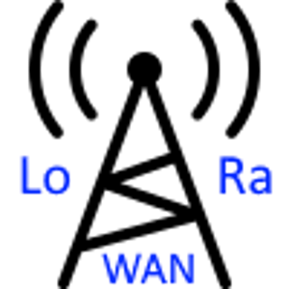

# ioBroker.lorawan

## lorawan adapter for ioBroker
The adapter communicates bidirectionally with LoraWan devices via LoRaWAN Network Server via MQTT protocol.
“The Thinks Network” and “Chirpstack” are supported now, more could follow later. 
Adapter was created in collaboration with Joerg Froehner LoraWan@hafenmeister.com

The documentation Wiki is here: https://github.com/BenAhrdt/ioBroker.lorawan/wiki
 
For now there is documentation in English here: https://wiki.hafenmeister.de

## Changelog
<!--
	Placeholder for the next version (at the beginning of the line):
	### **WORK IN PROGRESS**
-->
### 1.21.19 (2026-03-30)
* (BenAhrdt) add value.power.active to cardRoles and possibility for Name (label? Name? ID)

### 1.21.18 (2026-03-30)
* (BenAhrdt) bugfix display states for bridged devices in dM

### 1.21.17 (2026-03-30)
* (BenAhrdt) change display of sensor.contact in dM card

### 1.21.16 (2026-03-30)
* (BenAhrdt) implements cardRoles state to define displayed Roles in card
* (BenAhrdt) First try of custom Info at dM

### 1.21.15 (2026-03-28)
* (BenAhrdt) implement TTI tenant to download to TTI

### 1.21.14 (2026-03-27)
* (BenAhrdt) change userdata and alias query for bridge

### 1.21.13 (2026-03-23)
* (BenAhrdt) improve displaying devEUI in actual Values

### 1.21.12 (2026-03-19)
* (BenAhrdt) bugfix display devices in case of bridge is not selected

### 1.21.11 (2026-03-15)
* (BenAhrdt) improve nameing of actual values
* (BenAhrdt) imlpement digits to actual values

### 1.21.10 (2026-03-12)
* (BenAhrdt) change Testing and change standard value of lorawan origin to off

### 1.21.9 (2026-03-06)
* (BenAhrdt) persistant Bride DeviceIds

### 1.21.8 (2026-03-04)
* (BenAhrdt) update icons

### 1.21.7 (2026-03-04)
* (BenAhrdt) update logic for icons and link building

### 1.21.6 (2026-03-04)
* (BenAhrdt) change logic for TTN link and change base ip handling
* (BenAhrdt) set more devices at default

### 1.21.5 (2026-03-04)
* (BenAhrdt) implements link to Chirpstack / TTN

### 1.21.4 (2026-03-03)
* (BenAhrdt) update the updateBridge function in objectStore
* (BenAhrdt) improve LoraWAN and ToIob funkction (init / update)

### 1.21.3 (2026-03-02)
* (BenAhrdt) add Link to ToIoB Devices

### 1.21.2 (2026-03-02)
* (BenAhrdt) update icon for device link

### 1.21.1 (2026-03-02)
* (BenAhrdt) bring possibility for editing base ip in devce Manager

### 1.21.0 (2026-03-02)
* (BenAhrdt) update deviceManager (dm-utils) to 3.0.0
* (BenAhrdt) add Links for Bridge devices

### 1.20.57 (2026-03-02)
* (BenAhrdt) bugfix query for null

### 1.20.56 (2026-03-02)
* (BenAhrdt) implement deviceId Handling from bridge

### 1.20.55 (2026-03-02)
* (BenAhrdt) catch publishing value (null) and log warning for this id

### 1.20.54 (2026-02-27)
* (BenAhrdt) update dependencies
* (BenAhrdt) bugfix button press

### 1.20.53 (2026-02-21)
* (BenAhrdt) errorhandling in case of aggregat error with mqtt connection

### 1.20.52 (2026-02-20)
* (BenAhrdt) bugfix show ToIob always in device Manager
* (BenAhrdt) correction of wording in downlink Profil Vicki
* (BenAhrdt) add role button.mode.startMotorcalibration

### 1.20.51 (2026-02-14)
* (BenAhrdt) including of more entites in ToIob functionality (light, climate, hummidifier, lock, cover)

### 1.20.50 (2026-02-10)
* (BenAhrdt) implements light to ToIoB function

### Older entries
[here](OLD_CHANGELOG.md)

## License
MIT License

Copyright (c) 2025-2026 BenAhrdt <bsahrdt@gmail.com>  
Copyright (c) 2025-2026 Joerg Froehner <LoraWan@hafenmeister.com>

Permission is hereby granted, free of charge, to any person obtaining a copy
of this software and associated documentation files (the "Software"), to deal
in the Software without restriction, including without limitation the rights
to use, copy, modify, merge, publish, distribute, sublicense, and/or sell
copies of the Software, and to permit persons to whom the Software is
furnished to do so, subject to the following conditions:

The above copyright notice and this permission notice shall be included in all
copies or substantial portions of the Software.

THE SOFTWARE IS PROVIDED "AS IS", WITHOUT WARRANTY OF ANY KIND, EXPRESS OR
IMPLIED, INCLUDING BUT NOT LIMITED TO THE WARRANTIES OF MERCHANTABILITY,
FITNESS FOR A PARTICULAR PURPOSE AND NONINFRINGEMENT. IN NO EVENT SHALL THE
AUTHORS OR COPYRIGHT HOLDERS BE LIABLE FOR ANY CLAIM, DAMAGES OR OTHER
LIABILITY, WHETHER IN AN ACTION OF CONTRACT, TORT OR OTHERWISE, ARISING FROM,
OUT OF OR IN CONNECTION WITH THE SOFTWARE OR THE USE OR OTHER DEALINGS IN THE
SOFTWARE.

## DISCLAIMER
The rights of the trademarks and company names,
remain with their owners and have no relation to this adapter.
The fairuse policy must continue to be adhered to by the operator of the adapter.
If this repository is forked, it must be cited as the source.

LoRa® is a registered trademark or service
mark of Semtech Corporation or its affilantes.

LoRaWAN® is a licensed mark.
