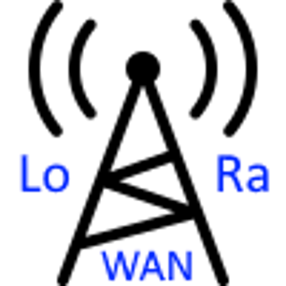

# ioBroker.lorawan

## lorawan adapter for ioBroker
The adapter communicates bidirectionally with LoraWan devices via LoRaWAN Network Server via MQTT protocol.
“The Thinks Network” and “Chirpstack” are supported now, more could follow later. 
Adapter was created in collaboration with Joerg Froehner LoraWan@hafenmeister.com

The documentation Wiki is here: https://github.com/BenAhrdt/ioBroker.lorawan/wiki
 
For now there is documentation in English here: https://wiki.hafenmeister.de

### Home Assistant sensor discovery

For numeric sensor entities, the bridge assigns Home Assistant `device_class` and `state_class` attributes according to the adapter's counter-first convention. Current measurements use `measurement`. Wind direction states with the ioBroker role `value.direction.wind` use the device class `wind_direction` and state class `measurement_angle`; an existing unit is retained, while `°` is added if no unit is defined. Energy values in `Wh`, `kWh`, or `MWh`, as well as values identified by an ioBroker energy or consumption role, are treated as consumption counters and use `total_increasing` for Home Assistant energy statistics. If a quantity cannot be distinguished reliably from a consumption reading, the bridge prefers counter semantics: `m³` and `ft³` are published as `gas` with `total_increasing`, and `L` as `water` with `total_increasing`. `mL` and `gal` remain generic `volume` values. Ambiguous concentration units such as `ppm`, `ppb`, or `µg/m³` do not imply a specific substance. `L/min`, `L/s`, and `m³/h` use `volume_flow_rate`.

## Changelog
<!--
	Placeholder for the next version (at the beginning of the line):
	### **WORK IN PROGRESS**
-->
### 1.22.33 (2026-08-19)
- (BenAhrdt) Add Home Assistant wind direction and angle measurement classification

### 1.22.32 (2026-08-19)
- (BenAhrdt) Align Home Assistant sensor device classes, state classes, and units with the current specification

### 1.22.31 (2026-07-09)
- (BenAhrdt) Add selection of ToIob source id

### 1.22.30 (2026-07-07)
- (BenAhrdt) Add PIR Mini device Profile
- (BenAhrdt) Add possibillity to ad states to downlink numbers

### 1.22.29 (2026-07-06)
- (BenAhrdt) Add some roles and units to assignhandler

[Older changes can be found there](CHANGELOG_OLD.md)

## DISCLAIMER
The rights of the trademarks and company names, remain with their owners and have no relation to this adapter. The fairuse policy must continue to be adhered to by the operator of the adapter. If this repository is forked, it must be cited as the source.

LoRa® is a registered trademark or service mark of Semtech Corporation or its affilantes.

LoRaWAN® is a licensed mark.

I have no affiliation with the mentioned brands or their subsidiaries, logos, or trademarks, nor am I endorsed by them.

## License
MIT License

Copyright (c) 2025-2026 BenAhrdt <bsahrdt@gmail.com>  
Copyright (c) 2025-2026 Joerg Froehner <LoraWan@hafenmeister.com>

Permission is hereby granted, free of charge, to any person obtaining a copy
of this software and associated documentation files (the "Software"), to deal
in the Software without restriction, including without limitation the rights
to use, copy, modify, merge, publish, distribute, sublicense, and/or sell
copies of the Software, and to permit persons to whom the Software is
furnished to do so, subject to the following conditions:

The above copyright notice and this permission notice shall be included in all
copies or substantial portions of the Software.

THE SOFTWARE IS PROVIDED "AS IS", WITHOUT WARRANTY OF ANY KIND, EXPRESS OR
IMPLIED, INCLUDING BUT NOT LIMITED TO THE WARRANTIES OF MERCHANTABILITY,
FITNESS FOR A PARTICULAR PURPOSE AND NONINFRINGEMENT. IN NO EVENT SHALL THE
AUTHORS OR COPYRIGHT HOLDERS BE LIABLE FOR ANY CLAIM, DAMAGES OR OTHER
LIABILITY, WHETHER IN AN ACTION OF CONTRACT, TORT OR OTHERWISE, ARISING FROM,
OUT OF OR IN CONNECTION WITH THE SOFTWARE OR THE USE OR OTHER DEALINGS IN THE
SOFTWARE.
