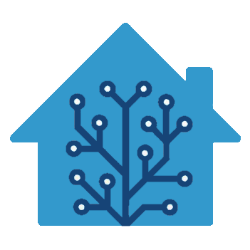

# Features

* [Notifications](#notifications)
* [Voice control](#voice-control)
* [Video / live streams](#video--live-streams)
* [Trouble shooting](#trouble-shooting)

## Notifications
You can add notifications via the `sendTo` functionality or by writing the state into `lovelace.X.notifications.add`:

```js
sendTo('lovelace.0', 'send', {message: 'Message text', title: 'Title'}); // full version
sendTo('lovelace.0', 'send', 'Message text'); // short version
```

or

```js
setState('lovelace.0.notifications.add', '{"message": "Message text", "title": "Title"}'); // full version
setState('lovelace.0.notifications.add', 'Message text'); // short version
```

## Voice control
All commands from the web interface are written into the `lovelace.X.conversation` state with `ack=false`. You can write a script that reacts on the request and answers:

```js
on({id: 'lovelace.0.conversation', ack: false, change: 'any'}, obj => {
   console.log('Question: ' + obj.state.val);
   if (obj.state.val.includes('time')) {
      setState('lovelace.0.conversation', new Date().toString(), true); // true marks this as the answer
   } else {
      setState('lovelace.0.conversation', 'Sorry I don\'t know, what do you want', true);
   }
});
```

## Video / live streams
You can display a video or live stream (e.g. a doorbell / Ring camera) with an `iframe` card pointed at the stream URL. For a fixed URL a plain `iframe` card with `url:` is enough. If the URL changes (a new clip / live session each time), read it dynamically from a state with the [config-template-card](https://github.com/iantrich/config-template-card) (install via HACS).

Map the ioBroker state that holds the URL (e.g. `ring.0.doorbell_625818110.Livestream.url`) to an `input_text` entity, then:

```yaml
type: custom:config-template-card
variables:
  URL: states['input_text.doorbell_625818110_Livestream_url'].state
entities:
  - input_text.doorbell_625818110_Livestream_url
card:
  type: iframe
  url: ${URL}
  aspect_ratio: 100%
  title: Letztes Live Video
```

(Thanks to @Vippis2000 in [#575](https://github.com/ioBroker/ioBroker.lovelace/issues/575).)

## Trouble shooting
If you messed up the YAML code and see a blank page but still have the top menu, enable edit mode (if not already enabled) from the menu and then open the menu again to access the "RAW Yaml Editor", where you see the complete YAML code and can clean it up.

If that does not help, open the object `lovelace.*.configuration` in the raw editor in ioBroker and have a look there. You can also restore that object from a backup — it contains the complete configuration of your visualization.