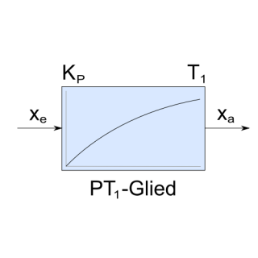

# ioBroker.lowpass-filter

## lowpass-filter adapter for ioBroker

You can filter states of type number according to the filter algorithm of a first-order low-pass filter.
e.g. you can filter power values to cut power peeks.

## Changelog
<!--
	Placeholder for the next version (at the beginning of the line):
	### **WORK IN PROGRESS**
-->
### 2.4.1 (2025-01-05)
* (BenAhrdt) copyrigth changed to 2025

### 2.4.0 (2024-12-04)
* (BenAhrdt) Changed ESLint

### 2.3.1 (2024-11-26)
* (BenAhrdt) Changed Schema and responsive tags

### 2.3.0 (2024-08-13)
* (BenAhrdt) Update Dependencies: "js-controller": ">=5.0.19"
  Check your System before installing new Version

### 2.2.5 (2024-08-09)
* (BenAhrdt) correct changes for check and service bot

### 2.2.4 (2024-08-09)
* (BenAhrdt) changes for check and service bot

### 2.2.3 (2023-11-12)
* (BenAhrdt) input check for node => 16

### 2.2.2 (2023-11-02)
* (BenAhrdt) correction in jsonconfig schema

### 2.2.1 (2023-04-26)
* (BenAhrdt) ukrain language added

### 2.2.0 (2023-04-13)
* (BenAhrdt) added some filtertimes (1s-9s)

### 2.1.0 (2023-04-06)
* (BenAhrdt) updated to actual dependencies

### 2.0.8 (2023-02-16)
* (BenAhrdt) limit of decimal places reduced to 8

### 2.0.7 (2023-02-16)
* (BenAhrdt) limit of decimal places implemented

### 2.0.6 (2023-01-20)
* (BenAhrdt) inplement the unit of the filtered falue

### 2.0.5 (2022-06-17) - readme changed
* (BenAhrdt) change some wrong links in readme file

### 2.0.4 (2022-06-16) - loglevel check deleted
* (BenAhrdt) dont check loglevel before log.debug()

### 2.0.3 (2022-06-13) - translate io-package
* (BenAhrdt) implement some translations into io-package

### 2.0.2 (2022-06-13) - adpater type changed
* (BenAhrdt) adapter tpe changed into misc-data

### 2.0.1 (2022-06-08) - loglevel implemented
* (BenAhrdt) logging just in loglevel mode "debug"

### 2.0.0 (2022-06-04)
* (BenAhrdt) workflow implemented

### 1.14.9
* (BenAhrdt) fixed some changes in readme

### 1.14.8
* (BenAhrdt) implements translation

## License
MIT License

Copyright (c) 2025 BenAhrdt <bsahrdt@gmail.com>

Permission is hereby granted, free of charge, to any person obtaining a copy
of this software and associated documentation files (the "Software"), to deal
in the Software without restriction, including without limitation the rights
to use, copy, modify, merge, publish, distribute, sublicense, and/or sell
copies of the Software, and to permit persons to whom the Software is
furnished to do so, subject to the following conditions:

The above copyright notice and this permission notice shall be included in all
copies or substantial portions of the Software.

THE SOFTWARE IS PROVIDED "AS IS", WITHOUT WARRANTY OF ANY KIND, EXPRESS OR
IMPLIED, INCLUDING BUT NOT LIMITED TO THE WARRANTIES OF MERCHANTABILITY,
FITNESS FOR A PARTICULAR PURPOSE AND NONINFRINGEMENT. IN NO EVENT SHALL THE
AUTHORS OR COPYRIGHT HOLDERS BE LIABLE FOR ANY CLAIM, DAMAGES OR OTHER
LIABILITY, WHETHER IN AN ACTION OF CONTRACT, TORT OR OTHERWISE, ARISING FROM,
OUT OF OR IN CONNECTION WITH THE SOFTWARE OR THE USE OR OTHER DEALINGS IN THE
SOFTWARE.