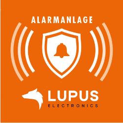
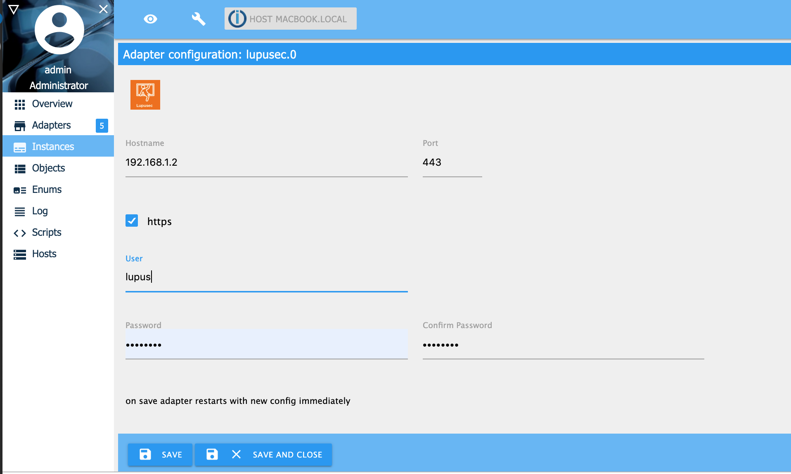
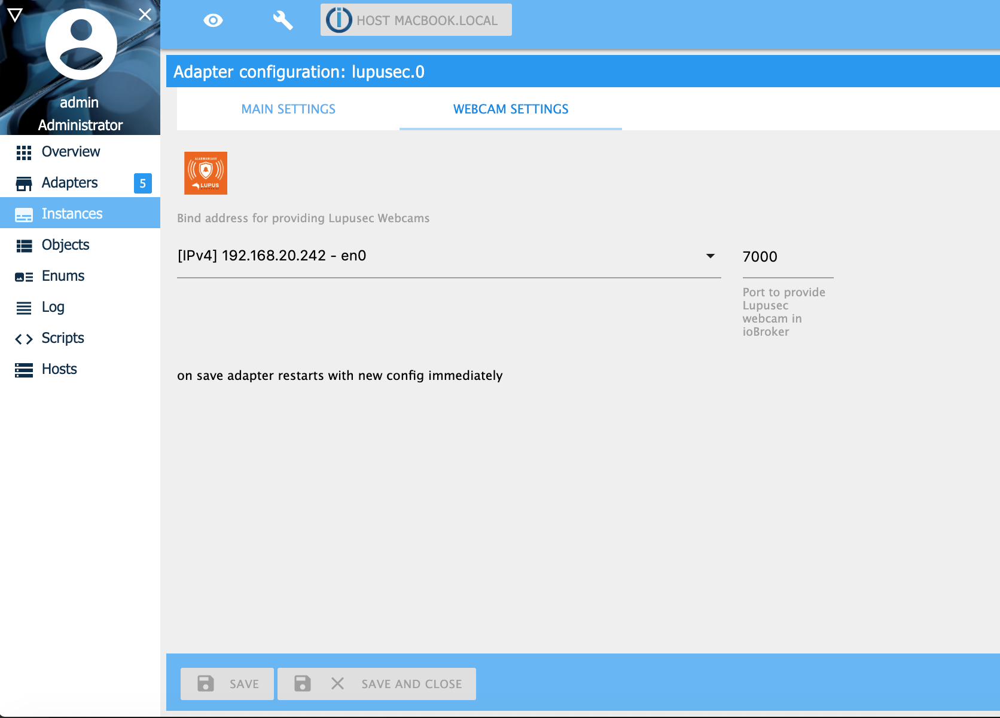
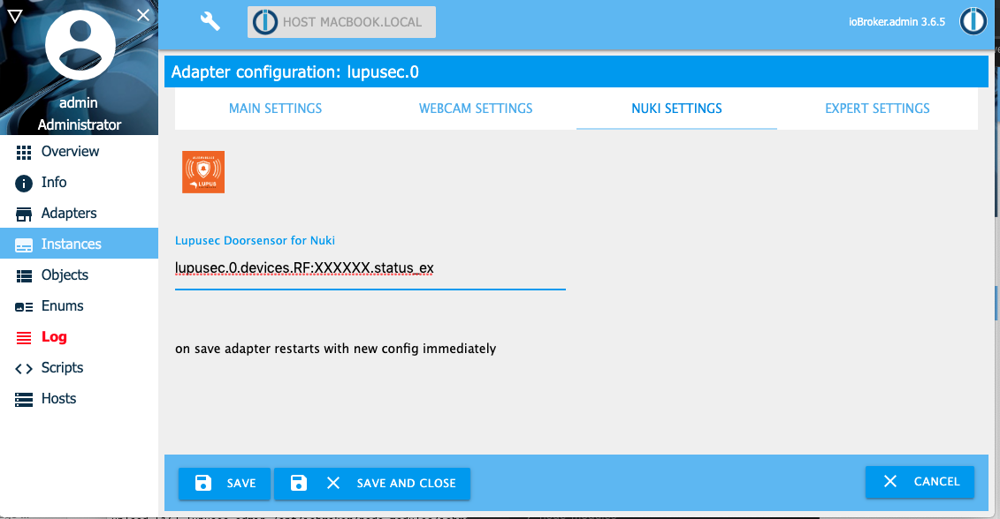
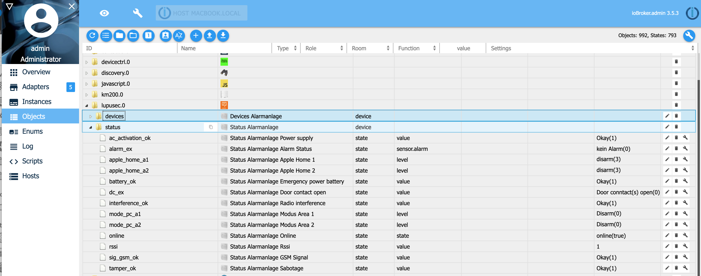
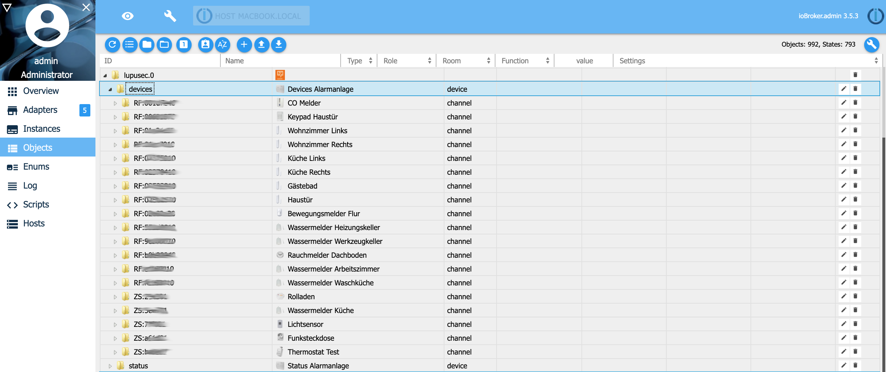
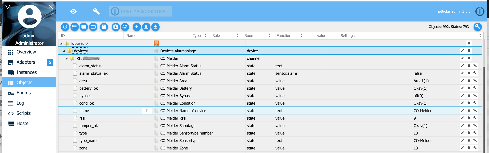
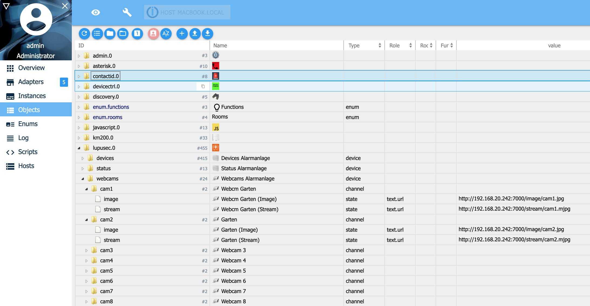
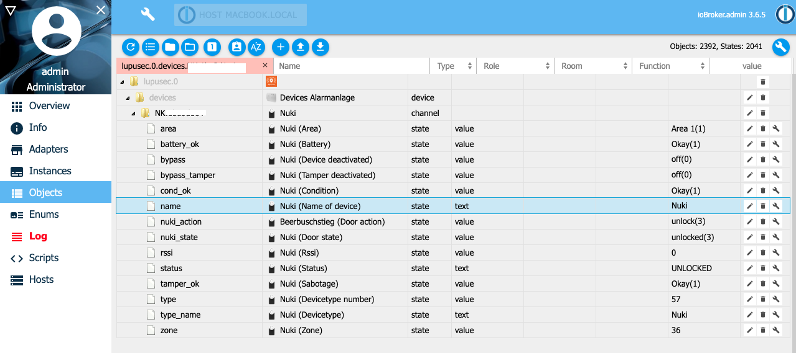

# ioBroker.lupusec


[](https://www.npmjs.com/package/iobroker.lupusec)
[](https://www.npmjs.com/package/iobroker.lupusec)  
[](https://nodei.co/npm/iobroker.lupusec/)

**Requires node.js 18.0 or higher and Admin v5!**

This adapter connects the Lupusec alarm system XT1 Plus, XT2, XT2 Plus and XT3 with ioBroker.
The XT1 (without Plus) will not be supported. You can read the status of the Lupusec sensors
like door, windows, water, smoke sensors and the status of the alarm system.
For example, you can turn on switches, control your shutter and arm/disarm the alarm system.
Because the adapter has to call the alarm system a few times to get all the information for the status and device the CPU load and memory usage is high. To decrease the CPU load you can increase the polltime.

You can find detailed information here: [Lupus](https://www.lupus-electronics.de/en)

## Installation

1. Install the adapter
   The easiest way is to configure the lupusec.iobroker adapter via the discovery adapter in ioBroker. The discovery adapter search for the right IP-address of the Lupusec alarm system. The other way is it, to configure it manually

2. Manually configuration of the adapter
   Choose the IP-Address or hostname and port from the Lupusec alarm system. If you use https, activate the https flag. The CPU load is higher with https insted without http.
   For only reading the status, select a user without write access. If you want to change the status
   (for example, turn on/off the light or arm/disarm the alarm) pick a user with write access.
   With polltime you can configure, how often the alarm system shall be called. A high polltime decrease the CPU load.

    
    If you have surveillance cams connected to your Lupusec alarm system you can provide them in ioBroker. The Lupusec adapter finds all Lupusec cams by it own. You have to enter a address (your ioBroker IP addrss or 0.0.0.0) and a port for later connecting to the cams.
    
    If you have your Nuki door opener connected to your Lupusec alarm system you can use it from ioBroker too. On the ioBroker instance admin menu, you can enter your Lupusec door sensor which is mounted to the Nuki door. If you now open the door where the Nuki is mounted you have the additional state 'door opened' instead only 'unlocked'. If you do not have a Lupusec door sensor at the Nuki door, you will only see the states 'locked' or 'locked'.
    

By default all Lupusec devices will be on the ioBroker object tab displayed.
Fully supported and individually adapted are following devices:

-   Door contact / window contact (Type 4)
-   Water sensor (Type 5)
-   Panic Button (Type 7)
-   Motion detector / 360 degree motion detector (Type 9)
-   CO sensor (Type 13)
-   Smoke Detector / Heat Detector (Type 14)
-   Temperature Sensor V2 (Type 20)
-   Siren inside (Type 21)
-   Status Indicator / Mini Indoor Siren (Type 22)
-   Power Switch (Type 24)
-   1 channel relay with ZigBee repeater (Type 24)
-   2 channel relay with ZigBee repeater (Type 24)
-   Repater V2 (Type 26)
-   Keypad (Type 37)
-   Glass sensor (Type 39)
-   Siren inside (Type 45)
-   Siren outside (Type 48)
-   Power Switch Meter (Type 48)
-   Electric Meter (Type 50)
-   Universal IR Controller (Type 52)
-   Room sensor V1 (Type 54)
-   LCD temperature sensor (Type 54)
-   Mini temperature (Type 54)
-   Nuki door opener (Type 57)
-   Heat detector (Type 58)
-   Dimmer (Type 66)
-   Light Switch V2 (Type 66)
-   Hue (Type 74)
-   Roller shutter relay V1 (Type 76)
-   Radiator thermostat (Type 79)
-   Radiator thermostat V2 (Type 79)
-   Light sensor (Type 78)
-   Scenario Switch V2 (Type 81)
-   Shock sensor (Type 93)
-   Smoke detector V2 (Type 14)
-   Inwall relay with dimmer V3 (Type 66)
-   Keypad Outdoor V2 (Type 17)

The two states apple_home_a1 and lupusec.0.status.apple_home_a2 for the Apple Homekit adapter yahka supported. You can turn in addition to the lupusec states the alarm system for area 1 and 2 on and off.

If you own a device that is not listed in the list above, please contact me
at Thorsten Stueben <thorsten@stueben.de>.

## Objects

### Lupusec Status

ioBroker offers you the same status objects as in the Lupusec app does.


### Lupusec Devices

You find all supported Lupsec sensors and devices under 'devices'. If a device is missing, please contact me.

Detailed view of a sensor or device. In this example you see the CO sensor. On CO alarm the state 'alarm_status_ex' change to true and 'alarm_status' change to 'CO'.


### Lupusec Webcams

You find all connected surveillance cams under 'webcams'. You can copy the link provided in the 'image' and 'stream' state to your web browser for opening.


### Lupusec Nuki

You find your Nuki door opener under 'devices' like the Lupusec devices. The Nuki provides 2 states. The state nuki_state shows you the actuall state of the Nuki door opener like door is locked or unlocked. With the state nuki_action you can open, lock or unlock your door.  


### Lupusec SMS

If you ar using the Lupusec XT1+, XT2+ or XT3 with an SMS sim card, you can send SMS with following states:


Alternative you can send SMS from your JavaScript with following command:

```
sendTo('lupusec.0', 'sms', { number: '+4917247114711', text: 'Test message' });
```

if you are using the SMS gateway you can use following command in your script:

```
sendTo('lupusec.0', 'smsgw', { number: '+4917247114711', text: 'Test message' });
```

## Troubleshooting

If you start the Lupusec Adapter and you get the error that the alarm system is not reachable please try to ping the system from a terminal window of your ioBroker system.

```
ssh <user>@<iobroker-ip-address>
sudo -u iobroker ping <lupsec-ip-address>
```

If you get the error _ping: icmp open socket: Operation not permitted_ please do following and start afterwards the Lupusec adapter again.

```
ls -l `which ping`
sudo chmod u+s `which ping`
```

## Changelog

### 2.0.0 (06.01.2023)

-   (Stübi) Redesign - changed everything from JavaScript to TypeScript
-   (Stübi) Using axios for http requests
-   (Stübi) the configuration changed. You have to edit the configuration

## Planed

Following things are planed in the future:

-   support more sensors / devices
-   writing a [documentation](docs/en/info.md) for every sensor / device

## License

The MIT License (MIT)

Copyright (c) 2024 Thorsten Stueben <thorsten@stueben.de>

Permission is hereby granted, free of charge, to any person obtaining a copy
of this software and associated documentation files (the "Software"), to deal
in the Software without restriction, including without limitation the rights
to use, copy, modify, merge, publish, distribute, sublicense, and/or sell
copies of the Software, and to permit persons to whom the Software is
furnished to do so, subject to the following conditions:

The above copyright notice and this permission notice shall be included in
all copies or substantial portions of the Software.

THE SOFTWARE IS PROVIDED "AS IS", WITHOUT WARRANTY OF ANY KIND, EXPRESS OR
IMPLIED, INCLUDING BUT NOT LIMITED TO THE WARRANTIES OF MERCHANTABILITY,
FITNESS FOR A PARTICULAR PURPOSE AND NONINFRINGEMENT. IN NO EVENT SHALL THE
AUTHORS OR COPYRIGHT HOLDERS BE LIABLE FOR ANY CLAIM, DAMAGES OR OTHER
LIABILITY, WHETHER IN AN ACTION OF CONTRACT, TORT OR OTHERWISE, ARISING FROM,
OUT OF OR IN CONNECTION WITH THE SOFTWARE OR THE USE OR OTHER DEALINGS IN
THE SOFTWARE.
