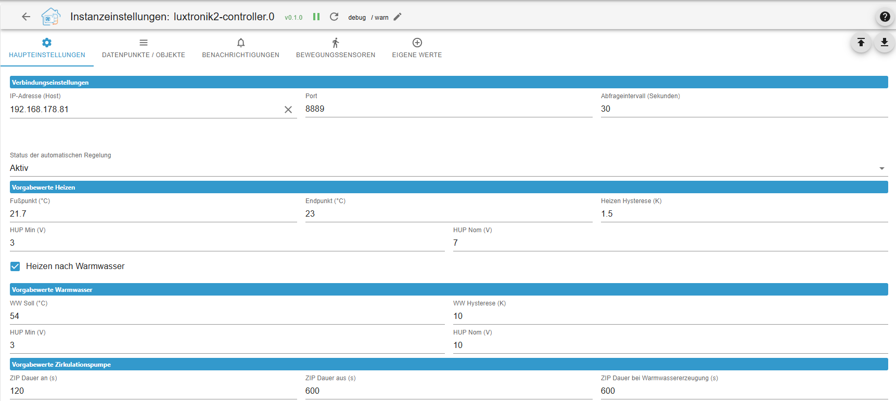
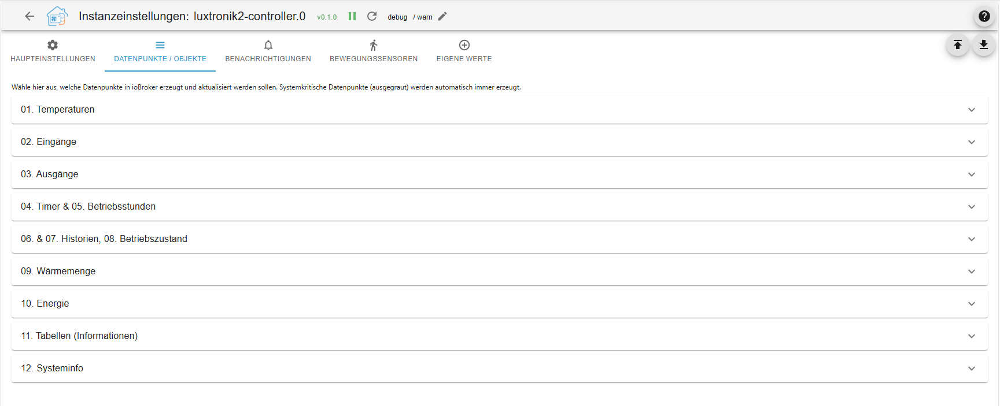

# ioBroker.luxtronik2-controller

**Tests:** 

## luxtronik2-controller adapter for ioBroker

This ioBroker adapter enables the local control and monitoring of heat pumps with [Luxtronik 2.x controllers](https://www.alpha-innotec.com/en/products/accessories/control/luxtronik) (e.g., Alpha Innotec, Novelan). The adapter is written entirely in TypeScript.

## Acknowledgements & History

This project builds upon the preliminary work of existing open-source projects. Special thanks go to:

[Bouni](https://github.com/bouni/luxtronik-2) Whose pioneering work and code developments form the essential foundation for communication with Luxtronik controllers.

[Coolchip:](https://github.com/coolchip/luxtronik2) For the fundamental reverse engineering of the Luxtronik network protocol.

[UncleSamSwiss:](https://github.com/UncleSamSwiss/ioBroker.luxtronik2) For the original ioBroker adapter.

Innovations in this version: The luxtronik2-controller natively integrates TCP communication (Port 8888 / 8889) and does not rely on external libraries. Additionally, controlling macros, a logic for compressor protection, and automated datapoint management were implemented.

### Features

- **Native TCP Communication:** Direct connection to the heat pump without any additional overhead.
- **Compressor Protection (Cycle Optimization):** Intelligent merging of heating and domestic hot water (DHW) cycles to significantly reduce compressor starts.
- **Dynamic HUP Control:** Automatic voltage adjustment of the heating circulation pump (HUP) based on the flow and return temperature spread for maximum efficiency.
- **Integrated Actions (Macros):** Pre-defined control logic for forced heating, DHW requests, and the circulation pump (ZIP) – including an automatic fallback to safe default values.
- **Demand-Driven Circulation (ZIP):** Control your circulation pump via existing ioBroker motion sensors or directly via external actuators (e.g., Shelly) – entirely without hardware modifications to the heat pump.
- **Custom Datapoints:** Measured values (Index 3004) and parameters (Index 3003) can be flexibly added via the adapter configuration. Unix timestamps are automatically parsed into human-readable formats.
- **Extended Status Texts & Calculations:** Live calculation of temperature spread, thermal energy, and detailed text outputs of current system states (including offsets, frost protection, and cooling status).
- **Intelligent Notification System:** Send error codes and critical shutdowns (like flow rate issues) directly to Telegram or the ioBroker notification system – complete with cooldown spam protection.
- **Automated DTA Backup:** Scheduled downloads of DTA diagnostic logs directly from the heat pump to your ioBroker storage for easy analysis (e.g., in OpenDTA).
- **Automatic Object Management:** Deselected or deleted datapoints, as well as empty folder structures, are automatically and cleanly removed from ioBroker upon an adapter restart.
- **Broad Compatibility:** Full support for older (V2.x) and newer (V3.x) firmware generations (e.g., Alpha Innotec, Novelan) utilizing dynamic scaling factors.

## ⚠️ Warning

Some settings provided by this integration can affect the performance of your heat pump. Misconfigurations can cause the controller to enter a fault state, which requires a manual on-site reset.

This project aims to protect your heat pump by restricting the configuration options to safe values. However, no guarantees can be made. Please be careful, consult your Luxtronik manual, and do not change any settings that you do not fully understand.

## 🔧 Compatibility

The integration allows you to monitor and control heat pumps with a Luxtronik2 controller. It works locally without internet access.
It was and is being tested with an LWD50A (LD5) from Alpha Innotec.
It is used by manufacturers such as:

- Alpha Innotec,
- Siemens,
- Novelan,
- Roth,
- Elco,
- Buderus,
- Nibe,
- Wolf Heiztechnik.

## ⚠️ Disclaimer ⚠️

_This project is not affiliated with Alpha Innotec, Novelan, ait-deutschland GmbH, or any other company. It is a personal project that is maintained in spare time. Use at your own risk._

## Reporting Bugs & Contributing

Bug reports, compatibility notes for specific firmware versions, or feature requests can be submitted via the issue tracker in the [GitHub-Repository](https://github.com/TbsJah/ioBroker.luxtronik2-controller/issues).

## Information

[Info Deutsch](/#/docs/adapterref/iobroker.luxtronik2-controller/documentation/readme_de.md)

[Info English](/#/docs/adapterref/iobroker.luxtronik2-controller/documentation/readme_en.md)

## Changelog

// ### **WORK IN PROGRESS**

### **WORK IN PROGRESS**

### 🚀 Features

- **New Telemetry Data added:** The adapter now automatically reads and creates crucial system values based on the BenPru standard: Compressor frequency (Index 231), Current heat output (Index 257), and Current power consumption (Index 268).
- **Extended Shutdown Codes (Outage History):** The internal database for heat pump shutdowns has been massively expanded. The adapter now recognizes and translates all 32 official Luxtronik shutdown reasons (e.g., _Inverter pause_, _Hot gas pause_, _Limit power consumption_) into detailed clear text (English & German). This ensures much more precise troubleshooting in the object tree and highly informative Telegram alerts.

**🛠 Bugfixes & Enhancements**

- **Visibility Filter (Command 3005) fixed:** Resolved a major logic flaw in the `cleanupStates` function. Previously, the adapter ignored unsupported hardware components (like missing cooling or solar modules) but failed to delete their remnants from the ioBroker object tree. Obsolete datapoints and empty folders are now rigorously removed upon startup.
- **Precise Visibility Mapping implemented:** The hide-logic (Command 3005) no longer relies on broad folder names. Instead, it now uses the exact, manufacturer-specific visibility index (`visiIndex`) for every individual module to accurately show or hide features.

- **HUP Optimization (Temperature Spread Control):** Dynamic voltage adjustment of the heating circulation pump during heating operation now only triggers after the state has been active for at least 10 minutes and compressor 1 (`VD1`) is actively running. This prevents premature voltage shifts during startup phases before the thermal spread has stabilized.
- **Outage & Malfunction Monitoring:** Fixed tracking logic in `checkAndSendOutageNotifications`: Luxtronik outage code `0` (_Heat pump malfunction / WP-Störung_) is no longer erroneously skipped. Both low flow issues and direct heat pump shutdowns now reliably dispatch alarms via Telegram and the ioBroker Notification Center.

### 0.14.1 (2026-10-06)

- remove log entry for chunk reporting

### 0.14.0 (2026-10-06)

**🚨 BREAKING CHANGE / IMPORTANT HARDWARE NOTICE 🚨**

**Critical Firmware Bug in Alpha Innotec / Novelan Controllers (V1.90.x & V2.90.x)**
The manufacturer has introduced a massive bug in the local Luxtronik protocol (Port 8889) with the firmware releases **V1.90.0** and **V2.90.0**. Whenever a smart home system (ioBroker, Home Assistant, etc.) attempts to write a parameter value to the heat pump, the controller freezes and forces a **hard reboot** of the system after about 10 seconds. Read operations are not affected.

👉 **Adapter Protective Measure:** To protect your hardware from continuous reboots and potential damage, a **protective shield (firewall)** has been implemented into the adapter.
As soon as the adapter detects firmware V1.90.x or V2.90.x, **all write commands are strictly blocked**. Instead, a corresponding warning is printed to the ioBroker log.

👉 **Solution for Affected Users:** Please contact the manufacturer's support or your installer to request an over-the-air (remote) downgrade to the previous stable version (**V1.89** or **V2.89**). If you still have the old firmware file saved locally, you can flash it via USB stick directly at the display. Once the system is running on V.89 again, the adapter will automatically release the write commands!

**✨ New Features & Improvements**

- **Hardware Protection Shield implemented:** Dynamic firmware verification before every write operation to protect against the reboot bug present in firmware versions 1.90.x and 2.90.x.
- **Visibilities completely overhauled:** The internal logic for command 3005 has been rewritten (dynamic detection of 1-byte and 4-byte arrays). The adapter now reads the visibility flags flawlessly across **all** firmware versions. Hiding non-existent hardware in the object tree now works perfectly for V1.x and V2.x systems without causing crashes or timeouts!

**🛠 Bugfixes & Refactoring**

- **Adapter Configuration (UI):** Removed outdated warning labels regarding the "Hide unsupported parameters" checkbox, as this feature is now completely stable across all controller generations.
- **Network / WebSocket:** The experimental password transmission for port 8214 has been completely removed, as the communication issue was proven to be caused by the manufacturer's firmware bug. The WebSocket connection for genuine V3.x firmwares operates cleanly again using the proven standard handshake.

### 0.13.1 (2026-10-02)

- **Fix (Circulation/ZIP):** Fixed a bug where the `Virtual_ZIP_Status` datapoint would remain stuck on `true` when using external relays (e.g., Shelly), even though the hardware relay was correctly turned off. The state reset logic has been decoupled and is now guaranteed to execute, ensuring the ioBroker interface stays perfectly synchronized with the actual hardware state.

### 0.13.0 (2026-10-02)

- **Bugfixes:**
    - **Critical DHW Target Fix:** Fixed an issue where the hot water target temperature was incorrectly written to parameter 2 instead of 105. This resolves unexpected temperature jumps (e.g., to 65°C) and socket timeouts on various heat pump models.
    - **Write Queue Timeout:** Added a maximum wait timeout to the write queue lock for legacy V1.x firmware to prevent potential infinite loops during read-write collisions.
    - **Backup Manager Multi-Instance Fix:** The automated DTA backup cron job is now safely scoped to the specific adapter instance, preventing conflicts when running multiple heat pumps on the same ioBroker host.
- **Under the Hood / Refactoring:**
    - **Centralized Typings:** Completely refactored the TypeScript architecture by introducing a centralized `LuxtronikAdapter` interface (`types.ts`). Replaced all fragmented, local interfaces across sub-modules to ensure strict, project-wide type safety and better maintainability.

### 0.12.1 (2026-09-30)

- **Bugfixes:**
    - **Fixed Null-Values on Startup:** Virtual states for the circulation pump logic (`Actions.Activate_Zip` and `03_Outputs.Virtual_ZIP_Status`) are now explicitly initialized to `false` during adapter startup. This prevents undefined `null` values in the object tree, ensuring immediate compatibility with visualizations and logic scripts (like Blockly) right from the first second.

## License

MIT License

Copyright (c) 2026 TbsJah <github.tbsjah@googlemail.com>

Permission is hereby granted, free of charge, to any person obtaining a copy
of this software and associated documentation files (the "Software"), to deal
in the Software without restriction, including without limitation the rights
to use, copy, modify, merge, publish, distribute, sublicense, and/or sell
copies of the Software, and to permit persons to whom the Software is
furnished to do so, subject to the following conditions:

The above copyright notice and this permission notice shall be included in all
copies or substantial portions of the Software.

THE SOFTWARE IS PROVIDED "AS IS", WITHOUT WARRANTY OF ANY KIND, EXPRESS OR
IMPLIED, INCLUDING BUT NOT LIMITED TO THE WARRANTIES OF MERCHANTABILITY,
FITNESS FOR A PARTICULAR PURPOSE AND NONINFRINGEMENT. IN NO EVENT SHALL THE
AUTHORS OR COPYRIGHT HOLDERS BE LIABLE FOR ANY CLAIM, DAMAGES OR OTHER
LIABILITY, WHETHER IN AN ACTION OF CONTRACT, TORT OR OTHERWISE, ARISING FROM,
OUT OF OR IN CONNECTION WITH THE SOFTWARE OR THE USE OR OTHER DEALINGS IN THE
SOFTWARE.