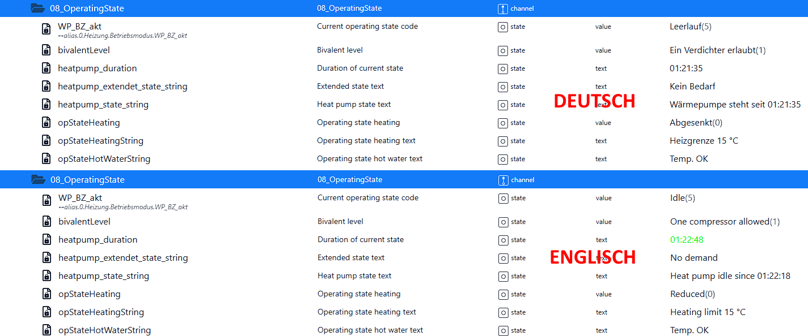
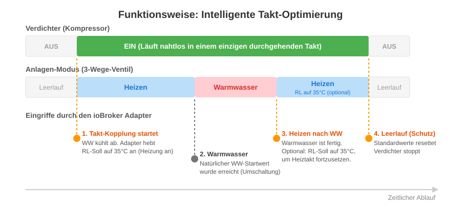
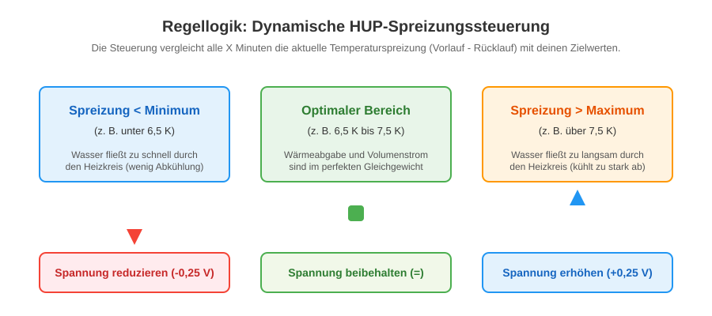

## Configuration of the Adapter Instance

After installing the adapter, the configuration interface opens. This is divided into various tabs to make setup as clear as possible.

### 1. Tab: Connection

This page contains the basic network settings for communication with the Luxtronik controller as well as the display language of the adapter.

#### Connection Settings

- **IP Address (Host):** Enter the local IP address of your heat pump in your network here (e.g., `192.168.178.12`).
- **Heat Pump Port:** The communication port of the controller.
    - `8889` = Standard port for classic TCP communication (often used with firmware V2.x).
    - `8214` = WebSocket port (typically required for newer systems starting from firmware V3.81x).
- **Polling Interval (Seconds):** Specifies the time interval at which the adapter retrieves new measured values and parameters from the heat pump (default: 45 seconds).

> 💡 **IMPORTANT TIP REGARDING THE POLLING INTERVAL:**
> Do **not** choose too low a value! Polling too frequently (e.g., every 10 seconds) permanently floods the internal processor of the Luxtronik controller with requests. This causes high CPU load on the heat pump, making the controller (both on the touch display and on the network) extremely sluggish. Values between 45 and 60 seconds are recommended.

---

#### Options

- **Language for Texts and Values:** This setting determines the language in which text-based states and operating modes are written to the ioBroker data points. The adapter automatically translates the system's numerical codes into readable text.

_Example: When the heat pump is heating water, the adapter writes either `Warmwasser` (German) or `Hot water` (English) into the object tree depending on your selection._

### 2. Tab: Cycle Optimization

By default, the Luxtronik controller treats heating and domestic hot water cycles strictly separated. This often causes the compressor to stop after hot water preparation, only to restart shortly after for a heating cycle (increased wear). This adapter intelligently couples these operations so that the compressor runs seamlessly and efficiently in a single continuous cycle.

- **Enable Intelligent Cycle Optimization:** Enables the overarching logic to prevent unnecessary compressor stops.
    - **Trigger Rule (Pre-Ignition):** If the domestic hot water is cooling down `(DHW Target - DHW Actual ≥ DHW Hysteresis - 1.5 K)` **AND** heating demand exists simultaneously `(Return Actual ≤ Return Target)` while the summer heating limit is not active, the adapter intervenes.
    - **Action:** The adapter directly starts heating operation and temporarily sets the return target value to 35°C to force the compressor to start immediately. If the system switches to hot water shortly after, the compressor simply continues running.
- **Force Heating After Hot Water:** When active, the adapter also checks the system _after_ a hot water cycle. The return target value remains raised to 35°C so that the compressor does not shut down after hot water preparation, but immediately continues the heating cycle.

> **⚠️ Important Note:**
> If you use this cycle optimization, it is **strongly recommended** to enable the option _"Force default values during idle"_ in the _"Idle"_ tab. This is the only way to guarantee that the temporarily manipulated 35°C target value is cleanly reset back to your normal heating values at the end of the cycle!

### 3. Tab: Idle (Hardware Protection)

The Luxtronik controller stores modified parameters in an internal flash memory that can only withstand a limited number of write cycles (EEPROM Flash Wear). To protect this memory, the adapter only performs write operations when the system is actively running (heating or hot water).

As soon as the heat pump switches to **idle (standby)**, the optimization ends. To prevent the system from continuing to run with temporary (modified) parameters from the optimization, the adapter forces the controller back into a safe initial state.

> **💡 Urgent Recommendation:**
> If you use the **intelligent cycle optimization** (coupling of hot water and heating) and/or the **dynamic HUP control**, you should definitely enable setting the default values during idle! This is the only way to ensure that after an adapter intervention, the system continues working with your exact original desired values.

- **Default Values:** Be sure to enter the exact original default values of your heating system here (e.g., standard hysteresis for heating/hot water, base point, end point, and pump voltages).
- **Visual Heating Curve:** For better orientation, the adapter generates a live graphical preview of your heating curve (return target) as soon as you enter the base and end points. _(A big thank you to [mnemotron.de](https://www.mnemotron.de/lux/heatcurve.html) for the inspiration for this representation!)_

### 4. Tab: Heating Circulation Pump (HUP)

The heating circulation pump (HUP) transports the warm water from the heat pump into your heating circuit. However, a fixed pump output is inefficient: If it is too high, the water rushes through the pipes too quickly and cannot release heat optimally into the room. If it is too low, the water cools down too much and the heat pump loses efficiency.

This adapter solves this problem via **dynamic control based on the temperature spread** (difference between supply and return). During a heating cycle, the pump control voltage is increased or decreased in tiny steps at regular intervals to always stay precisely within the perfect target range.

> **⚠️ Important Prerequisites (Please check before activation!)**
>
> 1. **Hardware Compatibility:** Only use this function if your circulation pump is actually connected to the Luxtronik board via a control cable (0-10V or PWM)! If you have a pump that regulates the volume flow independently (e.g., a _Grundfos ALPHA2 AutoAdapt_ set to "Auto"), you must **not** activate this function. Otherwise, the adapter and the pump will permanently regulate against each other.
> 2. **Voltage Factor (Firmware):** Older V2.x firmwares expect the control voltage in a different data format than newer V3.x firmwares (e.g., on the LWCV 82). Make sure to select the correct hardware factor for your system in the configuration (`100` for V2.x vs. `10` for V3.x).
> 3. **Safety Reset (Idle):** Be sure to enable the function _"Force default values during idle"_ in the "Idle" tab. This ensures that at the end of the heating cycle, the pump falls back to its fixed standard voltage instead of remaining stuck at the manipulated value.

#### Configuring Your System

The optimal temperature spread is extremely individual for every house and depends on the heating system:

- **Underfloor Heating (UFH):** Works with a large volume of water and low temperatures. Here, a spread of **3 to 5 Kelvin** is often optimal.
- **Radiators:** Require higher supply temperatures and cool down more significantly in the room. Here, a spread of **7 to 10 Kelvin** is typically expected.

Enter the limit values suitable for your system under _Minimum/Maximum Spread_. The adapter will then check every _X minutes_ (setting interval) whether the spread is still within the target corridor. If the spread is too low (water flows too fast), the pump voltage is reduced by the set _step size_ (e.g., 0.25 V). If the spread is too high, it is gently increased.

### 5. Tab: Circulation Pump (ZIP)

The circulation pump (ZIP) ensures that hot water is immediately available at the taps in the house (e.g., shower, sink). However, if it runs continuously or too often via time control, it massively cools down the hot water storage tank (energy loss) and unnecessarily consumes electricity.

This adapter offers smart automations to let the ZIP run only exactly when it is actually needed.

- **Intelligent ZIP Optimization:** When active, the adapter monitors the heat pump. Circulation can thus run completely synchronously with hot water preparation, for example.
- **Run Time upon Activation:** Defines how long (in seconds) the pump should run when triggered by the adapter or manually (via the `Activate_Zip` switch in the object tree). Short intervals of 120 to 180 seconds are usually recommended to flush the pipe system with warm water once.
- **Motion Sensors (On-Demand):** The absolute saving potential! You can enter the ioBroker data points of your smart home motion sensors here (e.g., Zigbee sensors in the bathroom or kitchen). When someone enters the room, the adapter immediately starts a short circulation cycle. The water is warm as soon as you stand at the sink, and no energy is wasted.
- **External Actuators (e.g., Smart Plugs):** If your circulation pump is not connected directly to the Luxtronik board, but to a smart relay (e.g., Shelly, Osram Smart Plug, etc.), you can store the data points of the plugs here. The adapter then automatically switches your WLAN/Zigbee plugs on and off using the internal logic. _(Advantage: This causes 0 flash write operations on the heat pump's memory!)_

**💡 Tip! Hardware Protection (EEPROM Flash Wear - Please Note!)**
To minimize constant writing in the controller, set the regular ZIP times once to the Mon-Sun table and enter 00:00 - 00:00 there. Set the cycle times to Off: 60 minutes and On: 0 minutes.

**To reduce write operations on the controller, it is recommended to control the ZIP(s) via an external actuator ➔ 0 write operations in the controller!**
**For comparison:** Activation via the Luxtronik2 controller requires 4 write operations for the deaeration program. Using the ZIP control table requires between 4 (best case) and 14 (worst case) write operations in the flash memory per ZIP cycle.