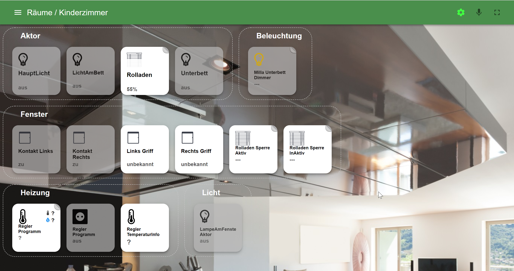

# ioBroker.material

  

React and Material UI interface.

## Installation
**Important!**
This adapter cannot be installed directly from GitHub. Only from npm.

## Usage
It is very important to know, that adapter shows only devices that added to some categories, like *rooms* or *function*.
Better if every device belongs to both categories. Because every device has the type and place.

## Supported types
### Switch
### Dimmer
### Media player
### Volume
### Group volume

## ToDO
* Cams (over extra Adapter)
* events (over extra Adapter)
* Main screen
* Narrow menu
* vacuum cleaner
* show bar for sliders to indicate position
* support of quality codes
* Maps (OpensStreetMap)
* Switch to default screen after X seconds
* Order states in info
* Use icons in weather and not text

## Credits
- Used icons from flaticon
- Volume knob from [here](https://codepen.io/blucube/pen/cudAz) By [Ed Hicks](https://twitter.com/blucube) - Inspired by a [dribbble shot](https://dribbble.com/shots/753124-Volume-Knob)  by [Ricardo Salazar](https://twitter.com/rickss)

<!--
	Placeholder for the next version (at the beginning of the line):
	### **WORK IN PROGRESS**
-->

## Changelog
### 1.3.1 (2023-02-10)
* (bluefox) Corrected the error with socket.io connection

### 1.3.0 (2022-12-27)
* (bluefox) Corrected URL widget

### 1.2.6 (2022-12-07)
* (bluefox) Corrected color of blinds in light mode

### 1.2.5 (2022-11-02)
* (bluefox) Corrected error with charts

### 1.2.2 (2022-10-18)
* (bluefox) migrated to MUIv5
* (bluefox) corrected error with blinds
* (bluefox) corrected error with echarts
* (bluefox) corrected error with background upload

### 1.1.2 (2021-12-28)
* (bluefox) Fixed double sending in the switch control

### 1.1.0 (2021-12-21)
* (bluefox) Changed the light style to be looks like old style

### 1.0.6 (2021-10-29)
* (bluefox) Added support of `iobroker.material` app

### 1.0.4 (2021-07-30)
* (bluefox) Corrected the size of icons

### 1.0.2 (2021-07-18)
* (bluefox) Redesign

### 0.13.9 (2020.08.22)
* (bluefox) Added support for new socket.io

### 0.13.8 (2020.03.19)
* (bluefox) Added sorting of rooms

### 0.13.5 (2020.03.12)
* (bluefox) Fixed error with stacked rooms

### 0.13.1 (2020.03.11)
* (bluefox) rebuild react

### 0.13.0 (2020.02.10)
* (Apollon77) compatibility to web 3.0

### 0.12.1 (2019.11.06)
* (bluefox) Packages were updated

### 0.10.6 (2019.01.29)
*  Added Chinese support

### 0.10.5 (2018.10.15)
* (bluefox) fix error with settings

### 0.10.3 (2018.09.02)
* (bluefox) implement color temperature
* (bluefox) implement cache of objects

### 0.10.1 (2018.09.02)
* (bluefox) GUI corrections

### 0.10.0 (2018.08.30)
* (bluefox) RGB was corrected

### 0.9.12 (2018.08.19)
* (bluefox) RGB was implemented

### 0.9.11 (2018.08.14)
* (bluefox) Fixed error with empty page

### 0.9.10 (2018.08.08)
* (bluefox) Crop of images was implemented
* (bluefox) Background of tiles is possible
* (bluefox) Double width of every tile is possible
* (bluefox) Group light control
* (bluefox) Custom URLs implemented

### 0.9.9 (2018.08.03)
* (bluefox) Order of tiles is implemented
* (bluefox) Support of dwd data

### 0.9.7 (2018.07.30)
* (bluefox) Implemented the weather widget

### 0.9.4 (2018.07.26)
* (bluefox) Bug-fixes

### 0.9.3 (2018.07.25)
* (bluefox) Many changes

### 0.9.2 (2018.07.21)
* (bluefox) Update logic was implemented (only with web 2.4.1)

### 0.9.1 (2018.07.20)
* (bluefox) Volume control was implemented

### 0.8.9 (2018.07.17)
* (bluefox) React app

### 0.5.7 (2018.01.24)
* (bluefox) Ready for cloud services

### 0.5.6 (2017.10.11)
* (bluefox) fix undefined names
* (bluefox) fix detection of switches

### 0.5.3 (2017.08.11)
* (bluefox) fix dimmer

### 0.5.2 (2017.07.30)
* (bluefox) fix action icons

### 0.5.1
* (bluefox) edit of visibility

## License
CC-BY-NC

Copyright (c) 2017-2023, bluefox <dogafox@gmail.com>

Commercial use is not allowed without permission.
