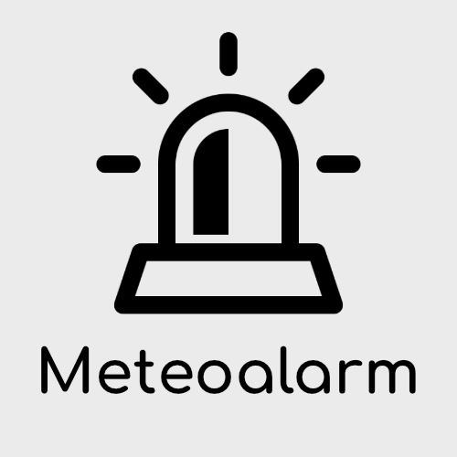

# ioBroker.meteoalarm

     

**This adapter uses Sentry libraries to automatically report exceptions and code errors to the developers.** For more details and for information how to disable the error reporting see [Sentry-Plugin Documentation](https://github.com/ioBroker/plugin-sentry#plugin-sentry)! Sentry reporting is used starting with js-controller 3.0.

meteoalarm Adapter for ioBroker
------------------------------------------------------------------------------
This adapter is pulling weather alarms from https://meteoalarm.org, which includes wind, snow, rain, high and low temperature,etc. This information is available in local language and for detailed regions.

DISCLAIMER: Time delays between this website and the www.meteoalarm.org website are possible, for the most up to date information about alert levels as published by the participating National Meteorological Services please use https://www.meteoalarm.org. 

The developer can't guarantee that the warnings are handled in time or that there are errors and problems that lead to not handling warnings at all!

## How to use it
Choose your country, and afterwards the region you want the warnings for. If you are unsure what your region name is, please go to https://meteoalarm.org and try to find it on the map. 

[English description](docs/en/meteoalarm.md)

[Deutsche Anleitung](docs/de/meteoalarm.md)

## Credits

This adapter would not have been possible without the great work of @jack-blackson (https://github.com/jack-blackson)",
who created pre V4.x.x releases of this adapter.

Bell in icon designed by Freepik from www.flaticon.com

## Changelog

<!--
	Placeholder for the next version (at the beginning of the line):
	### **WORK IN PROGRESS**
-->
### 4.0.0 (2025-06-06)
* (mcm1957) Adapter has been migrated to iobroker-community-adapters organisation.
* (mcm1957) Adapter requires node.js 20, js-controller 6.0.11 and admin 7.4.10 now.
* (mcm1957) @iobroker/eslint-config has been added and linter error have been fixed.
* (mcm1957) Dependencies have been updated.

### 3.0.3 (2024-08-11)
* (jack-blackson) Updated repositories
* (jack-blackson) Small adjustments in package settings

### 3.0.2 (2024-02-24)
* (jack-blackson) Bugfix for notification text - missing space
* (jack-blackson) Bugfix for notification text - fix to just show "warning level in words" in the notification if it is ticked in the setup

### 3.0.1 (2024-02-29)
* (jack-blackson) Bugfix for location names
* (jack-blackson) Removed necessity to choose country, this is now automatically detected

### 3.0.0 (2024-02-26)
* (jack-blackson) Breaking change: switch to locations instead of choosing geocodes to be able to also handle warnings coming with polygons (e.g. Switzerland)

## License
The MIT License (MIT)

Copyright (c) 2025, iobroker-community-adapters <iobroker-community-adapters@gmx.de>  
Copyright (c) 2019-2024 jack-blackson <blacksonj7@gmail.com>

Permission is hereby granted, free of charge, to any person obtaining a copy
of this software and associated documentation files (the "Software"), to deal
in the Software without restriction, including without limitation the rights
to use, copy, modify, merge, publish, distribute, sublicense, and/or sell
copies of the Software, and to permit persons to whom the Software is
furnished to do so, subject to the following conditions:

The above copyright notice and this permission notice shall be included in
all copies or substantial portions of the Software.

THE SOFTWARE IS PROVIDED "AS IS", WITHOUT WARRANTY OF ANY KIND, EXPRESS OR
IMPLIED, INCLUDING BUT NOT LIMITED TO THE WARRANTIES OF MERCHANTABILITY,
FITNESS FOR A PARTICULAR PURPOSE AND NONINFRINGEMENT. IN NO EVENT SHALL THE
AUTHORS OR COPYRIGHT HOLDERS BE LIABLE FOR ANY CLAIM, DAMAGES OR OTHER
LIABILITY, WHETHER IN AN ACTION OF CONTRACT, TORT OR OTHERWISE, ARISING FROM,
OUT OF OR IN CONNECTION WITH THE SOFTWARE OR THE USE OR OTHER DEALINGS IN
THE SOFTWARE.