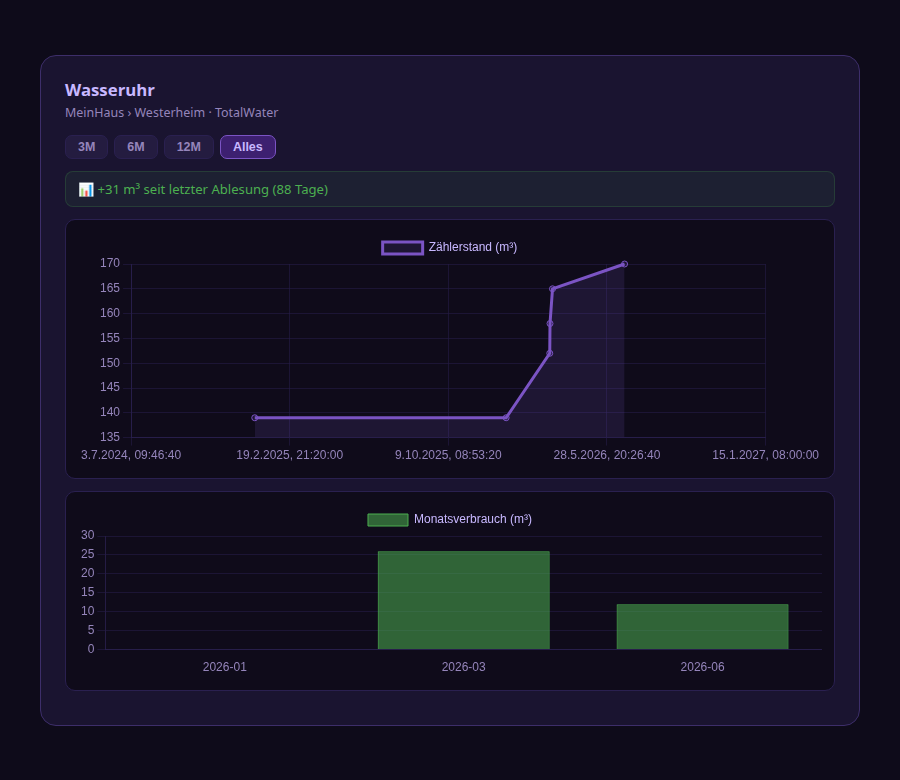
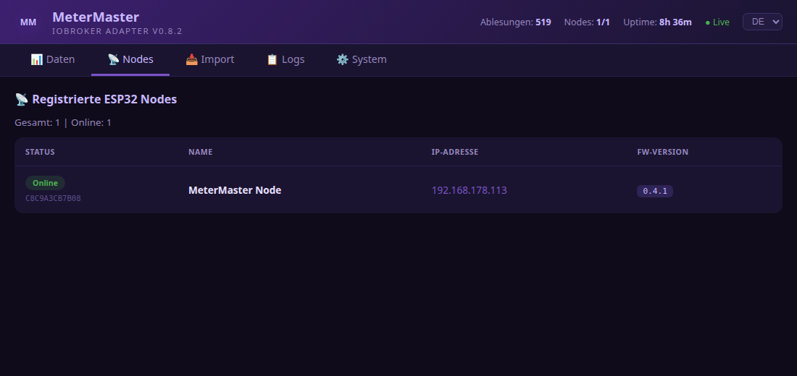
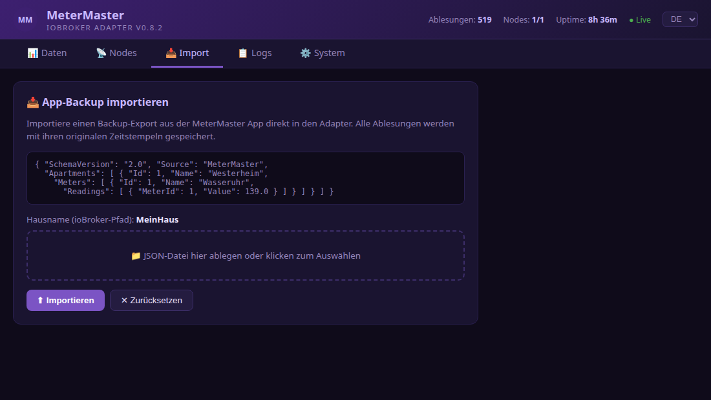
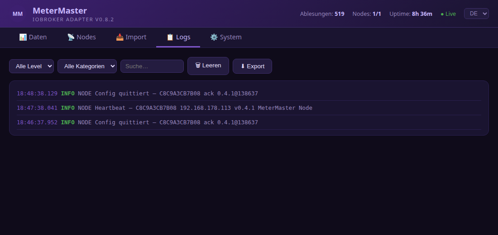
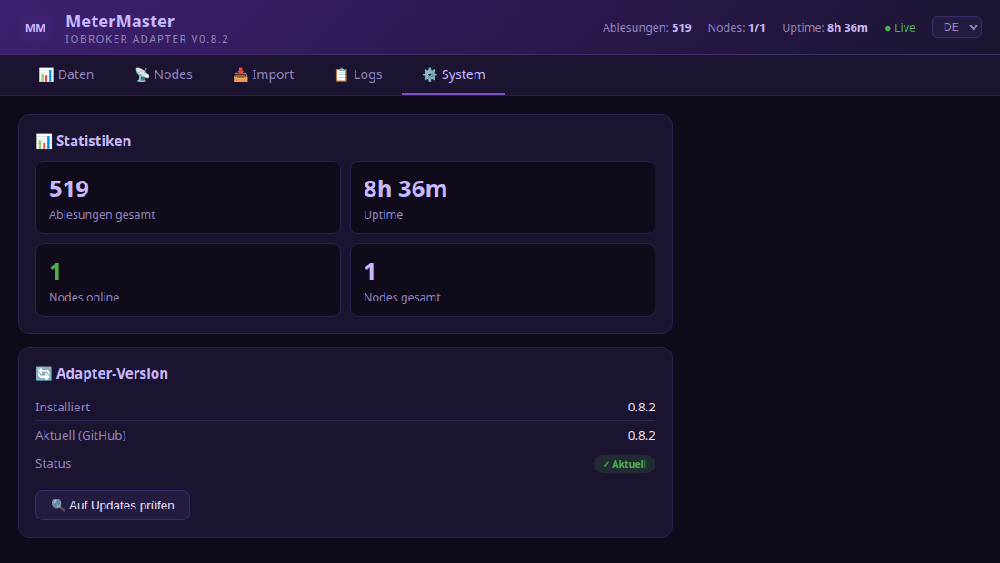

# ioBroker MeterMaster Adapter

[](https://github.com/MPunktBPunkt/ioBroker.metermaster)

[](https://github.com/MPunktBPunkt/ioBroker.metermaster)
[](https://github.com/MPunktBPunkt/ioBroker.metermaster/blob/main/LICENSE)
[](https://nodejs.org)

Receives meter readings from the **[MeterMaster Android app](https://play.google.com/store/apps/details?id=com.propertymanagement.metermaster)**, stores them as ioBroker data points, and manages **ESP32 display nodes** for showing meter values on OLED displays. Source code: [GitHub](https://github.com/MPunktBPunkt/MeterMaster).

---

## Features

- **HTTP receiver** – accepts readings directly from the app
- **Automatic data points** – states are created automatically on first sync
- **Correct timestamps** – state `ts` reflects the actual reading date
- **History** – each meter keeps a full `readings.history` array
- **Basic Auth** – optional username/password protection
- **Web UI** – built-in browser viewer with 5 tabs (Data, Nodes, Import, Logs, System)
- **Charts & CSV** – history charts, monthly consumption, and CSV export per meter
- **DE/EN** – language switch in the Web UI
- **Import** – app backup (schema 2.0) via the Web UI
- **ESP32 node management** – view and configure registered display nodes
- **Remote control** – control meter selection and LED of ESP32 nodes from the Web UI

---

## Screenshots

The built-in Web UI offers five tabs — overview:

| | |
|---|---|
| **Data** – meter cards with consumption KPI, history, chart & CSV |  |
| **Chart modal** – meter reading (linear time axis) & monthly consumption |  |
| **Nodes** – ESP32 status, IP, firmware |  |
| **Import** – app backup via drag & drop |  |
| **Logs** – real-time log with filter & export |  |
| **System** – statistics & version check |  |

---

## Installation

Install the adapter from the official ioBroker adapter list:

1. Open **ioBroker Admin** → **Adapters**
2. Search for **MeterMaster**
3. Click **Install** and create an instance

From the command line on the ioBroker host:

```bash
iobroker add metermaster
iobroker start metermaster
```

Open the firewall if needed: `sudo ufw allow 8089/tcp`

More details: [INSTALLATION.md](INSTALLATION.md)

---

## Instance configuration

After installation → ioBroker Admin → **Adapters → MeterMaster** → create instance:

| Setting | Default | Description |
|---|---|---|
| HTTP port | `8089` | Port the adapter listens on |
| Username | `metermaster` | Basic auth username |
| Password | – | Basic auth password |
| Verbose logging | enabled | Show DEBUG entries in log viewer |
| Log buffer | `500` | Max. stored log entries |
| Keep history | `0` | 0 = unlimited |

---

## MeterMaster Android app

Capture meters and sync with ioBroker:

| | |
|---|---|
| **Google Play** | [**MeterMaster**](https://play.google.com/store/apps/details?id=com.propertymanagement.metermaster) – install the app, read meters, and send to the adapter |
| **GitHub** | [**MPunktBPunkt/MeterMaster**](https://github.com/MPunktBPunkt/MeterMaster) – source code, APK build, and documentation |

[](https://play.google.com/store/apps/details?id=com.propertymanagement.metermaster)

---

## Configure the MeterMaster app

**Settings → ioBroker → MeterMaster adapter:**

| Field | Value |
|---|---|
| Enable ioBroker | on |
| IP / hostname | IP of the ioBroker server |
| Adapter port | `8089` |
| Username | as configured in the adapter |
| Password | as configured in the adapter |

"Test connection" should return `MeterMaster adapter reachable ✓`.

---

## Web UI

Accessible without password:

```
http://{ioBroker-IP}:8089/
```

| Tab | Content |
|---|---|
| **Data** | All received meters grouped by house/apartment, with history, chart modal, and CSV export |
| **Nodes** | Registered ESP32 nodes: status, IP link, firmware, meter dropdown, LED control |
| **Import** | App backup (JSON schema 2.0) via drag & drop |
| **Logs** | Real-time log with filter, auto-scroll, export |
| **System** | Statistics & version check |

Screenshots: see [Screenshots](#screenshots) above.

---

## ESP32 display node

The adapter supports the [MeterMaster ESP32 node](https://github.com/MPunktBPunkt/esp32.MeterMaster) as an OLED display companion.

### Flow
1. ESP32 sends heartbeat every 60 s: `POST :8089/api/register`
2. Adapter creates `metermaster.0.nodes.{MAC}.*` states automatically
3. ESP32 polls every 15 s: `GET :8089/api/nodes/{MAC}/config`
4. Adapter returns config and optional immediate commands (cmd)

### Nodes tab
- Online/offline badge (green if heartbeat < 120 s)
- IP as clickable link → opens ESP32 Web UI
- Meter dropdown: assign meter → ESP32 picks it up on next poll
- LED buttons: on/off → immediate command via cmd state

---

## Created data points

```
metermaster.0.
├── info.connection        bool    Adapter connected
├── info.lastSync          number  Timestamp of last sync (ms)
├── info.readingsReceived  number  Total readings received
│
├── {House}/{Apartment}/{Meter}/
│   ├── readings.latest      number  Latest value (ts = reading date)
│   ├── readings.latestDate  string  ISO-8601 date
│   ├── readings.history     string  JSON array of all readings
│   ├── name                 string
│   ├── unit                 string
│   └── typeName             string
│
└── nodes/{MAC}/
    ├── ip          string  ESP32 IP address
    ├── name        string  Device name
    ├── version     string  Firmware version
    ├── lastSeen    number  Timestamp of last heartbeat (ms)
    ├── config      string  JSON config (adapter writes, ESP32 reads)
    ├── configAck   string  Acknowledgement by ESP32
    └── cmd         string  Immediate command (adapter writes, ESP32 reads+clears)
```

---

## HTTP API

### Without authentication

| Method | Path | Description |
|---|---|---|
| GET | `/` | Web UI |
| GET | `/api/version` | Version + GitHub check |
| GET | `/api/stats` | Statistics (readings, uptime, nodes) |
| GET | `/api/data` | All cached readings |
| GET | `/api/logs` | Log buffer (with `?level=&category=&text=` filter) |
| GET | `/api/nodes` | All registered ESP32 nodes |
| GET | `/api/discover` | Known meter state IDs |
| POST | `/api/register` | ESP32 heartbeat (no auth required) |

### With Basic Auth

| Method | Path | Description |
|---|---|---|
| GET | `/api/ping` | Connection test |
| POST | `/api/reading` | Store single reading |
| POST | `/api/readings` | Store batch readings |
| POST | `/api/import` | Import app backup |
| GET | `/api/nodes/{MAC}/config` | Get config for ESP32 |
| POST | `/api/nodes/{MAC}/config` | Set config for ESP32 |
| POST | `/api/nodes/{MAC}/configAck` | Receive config acknowledgement |
| POST | `/api/nodes/{MAC}/cmd` | Send immediate command (LED, meter) |

### Example: single reading

```
POST http://host:8089/api/reading
Authorization: Basic base64(user:password)
Content-Type: application/json

{
  "house":       "MyHouse",
  "apartment":   "West",
  "meter":       "HotWater",
  "value":       128.75,
  "unit":        "m³",
  "typeName":    "HotWater",
  "readingDate": "2024-02-12T09:30:00.000Z"
}
```

### Example: immediate command to ESP32

```
POST http://host:8089/api/nodes/C8C9A3CB7B08/cmd
Authorization: Basic base64(user:password)
Content-Type: application/json

{ "ledOn": true }
```

---

## Update

### Via Web UI
`http://IP:8089/` → **System** tab → "Check for updates" (shows availability; install via CLI below)

### Command line

```bash
iobroker upgrade metermaster
iobroker restart metermaster.0
```

---

## Changelog

### 0.9.4
- All adapter log messages and API JSON error responses in English
- State common names and roles corrected (readings channel, date/text/json roles, info.firmware for nodes)
- Web UI i18n: full DE/EN coverage, English default HTML
- Config validation: clamped port (1024–65535), logBufferSize (50–5000), keepHistory (0–100000)
- Removed `/api/update` endpoint and one-click Web UI update (CLI commands card retained)
- `migrateStateRoles()` uses `getAdapterObjectsAsync` (own adapter states only)
- Removed dead `houseName` config; import default house is `MyHouse`
- Fixed redundant state check in stateChange handler
- `@types/node` pinned to `^22.0.0`

### 0.9.3
- Fix state roles for ioBroker object structure check (repochecker E1008/E1009/E1011)
- Migration of existing objects on adapter start

### 0.9.2
- Adapter checker compliance: npm news cleanup, devDependencies, trusted publishing
- npm publish via GitHub Actions with provenance

### 0.9.1
- Lowered admin dependency to >=7.6.20 (fixes startup when admin 7.7.x is installed)

### 0.9.0
- Finalized for ioBroker repository: CI/CD testing, adapter checker compliance
- English README, updated dependencies (Node.js >= 22, adapter-core 3.4.x)
- Admin config i18n, encrypted password storage
- Requires js-controller >= 6.0.11 and admin >= 7.6.20

### 0.8.3
- Chart: linear time axis, yearly consumption projection toggle, README screenshots

### 0.8.2
- Bugfix: chart modal close button and range filters

### 0.8.1
- Bugfix: literal newline in CSV export JS broke Web UI

### 0.8.0
- Charts per meter, consumption KPI, CSV export, DE/EN language switch

See [io-package.json](io-package.json) `common.news` for full history. Older entries: [CHANGELOG_OLD.md](CHANGELOG_OLD.md).

---

## License

Copyright (c) 2026 MPunktBPunkt

MIT License – see [LICENSE](LICENSE) for the full license text.

