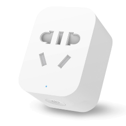

# ioBroker mihome-plug adapter
  =================

This adapter allows you control the Xiaomi Plug (wifi) with ioBroker.
You can control simple and 6x plugs with it.
You need token to control it. The instruction for that you can find [here](https://github.com/ioBroker/ioBroker.mihome-vacuum#configuration)

This adapter is forked from [MeisterTR](https://github.com/MeisterTR/iobroker.mihome-lamp)

## Changelog
<!--
    Placeholder for the next version (at the beginning of the line):
    ### **WORK IN PROGRESS**
-->
### 0.3.0 (2024-03-21)
- (mcm1957) Adapter requires node 18 or newer now.
- (mcm1957) Dependencies have been updated.

### 0.2.1 (2020-05-05)
* (Apollon77) fix wrong variable usage

### 0.2.0 (2018-09-02)
* (bluefox) The input of token is allowed if required

### 0.1.1 (2017-08-04)
* (bluefox) initial commit

## License

MIT License

Copyright (c) 2023-2024 iobroker-community-adapters <mcm57@gmx.at>

Permission is hereby granted, free of charge, to any person obtaining a copy
of this software and associated documentation files (the "Software"), to deal
in the Software without restriction, including without limitation the rights
to use, copy, modify, merge, publish, distribute, sublicense, and/or sell
copies of the Software, and to permit persons to whom the Software is
furnished to do so, subject to the following conditions:

The above copyright notice and this permission notice shall be included in all
copies or substantial portions of the Software.

THE SOFTWARE IS PROVIDED "AS IS", WITHOUT WARRANTY OF ANY KIND, EXPRESS OR
IMPLIED, INCLUDING BUT NOT LIMITED TO THE WARRANTIES OF MERCHANTABILITY,
FITNESS FOR A PARTICULAR PURPOSE AND NONINFRINGEMENT. IN NO EVENT SHALL THE
AUTHORS OR COPYRIGHT HOLDERS BE LIABLE FOR ANY CLAIM, DAMAGES OR OTHER
LIABILITY, WHETHER IN AN ACTION OF CONTRACT, TORT OR OTHERWISE, ARISING FROM,
OUT OF OR IN CONNECTION WITH THE SOFTWARE OR THE USE OR OTHER DEALINGS IN THE
SOFTWARE.
