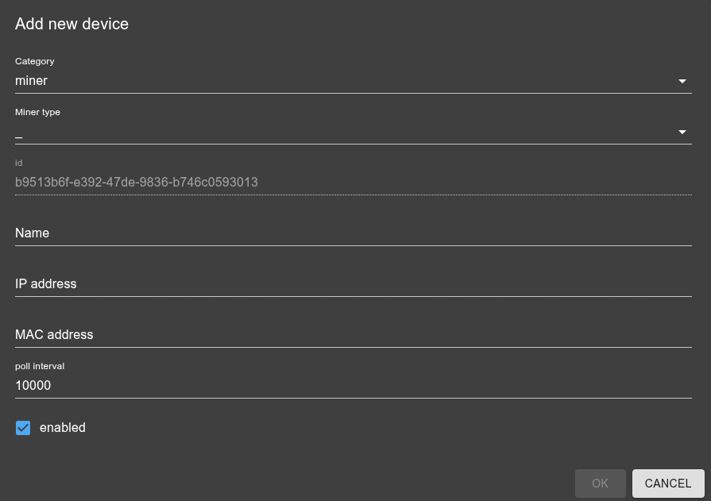

# ioBroker.miner

[](https://www.npmjs.com/package/iobroker.miner)
[](https://www.npmjs.com/package/iobroker.miner)


[](https://nodei.co/npm/iobroker.miner/)

**Tests:** 

## miner adapter for ioBroker

Interact with different crypto miner apis

## Roadmap
- [X] v0.1: device management, trm implementation
- [X] more miners support: bos+, xmrig, avalon, ...?
- [ ] implement more features (controls + info from devices)
- [ ] pools support
- [ ] device discover
- [ ] sentry
- [ ] more: see Todo.md / issues

## Usage
When adding a new device inside the instance settings (or inside the Admin DeviceManager Tab) you should get a dialog like this:



The options should be pretty self-explanatory. All of them also have tooltips with more details. If anything is still unclear feel free to ask in an issue, discussion or the forum. 

### Braiins OS miner types
There are two Braiins miner implementations because Braiins changed the API stack across firmware generations:

- `bos`: use this for official Braiins OS firmware `>= 23.03`, typically Antminer S19 series and newer. This implementation uses the Braiins OS Public API (PAPI) over gRPC.
- `bosMiner`: use this for legacy Braiins OS firmware `< 23.03`, typically pre-S19 devices such as Antminer S9 and S17 series. This keeps using the older CGMiner-compatible API.

`bosMiner` also supports the `control.powerTarget` state. Legacy Braiins OS does not expose this through the CGMiner-compatible API, so the adapter uses an SSH workaround: it logs in to the miner, updates `power_target` in the `[autotuning]` section and `timestamp` in the `[format]` section of `/etc/bosminer.toml`, stores a backup at `/etc/bosminer.toml.iobroker-power-target.bak`, stops `bosminer`, writes the config, and starts `bosminer` again. Configure valid SSH credentials for `bosMiner` devices; the default username is `root` with no password.

Warning: changing `control.powerTarget` on old `bosMiner` devices requires a full `bosminer` stop/start cycle. Do not change this value frequently; use it for deliberate target changes, not for rapid automation loops.

If you are unsure which one to choose, check the firmware generation/device family first:

- S19/S21/T19 and newer Braiins OS images are listed in the current firmware download flow and should normally use `bos`.
- S17 images are published as `v 23.01` and S9 images as `v 22.08.1` on the Braiins download page, so those legacy generations should use `bosMiner`.

References:
- Braiins OS Public API: https://academy.braiins.com/braiins-os/papi-about
- Braiins OS firmware downloads: https://braiins.com/os-firmware/download

## Object model

All objects are created under:

`miner.<instance>.miner.<minerId>`

`<minerId>` is the stable ID from the device configuration (`settings.id`). This allows multiple miner processes on the same host.

### Groups (channels)
- `info`: identity/config/firmware/connection meta
- `stats`: live performance metrics (hashrate, shares, power, temps, ...)
- `control`: writable controls (start/stop, reboot, ...)
- `raw`: raw API payloads (expert)

### Entities (optional subtrees)
Some miners expose sub-entities. If available, they are placed below the miner:
- `pools.<index>...`
- `hardware.gpus.<index>...`
- `hardware.hashboards.<index>...`

### Examples
- `miner.0.miner.<minerId>.enabled`
- `miner.0.miner.<minerId>.control.running`
- `miner.0.miner.<minerId>.stats.totalHashrate`
- `miner.0.miner.<minerId>.hardware.gpus.0.stats.temp`
- `miner.0.miner.<minerId>.raw.stats`

### Enable / disable a miner
Each miner device has a writable top-level `enabled` state:

`miner.<instance>.miner.<minerId>.enabled`

Set this state to `false` to disable the miner in the adapter at runtime. Disabled miners are unloaded and no polling/control handling is active for them. Set it back to `true` to initialize the miner again without restarting the adapter.

This is different from `control.running`: `enabled` controls whether the adapter manages the miner at all, while `control.running` asks a supported miner to start or stop mining.

### Example tree
This is just an overview / idea / plan. Not all of them are implemented yet, but it should give you an idea of the intended structure and naming. The actual implementation may differ in some details, but the general structure should be similar to this.
```
miner.0
  miner
    <minerId>                        (device)
      enabled                        (boolean)  enable/disable adapter handling for this miner
      info                           (channel)
        minerType                    (string)   e.g. xmRig / teamRedMiner / bosMiner
        host                         (string)
        version                      (string)   (maps to feature: version)
        online                        (boolean)  derived from lastSeen
        lastSeen                     (number)   unix ms
      stats                          (channel)
        totalHashrate                (number)   H/s (maps to feature: totalHashrate)
        power                        (number)   W
        dynamicPowerTarget           (number)   W, current dynamic target reported by miner
        efficiency                   (number)   H/W
        acceptedShares               (number)
        rejectedShares               (number)
      control                        (channel)  (writable states only here, top-level)
        running                      (boolean)  start/stop (maps to feature: running)
        reboot                       (boolean)  "button"
        profile                      (string)   performance profile (e.g. low/medium/high)
        powerTarget                  (number)   W, configured target to write to miner
      pools                          (channel)
        0                            (channel)
          info
            url                      (string)
            user                     (string)
          stats
            status                   (string)
            acceptedShares           (number)
            rejectedShares           (number)
        1 ...
      hardware                       (channel)
        gpus                         (channel)
          0                          (channel)
            info
              name                   (string)
            stats
              hashrate               (number)
              temp                   (number)   °C
              fanRpm                 (number)
              power                  (number)
          1 ...
        hashboards                   (channel)  (ASICs)
          0
            stats
              hashrate               (number)
              temp                   (number)
      raw                            (channel)
        stats                        (object/string) raw miner payload (maps to feature: rawStats)
```

## Changelog
<!--
    Placeholder for the next version (at the beginning of the line):
    ### **WORK IN PROGRESS**
-->
### 1.1.0 (2026-07-12)
- (copilot) Adapter requires node.js >= 22 now
* (SimonFischer04) **NEW**: Added a new `bos` miner type for newer Braiins OS firmware using the Braiins Public API
* (SimonFischer04) **ENHANCED**: Extended legacy `bosMiner` devices with writable `control.powerTarget` support for deliberate power target changes
* (SimonFischer04) **NEW**: Added top-level `enabled` state to dynamically enable or disable miner handling at runtime
* (SimonFischer04) **FIXED**: Removed example configuration (option1, option2) from native section and code (fixes #126 / E5040)

### 1.0.4 (2026-04-07)
* (SimonFischer04) fix repo url in package-json

### 1.0.3 (2026-04-07)
* (SimonFischer04) increase admin requirement to fix DM (does not work at all with current stable 7.7.22)

### 1.0.2 (2026-04-07)
* (SimonFischer04) **CI/CD**: Migrated deploy workflow from NPM classic tokens to Trusted Publishing (OIDC) (fixes #80)
* (SimonFischer04) cleanup readme

### 1.0.1 (2026-04-06)
* (SimonFischer04) fix release

[Older changelogs can be found there](CHANGELOG_OLD.md)

## Credits
- the logo was created using ChatGPT

## License

Copyright (c) 2026 SimonFischer04 <simi.fischa@gmail.com>  

This project is licensed under the GNU General Public License v3.0 - see [LICENSE](https://github.com/SimonFischer04/ioBroker.miner/blob/main/LICENSE) for details.
