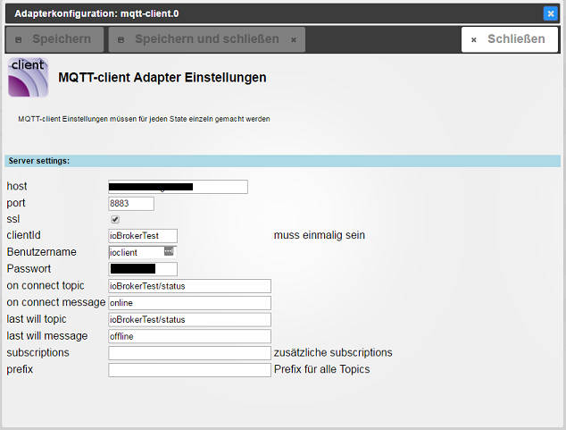
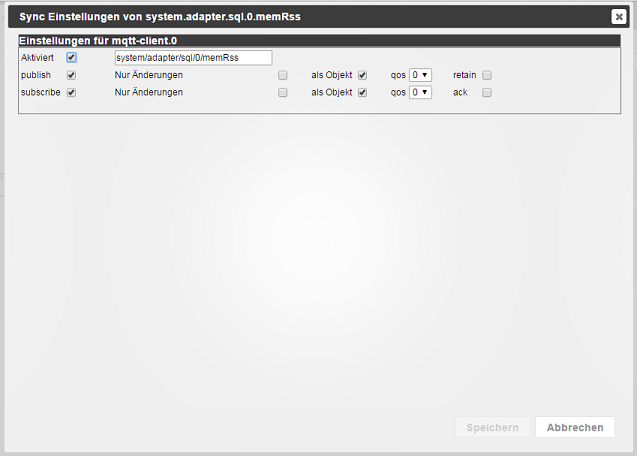

# ioBroker.mqtt-client

[](https://www.npmjs.com/package/iobroker.mqtt-client)
[](https://www.npmjs.com/package/iobroker.mqtt-client)


## Versions


Publish and subscribe ioBroker states to MQTT Brokers

## Sentry
**This adapter uses Sentry libraries to automatically report exceptions and code errors to the developers.**
For more details and for information how to disable the error reporting see [Sentry-Plugin Documentation](https://github.com/ioBroker/plugin-sentry#plugin-sentry)! Sentry reporting is used starting with js-controller 3.0.

## Adapter Settings


### on connect topic and message
The ```on connect message``` is published to the ```on connect topic``` every time the client connects or reconnects to the server.

### on disconnect topic and message
The ```on disconnect message``` is published to the ```on disconnect topic``` when the adapter stops gracefully.

### last will topic and message
The ```last will message``` is published to the ```last will topic``` every time the client connects or reconnects to the server.
The Server will store this message and send it to its subscribers when the client disconnects unexpectedly.

### subscriptions
Comma separated list of topics that are not covered by existing states.
Received messages are converted to states within the adapter's namespace (e.g. mqtt.0) and subscribed.
You can remove topics after all states have been created.

### publish prefix
When publishing this will be prepended to all topics.
Default is empty (no prefix).

### subscribe prefix
When subscribing this will be prepended to all topics.
Default is empty (no prefix).

## State Settings


### enabled
Enables or disables the mqtt-client functionality for this state.
Disabling will delete any mqtt-client settings from this state.

### topic
The topic this state is published to and subscribed from.
default: state-ID converted to a mqtt topic.

### publish
* ```enable``` state will be published
* ```changes only``` state will only be published when its value changes
* ```as object``` whole state will be published as object
* ```qos``` see <http://www.hivemq.com/blog/mqtt-essentials-part-6-mqtt-quality-of-service-levels>
* ```retain``` see <http://www.hivemq.com/blog/mqtt-essentials-part-8-retained-messages>

### subscribe
* ```enable``` topic will be subscribed and state will be updated accordingly
* ```changes only``` state will only be written when the value changed
* ```as object``` messages will be interpreted as objects
* ```qos``` see <http://www.hivemq.com/blog/mqtt-essentials-part-6-mqtt-quality-of-service-levels>
* ```ack``` on state updates the ack flag will be set accordingly

#### Note
* when ack is set to true it will overwrite objects ack, see ```as object```
* to prevent message loops, if both publish and subscribe are enabled ```changes only``` is always on for subscribe


<!--
	Placeholder for the next version (at the beginning of the line):
	### __WORK IN PROGRESS__
-->
## Changelog

### **WORK IN PROGRESS**
- (copilot) Adapter requires js-controller >= 6.0.11 now
- (copilot) Adapter requires admin >= 7.6.17 now

### __WORK IN PROGRESS__
* (@klein0r) Updated dependencies

### 3.0.0 (2025-01-24)
* (@klein0r) Breaking change: Underscores are not replaced by spaces in the corresponding topic anymore

### 2.1.0 (2024-11-12)
* (mcm1957) Adapter requires node.js 20 now.
* (mcm1957) Adapter requires js-controller 5.0.19 and admin 6.17.14 now.
* (simatec) Adapter changed to meet Responsive Design rules.
* (mcm1957) Dependencies have been updated.

### 2.0.1 (2024-09-23)
* (@klein0r) Added missing information in configuration dialog
* (@klein0r) Fixed type of port configuration to avoid conflicts

### 2.0.0 (2024-06-21)
* (klein0r) Password is now encrypted - you have to re-renter your password in instance settings!
* (klein0r) Use jsonConfig instead of materialize (for instance settings)

### 1.8.0 (2024-04-07)
* (mcm1957) Adapter requires node.js 18 and js-controller >= 5 now
* (mcm1957) Dependencies have been updated

## License
The MIT License (MIT)

Copyright (c) 2025-2026 iobroker-community-adapters <iobroker-community-adapters@gmx.de>
Copyright (c) 2016-2023 Pmant

Permission is hereby granted, free of charge, to any person obtaining a copy
of this software and associated documentation files (the "Software"), to deal
in the Software without restriction, including without limitation the rights
to use, copy, modify, merge, publish, distribute, sublicense, and/or sell
copies of the Software, and to permit persons to whom the Software is
furnished to do so, subject to the following conditions:

The above copyright notice and this permission notice shall be included in
all copies or substantial portions of the Software.

THE SOFTWARE IS PROVIDED "AS IS", WITHOUT WARRANTY OF ANY KIND, EXPRESS OR
IMPLIED, INCLUDING BUT NOT LIMITED TO THE WARRANTIES OF MERCHANTABILITY,
FITNESS FOR A PARTICULAR PURPOSE AND NONINFRINGEMENT. IN NO EVENT SHALL THE
AUTHORS OR COPYRIGHT HOLDERS BE LIABLE FOR ANY CLAIM, DAMAGES OR OTHER
LIABILITY, WHETHER IN AN ACTION OF CONTRACT, TORT OR OTHERWISE, ARISING FROM,
OUT OF OR IN CONNECTION WITH THE SOFTWARE OR THE USE OR OTHER DEALINGS IN
THE SOFTWARE.
