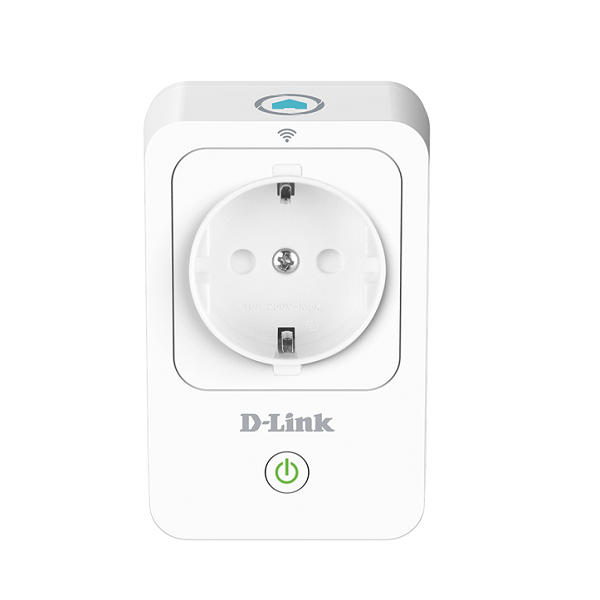
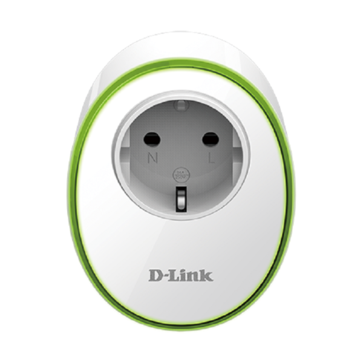
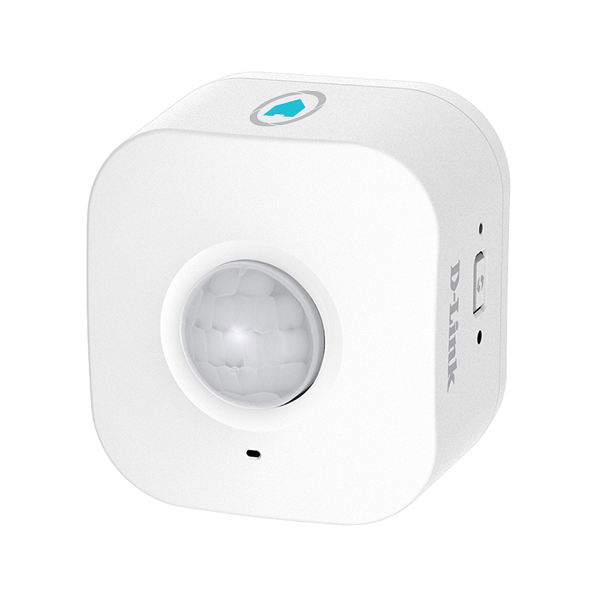

---
---

# ioBroker.mydlink

MyDlink Adapter for ioBroker. 
------------------------------------------------------------------------------

Allows to control power sockets or motion detectors from [D-Link](https://eu.dlink.com/uk/en/for-home/smart-home) from within ioBroker. 

**This adapter uses Sentry libraries to automatically report exceptions and code errors to the developers.** For more details and for information how to disable the error reporting see [Sentry-Plugin Documentation](https://github.com/ioBroker/plugin-sentry#plugin-sentry)! Sentry reporting is used starting with js-controller 3.0.
This also helps with supporting new devices.

Currently tested devices:

| Model | Type  | Image |
| :---: | :---: | :---: |
| DSP-W215 | Smart Plug (socket, temperature, current) **Needs polling** |  |
| DSP-W115 | Smart Plug (socket) |  | 
| DCH-S150 | Motion Detector (last motion detected) **Needs polling** |  |

The adapter needs to poll some devices. Newer ones do send push messages, which is now supported. Sensor readings and motion detection will be 
delayed by polling interval, if they need to be polled (can be set in config).

#### Configuration:
* List of devices, each device with following settings:

<table>
<tr><td>Name</td><td>set a name here, must be unique (for mydlink devices)</td></tr>
<tr><td>IP</td><td>fill in IP address here, hostname should also work</td></tr>
<tr><td>PIN</td><td>PIN is printed on a sticker on the device, probably at the bottom. Can be TELNET for DSP-W115, see below.</td></tr>
<tr><td>Poll interval</td><td>per device poll interval  Set 0 to disable polling.  <b>Recommendation:</b> Set a fast poll interval for sensors and a longer one for plugs.</td></tr>
<tr><td>enable</td><td>if not enabled, will not be polled or controlled.  Devices that are not plugged in can be disabled to avoid network traffic and error messages in the log.</td></tr>
</table>

The adapter does not interfere with the use of the app.

## Setup of DSP-W115

DSP-W115 and other *newer* devices use a completely different protocol and a different setup. There are two ways to use them.

1. Use App and Adapter at the same time:
  If you want to keep using the app, you have to put the device into factory mode, following this procedure:
  1. Reset device into recovery mode by holding the wps/reset button during boot until it starts blinking **red** instead of orange.
  2. Now a telnet deamon is running, connect to the device wifi
  3. Run `telnet 192.168.0.20` and login with `admin:123456` (or use putty, don't forget to select `telnet` instead of `ssh`).
  4. Run `nvram_set FactoryMode 1`
  5. Run `reboot; exit;` to reboot the device.
  6. Now you should enter `TELNET` as Pin, and the adapter will retrieve the required data from the device itself.
2. Don't want to use the App
  1. Remove the device from the app, this will reset the device
  2. Start setup in the app again and configure your Wifi on the device.
  3. Now the device will reoobt and connect to your Wifi. During that time **close** the app, make sure it is really closed.
  4. Now the device should be connected to your Wifi and not connected to the app, so that the PIN from the sticker will work in the adapter.
  (If the device does not connect to your wifi or the device does not accept login via the PIN please try again. Press the button on the device until it lights up red in order to reset.