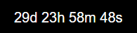
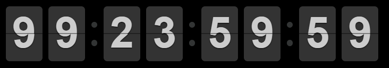

# ioBroker.mytime

[](https://www.npmjs.com/package/iobroker.mytime)
[](https://www.npmjs.com/package/iobroker.mytime)


[](https://nodei.co/npm/iobroker.mytime/)

**Tests:** 

## IMPORTANT

Only the english documentation is valid as the automatic translation
translates areas that should not be translated.

## mytime adapter for ioBroker

This adapter handle Time (eg: countdown,etc.).
The countdown functionality provides datapoints that you can use to manage a
countdown (e.g. in a script). The adapter also includes several widgets
to visualize these countdowns. Time series can be used to create
complex time series at which the data points are triggered.

### Configuration

#### Countdown

In the configuration dialog Tab "Countdown" you can create a new countdown
eg 'test', set timer to 10 seconds and import the following widgets.
Datapoints are pre configured for a countdown named test.

##### Stop behaviour timer

After the countdown gets the signal stop, the countdown resets
to the time set by timer.

##### Stop behaviour zero

After the countdown gets the signal stop, the countdown remains at 0.

##### Stop behaviour rerun

When the timer expires, it will automatically restart.

#### Timeseries

In the configuration dialog Tab "Timeseries" you can create a
new timeseries with one or more timerules. For each timerule you can
define different parameters
Each timeseries creates a seperate datapoint which is triggered
at the calculated time events.
The time events are calculated in real time. However, the rrule library
used is not yet perfect in all parameter combinations.
This shows that with some combinations the page goes into an endless loop.
The demo page <http://jakubroztocil.github.io/rrule/> can also be used for experiments.
Additional to add a timerule, you can add a timerule to exclude time events,
to add single time events and also to exclude single time events.

In addition to the functionality of rrule, dynamically calculated times
for the various sun and moon phases can now also be calculated.
This calculation only occurs if the time interval is at
least daily (not hourly or minutely).

##### Sun based time events

- astronomicalDawn
- amateurDawn
- nauticalDawn
- blueHourDawnStart
- civilDawn
- blueHourDawnEnd
- goldenHourDawnStart
- sunriseStart
- sunriseEnd
- goldenHourDawnEnd
- solarNoon
- goldenHourDuskStart
- sunsetStart
- sunsetEnd
- goldenHourDuskEnd
- blueHourDuskStart
- civilDusk
- blueHourDuskEnd
- nauticalDusk
- amateurDusk
- astronomicalDusk
- nadir

##### Moon based time events

- moonrise
- moonhigh
- moonset

### Usage

#### Usage of Timeseries

##### Available Datapoints of a timeserie

After configuration of a new timeserie the adapter creates the following datapoints:

| datapoint | description                                                  |
| --------- | ------------------------------------------------------------ |
| action    | actual state of thie timeserie. possible values are stop,run |
| cmd       | no function atm                                              |

##### Available action states

| action | description                                                                                   |
| ------ | --------------------------------------------------------------------------------------------- |
| stop   | no time event is active at the moment                                                         |
| run    | a time event was triggered. after the configured duration time, the datapoint changes to stop |

#### Usage of Countdown

##### Available Datapoints of a countdown

After configuration of a new countdown the adapter creates the following datapoints:

| datapoint | description                                                            |
| --------- | ---------------------------------------------------------------------- |
| action    | actual state of thie countdown. possible values are stop,run,pause,end |
| cmd       | datapoint for commands. possible commands are described below          |
| config    | enthält zusätzliche konfiguration für den countdowntimer.              |
| start     | datapoint for the start time in milliseconds                           |
| end       | datapoint for the end time in milliseconds                             |
| timer     | datapoint for the total time set in milliseconds                       |

##### Available action states of a countdown

| action | description                                                                                           |
| ------ | ----------------------------------------------------------------------------------------------------- |
| stop   | the countdown is stopped, start and end time is set to 0                                              |
| run    | the countdown runs. if the countdown reachs the end time. the action switchs to end                   |
| pause  | countdown is in pausemode. the end time was set to the time of the pause                              |
| end    | the countdown is ended. this state you can use as a trigger for further actions (sound, popups, etc.) |

##### Available commands for the cmd datapoint

| command         | example                 | description                                                                                                                          |
| --------------- | ----------------------- | ------------------------------------------------------------------------------------------------------------------------------------ |
| `+value`        | `+1:10`                 | adds time to the countdown setting. the setting will be taken into account at the next start                                         |
| `+!value`       | ``+!1:10`               | like + operator and extend the running timer                                                                                         |
| `-value`        | `-1:2:3`                | subtracts time from the countdown. the setting will be taken into account at the next start                                          |
| `-!value`       | `-!1:2:3`               | like - operator and reduce the running timer                                                                                         |
| `=value`        | `=5:00`                 | set the countdowntimer to this time.                                                                                                 |
| `=!value`       | `=!5:00`                | like = operator and set running timer to the given time                                                                              |
| `#ISO-Date`     | `#2025-01-01T10:00:00`  | set the countdowntimer to a target time. The Time must be formatted as ISO-Datestring                                                |
| `#!ISO-Date`    | `#!2025-01-01T10:00:00` | like # operator and setting running timer to the given target time                                                                   |
| `$Time`         | `$20:15`                | set the countdowntimer to a target time. If Time is before current time. the next day is set.                                        |
| `$!Time`        | `$!20:15`               | like $ operator and setting running timer to the given target time                                                                   |
| `start`         | `start`                 | starts the countdown                                                                                                                 |
| `stop`          | `stop`                  | stops the countdown. the countdown time is reset to the setting                                                                      |
| `pause`         | `pause`                 | pauses the countdown                                                                                                                 |
| `end`           | `end`                   | stops the countdown. the countdown is set to 0                                                                                       |
| `reset`         | `reset`                 | reset the timer to the configuration state                                                                                           |
| `setstop2timer` | `setstop2timer`         | set stop behaviour configuration to timer                                                                                            |
| `setstop2zero`  | `setstop2zero`          | set stop behaviour configuration to zero                                                                                             |
| `setstop2rerun` | `setstop2rerun`         | set stop behaviour configuration to rerun                                                                                            |
| `save`          | `save`                  | save the configuration defined in datapoints to the iobroker configuration, iobroker restarts the adapter after saving automatically |

##### Format of the value for setting the countdown timer

you can set the countdown to an unlimited time.
the notation of the value is
[days:[hours:[minutes:[seconds]]]]
days,hours and minutes are optional.
if you want to set the timer to one day you have
to set hours, minutes and second aswell
you dont have to respect the normal value ranges (eg hours 0-24).
You can also set 48 hours.
If you want you can set irregular time notations. the time is summed up seperatly

**Examples:**

| setting   | description                                 |
| --------- | ------------------------------------------- |
| 1:0:0:0   | set/adds/subtracts 1 day to the timer       |
| 2:0:0     | set/adds/subtracts 2 hours to the timer     |
| 3:0       | set/adds/subtracts 3 minutes to the timer   |
| 120       | set/adds/subtracts 120 seconds to the timer |
| 48:0:0    | set/adds/subtracts 48 hours to the timer    |
| 48:75:120 | set/adds/subtracts the timer                |

##### Format of the Datetime to format the output in the widget

The following placeholders are available:

| placeholder | description                                                     |
| ----------- | --------------------------------------------------------------- |
| YYYY        | years in 4 digits                                               |
| YY          | years in 2 digits                                               |
| w           | months without leading zeros, (not together with the months)    |
| ww          | months with leading zeros, (not together with the months)       |
| M           | months without leading zeros, (not together with the weeks)     |
| MM          | months with leading zeros, (not together with the weeks)        |
| d           | days without leading zeros                                      |
| dd          | days with leading zeros                                         |
| H           | hours without leading zeros                                     |
| HH          | hours with leading zeros                                        |
| m           | minutes without leading zeros                                   |
| mm          | minutes with leading zeros                                      |
| s           | seconds without leading zeros                                   |
| ss          | seconds with leading zeros                                      |
| \           | Escape character if you want to use a placeholder in the output |

When multiple parts are taken, there must be no gaps between them.

Example:

Valid: year, month, day | hour, minute, second
Irvalid: year, minute, second

**Examples:**

All following Examples with countdown timer 1:2:3:4

| template           | example         | result                                           |
| ------------------ | --------------- | ------------------------------------------------ |
| d\d Hh m\m s\s     | 1d 2h 3m 4s     | with escape-characters and without leading zeros |
| dd\d HHh mm\m ss\s | 01d 02h 03m 04s | with escape-characters and with leading zeros    |
| ss\s               | 93784s          | only seconds                                     |
| dd\d HH\h          | 01d 02h         | only days and hours                              |
| HH\h mm\m          | 26h 03m         | only hours and minutes                           |

### Widgets

From Version 1.2.0 on the widgets should be compatible with vis1 and vis2.

#### Widget Countdown plain


A countdown widget for a plain textual output.
The output can be configured in detail.

##### Widget Attributes

| Attribute      | Description                                                                                                                                  |
| -------------- | -------------------------------------------------------------------------------------------------------------------------------------------- |
| `Object ID`    | Datapoint of the countdown timer. any datapoint can be used                                                                                  |
| `Format`       | Format of the output, Please see chapter [Datetime Format](#format-of-the-template-to-format-the-countdown-output-in-the-widget) for details |
| `HTML-Prepend` | This text or html is prepended to the output of the widget                                                                                   |
| `HTML-Append`  | This text or html is appended to the output of the widget                                                                                    |

##### Example widget code

The widgets are preconfigured for a countdown named test.
There a 2 seperate versions for vis1 and vis2


**VIS1:**

<details>
  <summary>Details</summary>
  <pre><code>[{"tpl":"tplMyTimeCountdownPlain","data":{"g_fixed":false,"g_visibility":false,"g_css_font_text":false,"g_css_background":false,"g_css_shadow_padding":false,"g_css_border":false,"g_gestures":false,"g_signals":false,"g_last_change":false,"visibility-cond":"==","visibility-val":1,"visibility-groups-action":"hide","signals-cond-0":"==","signals-val-0":true,"signals-icon-0":"/vis/signals/lowbattery.png","signals-icon-size-0":0,"signals-blink-0":false,"signals-horz-0":0,"signals-vert-0":0,"signals-hide-edit-0":false,"signals-cond-1":"==","signals-val-1":true,"signals-icon-1":"/vis/signals/lowbattery.png","signals-icon-size-1":0,"signals-blink-1":false,"signals-horz-1":0,"signals-vert-1":0,"signals-hide-edit-1":false,"signals-cond-2":"==","signals-val-2":true,"signals-icon-2":"/vis/signals/lowbattery.png","signals-icon-size-2":0,"signals-blink-2":false,"signals-horz-2":0,"signals-vert-2":0,"signals-hide-edit-2":false,"lc-type":"last-change","lc-is-interval":true,"lc-is-moment":false,"lc-format":"","lc-position-vert":"top","lc-position-horz":"right","lc-offset-vert":0,"lc-offset-horz":0,"lc-font-size":"12px","lc-font-family":"","lc-font-style":"","lc-bkg-color":"","lc-color":"","lc-border-width":"0","lc-border-style":"","lc-border-color":"","lc-border-radius":10,"lc-zindex":0,"countdown_oid":"mytime.0.Countdowns.test.timer","format":"d H m s"},"style":{"left":"771px","top":"143px","width":"151px","height":"16px"},"widgetSet":"mytime"},{"tpl":"tplJquiButtonState","data":{"oid":"mytime.0.Countdowns.test.cmd","g_fixed":true,"g_visibility":false,"g_css_font_text":true,"g_css_background":true,"g_css_shadow_padding":true,"g_css_border":true,"g_gestures":false,"g_signals":false,"g_last_change":false,"buttontext":"+10s","signals-cond-0":"==","signals-val-0":true,"signals-icon-0":"/vis/signals/lowbattery.png","signals-icon-size-0":0,"signals-blink-0":false,"signals-horz-0":0,"signals-vert-0":0,"signals-hide-edit-0":false,"signals-cond-1":"==","signals-val-1":true,"signals-icon-1":"/vis/signals/lowbattery.png","signals-icon-size-1":0,"signals-blink-1":false,"signals-horz-1":0,"signals-vert-1":0,"signals-hide-edit-1":false,"signals-cond-2":"==","signals-val-2":true,"signals-icon-2":"/vis/signals/lowbattery.png","signals-icon-size-2":0,"signals-blink-2":false,"signals-horz-2":0,"signals-vert-2":0,"signals-hide-edit-2":false,"lc-type":"last-change","lc-is-interval":true,"lc-is-moment":false,"lc-format":"","lc-position-vert":"top","lc-position-horz":"right","lc-offset-vert":0,"lc-offset-horz":0,"lc-font-size":"12px","lc-font-family":"","lc-font-style":"","lc-bkg-color":"","lc-color":"","lc-border-width":"0","lc-border-style":"","lc-border-color":"","lc-border-radius":10,"lc-zindex":0,"value":"+10","visibility-cond":"==","visibility-val":1,"visibility-groups-action":"hide","class":"mytime"},"style":{"left":"742px","top":"111px","color":"white","font-weight":"lighter","font-size":"x-small","background":"","border-width":"2px","border-style":"solid","border-color":"white","border-radius":"10px","background-color":"#303030 !important","box-shadow":"2px 2px 3px rgba(20, 20, 20, 50)","width":"55px"},"widgetSet":"jqui"},{"tpl":"tplJquiButtonState","data":{"oid":"mytime.0.Countdowns.test.cmd","g_fixed":true,"g_visibility":false,"g_css_font_text":true,"g_css_background":true,"g_css_shadow_padding":true,"g_css_border":true,"g_gestures":false,"g_signals":false,"g_last_change":false,"buttontext":"-10s","signals-cond-0":"==","signals-val-0":true,"signals-icon-0":"/vis/signals/lowbattery.png","signals-icon-size-0":0,"signals-blink-0":false,"signals-horz-0":0,"signals-vert-0":0,"signals-hide-edit-0":false,"signals-cond-1":"==","signals-val-1":true,"signals-icon-1":"/vis/signals/lowbattery.png","signals-icon-size-1":0,"signals-blink-1":false,"signals-horz-1":0,"signals-vert-1":0,"signals-hide-edit-1":false,"signals-cond-2":"==","signals-val-2":true,"signals-icon-2":"/vis/signals/lowbattery.png","signals-icon-size-2":0,"signals-blink-2":false,"signals-horz-2":0,"signals-vert-2":0,"signals-hide-edit-2":false,"lc-type":"last-change","lc-is-interval":true,"lc-is-moment":false,"lc-format":"","lc-position-vert":"top","lc-position-horz":"right","lc-offset-vert":0,"lc-offset-horz":0,"lc-font-size":"12px","lc-font-family":"","lc-font-style":"","lc-bkg-color":"","lc-color":"","lc-border-width":"0","lc-border-style":"","lc-border-color":"","lc-border-radius":10,"lc-zindex":0,"value":"-10","visibility-cond":"==","visibility-val":1,"visibility-groups-action":"hide","class":"mytime"},"style":{"left":"801px","top":"111px","color":"white","font-weight":"lighter","font-size":"x-small","background":"","border-width":"2px","border-style":"solid","border-color":"white","border-radius":"10px","background-color":"#303030 !important","box-shadow":"2px 2px 3px rgba(20, 20, 20, 50)","width":"55px"},"widgetSet":"jqui"},{"tpl":"tplJquiButtonState","data":{"oid":"mytime.0.Countdowns.test.cmd","g_fixed":true,"g_visibility":false,"g_css_font_text":true,"g_css_background":true,"g_css_shadow_padding":true,"g_css_border":true,"g_gestures":false,"g_signals":false,"g_last_change":false,"buttontext":"=10","signals-cond-0":"==","signals-val-0":true,"signals-icon-0":"/vis/signals/lowbattery.png","signals-icon-size-0":0,"signals-blink-0":false,"signals-horz-0":0,"signals-vert-0":0,"signals-hide-edit-0":false,"signals-cond-1":"==","signals-val-1":true,"signals-icon-1":"/vis/signals/lowbattery.png","signals-icon-size-1":0,"signals-blink-1":false,"signals-horz-1":0,"signals-vert-1":0,"signals-hide-edit-1":false,"signals-cond-2":"==","signals-val-2":true,"signals-icon-2":"/vis/signals/lowbattery.png","signals-icon-size-2":0,"signals-blink-2":false,"signals-horz-2":0,"signals-vert-2":0,"signals-hide-edit-2":false,"lc-type":"last-change","lc-is-interval":true,"lc-is-moment":false,"lc-format":"","lc-position-vert":"top","lc-position-horz":"right","lc-offset-vert":0,"lc-offset-horz":0,"lc-font-size":"12px","lc-font-family":"","lc-font-style":"","lc-bkg-color":"","lc-color":"","lc-border-width":"0","lc-border-style":"","lc-border-color":"","lc-border-radius":10,"lc-zindex":0,"value":"=10","visibility-cond":"==","visibility-val":1,"visibility-groups-action":"hide","class":"mytime"},"style":{"left":"864px","top":"111px","color":"white","font-weight":"lighter","font-size":"x-small","background":"","border-width":"2px","border-style":"solid","border-color":"white","border-radius":"10px","background-color":"#303030 !important","box-shadow":"2px 2px 3px rgba(20, 20, 20, 50)","width":"55px"},"widgetSet":"jqui"},{"tpl":"tplJquiButtonState","data":{"oid":"mytime.0.Countdowns.test.cmd","g_fixed":true,"g_visibility":false,"g_css_font_text":true,"g_css_background":true,"g_css_shadow_padding":true,"g_css_border":true,"g_gestures":false,"g_signals":false,"g_last_change":false,"buttontext":"start","signals-cond-0":"==","signals-val-0":true,"signals-icon-0":"/vis/signals/lowbattery.png","signals-icon-size-0":0,"signals-blink-0":false,"signals-horz-0":0,"signals-vert-0":0,"signals-hide-edit-0":false,"signals-cond-1":"==","signals-val-1":true,"signals-icon-1":"/vis/signals/lowbattery.png","signals-icon-size-1":0,"signals-blink-1":false,"signals-horz-1":0,"signals-vert-1":0,"signals-hide-edit-1":false,"signals-cond-2":"==","signals-val-2":true,"signals-icon-2":"/vis/signals/lowbattery.png","signals-icon-size-2":0,"signals-blink-2":false,"signals-horz-2":0,"signals-vert-2":0,"signals-hide-edit-2":false,"lc-type":"last-change","lc-is-interval":true,"lc-is-moment":false,"lc-format":"","lc-position-vert":"top","lc-position-horz":"right","lc-offset-vert":0,"lc-offset-horz":0,"lc-font-size":"12px","lc-font-family":"","lc-font-style":"","lc-bkg-color":"","lc-color":"","lc-border-width":"0","lc-border-style":"","lc-border-color":"","lc-border-radius":10,"lc-zindex":0,"value":"start","visibility-cond":"==","visibility-val":1,"visibility-groups-action":"hide","class":"mytime"},"style":{"left":"742px","top":"163px","color":"white","font-weight":"lighter","font-size":"x-small","background":"","border-width":"2px","border-style":"solid","border-color":"white","border-radius":"10px","background-color":"#303030 !important","box-shadow":"2px 2px 3px rgba(20, 20, 20, 50)","width":"55px"},"widgetSet":"jqui"},{"tpl":"tplJquiButtonState","data":{"oid":"mytime.0.Countdowns.test.cmd","g_fixed":true,"g_visibility":false,"g_css_font_text":true,"g_css_background":true,"g_css_shadow_padding":true,"g_css_border":true,"g_gestures":false,"g_signals":false,"g_last_change":false,"buttontext":"pause","signals-cond-0":"==","signals-val-0":true,"signals-icon-0":"/vis/signals/lowbattery.png","signals-icon-size-0":0,"signals-blink-0":false,"signals-horz-0":0,"signals-vert-0":0,"signals-hide-edit-0":false,"signals-cond-1":"==","signals-val-1":true,"signals-icon-1":"/vis/signals/lowbattery.png","signals-icon-size-1":0,"signals-blink-1":false,"signals-horz-1":0,"signals-vert-1":0,"signals-hide-edit-1":false,"signals-cond-2":"==","signals-val-2":true,"signals-icon-2":"/vis/signals/lowbattery.png","signals-icon-size-2":0,"signals-blink-2":false,"signals-horz-2":0,"signals-vert-2":0,"signals-hide-edit-2":false,"lc-type":"last-change","lc-is-interval":true,"lc-is-moment":false,"lc-format":"","lc-position-vert":"top","lc-position-horz":"right","lc-offset-vert":0,"lc-offset-horz":0,"lc-font-size":"12px","lc-font-family":"","lc-font-style":"","lc-bkg-color":"","lc-color":"","lc-border-width":"0","lc-border-style":"","lc-border-color":"","lc-border-radius":10,"lc-zindex":0,"value":"pause","visibility-cond":"==","visibility-val":1,"visibility-groups-action":"hide","class":"mytime"},"style":{"left":"801px","top":"163px","color":"white","font-weight":"lighter","font-size":"x-small","background":"","border-width":"2px","border-style":"solid","border-color":"white","border-radius":"10px","background-color":"#303030 !important","box-shadow":"2px 2px 3px rgba(20, 20, 20, 50)","width":"55px"},"widgetSet":"jqui"},{"tpl":"tplJquiButtonState","data":{"oid":"mytime.0.Countdowns.test.cmd","g_fixed":true,"g_visibility":false,"g_css_font_text":true,"g_css_background":true,"g_css_shadow_padding":true,"g_css_border":true,"g_gestures":false,"g_signals":false,"g_last_change":false,"buttontext":"stop","signals-cond-0":"==","signals-val-0":true,"signals-icon-0":"/vis/signals/lowbattery.png","signals-icon-size-0":0,"signals-blink-0":false,"signals-horz-0":0,"signals-vert-0":0,"signals-hide-edit-0":false,"signals-cond-1":"==","signals-val-1":true,"signals-icon-1":"/vis/signals/lowbattery.png","signals-icon-size-1":0,"signals-blink-1":false,"signals-horz-1":0,"signals-vert-1":0,"signals-hide-edit-1":false,"signals-cond-2":"==","signals-val-2":true,"signals-icon-2":"/vis/signals/lowbattery.png","signals-icon-size-2":0,"signals-blink-2":false,"signals-horz-2":0,"signals-vert-2":0,"signals-hide-edit-2":false,"lc-type":"last-change","lc-is-interval":true,"lc-is-moment":false,"lc-format":"","lc-position-vert":"top","lc-position-horz":"right","lc-offset-vert":0,"lc-offset-horz":0,"lc-font-size":"12px","lc-font-family":"","lc-font-style":"","lc-bkg-color":"","lc-color":"","lc-border-width":"0","lc-border-style":"","lc-border-color":"","lc-border-radius":10,"lc-zindex":0,"value":"stop","visibility-cond":"==","visibility-val":1,"visibility-groups-action":"hide","class":"mytime"},"style":{"left":"864px","top":"163px","color":"white","font-weight":"lighter","font-size":"x-small","background":"","border-width":"2px","border-style":"solid","border-color":"white","border-radius":"10px","background-color":"#303030 !important","box-shadow":"2px 2px 3px rgba(20, 20, 20, 50)","width":"55px"},"widgetSet":"jqui"}]</code></pre>
</details>

**VIS2:**

<details>
  <summary>Details</summary>
<pre><code>[{"tpl":"tplIconState","data":{"bindings":[],"oid":"mytime.0.Countdowns.test.cmd","type":"value","g_common":true,"step":1,"minmax":1,"repeat_delay":800,"repeat_interval":300,"min":0,"max":100,"variant":"contained","g_style":true,"text":"pause","value":"pause"},"style":{"bindings":[],"left":"423.0000305175781px","top":"402.00001525878906px","width":"59px","height":"26px"},"widgetSet":"jqui","_id":"i000001"},{"tpl":"tplIconState","data":{"bindings":[],"oid":"mytime.0.Countdowns.test.cmd","type":"value","g_common":true,"step":1,"minmax":1,"repeat_delay":800,"repeat_interval":300,"min":0,"max":100,"variant":"contained","g_style":true,"text":"start","value":"start"},"style":{"bindings":[],"left":"361.0000305175781px","top":"402.00001525878906px","width":"59px","height":"26px"},"widgetSet":"jqui","_id":"i000002"},{"tpl":"tplIconState","data":{"bindings":[],"oid":"mytime.0.Countdowns.test.cmd","type":"value","g_common":true,"step":1,"minmax":1,"repeat_delay":800,"repeat_interval":300,"min":0,"max":100,"variant":"contained","g_style":true,"text":"stop","value":"stop"},"style":{"bindings":[],"left":"485.0000305175781px","top":"402.00001525878906px","width":"59px","height":"26px"},"widgetSet":"jqui","_id":"i000003"},{"tpl":"tplIconState","data":{"bindings":[],"oid":"mytime.0.Countdowns.test.cmd","type":"value","g_common":true,"step":1,"minmax":1,"repeat_delay":800,"repeat_interval":300,"min":0,"max":100,"variant":"contained","g_style":true,"text":"+10","value":"+10"},"style":{"bindings":[],"left":"423.0000305175781px","top":"349.00001525878906px","width":"59px","height":"26px"},"widgetSet":"jqui","_id":"i000004"},{"tpl":"tplIconState","data":{"bindings":[],"oid":"mytime.0.Countdowns.test.cmd","type":"value","g_common":true,"step":1,"minmax":1,"repeat_delay":800,"repeat_interval":300,"min":0,"max":100,"variant":"contained","g_style":true,"text":"=100","value":"=100"},"style":{"bindings":[],"left":"361.0000305175781px","top":"349.00001525878906px","width":"59px","height":"26px"},"widgetSet":"jqui","_id":"i000005"},{"tpl":"tplIconState","data":{"bindings":[],"oid":"mytime.0.Countdowns.test.cmd","type":"value","g_common":true,"step":1,"minmax":1,"repeat_delay":800,"repeat_interval":300,"min":0,"max":100,"variant":"contained","g_style":true,"text":"-10","value":"-10"},"style":{"bindings":[],"left":"485.0000305175781px","top":"349.00001525878906px","width":"59px","height":"26px"},"widgetSet":"jqui","_id":"i000006"},{"tpl":"tplIconState","data":{"bindings":[],"oid":"mytime.0.Countdowns.test.cmd","type":"value","g_common":true,"step":1,"minmax":1,"repeat_delay":800,"repeat_interval":300,"min":0,"max":100,"variant":"contained","g_style":true,"text":"+!10","value":"+!10"},"style":{"bindings":[],"left":"423.0000305175781px","top":"320.00001525878906px","width":"59px","height":"26px"},"widgetSet":"jqui","_id":"i000007"},{"tpl":"tplIconState","data":{"bindings":[],"oid":"mytime.0.Countdowns.test.cmd","type":"value","g_common":true,"step":1,"minmax":1,"repeat_delay":800,"repeat_interval":300,"min":0,"max":100,"variant":"contained","g_style":true,"text":"=!100","value":"=!100"},"style":{"bindings":[],"left":"361.0000305175781px","top":"320.00001525878906px","width":"59px","height":"26px"},"widgetSet":"jqui","_id":"i000008"},{"tpl":"tplIconState","data":{"bindings":[],"oid":"mytime.0.Countdowns.test.cmd","type":"value","g_common":true,"step":1,"minmax":1,"repeat_delay":800,"repeat_interval":300,"min":0,"max":100,"variant":"contained","g_style":true,"text":"-!10","value":"-!10"},"style":{"bindings":[],"left":"485.0000305175781px","top":"320.00001525878906px","width":"59px","height":"26px"},"widgetSet":"jqui","_id":"i000009"},{"tpl":"tplMyTimeCountdownPlain","data":{"bindings":[],"countdown_format":"dd\\d HH\\h mm\\m ss\\s","g_common":true,"g_css_border":true,"countdown_oid":"mytime.0.Countdowns.test.timer","g_css_font_text":true},"style":{"bindings":[],"left":"361.0000305175781px","top":"375.00001525878906px","width":"182px","height":"24px","border-width":"0","border-style":"solid","border-color":"rgba(237,235,243,1)","text-align":"center"},"widgetSet":"mytime","_id":"i000010"}]</code></pre>
</details>

**The actual action state (cdstop,cdrun,cdpause,cdend)
of the countdown is available as CSS-Class selector:**

```css
#w00000 .timer.cdend {
    color: red;
}
#w00000 .timer.cdrun {
    color: green;
}
```

#### Widget Reverse Countdown plain



A widget that shows the elapsed time from a given point in time

##### Widget Properties of Reverse Countdown plain

| Datapoint      | Description                                                                                                                                                                                                                                                                              |
| -------------- | ---------------------------------------------------------------------------------------------------------------------------------------------------------------------------------------------------------------------------------------------------------------------------------------- |
| `ISO datetime` | A DateTime-String of the start time. The expression must be interpretable by the javascript function new Date(expression). See also <https://developer.mozilla.org/en-US/docs/Web/JavaScript/Reference/Global_Objects/Date/parse> Example: 2022-01-10 23:12 or 2022-01-104T23:12:00.000Z |
| `Format`       | Formats the timer output. default is mm:ss. Please see chapter [Datetime Format](#format-of-the-template-to-format-the-countdown-output-in-the-widget) for details                                                                                                                       |
| `HTML-Prepend` | This text or html is prepended to the output of the widget                                                                                                                                                                                                                               |
| `HTML-Append`  | This text or html is appended to the output of the widget                                                                                                                                                                                                                                |

#### Widget Countdown Circle


A countdown widget in a ring/circle design.

##### Widget Properties of Countdown Circle

| Attribute                | Description                                                                                                                                                                                                           |
| ------------------------ | --------------------------------------------------------------------------------------------------------------------------------------------------------------------------------------------------------------------- |
| `Object ID`              | The timer datapoint of a countdown datapoint.                                                                                                                                                                         |
| `notimetext`             | Disables the time text over the polar clock                                                                                                                                                                           |
| `Format`                 | Formats the timer output. default is mm:ss. for details see Chapter [Datetime Format](#format-of-the-template-to-format-the-countdown-output-in-the-widget). ReversevSetting for growing or shrinking the ring/circle |
| `reverse`                | The width of the ring or circle.                                                                                                                                                                                      |
| `Width`                  | The width of the ring or circle.                                                                                                                                                                                      |
| `Ring gap`               | Gap in pixel between the rings                                                                                                                                                                                        |
| `Ring Caps`              | Setting for the ends of the ring/circle: round or straight                                                                                                                                                            |
| `background`             | Backgroundcolor of the ring/circle                                                                                                                                                                                    |
| `foreground`             | Foregroundcolor of the ring/circle                                                                                                                                                                                    |
| `countdown_color_second` | Foregroundcolor of the second ring/circle                                                                                                                                                                             |
| `countdown_color_hour`   | Foregroundcolor of the hour ring/circle                                                                                                                                                                               |
| `countdown_color_day`    | Foregroundcolor of the day ring/circle                                                                                                                                                                                |
| `countdown_color_week`   | Foregroundcolor of the week ring/circle                                                                                                                                                                               |
| `countdown_color_month`  | Foregroundcolor of the month ring/circle                                                                                                                                                                              |
| `countdown_color_year`   | Foregroundcolor of the second ring/circle                                                                                                                                                                             |
| `showsec`                | Show the ring of seconds                                                                                                                                                                                              |
| `showmin`                | Show the ring of minutes                                                                                                                                                                                              |
| `showhrs`                | Show the ring of minutes                                                                                                                                                                                              |
| `showday`                | Show the ring of days                                                                                                                                                                                                 |
| `showmonth`              | Show the ring of months (not together with the weeks)                                                                                                                                                                 |
| `showweek`               | Show the ring of weeks (not together with the months)                                                                                                                                                                 |
| `showyear`               | Show the ring of years                                                                                                                                                                                                |

When multiple parts are selected, there must be no gaps between them.

Example:

Valid: year, month, day | hour, minute, second
Irvalid: year, minute, second

**The actual action state (cdstop,cdrun,cdpause,cdend)
of the countdown is available as CSS-Class selector:**

```css
#w00000 .timer.cdend {
    color: red;
}
#w00000 .timer.cdrun {
    color: green;
}
```

#### Widget Countdown FlipClock



A countdown widget in a airport flip board style.
Only 100 day - 1 second is supported.

##### Widget Properties of Countdown FlipClock

| Attribute             | Description                                   |
| --------------------- | --------------------------------------------- |
| `Object ID`           | The timer datapoint of a countdown datapoint. |
| `showsec`             | Shows the seconds-part.                       |
| `showmin`             | Shows the minute-part.                        |
| `showhrs`             | Shows the hours-part.                         |
| `showday`             | Shows the day-part.                           |
| `color`               | Color of the countdowntimer                   |
| `background_color`    | Backgroundcolor of the countdowntimer         |
| `countdown_dot_color` | Color of the dots of the countdowntimer       |

When multiple parts are selected, there must be no gaps between them.

Example:

Valid: year, month, day | hour, minute, second
Irvalid: year, minute, second

**Tips:**

If you want to adjust the size of the countdown flipclock,
under css settings in vis you can enter for half size:
Group CSS-Common / transform "scale(0.5)"

**The actual action state (cdstop,cdrun,cdpause,cdend)
of the countdown is available as CSS-Class selector:**

```css
#w00000 .timer.cdend {
    color: red;
}
#w00000 .timer.cdrun {
    color: green;
}
```

#### Widget Countdown NixieClock


A countdown widget in a Nixie-Tube/LED style

##### Widget Properties of Countdown NixieClock

| Attribute                  | Description                                          |
| -------------------------- | ---------------------------------------------------- |
| Object ID                  | The timer datapoint of a countdown datapoint.        |
| countdown_showsec          | Shows the seconds-part.                              |
| countdown_showmin          | Shows the minute-part.                               |
| countdown_showhrs          | Shows the hours-part.                                |
| countdown_showday          | Shows the day-part.                                  |
| countdown_showmonth        | Shows the monthy-part. (not together with the weeks) |
| countdown_showweek         | Shows the week-part. (not together with the months)  |
| countdown_showyear         | Shows the year-part.                                 |
| countdown_color_active     | Color of the countdowntimer                          |
| countdown_color_inactive   | Color of the inactiv digits                          |
| countdown_opacity_inactive | Opacity of the color of the inactive digits          |
| countdown_glowcolor        | Color of the glow around thie Nixie-digits           |

When multiple parts are selected, there must be no gaps between them.

Example:

Valid: year, month, day | hour, minute, second
Irvalid: year, minute, second

##### Tips

###### Top/Bottom Margins

The used Lato font is slightly slanted downwards, creating uneven top and
bottom margins. This can be adjusted using the height and a negative top margin.
The widget uses a height of 1em. The height can be set directly in the widget properties.

A CSS class must be created for the negative margin.

```css
#w00000 .cdclock {
    margin-top: -5px;
}
```

###### Widget size before Vrsion 2

If you want to adjust the size of the countdown nixieclock,
under css settings in vis you can enter for half size:
Group CSS-Common / transform "scale(0.5)"

###### Centering the Nixie Clock

To center the clock, an additional CSS class is required, as the
corresponding settings cannot be configured in the widget settings:

```css
#w00000 {
    display: flex;
    justify-content: center;
}
```

#### Widget Wordclock


A widget to show a wordclock with many options

##### Widget Properties of Wordclock

| Datapoint           | Description                                              |
| ------------------- | -------------------------------------------------------- |
| `language`          | Some different languages for the wordclock are available |
| `letterActivated`   | Color for the highlighted words                          |
| `letterDeactivated` | Color for the normal letters                             |
| `wordclockMargin`   | Margin between the wordclock and the LEDs                |
| `withMinutes`       | Show the Minute-LEDs in the Corner of the wordclock      |
| `minuteSize`        | Size in Pixels of the Minute LEDs                        |
| `minuteColor`       | color of the Minute LED                                  |
| `withSeconds`       | Show the Seconds-LEDs of the wordclock                   |
| `secondSize`        | Size in Pixels of the Seconds LEDs                       |
| `secondColor`       | color of the Seconds LED                                 |
| `timezone`          | The time of the selected timezone is displayed           |

**The actual action state (cdstop,cdrun,cdpause,cdend)
of the countdown is available as CSS-Class selector:**

```css
#w00000 .timer.cdend {
    color: red;
}
#w00000 .timer.cdrun {
    color: green;
}
```

## Todo

- 7segment display
- rolling numbers
- customizable fonts
- ts: timerules for exclusion (time range, single dates)
- ~~add timezone for wordclock~~
- ~~wordclock timer~~
- ~~timed scheduler: plan single date/time and recurring events like outlook~~
- ~~Nixie style~~
- ~~flip board display (airport-display)~~
- ~~new command to set only target time without date~~
- ~~countdown circle widget with option to disable countdown text
- ~~Groupseperator '.' in Name~~
- ~~Polar clock~~
- ~~circle reverse~~
- ~~circle with round caps~~

## Changelog

<!--
  Placeholder for the next version (at the beginning of the line):
  ### **WORK IN PROGRESS**
-->
### 2.3.0 (2025-12-03)

- remove autocomplete function in the browser
- improve documentation
- add html prepend and append to the countdown plain widget
- Revision of the algorithms for parameter takeover and verification.
- Revision of the calculation of dynamic time differences

### 2.2.1 (2025-12-01)

- add missing files

### 2.2.0 (2025-12-01)

- add calculation of astro dates to timeseries
- rework of the timeseries caluclation in the backend
- this version includes extended debug information (map-files).
  For this reason, the adapter is approximately 13MB in size instead of 2MB.

### 2.1.0 (2025-11-27)

- switch from crao to vite build system
- New option for countdown timer: rerun - when the timer expires,
  it will automatically restart.

### 2.0.1 (2025-09-08)

- major release: make nixie clock responsive. the users have to adjust the
  font-size of the widget to get the old size.
  if you want the old size try it with 100px font-size.

### 1.4.7 (2025-07-25)

- remove types/request
- improve documentation format

### 1.4.6 (2025-07-21)

- fix wrong calc of datapoints in some cases

### 1.4.5 (2025-07-21)

- fix widget reverse countdown plain

### 1.4.4 (2025-06-16)

- fix stopbeaviour
- fix state handling
- improve validator vor name and setdp in admin

### 1.4.3 (2025-06-06)

- fix validation rule for the setDP button in admin

### 1.4.2 (2025-06-01)

- revert to node 18
- cleanup files and some details
- fix server time diff calculations

### 1.4.0 (2025-01-02)

- to update the time from the configuration i added a SetDP Button

### 1.3.0 (2025-01-02)

- switch to iobroker eslint
- adjust many code to follow the new rules
- add some jsdoc
- implement servertimediff calculation and correction
- fix datapoint names for the vis1 example controls
- set nogit
- adjust year in readme and license

### 1.2.2 (2024-11-18)

- improve readme
- improve widget js
- remove word test from widgets html, sorry

### 1.2.1 (2024-11-17)

- interprete all commands in lowercase

### 1.2.0 (2024-11-15)

- widgets are now compatible with vis2

### 1.1.1 (2024-11-13)

- fix problem with start of vis2, exclude widgets for vis2

### 1.1.0 (2024-11-12)

- IMPORTANT: Changed Datapoint names and datastructure for the configuration,
  no migration you have to enter all configurations again
- add some new commands to restart the countdown time in place
- repair save command
- removed vis dependency from io-package.json

### 1.0.15 (2024-11-11)

- repair issues from repochecker

### 1.0.14 (2024-11-11)

- improve test and release process
- update github workflow
- remove eslint command from package.json
- switch back to node 18 for testing due to airbnb error
- more repair
- add package-lock.json to git
- remove unused library
- add lint and lint
- remove iobroker eslint
- general revision
- updating the configuration dialogs for countdown and timeseries
  in jsonConfig and custom react

### 0.7.12

- add html_prepend and html_append properties to the widget reverse countdown

### 0.7.10

- add widget reverse countdown

### 0.7.9

- add more wordclock tests
- fix wordclock matrix swiss

### 0.7.8

- add timezone for wordclock

### 0.7.7

- add timezone for wordclock

### 0.7.6

- add tests for wordclock \* remove admin tab

### 0.7.5

- Remove comments in io-package

### 0.7.4

- fix spanish language pack

### 0.7.3

- add turkish language for wordclock

### 0.7.2

- add russian and espaniol language for wordclock

### 0.7.1

- add margin property for wordclock
- add italiano and francais for wordclock
- wordclock remove border

### 0.7.0

- New widget wordclock

### 0.6.1

- remove beta tag from widgets \* m,assive reengeneering of the react classes,
  add functions für exclusion rules, adding single time events
  and exclude single time events

### 0.6.0

- Introduction of new functionality timeseries

### 0.5.2

- fix an issue and introduce a new command save to save the configuration
  defined in datapoints to the iobroker configuration data

### 0.5.1

- Migration of old counters

### 0.5.0

- Change settings dialog to react

### 0.4.2

- performance optimization. mytime now checks the data from internal
  and did not read the data allways from datapoints | update dependencies

### 0.4.1

- widget cd flipclock: remove dot labels

### 0.4.0

- New widget NixieClock

### 0.3.1

- remove mytime tile in iobroker overview
- set initial visual countdown value to 0
- prefix css classes, due css artefacts from other adapters
  (eg kodi and css class stop)

### 0.3.0

- new command to set only target time without date
- countdown circle widget now with option to disable countdown text
- timers are now groupable in subdirectories.
  you can now enter dots (.) as a groupseperater in the name of a timer

### 0.2.1

- fix timer display in configuration dialog
- fix default template of countdown plain
- add icons for countdonw plain and countdown circle widgets
- fix startangle calculation for countdown circle if time values are 0
- remove timer intervals in editmode due to interfer with
  the configuration dialog and didnt save the ne values

### 0.2.0

- extend the countdown circle with more rings for days, hours and minutes

### 0.1.2

- Setting for growing or shrinking the ring/circle
- Setting for the ends of the ring/circle: round or straight
- Extend special char filtering with umlauts
- Fix state request issue in widget countdown circle

### 0.1.1

- Add a countdown name datapoint

### 0.1.0

- Forum release
- initial release

## License

MIT License

Copyright (c) 2025 oweitman <oweitman@gmx.de>

Permission is hereby granted, free of charge, to any person obtaining a copy
of this software and associated documentation files (the "Software"), to deal
in the Software without restriction, including without limitation the rights
to use, copy, modify, merge, publish, distribute, sublicense, and/or sell
copies of the Software, and to permit persons to whom the Software is
furnished to do so, subject to the following conditions:

The above copyright notice and this permission notice shall be included in all
copies or substantial portions of the Software.

THE SOFTWARE IS PROVIDED "AS IS", WITHOUT WARRANTY OF ANY KIND, EXPRESS OR
IMPLIED, INCLUDING BUT NOT LIMITED TO THE WARRANTIES OF MERCHANTABILITY,
FITNESS FOR A PARTICULAR PURPOSE AND NONINFRINGEMENT. IN NO EVENT SHALL THE
AUTHORS OR COPYRIGHT HOLDERS BE LIABLE FOR ANY CLAIM, DAMAGES OR OTHER
LIABILITY, WHETHER IN AN ACTION OF CONTRACT, TORT OR OTHERWISE, ARISING FROM,
OUT OF OR IN CONNECTION WITH THE SOFTWARE OR THE USE OR OTHER DEALINGS IN THE
SOFTWARE.
